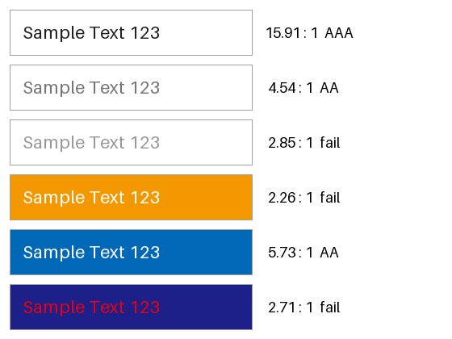
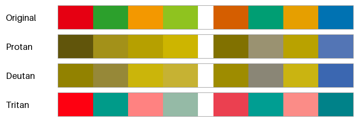
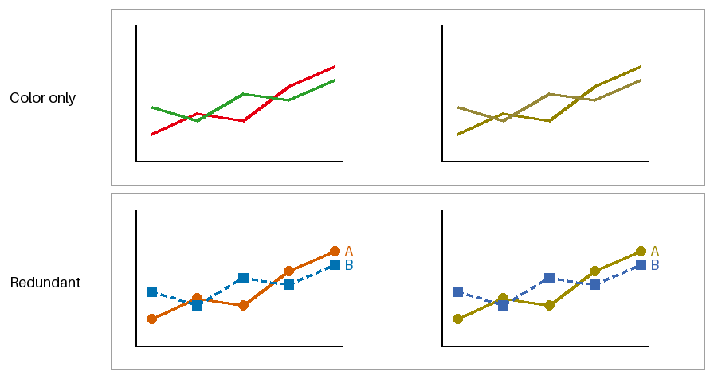

アクセシビリティ
================

色の見え方は人によって、また見る環境によって異なる。視力の弱い人、色の区別がしにくい人、明るい屋外でスマートフォンを見る人など、さまざまな人と状況を考えて配色を決めることを、色のアクセシビリティへの配慮という。

Web のアクセシビリティの国際的な指針としては、W3C の WCAG（Web Content Accessibility Guidelines）が広く使われている。本章では、WCAG 2.2 の達成基準のうち色に関わるものを中心に、配色で確かめるべき点を紹介する。WCAG の達成基準には、満たすのが易しい順に A、AA、AAA の 3 つの水準がある。

本章のコードは ``accessibility.py`` にある。

コントラスト比
--------------

文字と背景の明るさの差が小さいと、文字は読みにくくなる。WCAG では、明るさの差をコントラスト比という値で評価する。

相対輝度
^^^^^^^^

コントラスト比の計算には、色の相対輝度を使う。相対輝度は、線形な :term:`sRGB` の値（:doc:`color_spaces`\ を参照）に重みを掛けて足したもので、黒が 0、白が 1 になる。重みは CIE XYZ の Y を求める係数と同じであり、緑が最も大きく、青が最も小さい。

.. math::

   Y = 0.2126 \, R_{\mathrm{linear}} + 0.7152 \, G_{\mathrm{linear}} + 0.0722 \, B_{\mathrm{linear}}

WCAG 2.1 以前の文書では、sRGB の値を線形な値に変換する式の閾値が 0.04045 ではなく 0.03928 と記されている。ただし、0 から 255 の整数で表される色には、2 つの閾値の間に入る値がない（10 / 255 は約 0.0392、11 / 255 は約 0.0431）。そのため、どちらの閾値を使っても計算結果は変わらない。

コントラスト比の計算
^^^^^^^^^^^^^^^^^^^^

2 色の相対輝度のうち、大きい方を :math:`Y_1`、小さい方を :math:`Y_2` とすると、コントラスト比は次の式で求められる。

.. math::

   \text{コントラスト比} = \frac{Y_1 + 0.05}{Y_2 + 0.05}

コントラスト比は、同じ色どうしで最小の 1、白と黒の組で最大の 21 になる。分子と分母に加えている 0.05 は、画面に映り込む周囲の光（フレア）の影響を考慮した値である。

.. literalinclude:: ../examples/color_utils.py
   :language: python
   :pyobject: relative_luminance

.. literalinclude:: ../examples/color_utils.py
   :language: python
   :pyobject: contrast_ratio

WCAG の基準
^^^^^^^^^^^

WCAG 2.2 では、コントラスト比について次の基準を定めている。大きな文字とは、18 ポイント以上の文字、または 14 ポイント以上の太字の文字を指す。

.. list-table::
   :header-rows: 1
   :widths: 40 15 15 30

   * - 対象
     - AA
     - AAA
     - 達成基準
   * - 通常の文字
     - 4.5 以上
     - 7 以上
     - 1.4.3、1.4.6
   * - 大きな文字
     - 3 以上
     - 4.5 以上
     - 1.4.3、1.4.6
   * - UI の部品（入力欄の枠線など）とグラフなどの図形
     - 3 以上
     - なし
     - 1.4.11

:numref:`fig-contrast-samples` は、いくつかの文字色と背景色の組について、見本の文字とコントラスト比を示したものである。右端の文字は、通常の文字の水準（AAA、AA、基準を満たさない場合は fail）を表す。

.. _fig-contrast-samples:

   文字色と背景色の組とコントラスト比

.. list-table::
   :header-rows: 1
   :widths: 25 25 25 25

   * - 文字色
     - 背景色
     - コントラスト比
     - 水準
   * - ``#222222``
     - ``#ffffff``
     - 15.91
     - AAA
   * - ``#767676``
     - ``#ffffff``
     - 4.54
     - AA
   * - ``#999999``
     - ``#ffffff``
     - 2.85
     - 基準を満たさない
   * - ``#ffffff``
     - ``#f39800``
     - 2.26
     - 基準を満たさない
   * - ``#ffffff``
     - ``#0068b7``
     - 5.73
     - AA
   * - ``#e60012``
     - ``#1d2088``
     - 2.71
     - 基準を満たさない

この結果から、次のことが分かる。

* 白い背景の上の灰色の文字は、``#767676`` がほぼ AA の下限である。これより明るい灰色は、補足の説明などに使われがちだが、基準を満たさない。
* 橙や黄の背景に白い文字を載せると、見た目は鮮やかでもコントラスト比は低い。橙や黄は相対輝度が高いためである。このような背景には、暗い色の文字を使う。
* 赤の文字と紺の背景は、色相が大きく異なるので目立つように思えるが、相対輝度の差が小さいため読みにくい。コントラスト比が評価するのは明るさの差だけである。

なお、WCAG 2.2 のコントラスト比は、暗い背景の上の明るい文字の読みやすさを実際より高く評価する傾向があると指摘されている。次の版として検討されている WCAG 3 では、APCA という新しい評価方法が議論されている。本資料では、現在の達成基準である WCAG 2.2 のコントラスト比を使う。

色覚の多様性
------------

:doc:`basics`\ で述べたとおり、人間は 3 種類の\ :term:`錐体`\ の反応の組み合わせで色を感じる。錐体のうちいずれかがない、または反応する波長がずれていると、特定の色の組み合わせを区別しにくくなる。

.. list-table::
   :header-rows: 1
   :widths: 25 30 45

   * - 種類
     - 関係する錐体
     - 区別しにくい色の例
   * - 1 型（P 型）
     - L 錐体
     - 赤と緑、赤と黒、ピンクと水色
   * - 2 型（D 型）
     - M 錐体
     - 赤と緑、緑と茶、水色とピンク
   * - 3 型（T 型）
     - S 錐体
     - 青と緑、黄と白

1 型と 2 型は、日本では男性の約 5%、女性の約 0.2% にみられ、決して珍しくない。3 型はまれである。同じ種類でも、区別のしにくさの程度は人によって異なる。

見え方のシミュレーション
^^^^^^^^^^^^^^^^^^^^^^^^

色覚の多様性を持つ人の見え方は、色の変換で近似できる。本資料では、Machado らが 2009 年に発表した方法を使う。線形な sRGB の値に 3 行 3 列の行列を掛けるだけで、見え方を近似できる。次のコードは、錐体の 1 種類が機能しない場合（2 色覚）の行列を使っている。

.. literalinclude:: ../examples/accessibility.py
   :language: python
   :pyobject: simulate_cvd

:numref:`fig-cvd-palettes` は、2 つの配色を、1 型、2 型、3 型の見え方のシミュレーションとともに並べたものである。左の 4 色は赤と緑を中心にした配色、右の 4 色は Okabe-Ito の配色（:doc:`dataviz`\ を参照）から選んだ 4 色である。

.. _fig-cvd-palettes:

   元の色（1 段目）と、1 型、2 型、3 型の見え方のシミュレーション（2 段目から 4 段目）

赤と緑を中心にした配色は、1 型と 2 型のシミュレーションで全ての色が黄土色から黄色の範囲に集まり、区別しにくくなる。Okabe-Ito の配色では、明るさの差と青の成分が残るため、どのシミュレーションでもおおむね区別できる。

シミュレーションは近似であり、実際の見え方を完全に再現するものではない。配色を確かめる手段の 1 つとして使い、色だけに頼らない表現（次の節）と組み合わせる。

色だけに頼らない表現
--------------------

WCAG 2.2 の達成基準 1.4.1（色の使用、水準 A）は、色だけで情報を伝えないことを求めている。どれほど配色を工夫しても、色の区別に頼る限り、全ての人と環境で確実に伝わるとは限らないからである。

:numref:`fig-color-only` の上段は、2 本の折れ線を赤と緑の色だけで区別したグラフである。右は 2 型のシミュレーションであり、2 本の線をほとんど区別できない。下段は、色の組を朱色と青に変えたうえで、線の種類（実線と破線）、点の形（丸と四角）、線の端の直接のラベルでも区別したグラフである。シミュレーションでも 2 本の線を区別できる。

.. _fig-color-only:

   色だけで区別したグラフ（上）と、色以外の手がかりも加えたグラフ（下）。右は 2 型のシミュレーション。

色以外の手がかりには、次のようなものがある。

* グラフ: 線の種類、点の形、塗りの模様、直接のラベル
* UI の状態: アイコンや記号（✓、!、×）、「エラー」などの文字
* リンク: 下線
* 入力欄のエラー: 枠線の色に加えて、エラーの内容を説明する文字

配色を確かめる手順
------------------

配色を決めたら、次の点を確かめる。

1. 文字と背景のコントラスト比が、通常の文字で 4.5 以上、大きな文字で 3 以上あるか。
2. ボタンや入力欄の枠線、グラフの線と背景のコントラスト比が 3 以上あるか。
3. 色覚の多様性の見え方のシミュレーションで、区別すべき色を区別できるか。
4. 色だけで伝えている情報がないか。画面を白黒にして確かめるとよい。

まとめ
------

* 文字と背景の明るさの差は、WCAG のコントラスト比で評価する。通常の文字では 4.5 以上を目安にする。
* コントラスト比が評価するのは明るさの差だけであり、色相の違いは考慮されない。
* 1 型と 2 型の色覚は珍しくない。赤と緑の組み合わせに頼る配色は避け、明度にも差を付ける。
* 色だけで情報を伝えず、形、模様、文字などの手がかりを併用する。
