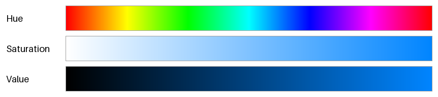
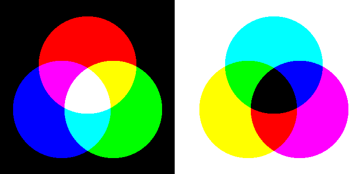
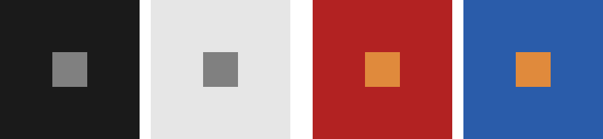

色の基礎
========

配色を考える前に、色がどのように生まれ、どのように見えるかを整理しておく。本章の内容は、以降の全ての章の前提になる。

光と色
------

人間の目に見える光（可視光）は、波長がおよそ 380 nm から 780 nm の電磁波である。波長の短い側から順に、紫、青、緑、黄、橙、赤と感じられる。

ただし、色は光そのものの性質ではない。光が目に入り、網膜の細胞の反応を脳が解釈した結果として生じる感覚である。明るい場所で色を感じ取るのは、網膜にある 3 種類の錐体（すいたい）細胞である。

.. list-table::
   :header-rows: 1
   :widths: 25 35 40

   * - 錐体
     - 最もよく反応する波長
     - 主に感じ取る色
   * - S 錐体
     - 約 420 nm
     - 青
   * - M 錐体
     - 約 530 nm
     - 緑
   * - L 錐体
     - 約 560 nm
     - 黄緑から赤

どのような光も、目の中では 3 種類の錐体の反応の強さという 3 つの数値に置き換えられる。そのため、色は 3 つの数値の組で表せる。これが、ディスプレイが赤・緑・青の 3 色の光だけで多くの色を表現できる理由であり、次の章で扱う色空間が 3 次元である理由でもある。

また、波長の成分がまったく異なる 2 つの光でも、3 種類の錐体の反応が同じであれば同じ色に見える。この現象を条件等色（メタメリズム）という。ディスプレイに映った黄色は赤と緑の光を混ぜたものであり、黄色の波長の光は含まれていないが、錐体の反応が同じになるので黄色に見える。

.. _basics-attributes:

色の三属性
----------

色は、次の 3 つの性質（色の三属性）で説明できる。

.. list-table::
   :header-rows: 1
   :widths: 20 80

   * - 属性
     - 意味
   * - 色相（Hue）
     - 赤、黄、緑、青のような色味の種類。色相を順に並べると、赤から紫を経て赤に戻る環になる。
   * - 彩度（Saturation）
     - 色の鮮やかさ。彩度が低いほど灰色に近づく。
   * - 明度（Lightness）
     - 色の明るさ。明度が最も高い色は白、最も低い色は黒である。

白、灰色、黒のように色味のない色を無彩色といい、明度だけを持つ。それ以外の色を有彩色という。

:numref:`fig-hsv-attributes` は、色の三属性を、次の章で扱う HSV という表し方で 1 つずつ変化させたものである。上から順に、色相だけ、彩度だけ、明度（HSV では V）だけを左から右へ変化させている。

.. _fig-hsv-attributes:

   色の三属性を 1 つずつ変化させた帯（HSV）

HSV は計算が簡単で広く使われているが、HSV の V は人間が感じる明るさとは一致しない。:numref:`fig-hsv-attributes` の色相の帯でも、黄色の付近は明るく、青の付近は暗く見える。この問題とその解決方法は\ :doc:`color_spaces`\ で扱う。

加法混色と減法混色
------------------

色を混ぜる方法には、光を重ねる加法混色と、光を吸収する材料（色材）を重ねる減法混色の 2 種類がある。

.. _fig-mixing:

   加法混色（左）と減法混色（右）

.. list-table::
   :header-rows: 1
   :widths: 20 40 40

   * - 項目
     - 加法混色
     - 減法混色
   * - 三原色
     - 赤（R）、緑（G）、青（B）
     - シアン（C）、マゼンタ（M）、イエロー（Y）
   * - 混ぜるほど
     - 明るくなり、白に近づく
     - 暗くなり、黒に近づく
   * - 主な用途
     - ディスプレイ、プロジェクター、照明
     - 印刷、絵の具、写真のプリント
   * - 計算
     - 光の強さを足し合わせる
     - 光の反射率を掛け合わせる

加法混色の三原色を 2 つずつ混ぜると、減法混色の三原色になる。たとえば、赤と緑の光を重ねるとイエローになる。逆に、減法混色の三原色を 2 つずつ混ぜると、加法混色の三原色になる。たとえば、シアンは赤の光を、イエローは青の光を吸収するので、2 つを重ねると緑の光だけが残る。

実際の印刷では、C、M、Y に黒（K）を加えた 4 色（CMYK）のインクを使う。3 色のインクを重ねただけでは純粋な黒にならないことと、文字などの黒い部分に 3 色分のインクを使うのは無駄であることが理由である。

画面上で作った色は加法混色で表現されている。同じ色を印刷すると、表現できる色の範囲（色域）が異なるため、特に鮮やかな色は画面より沈んだ色になることが多い。印刷物の配色の注意点は\ :doc:`print`\ で扱う。

色の見え方の性質
----------------

同じ色でも、周りの色や面積によって見え方が変わる。配色を考えるときは、色を単独で評価するのではなく、実際に隣り合う色や使う面積と合わせて確かめる必要がある。

同時対比
^^^^^^^^

隣り合う色の影響を受けて、色が実際とは違って見える現象を同時対比という。:numref:`fig-simultaneous-contrast` の左の 2 つの図の中央の正方形は、どちらも同じ灰色である。暗い背景の上では明るく、明るい背景の上では暗く見える（明度対比）。

.. _fig-simultaneous-contrast:

   同時対比。中央の正方形は、左の 2 つが同じ灰色、右の 2 つが同じ橙色である。

右の 2 つの図の中央の正方形は、どちらも同じ橙色である。赤の背景の上では黄みがかって見え、青の背景の上ではより鮮やかに見える。前者は、背景の色相から遠ざかる向きに色相がずれて見える現象（色相対比）である。後者は、補色（色相が反対の色）に囲まれると彩度が高く見える現象（彩度対比）である。

同時対比があるため、同じ色でも、明るい背景の配色（ライトテーマ）と暗い背景の配色（ダークテーマ）では違った印象になる。UI の配色で、ボタンやアイコンの色を背景ごとに調整するのはこのためである（:doc:`ui`\ を参照）。

面積効果
^^^^^^^^

同じ色でも、塗る面積が大きいほど明るく、鮮やかに見える。これを面積効果という。小さな色見本で選んだ鮮やかな色を画面の背景全体に塗ると、想像より派手で落ち着かない印象になる。広い面積に使う色は、色見本で選ぶときよりも彩度を下げておくとよい。配色の面積比については\ :doc:`harmony`\ で扱う。

まとめ
------

* 色は光そのものではなく、3 種類の錐体の反応から生まれる感覚である。そのため、色は 3 つの数値で表せる。
* 色は色相、彩度、明度の三属性で説明できる。
* ディスプレイは加法混色で、印刷は減法混色で色を表現する。
* 色の見え方は、周りの色（同時対比）や面積（面積効果）によって変わる。
