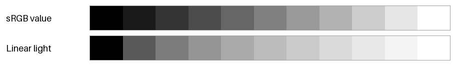
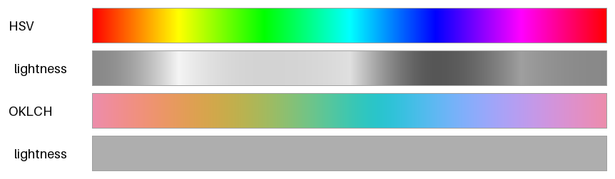
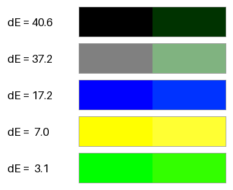
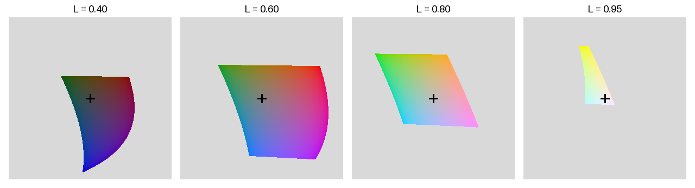

色空間
======

:doc:`basics`\ で見たとおり、色は 3 つの数値の組で表せる。3 つの数値をどのように決めるかの約束事を色空間（表色系）という。色空間にはそれぞれ得意なことと苦手なことがあり、目的に合わせて使い分ける必要がある。本章では、配色の設計でよく使う色空間を順に紹介する。

本章のコードは ``color_utils.py`` と ``color_spaces.py`` にある。

sRGB とガンマ補正
-----------------

sRGB は、ディスプレイと Web で標準的に使われている色空間であり、国際規格 IEC 61966-2-1 で定められている。画像ファイルや CSS で ``#2f6fb0`` のように書く色は、特に指定がなければ sRGB の値である。

sRGB の値は、光の強さに比例していない。値が 0.5 の灰色が出す光の強さは、白（値が 1.0）のおよそ 21% である。これは、人間の目が暗い色の違いに敏感であることに合わせて、暗い側に多くの段階を割り当てるためである。この変換をガンマ補正という。

sRGB の値 :math:`C`\ （R、G、B のそれぞれ、0.0 から 1.0）と、光の強さに比例する線形な値 :math:`C_{\mathrm{linear}}` の関係は次の式で表される。

.. math::

   C_{\mathrm{linear}} =
   \begin{cases}
   \dfrac{C}{12.92} & (C \le 0.04045) \\[2ex]
   \left( \dfrac{C + 0.055}{1.055} \right)^{2.4} & (C > 0.04045)
   \end{cases}

.. literalinclude:: ../examples/color_utils.py
   :language: python
   :pyobject: srgb_to_linear

:numref:`fig-gamma-ramps` の上の帯は sRGB の値を、下の帯は線形な値（光の強さ）を等間隔に変えた階調である。上の帯は明るさがほぼ均等に変わって見える。一方、下の帯は明るい側の変化が小さく、暗い側の変化が大きく見える。

.. _fig-gamma-ramps:

   sRGB の値で等間隔な階調（上）と、光の強さで等間隔な階調（下）

光の物理的な振る舞いを再現する計算では、線形な値を使う。たとえば、画像のぼかしや縮小、半透明の色の合成、CG の照明の計算である。これらを sRGB の値のまま計算すると、境目が暗く濁る。一方、「見た目に均等な段階」を作りたいときは、sRGB の値も線形な値も適さない。そのための色空間は、後の :ref:`color-spaces-oklab` で扱う。

HSV と HSL
----------

sRGB の R、G、B の値から、色の三属性に近い 3 つの値を計算するのが HSV と HSL である。どちらも RGB の値の簡単な計算で求められるので、色を選ぶ UI（カラーピッカー）などで広く使われている。

R、G、B の最大値を :math:`C_{\max}`、最小値を :math:`C_{\min}` とすると、明るさと彩度に当たる値は次のように求められる。色相 H は、どちらも同じ方法で、色相環の上の角度として求める。

.. list-table::
   :header-rows: 1
   :widths: 20 40 40

   * - 色空間
     - 明るさに当たる値
     - 彩度に当たる値
   * - HSV
     - :math:`V = C_{\max}`
     - :math:`S = (C_{\max} - C_{\min}) / C_{\max}`
   * - HSL
     - :math:`L = (C_{\max} + C_{\min}) / 2`
     - :math:`S = (C_{\max} - C_{\min}) / (1 - |2L - 1|)`

HSV では、純色（最も鮮やかな色）は V = 1、S = 1 の位置にある。HSL では、純色は L = 0.5、S = 1 の位置にあり、L = 1 が白になる。

HSV から sRGB への変換は、色相環を 60 度ずつ 6 つの区間に分けて計算する。

.. literalinclude:: ../examples/color_utils.py
   :language: python
   :pyobject: hsv_to_rgb

HSV と HSL の弱点は、明るさに当たる値（V と L）が、人間の感じる明るさを表していないことである。:numref:`fig-hue-rotation` の 1 本目の帯は、HSV の S と V を 1 に固定し、色相だけを 1 周させたものである。2 本目の帯は、その色から色味を取り除き、人間の感じる明るさだけを灰色で表したものである。V は一定なのに、黄色や水色は明るく、青や赤は暗い。そのため、HSV で色相だけを変えた色を並べると、一部の色だけが目立ってしまう。

.. _fig-hue-rotation:

   HSV（上 2 本）と OKLCH（下 2 本）で色相だけを 1 周させた色と、その明るさ

下の 2 本の帯は、後で紹介する OKLCH で、明度と彩度を固定して色相を 1 周させたものである。明るさがそろっていることが分かる。

CIE XYZ と CIELAB
-----------------

CIE XYZ
^^^^^^^

CIE（国際照明委員会）は 1931 年に、多くの人の色の見え方を測定した実験にもとづいて、XYZ 表色系を定めた。X、Y、Z の 3 つの値で、人間が見分けられる全ての色を表せる。Y は光の明るさ（輝度）に比例する値である。XYZ は色の見え方を数値で扱うための基準として、多くの色空間の変換の中継点になっている。

線形な sRGB の値は、次の行列を掛けると XYZ に変換できる。白色点（白とみなす光の色）は、sRGB で定められた D65（昼光に近い光）である。

.. math::

   \begin{pmatrix} X \\ Y \\ Z \end{pmatrix} =
   \begin{pmatrix}
   0.4124564 & 0.3575761 & 0.1804375 \\
   0.2126729 & 0.7151522 & 0.0721750 \\
   0.0193339 & 0.1191920 & 0.9503041
   \end{pmatrix}
   \begin{pmatrix} R_{\mathrm{linear}} \\ G_{\mathrm{linear}} \\ B_{\mathrm{linear}} \end{pmatrix}

行列の 2 行目から、輝度 Y への寄与は緑が最も大きく、青が最も小さいことが分かる。:numref:`fig-hue-rotation` で青が暗く見えたのはこのためである。

CIELAB
^^^^^^

XYZ の値の差は、見た目の色の差に比例しない。そこで CIE は 1976 年に、座標の距離が見た目の差にほぼ比例するように XYZ を変換した CIELAB（:math:`L^*a^*b^*` 表色系）を定めた。

.. list-table::
   :header-rows: 1
   :widths: 20 80

   * - 成分
     - 意味
   * - :math:`L^*`
     - 明度。黒が 0、白が 100 である。
   * - :math:`a^*`
     - 正の向きが赤み、負の向きが緑み。
   * - :math:`b^*`
     - 正の向きが黄み、負の向きが青み。

XYZ から CIELAB への変換式は次のとおりである。:math:`X_n, Y_n, Z_n` は白色点の XYZ の値である。

.. math::

   \begin{aligned}
   L^* &= 116 \, f\!\left(\frac{Y}{Y_n}\right) - 16 \\
   a^* &= 500 \left( f\!\left(\frac{X}{X_n}\right) - f\!\left(\frac{Y}{Y_n}\right) \right) \\
   b^* &= 200 \left( f\!\left(\frac{Y}{Y_n}\right) - f\!\left(\frac{Z}{Z_n}\right) \right)
   \end{aligned}

.. math::

   f(t) =
   \begin{cases}
   t^{1/3} & (t > \delta^3) \\[1ex]
   \dfrac{t}{3 \delta^2} + \dfrac{4}{29} & (t \le \delta^3)
   \end{cases}
   \qquad \delta = \frac{6}{29}

立方根を取ることで、暗い側の小さな差を大きく、明るい側の大きな差を小さく評価している。ガンマ補正と同じく、人間の目の感度に合わせるための工夫である。

.. literalinclude:: ../examples/color_utils.py
   :language: python
   :pyobject: xyz_to_lab

.. _color-spaces-delta-e:

色差
^^^^

CIELAB の 2 色の間のユークリッド距離を色差 :math:`\Delta E^*_{ab}` という。

.. math::

   \Delta E^*_{ab} = \sqrt{(\Delta L^*)^2 + (\Delta a^*)^2 + (\Delta b^*)^2}

:numref:`fig-distance-pairs` の 5 組の色は、どれも RGB の 1 つの成分だけを 51（16 進数で 0x33）変えたものであり、RGB の値のユークリッド距離はどれも 51 である。それにもかかわらず、見た目の差は大きく異なる。

.. _fig-distance-pairs:

   RGB の距離がどれも 51 である 5 組の色と、その色差 :math:`\Delta E^*_{ab}`

``color_spaces.py`` を実行すると、次の結果が表示される。

.. list-table::
   :header-rows: 1
   :widths: 25 25 25 25

   * - 色 1
     - 色 2
     - RGB の距離
     - :math:`\Delta E^*_{ab}`
   * - ``#000000``
     - ``#003300``
     - 51.0
     - 40.6
   * - ``#808080``
     - ``#80b380``
     - 51.0
     - 37.2
   * - ``#0000ff``
     - ``#0033ff``
     - 51.0
     - 17.2
   * - ``#ffff00``
     - ``#ffff33``
     - 51.0
     - 7.0
   * - ``#00ff00``
     - ``#33ff00``
     - 51.0
     - 3.1

黒に緑を加えた組の色差は 40.6 と大きく、鮮やかな緑に赤を少し加えた組の色差は 3.1 しかない。RGB の値の差は、見た目の差の目安にならないことが分かる。

:math:`\Delta E^*_{ab}` はおおむね見た目の差を表すが、鮮やかな色や青の付近では見た目との食い違いが残る。この食い違いを補正した式として、CIEDE2000（:math:`\Delta E_{00}`）が広く使われている。

.. _color-spaces-oklab:

OKLab と OKLCH
--------------

OKLab
^^^^^

CIELAB には、明度や彩度を変えたときに色相がずれて見えるという弱点がある。特に青は、明度を上げると紫みを帯びて見える。Björn Ottosson が 2020 年に発表した OKLab は、この弱点を改善し、計算も簡単にした色空間である。CSS Color Module Level 4 にも ``oklab()`` 関数として取り入れられている。

OKLab の成分の意味は CIELAB と同じで、:math:`L` が明度（黒が 0、白が 1）、:math:`a` が緑から赤への軸、:math:`b` が青から黄への軸である。線形な sRGB の値からは、次の 3 段階で変換する。

1. 行列 :math:`M_1` を掛けて、錐体の応答に近い 3 つの値 :math:`(l, m, s)` を求める。
2. それぞれの立方根を取る。
3. 行列 :math:`M_2` を掛けて :math:`(L, a, b)` を求める。

.. math::

   \begin{pmatrix} l \\ m \\ s \end{pmatrix} = M_1
   \begin{pmatrix} R_{\mathrm{linear}} \\ G_{\mathrm{linear}} \\ B_{\mathrm{linear}} \end{pmatrix},
   \qquad
   \begin{pmatrix} L \\ a \\ b \end{pmatrix} = M_2
   \begin{pmatrix} l^{1/3} \\ m^{1/3} \\ s^{1/3} \end{pmatrix}

:math:`M_1` と :math:`M_2` の値は ``color_utils.py`` の ``_RGB_TO_LMS`` と ``_LMS_TO_LAB`` に記している。逆変換は、逆行列を掛け、立方根の代わりに 3 乗すればよい。

.. literalinclude:: ../examples/color_utils.py
   :language: python
   :pyobject: srgb_to_oklab

.. literalinclude:: ../examples/color_utils.py
   :language: python
   :pyobject: oklab_to_linear

OKLCH
^^^^^

OKLab の :math:`(a, b)` 平面を極座標で表したものを OKLCH という。:math:`C` は彩度（無彩色の軸からの距離）、:math:`h` は色相角である。

.. math::

   C = \sqrt{a^2 + b^2}, \qquad h = \operatorname{atan2}(b, a)

OKLCH は、色の三属性に対応する 3 つの値を、見た目にほぼ均等な尺度で指定できる。たとえば「明度と彩度をそろえ、色相だけを変えた色」を作るには、:math:`L` と :math:`C` を固定して :math:`h` だけを変えればよい。:numref:`fig-hue-rotation` の下の 2 本の帯はこの方法で作ったものであり、どの色相でも明るさがそろっている。本資料の以降の章では、配色を作るときに主に OKLCH を使う。

色域
^^^^

OKLab は人間が見分けられる全ての色を表せるが、そのうち sRGB のディスプレイで表示できる色（sRGB の色域）は一部だけである。:numref:`fig-oklab-slices` は、明度 :math:`L` を固定した OKLab の :math:`(a, b)` 平面のうち、sRGB で表示できる範囲を示したものである。灰色の部分は sRGB の色域の外であり、十字の印は無彩色の位置を表す。

.. _fig-oklab-slices:

   明度を固定した OKLab の a-b 平面と sRGB の色域

色域の形は明度と色相によって大きく変わる。明るい黄色は高い彩度まで表示できるが、明るい青は彩度をほとんど上げられない。逆に、暗い青は高い彩度まで表示できる。そのため、OKLCH で指定した色が sRGB の色域の外になることがある。

色域の外の色を表示するには、色域の中に収める処理（ガマットマッピング）が必要である。RGB の各成分を単純に 0.0 から 1.0 に切り詰めると、明度や色相まで変わってしまう。本資料のサンプルコードでは、明度と色相を保ったまま、色域に収まるまで彩度だけを下げる方法を使う。収まる最大の彩度は二分探索で求める。

.. literalinclude:: ../examples/color_utils.py
   :language: python
   :pyobject: oklch_to_srgb_in_gamut

色空間の使い分け
----------------

.. list-table::
   :header-rows: 1
   :widths: 25 75

   * - 色空間
     - 主な用途
   * - sRGB
     - 画像ファイルや CSS での色の保存と受け渡し
   * - 線形 sRGB
     - 光の合成、ぼかしや縮小、CG の照明の計算
   * - HSV、HSL
     - カラーピッカーなどで大まかに色を選ぶ操作
   * - CIE XYZ
     - 色空間どうしの変換の中継
   * - CIELAB
     - 色差の評価、印刷や工業製品の色の管理
   * - OKLab、OKLCH
     - 見た目に均等な段階の配色やグラデーションの作成

まとめ
------

* sRGB の値は光の強さに比例せず、ガンマ補正されている。光の物理的な計算は線形な値で行う。
* HSV と HSL は計算が簡単だが、V と L は人間が感じる明るさを表さない。
* CIELAB は座標の距離が見た目の差にほぼ比例するように作られた色空間であり、色差 :math:`\Delta E^*_{ab}` で色の違いを評価できる。
* OKLab と OKLCH は、明度・彩度・色相を見た目にほぼ均等な尺度で扱える。配色を作るときはこれらを使うとよい。
* sRGB で表示できる彩度の上限は、明度と色相によって変わる。色域の外の色は、彩度を下げて色域に収める。
