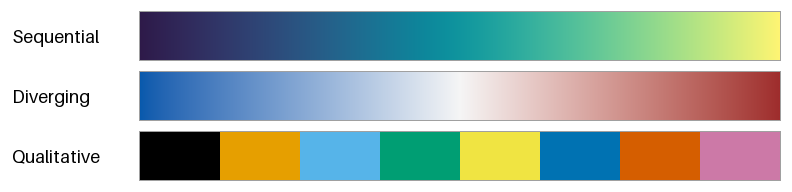
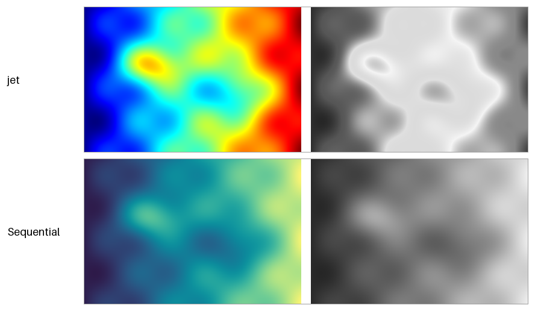
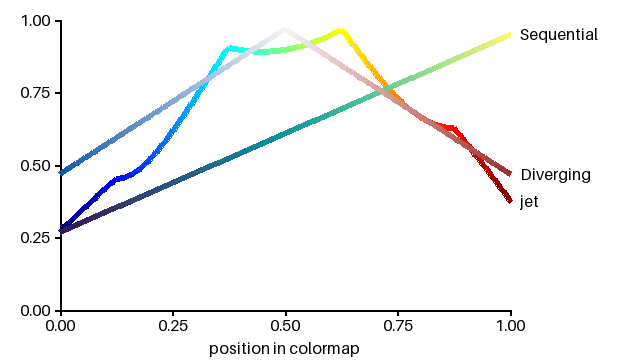
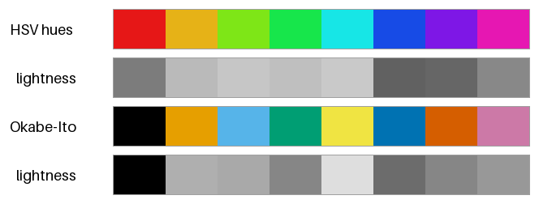

データ可視化の配色
==================

グラフやヒートマップでは、色はデータの値や分類を伝える手段である。見た目の好みより、色からデータを正しく読み取れるかどうかを優先して配色を決める必要がある。

本章のコードは ``dataviz.py`` にある。

カラーマップの種類
------------------

データの値を色に対応させる規則をカラーマップという。カラーマップは、表すデータの性質によって次の 3 種類に分けられる。

.. _fig-colormap-types:

   連続（上）、発散（中）、カテゴリ（下）のカラーマップ

.. list-table::
   :header-rows: 1
   :widths: 20 40 40

   * - 種類
     - 特徴
     - 向いているデータ
   * - 連続（シーケンシャル）
     - 明度が一方向に単調に変わる。
     - 気温、人口、確率など、小さい値から大きい値へ順序のある量
   * - 発散（ダイバージング）
     - 中央が最も明るく（または暗く）、両端に向かって別々の色相で濃くなる。
     - 平年との差、増減率、相関係数など、基準の値からの正負のずれ
   * - カテゴリ（クオリタティブ）
     - 見分けやすい色を並べる。色の間に順序はない。
     - 地域、製品の種類、実験の条件など、順序のない分類

データの性質とカラーマップの種類が合っていないと、誤った読み取りを招く。たとえば、順序のない分類を連続のカラーマップで塗ると、分類の間に大小関係があるように見える。逆に、順序のある量をカテゴリの配色で塗ると、値の大小が読み取れない。

虹色のカラーマップの問題
------------------------

青から水色、緑、黄を経て赤に至る虹色のカラーマップは、鮮やかで目を引くため広く使われてきた。代表的なものに、MATLAB の既定のカラーマップだった jet がある。しかし、虹色のカラーマップには次の問題がある。

* 明度が単調に変わらないので、色から値の大小を読み取りにくい。
* 明度が急に変わる黄や水色の付近に、データにはない境界が見える。
* 白黒で印刷すると、異なる値が同じ灰色になり、値の順序が分からなくなる。
* 赤と緑を見分けにくい色覚の人には、中央付近と端の値を区別しにくい（:doc:`accessibility`\ を参照）。

:numref:`fig-colormap-field` は、なだらかに変化する同じデータを、jet（上）と明度が単調に変わる連続のカラーマップ（下）で塗ったものである。右は、それぞれの色から明るさだけを取り出した灰色の画像である。

.. _fig-colormap-field:

   同じデータを jet（上）と連続のカラーマップ（下）で塗ったもの。右は明るさだけを取り出したもの。

jet で塗った画像では、黄と水色の帯がくっきりとした境界のように見える。しかし、実際のデータはなだらかに変化しており、その位置に境界はない。また、明るさだけを取り出した画像では、値の小さい左端と値の大きい右端がどちらも暗くなり、区別できない。連続のカラーマップでは、明るさだけを取り出しても値の大小がそのまま読み取れる。

:numref:`fig-colormap-lightness` は、カラーマップの位置（横軸）と :term:`OKLab` の明度 :math:`L`\ （縦軸）の関係をグラフにしたものである。線はそれぞれのカラーマップの色で塗っている。

.. _fig-colormap-lightness:

   カラーマップに沿った明度 L の変化

jet の明度は途中で急に上がって下がり、平らな部分や折れ曲がる部分がある。連続のカラーマップの明度は直線的に増えている。発散のカラーマップの明度は、中央で最も高く、両端に向かって対称に下がっている。

このような問題があるため、Matplotlib は 2017 年のバージョン 2.0 で、既定のカラーマップを jet から viridis に変更した。viridis は、明度が単調に変わるように設計された連続のカラーマップである。

カラーマップを作る
------------------

見た目に均等なカラーマップの条件は、次のとおりである。

* 明度が単調に、できれば一定の割合で変わる。
* 色相と彩度が滑らかに変わり、急な変化がない。
* 全ての色が sRGB の\ :term:`色域`\ に収まる。色域の境界で彩度が切り詰められると、変化に折れ目ができる。

:term:`OKLCH` を使うと、これらの条件を満たすカラーマップを簡単に作れる。次の関数は、暗い紫から青緑を経て明るい黄に至る連続のカラーマップである。明度 :math:`L` を位置 :math:`t` に比例させ、色相 :math:`h` を紫（300 度）から黄（105 度）へ回している。

.. literalinclude:: ../examples/dataviz.py
   :language: python
   :pyobject: sequential

発散のカラーマップでは、中央の値（0 や平均値など）に最も明るい無彩色に近い色を置き、両端に向かって明度を同じ割合で下げる。左右で色相を変えることで、中央より大きいか小さいかを区別できるようにする。

.. literalinclude:: ../examples/dataviz.py
   :language: python
   :pyobject: diverging

発散のカラーマップは、中央の値に意味があるデータにだけ使う。中央の値に意味がないデータを塗ると、中央の値を境に性質が変わるかのような誤解を与える。

カテゴリの配色
--------------

カテゴリの配色では、各色が互いに見分けやすいことが最も重要である。そのためには、色相だけでなく明度にも差を付けるとよい。明度に差があれば、色相の違いが分かりにくい環境（白黒の印刷、色覚の多様性、暗い部屋での投影など）でも区別しやすい。

:numref:`fig-qualitative` の 1 段目は、HSV の色相を 8 等分した 8 色である。2 段目の明るさだけの色見本を見ると、橙、黄緑、緑、水色の 4 色がほぼ同じ明るさであることが分かる。3 段目は、Okabe と Ito が色覚の多様性に配慮して提案した 8 色の配色である。明るさにも差があり、4 段目の明るさだけの色見本でもおおむね区別できる。

.. _fig-qualitative:

   HSV の色相を 8 等分した配色（上 2 段）と、Okabe-Ito の配色（下 2 段）

Okabe-Ito の配色のカラーコードは次のとおりである。

.. literalinclude:: ../examples/dataviz.py
   :language: python
   :start-after: # Okabe と Ito が提案した、色覚の多様性に配慮したカテゴリの配色。
   :end-before: def jet

カテゴリの配色では、次の点にも注意する。

* 見分けられる色の数には限りがある。カテゴリが 8 を超える場合は、小さいカテゴリを「その他」にまとめる、グラフを分けるなど、色以外の方法を検討する。
* 同じカテゴリには、資料の中の全てのグラフで同じ色を使う。
* 特定のカテゴリだけに注目してほしいときは、そのカテゴリだけに鮮やかな色を使い、ほかのカテゴリを灰色にする。
* 凡例を離れた位置に置くより、線や棒の近くに直接ラベルを付ける方が読み取りやすい。

まとめ
------

* カラーマップは、データの性質に合わせて連続、発散、カテゴリの 3 種類から選ぶ。
* 虹色のカラーマップは、明度が単調に変わらないので、値の大小を正しく伝えにくい。
* 連続のカラーマップは、OKLCH で明度を単調に変えると作れる。
* カテゴリの配色では、色相だけでなく明度にも差を付ける。
