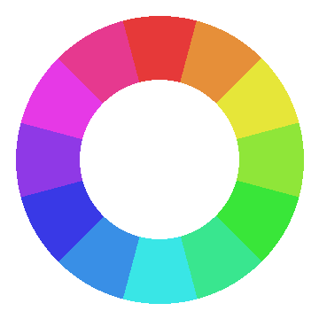
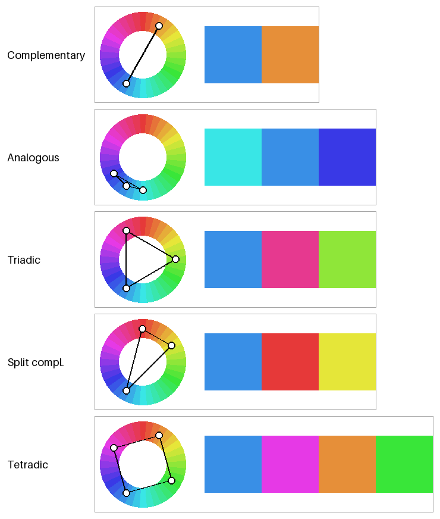
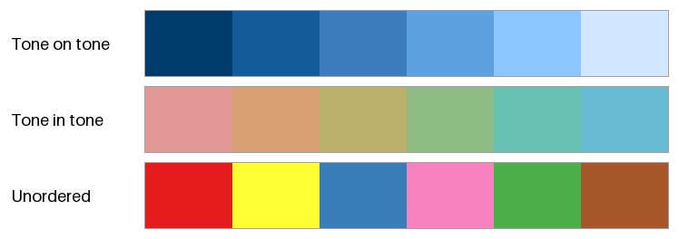
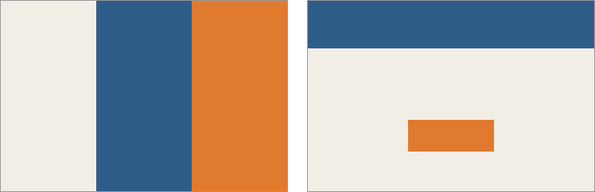

配色の基本
==========

複数の色を組み合わせることを配色という。まとまりのある配色には、色相や明度、彩度の関係に一定の規則があることが多い。本章では、配色を考えるときの代表的な規則を紹介する。

本章のコードは ``harmony.py`` にある。

色相環
------

色相を環状に並べたものを色相環という。:numref:`fig-color-wheel` は、HSV の色相を 30 度ずつ 12 色に分けた色相環である。真上が赤で、時計回りに黄、緑、シアン、青、マゼンタと並ぶ。

.. _fig-color-wheel:

   12 色の色相環（HSV）

色相環の上で向かい合う位置にある 2 色を補色という。補色の組は、互いの色味を最も強く引き立て合う。

色相環にはいくつかの種類があり、どの色相環を使うかによって補色の組が変わる点に注意が必要である。

.. list-table::
   :header-rows: 1
   :widths: 30 35 35

   * - 色相環
     - 特徴
     - 赤の補色
   * - HSV（RGB）の色相環
     - 光の三原色にもとづく。コンピューターで扱いやすい。
     - シアン
   * - 伝統的な絵の具の色相環（RYB）
     - 赤・黄・青を三原色とする。美術の教育で使われてきた。
     - 緑
   * - PCCS の色相環
     - 日本色彩研究所が定めた 24 色相の色相環。心理的な補色が向かい合うように並べている。
     - 青緑

本資料では、計算のしやすさから :term:`HSV` と :term:`OKLCH` の色相を使う。ただし、OKLCH の色相角は HSV の色相とは一致しない。たとえば、OKLCH では赤が約 30 度、黄が約 110 度、青が約 265 度の位置にある。

色相にもとづく配色
------------------

色相環の上での位置関係によって配色を決める方法である。基準の色を 1 つ決め、そこからの角度で残りの色を決める。

.. list-table::
   :header-rows: 1
   :widths: 30 25 45

   * - 配色
     - 基準からの角度
     - 特徴
   * - 補色配色（ダイアード）
     - 0 度、180 度
     - 対比が最も強い。一方を小さな面積で使うと、目立たせたい部分を強調できる。
   * - 類似色配色（アナロガス）
     - -30 度、0 度、30 度
     - 隣り合う色相の組み合わせ。穏やかでまとまりやすい。
   * - トライアド
     - 0 度、120 度、240 度
     - 色相環を 3 等分する。変化に富み、バランスが取れている。
   * - スプリットコンプリメンタリー
     - 0 度、150 度、210 度
     - 補色の両隣の 2 色を使う。補色配色より対比が穏やかになる。
   * - テトラード
     - 0 度、90 度、180 度、270 度
     - 補色の組を 2 つ使う。色数が多いので、主役にする色を決めて面積に差を付ける。

:numref:`fig-hue-schemes` は、それぞれの配色の色相の位置と、実際の色を示したものである。基準の色相は HSV の 210 度（青）とし、彩度と明度はどの色も同じにしている。

.. _fig-hue-schemes:

   色相にもとづく配色。左は色相環の上の位置、右は実際の色である。

``harmony.py`` では、それぞれの配色を基準の色相からの角度の並びとして定義している。

.. literalinclude:: ../examples/harmony.py
   :language: python
   :start-after: # 色相環上での位置関係にもとづく配色。基準の色相からの角度で表す。
   :end-before: def hsv_color

色相の関係だけで配色を決めても、良い配色になるとは限らない。:numref:`fig-hue-schemes` のトライアドやテトラードでは、HSV の彩度と明度をそろえたにもかかわらず、黄緑や緑が明るく、青やマゼンタが暗く見える（:doc:`color_spaces`\ を参照）。色相にもとづく配色は、候補を選ぶ出発点として使い、明度と彩度は次に述べるトーンの考え方で調整するとよい。

トーンにもとづく配色
--------------------

明度と彩度を組み合わせた色の調子をトーンという。たとえば、PCCS では「ビビッド（さえた）」「ペール（うすい）」「ダーク（暗い）」「グレイッシュ（灰みの）」など 12 種類のトーンを定めている。同じトーンの色は、色相が違っても似た印象を与える。

トーンにもとづく代表的な配色には次の 2 つがある。

.. list-table::
   :header-rows: 1
   :widths: 30 70

   * - 配色
     - 特徴
   * - トーンオントーン
     - 色相をそろえ（または近い色相にし）、トーンを大きく変える。同じ色味の濃淡で構成するので、統一感が強い。
   * - トーンイントーン
     - トーンをそろえ、色相を変える。多くの色を使っても、まとまった印象を保てる。

:numref:`fig-tone-schemes` の 1 段目はトーンオントーン、2 段目はトーンイントーンの例である。どちらも OKLCH で作っている。3 段目は比較のために、色相も明度も彩度も規則なく選んだ 6 色を並べたものである。

.. _fig-tone-schemes:

   トーンオントーン（1 段目）、トーンイントーン（2 段目）、規則なく選んだ色（3 段目）

.. literalinclude:: ../examples/harmony.py
   :language: python
   :pyobject: tone_schemes

OKLCH を使うと、トーンをそろえる操作は「:math:`L` と :math:`C` を固定する」、トーンを変える操作は「:math:`L` と :math:`C` を変える」と言い換えられる。HSV で同じことをしようとすると、色相ごとに明るさの感じ方が違うため、色ごとに値を調整する必要がある。

配色の面積比
------------

同じ色の組み合わせでも、それぞれの色を使う面積によって印象は大きく変わる。配色の面積比の目安として、次の 3 つの役割に分ける考え方がよく使われる。

.. list-table::
   :header-rows: 1
   :widths: 25 15 60

   * - 役割
     - 面積の目安
     - 内容
   * - ベースカラー
     - 70%
     - 背景など、最も広い面積に使う色。彩度の低い、落ち着いた色を選ぶ。
   * - メインカラー
     - 25%
     - 全体の印象を決める主役の色。ブランドの色などを使う。
   * - アクセントカラー
     - 5%
     - 目立たせたい部分にだけ使う色。メインカラーと対比の強い色（補色など）を選ぶ。

:numref:`fig-proportion` は、同じ 3 色を、等しい面積で使った場合（左）と、70:25:5 の面積で使った場合（右）である。等しい面積で使うと、3 色が互いに主張し合い、どこに注目すればよいかが分からない。70:25:5 で使うと、アクセントカラーのボタンに自然に目が向く。

.. _fig-proportion:

   同じ 3 色を等しい面積で使った場合（左）と 70:25:5 の面積で使った場合（右）

70:25:5 は厳密な規則ではなく目安である。大切なのは、色ごとに役割を決め、面積に明確な差を付けることである。

色の心理的な効果
----------------

色は、見る人にさまざまな印象を与える。配色の目的に合わせて、次のような効果を利用できる。

.. list-table::
   :header-rows: 1
   :widths: 25 75

   * - 効果
     - 内容
   * - 暖色と寒色
     - 赤、橙、黄などは暖かさを、青緑、青などは冷たさを感じさせる。緑や紫は、どちらとも感じにくい中性色である。
   * - 進出色と後退色
     - 暖色や明るい色は手前に飛び出して見え、寒色や暗い色は奥に引っ込んで見える。
   * - 膨張色と収縮色
     - 明るい色は実際より大きく、暗い色は実際より小さく見える。
   * - 軽さと重さ
     - 明度の高い色は軽く、明度の低い色は重く感じられる。画面の下部や土台の部分に暗い色を置くと安定して見える。
   * - 色からの連想
     - 赤は危険や停止、緑は安全や完了、青は信頼や冷静さを連想させやすい。ただし、連想は文化や分野によって異なる。

色からの連想は、UI の状態を表す色（成功、警告、エラーなど）を決めるときに特に重要である。利用者がすでに持っている連想と逆の色を使うと、誤解を招く。

配色を決める手順
----------------

本章の内容をまとめると、配色は次の手順で決めるとよい。

1. 配色の目的と、伝えたい印象を決める。
2. メインカラーを決め、色相にもとづく配色から残りの色の候補を選ぶ。
3. トーンを調整し、ベースカラー、メインカラー、アクセントカラーの役割と面積を決める。
4. 明度の差が十分にあるかを確かめる（:doc:`accessibility`\ を参照）。
5. 実際の画面や図に色を塗り、周りの色や面積による見え方の変化を確かめる。

まとめ
------

* 色相環の上での位置関係にもとづいて、補色配色、類似色配色、トライアドなどの配色を作れる。色相環の種類によって補色の組が変わる点に注意する。
* トーン（明度と彩度の組み合わせ）をそろえる、または変えることで、配色にまとまりを持たせられる。OKLCH を使うとトーンを数値で扱える。
* 配色では、色ごとに役割を決め、面積に差を付ける。70:25:5 はその目安である。
* 色の心理的な効果や連想を、配色の目的に合わせて利用する。
