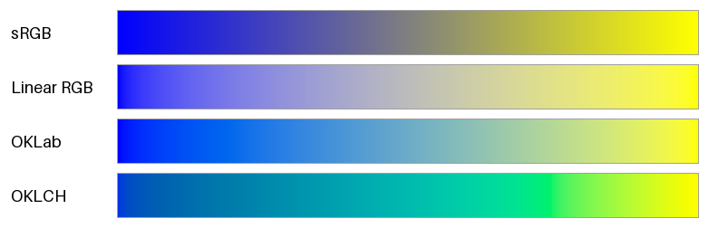
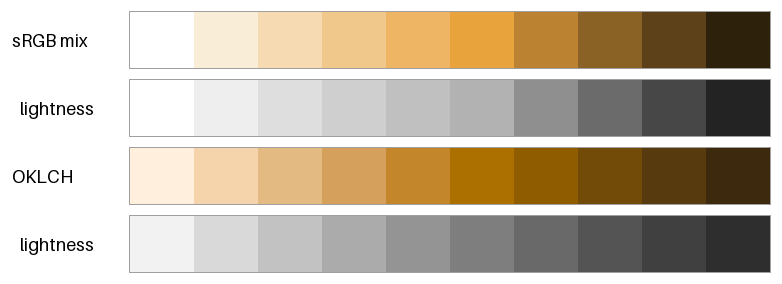
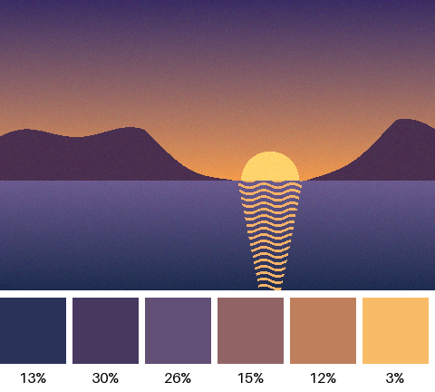

パレットの作り方
================

配色に使う色の集まりをパレットという。本章では、:doc:`color_spaces`\ で学んだ色空間を使って、パレットを計算で作る方法を紹介する。

本章のコードは ``palette.py`` にある。

グラデーションの補間
--------------------

2 つの色の間を滑らかにつなぐ色の列（グラデーション）は、2 色の座標を線形補間して作る。始点の色を :math:`\boldsymbol{c}_0`、終点の色を :math:`\boldsymbol{c}_1` とすると、割合 :math:`t`\ （0 から 1）の位置の色は次の式で求められる。

.. math::

   \boldsymbol{c}(t) = (1 - t) \, \boldsymbol{c}_0 + t \, \boldsymbol{c}_1

同じ式でも、どの色空間の座標で補間するかによって、途中の色は大きく変わる。:numref:`fig-interpolation` は、青（``#0000ff``）から黄（``#ffff00``）への補間を、4 つの色空間で比べたものである。

.. _fig-interpolation:

   青から黄への補間。上から sRGB、線形 RGB、OKLab、OKLCH で補間したもの。

.. list-table::
   :header-rows: 1
   :widths: 20 80

   * - 色空間
     - 補間の結果
   * - sRGB
     - 中央が暗く濁った灰色になる。青と黄は\ :term:`補色`\ の関係にあり、RGB の値を平均すると R = G = B に近づくためである。
   * - 線形 RGB
     - 青と黄の光を混ぜた結果を正しく再現しており、中央は明るい灰色になる。ただし、始点の側で急に明るくなり、明るさの変化が均等ではない。
   * - OKLab
     - 明るさが均等に変化する。中央は彩度の低い色になるが、濁りは少ない。
   * - OKLCH
     - 明度と彩度に加えて色相も補間するので、途中で色相環の上の色（青緑、緑）を通る。彩度を保った鮮やかなグラデーションになる。

:term:`OKLab` での補間は、``color_utils.py`` の変換関数を使えば、sRGB での補間とほとんど同じ手間で書ける。

.. literalinclude:: ../examples/palette.py
   :language: python
   :pyobject: interpolate_oklab

:term:`OKLCH` での補間では、色相の扱いに注意が必要である。色相は環状の値なので、たとえば 350 度から 10 度へ補間するときは、340 度戻るのではなく 20 度進む方が自然である。そのため、色相の差を -180 度から 180 度の範囲に直してから補間する。

.. literalinclude:: ../examples/palette.py
   :language: python
   :pyobject: interpolate_oklch

OKLCH で補間した帯には、緑の付近に折れ目のような変化が見える。途中の色が sRGB の\ :term:`色域`\ の外にあり、彩度が色域の境界で抑えられているためである（:doc:`color_spaces`\ の「色域」の節を参照）。補間する 2 色の彩度を下げれば、折れ目はなくなる。

どの色空間で補間するかは、目的によって選ぶ。

* 見た目に均等なグラデーションを作るには、OKLab を使う。
* 鮮やかさを保ちたいときは、OKLCH を使う。ただし、途中で予期しない色相を通ることがある。
* 光の混合を再現するとき（半透明の合成など）は、線形 RGB を使う。

.. _palette-scale:

カラースケールの作成
--------------------

1 つの基準の色から、明るさの異なる色を段階的に並べたものをカラースケールという。カラースケールがあると、同じ色味の色を、背景、枠線、文字など用途に応じて使い分けられる。:doc:`ui`\ の配色設計では、カラースケールが土台になる。

:numref:`fig-color-scale` は、明度の高い橙 ``#e8a33d``\ （OKLab の明度 :math:`L` は約 0.77）を基準の色として、10 段階のカラースケールを 2 つの方法で作り、それぞれの明るさだけを灰色で並べたものである。

.. _fig-color-scale:

   白と黒を sRGB の値で混ぜて作ったカラースケール（上 2 段）と、OKLCH で作ったカラースケール（下 2 段）

1 つ目の方法は、基準の色に白または黒を sRGB の値で混ぜる方法である。簡単だが、段階の明るさの間隔が基準の色の明度に左右される。この例では基準の色が明るいため、白を混ぜる明るい側の 5 段は明度の差が約 0.05 しかなく見分けにくい。一方、黒を混ぜる暗い側の段は明度の差が 0.11 から 0.14 と大きい。また、最も明るい段は白そのものになり、色味がなくなる。

2 つ目の方法は、OKLCH で色相を保ったまま、明度 :math:`L` を等間隔に変える方法である。基準の色の明度にかかわらず、明るさの段階が等間隔になる。ただし、基準の色そのものがスケールに含まれるとは限らない。基準の色を必ず使いたい場合は、明度が最も近い段を基準の色で置き換えるとよい。明度が極端に高い色や低い色は、sRGB の色域の中で高い彩度を取れないので、彩度は中央の段で最大になるように山形に変えている。

.. literalinclude:: ../examples/palette.py
   :language: python
   :pyobject: oklch_scale

画像からの配色の抽出
--------------------

写真や絵画の配色を参考にしたいときは、画像に多く含まれる代表的な色を取り出すとよい。代表的な色を取り出すには、画素の色を似たもの同士のグループ（クラスタ）に分ける k-means 法がよく使われる。k-means 法は次の手順で、全ての点を :math:`k` 個のクラスタに分ける。

1. 点の中から :math:`k` 個を無作為に選び、クラスタの中心とする。
2. 各点を、最も近い中心のクラスタに割り当てる。
3. 各クラスタの中心を、そのクラスタに属する点の平均に動かす。
4. 手順 2 と 3 を、中心がほとんど動かなくなるまで繰り返す。

サンプルコードでは、簡単のため、繰り返しの回数を 30 回に固定している。

.. literalinclude:: ../examples/palette.py
   :language: python
   :pyobject: kmeans

色の近さを正しく評価するため、画素の色は OKLab に変換してから分類する。sRGB の値のまま分類すると、:doc:`color_spaces`\ の「色差」の節で見たとおり、距離が見た目の差と一致しない。そのため、見た目にはほとんど同じ色が別のクラスタに分かれたり、見た目には違う色が同じクラスタにまとめられたりする。また、画像の全ての画素を使うと計算に時間がかかるので、画素の一部を無作為に選んで分類する。

.. literalinclude:: ../examples/palette.py
   :language: python
   :pyobject: extract_palette

:numref:`fig-extracted-palette` は、夕焼けの海辺を模した画像から 6 色を取り出した結果である。色見本の下の数値は、その色のクラスタに属する画素の割合である。

.. _fig-extracted-palette:

   画像から取り出した 6 色と、画像に占める割合

割合の大きい紫や紺はベースカラーに、割合が約 3% と小さい太陽の黄色はアクセントカラーに向いている。取り出した色と割合は、:doc:`harmony`\ の配色の面積比を考えるときの参考にもなる。

k-means 法の結果は、最初に選ぶ中心によって変わる。サンプルコードでは乱数の種を固定して、毎回同じ結果になるようにしている。

まとめ
------

* グラデーションは、どの色空間で補間するかで結果が大きく変わる。見た目に均等な変化には OKLab を、鮮やかさを保つには OKLCH を使う。
* OKLCH で明度を等間隔に変えると、段階が均等なカラースケールを作れる。
* k-means 法を使うと、画像から代表的な色とその割合を取り出せる。分類は OKLab で行う。
