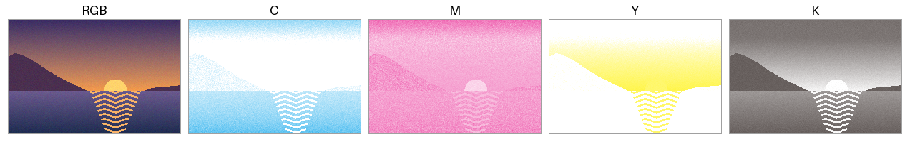
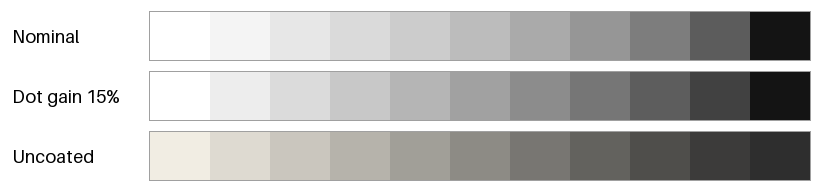

印刷物の配色
============

これまでの章では、ディスプレイに表示する色を扱ってきた。同じ配色を資料やポスターとして印刷すると、画面とは色が変わって見えることが多い。本章では、印刷で色が変わる理由と、印刷物の配色で注意すべき点を紹介する。

本章のコードは ``print_colors.py`` にある。本章の図は考え方を示すための単純化したモデルで作っており、実際の印刷の色を正確に再現するものではない。

画面と印刷の違い
----------------

:doc:`basics`\ で述べたとおり、ディスプレイは光を重ねる加法混色で、印刷はインキで光を吸収する減法混色で色を表現する。この違いから、次のような差が生じる。

.. list-table::
   :header-rows: 1
   :widths: 25 35 40

   * - 項目
     - ディスプレイ（sRGB）
     - 印刷（CMYK）
   * - 最も明るい色
     - 画面が発する白
     - 用紙の白（紙白）。用紙によって黄みや灰みを帯びる。
   * - 最も暗い色
     - 画面の黒
     - インキを重ねた黒。画面の黒ほど暗くならない。
   * - 色域
     - 鮮やかな青、緑、赤を表示できる。
     - 鮮やかな青、緑、赤は再現しにくい。一方、一部のシアンや緑みの色は sRGB より鮮やかに再現できる。
   * - 見え方
     - 周囲の明るさの影響を受けにくい。
     - 照明の光を反射して見えるので、照明の色や明るさによって変わる。

画面で作った鮮やかな色の多くは、印刷の\ :term:`色域`\ の外にある。そのような色は、印刷の色域に収まる色に置き換えて印刷されるので、画面より沈んだ色に見える。

CMYK とカラーマネジメント
-------------------------

CMYK の値は網点の面積率
^^^^^^^^^^^^^^^^^^^^^^^

印刷では、C、M、Y、K の 4 色のインキを、それぞれ別の版で刷り重ねる。1 つの版の中では、インキを付ける小さな点（網点）の大きさや密度を変えることで、濃淡を表現する。CMYK の値（0% から 100%）は、この網点が紙の面積に占める割合（面積率）を表している。

RGB の画像を CMYK の 4 つの版に分けることを色分解という。色分解を最も単純に行うには、次の式を使う。まず R、G、B の最大値から K を決め、残りを C、M、Y に割り振る。

.. math::

   K = 1 - \max(R, G, B), \qquad
   C = \frac{1 - R - K}{1 - K}, \quad
   M = \frac{1 - G - K}{1 - K}, \quad
   Y = \frac{1 - B - K}{1 - K}

.. literalinclude:: ../examples/print_colors.py
   :language: python
   :pyobject: naive_rgb_to_cmyk

:numref:`fig-cmyk-plates` は、:doc:`palette`\ で使った夕焼けの画像を、この式で 4 つの版に分けたものである。各版は、白い紙にそのインキだけを刷ったときの色で表している。

.. _fig-cmyk-plates:

   元の画像（左端）と、簡易的な式で分けた C、M、Y、K の版

ただし、この式は実際の印刷には使えない。インキの色、用紙、印刷機の特性を考慮していないため、刷り上がりの色は元の画像とは大きく異なる。同じ CMYK の値でも、印刷する条件が変われば色が変わる。CMYK の値は色そのものではなく、「どれだけインキを付けるか」という指示にすぎない。

ICC プロファイル
^^^^^^^^^^^^^^^^

機器ごとに異なる色の特性を吸収して、色を正しく受け渡す仕組みをカラーマネジメントという。カラーマネジメントでは、機器や印刷条件ごとの色の特性を、:term:`ICC プロファイル`\ というファイルに記述する。ICC プロファイルは、機器の値（RGB や CMYK）と、機器に依存しない色空間（:term:`CIELAB` や :term:`CIE XYZ`）の値との対応を表す。

RGB の画像を CMYK に変換するときは、次の 2 段階で変換する。

1. sRGB の ICC プロファイルを使い、RGB の値を CIELAB などに変換する。
2. 印刷条件の ICC プロファイルを使い、CIELAB などの値を CMYK の値に変換する。

日本では、オフセット印刷の標準的な印刷条件として Japan Color が広く使われている。印刷会社に入稿するときは、どの印刷条件（ICC プロファイル）で変換すればよいかを確認する。

印刷の色域に収まらない色をどのように置き換えるかは、レンダリングインテントで指定する。代表的なものは次の 2 つである。

.. list-table::
   :header-rows: 1
   :widths: 30 70

   * - レンダリングインテント
     - 内容
   * - 知覚的
     - 色域の外の色だけでなく、画像全体の色を少しずつ圧縮する。色の関係（グラデーションの滑らかさなど）が保たれるので、写真に向いている。
   * - 相対的な色域を維持
     - 色域の中の色はそのまま残し、色域の外の色だけを最も近い色に置き換える。ロゴや図のように、色を正確に保ちたい場合に向いている。

これは、:doc:`color_spaces`\ の「色域」の節で紹介した、色域に収める処理（:term:`ガマットマッピング`）の考え方と同じである。

用紙と網点
----------

ドットゲイン
^^^^^^^^^^^^

印刷では、インキが紙ににじむため、網点が指定より大きくなる。この現象をドットゲインという。ドットゲインは中間調（面積率 50% 前後）で最も大きく、中間調が指定より暗く刷り上がる。

用紙によっても刷り上がりは変わる。コート紙のように表面を加工した用紙に比べて、上質紙のような表面を加工していない用紙（非塗工紙）は、インキがにじみやすくドットゲインが大きい。また、紙白が黄みを帯び、黒も浅くなるので、明暗の差（コントラスト）と彩度が下がる。

:numref:`fig-print-tones` は、黒インキの面積率を 0% から 100% まで 10% ずつ変えた階調を、単純なモデルで計算したものである。1 段目はドットゲインがない場合、2 段目は面積率 50% のときに面積率が 15% 増える場合、3 段目は非塗工紙を想定した場合（ドットゲイン 22%、黄みを帯びた紙白、浅い黒）である。

.. _fig-print-tones:

   網点の面積率と刷り上がりの濃さの簡易モデル。上から、ドットゲインなし、ドットゲイン 15%、非塗工紙。

ドットゲインは、面積率 50% のときに最大となる放物線で近似している。

.. literalinclude:: ../examples/print_colors.py
   :language: python
   :pyobject: dot_gain

刷り上がりの色は、光の反射率（線形な値）を、インキの部分と紙の部分の面積で重み付けして平均することで求めている。これは Murray-Davies の式と呼ばれる考え方である。

.. literalinclude:: ../examples/print_colors.py
   :language: python
   :pyobject: printed_tone

ドットゲインがあると、明るい灰色と中間の灰色の差が縮まり、暗い側の段階がつぶれて見分けにくくなる。画面で見分けられた暗い色どうしが、印刷すると区別できなくなることがあるのはこのためである。印刷物では、画面で見るときよりも明度の差を大きく取っておくとよい。

黒の扱い
^^^^^^^^

黒は、印刷物で特に注意が必要な色である。

* **K 100% だけの黒は、広い面積では浅く見える。**\ 背景などの広い面積を黒く塗るときは、K 100% に C、M、Y を加えた黒（リッチブラック）を使うことがある。
* **小さな文字や細い線には K 100% だけを使う。** 4 つの版は刷るときにわずかにずれることがある（見当ずれ）。リッチブラックで小さな文字を刷ると、版のずれによって文字の縁に色がにじむ。
* **インキの総量に上限がある。** C、M、Y、K の面積率の合計（総インキ量）が大きすぎると、インキが乾かず、裏移りなどの問題が起こる。上限は印刷条件によって異なるが、一般に 300% から 350% 程度とされる。RGB の黒（``#000000``）を単純に変換すると総インキ量が大きくなることがあるので、印刷条件の ICC プロファイルで変換する。

白黒の印刷とコピー
------------------

資料は白黒で印刷されたり、コピーされたりすることも多い。白黒になると、色の違いのうち明度の差だけが残る。グラフや図が白黒でも読めるかどうかは、:doc:`dataviz`\ と\ :doc:`accessibility`\ で紹介した次の方法で確かめられる。

* 色から明度だけを取り出した灰色の画像で、区別すべき色を区別できるか確かめる。
* 連続のカラーマップには、明度が単調に変わるものを使う。
* 線の種類、点の形、塗りの模様、直接のラベルなど、色以外の手がかりを併用する。

媒体ごとの色の指定
------------------

ロゴやブランドカラーのように、画面でも印刷でも同じ印象で見せたい色は、媒体ごとに色の値を決めておく。

.. list-table::
   :header-rows: 1
   :widths: 25 35 40

   * - 媒体
     - 指定の方法
     - 例
   * - Web、アプリケーション
     - sRGB のカラーコード
     - ``#f39800``
   * - 一般的な印刷
     - 印刷条件を明記した CMYK の値
     - C0 M50 Y100 K0 と、その値を決めた印刷条件の名前
   * - 色を厳密に合わせたい印刷
     - 特色（あらかじめ調合されたインキ）の番号
     - PANTONE や DIC カラーガイドの番号

特色は、CMYK の 4 色の掛け合わせではなく、目的の色に調合したインキで刷る方法である。CMYK では再現しにくい鮮やかな色や、企業のロゴの色を安定して再現できる。

sRGB の値と CMYK の値は、計算で一方から他方を機械的に求めるのではなく、実際に印刷した見本と画面を見比べて、同じ印象になるように決めることが多い。決めた値は、ブランドのガイドラインなどにまとめ、全ての制作物で同じ値を使う。UI でブランドカラーを使うときの注意点は、:doc:`ui`\ の\ :ref:`ui-brand`\ の節で扱う。

印刷の前に確かめること
----------------------

1. 印刷会社に、印刷条件（ICC プロファイル）、用紙、総インキ量の上限を確認する。
2. 画像や図は RGB のまま作り、CMYK への変換は印刷条件の ICC プロファイルを使って行う。
3. 変換後の色を画面で確かめる（ソフトプルーフ）。画面の色の特性を測定器で合わせておく（キャリブレーション）と、確認の精度が上がる。
4. 色が重要な制作物では、試し刷り（色校正）で実際の色を確かめる。
5. 暗い色どうしの明度の差、小さな黒い文字の色、白黒で印刷したときの見え方を確かめる。

まとめ
------

* 印刷は、用紙の白とインキの黒の範囲でしか色を表現できず、鮮やかな色の多くは画面より沈んで見える。
* CMYK の値はインキの量の指示であり、印刷条件が変われば色が変わる。RGB から CMYK への変換は、印刷条件の ICC プロファイルを使って行う。
* ドットゲインによって中間調は暗くなり、暗い側の段階はつぶれやすい。印刷物では明度の差を大きく取る。
* 広い面積の黒にはリッチブラックを、小さな文字には K 100% を使う。
* 画面と印刷で同じ印象を保ちたい色は、媒体ごとに値を決めておく。
