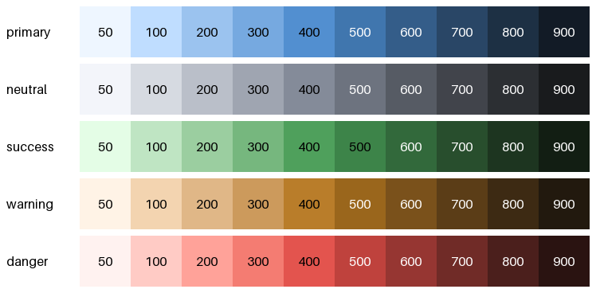
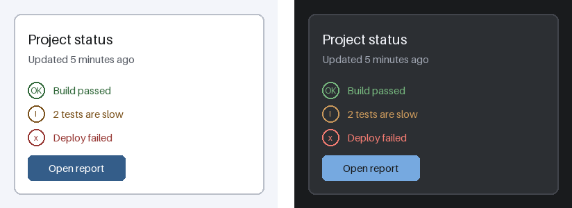
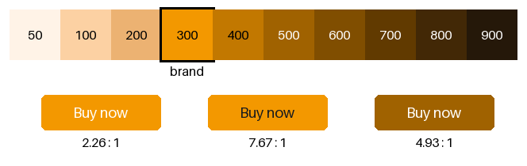

実践: UI の配色設計
===================

本章では、これまでの章の内容を組み合わせて、アプリケーションの画面（UI）の配色を設計する。画面の数や部品の数が多い UI では、色を 1 つずつ選ぶのではなく、色を決める仕組みを先に作ることが重要である。

本章のコードは ``ui_colors.py`` にある。:term:`カラースケール`\ を作る関数は、:doc:`palette`\ の ``palette.py`` のものを使う。

配色を仕組みにする
------------------

UI の配色は、次の 3 つの層に分けて設計するとよい。

.. list-table::
   :header-rows: 1
   :widths: 25 40 35

   * - 層
     - 内容
     - 例
   * - カラースケール
     - 使ってよい色の一覧。色相ごとに、明るさの異なる色を段階的に並べる。
     - primary の 50 から 900 まで
   * - トークン
     - 色の役割の名前と、その役割に割り当てるカラースケールの色。
     - text に neutral の 900 を割り当てる
   * - 部品
     - ボタンや入力欄などの部品は、トークンだけを使って色を指定する。
     - ボタンの背景色に primary を使う

部品がカラーコードを直接使わず、トークンを通して色を参照するようにしておくと、次の利点がある。

* 同じ役割の色が画面ごとにばらばらになることを防げる。
* トークンに割り当てる色を替えるだけで、全ての画面の配色を変えられる。ダークテーマへの対応も、トークンの割り当てを 2 通り用意するだけで済む。
* トークンの組み合わせ（text と background など）ごとに、コントラスト比を機械的に確かめられる。

カラースケールを用意する
------------------------

:doc:`palette`\ の\ :ref:`palette-scale`\ の節で紹介した方法を使い、役割ごとに 10 段階のカラースケールを作る。段階には、明るい方から 50、100、200 から 900 までの名前を付ける。この名前の付け方は、多くの UI のフレームワークで使われている。

.. literalinclude:: ../examples/ui_colors.py
   :language: python
   :start-after: # カラースケールの段階の名前。数値が大きいほど暗い。
   :end-before: # 役割 (トークン) に色を割り当てたテーマ。

:numref:`fig-ui-scales` は、5 つの役割のカラースケールである。各段階の名前の文字は、白と黒のうちコントラスト比が高い方の色で描いている。

.. _fig-ui-scales:

   役割ごとのカラースケール

どのカラースケールも、同じ段階の色は :term:`OKLCH` の明度 :math:`L` が等しい。そのため、段階の名前から明るさの見当が付き、色相が違っても同じ段階の色は背景として同じように扱える。たとえば、:numref:`fig-ui-scales` では、ほとんどのカラースケールで 400 以下の段階には黒い文字が、500 以上の段階には白い文字が選ばれている。

ただし、success の 500 には黒い文字が選ばれている。コントラスト比の計算に使う\ :term:`相対輝度`\ は、緑の成分の重みが大きい（:doc:`accessibility`\ を参照）。そのため、明度 :math:`L` が同じでも、緑の色は相対輝度が高くなりやすい。段階の名前は目安として使い、実際のコントラスト比は後で述べる方法で確かめる。

neutral は、彩度の低い灰色のカラースケールである。背景、枠線、文字など、UI の大部分の面積はこの色で塗る。完全な無彩色ではなく、primary に近い色相をわずかに含ませると、画面全体に統一感が出る。

トークンに色を割り当てる
------------------------

次に、色の役割（トークン）を決め、カラースケールの色を割り当てる。明るいテーマ（ライトテーマ）と暗いテーマ（ダークテーマ）の 2 通りの割り当てを用意する。

.. list-table::
   :header-rows: 1
   :widths: 25 35 20 20

   * - トークン
     - 役割
     - ライト
     - ダーク
   * - background
     - 画面全体の背景
     - neutral 50
     - neutral 900
   * - surface
     - カードなど、背景の上に置く面
     - 白
     - neutral 800
   * - border
     - 枠線、区切り線
     - neutral 200
     - neutral 700
   * - text
     - 本文の文字
     - neutral 900
     - neutral 50
   * - text-muted
     - 補足の説明など、目立たせない文字
     - neutral 600
     - neutral 300
   * - primary
     - 主要なボタン、リンク
     - primary 600
     - primary 300
   * - on-primary
     - primary の上に載せる文字
     - 白
     - neutral 900
   * - success
     - 成功、完了の状態
     - success 600
     - success 300
   * - warning
     - 注意が必要な状態
     - warning 600
     - warning 300
   * - danger
     - エラー、危険な操作
     - danger 600
     - danger 300

ライトテーマとダークテーマでは、明るさの順序を逆にしている。たとえば、ライトテーマで 600 の段階を使う役割には、ダークテーマでは 300 の段階を使う。

.. literalinclude:: ../examples/ui_colors.py
   :language: python
   :start-after: # 役割 (トークン) に色を割り当てたテーマ。
   :end-before: # コントラスト比を確認する (前景, 背景) の組と、必要なコントラスト比。

:numref:`fig-ui-mock` は、トークンの色だけを使って描いた画面の見本である。左がライトテーマ、右がダークテーマである。状態を表す行には、色に加えて記号も付けている（:doc:`accessibility`\ を参照）。

.. _fig-ui-mock:

   ライトテーマ（左）とダークテーマ（右）の画面の見本

ダークテーマの注意点
--------------------

ダークテーマは、ライトテーマの色を単純に反転しただけではうまくいかない。次の点に注意する。

* **背景に純粋な黒を使わない。**\ 真っ黒な背景に白い文字を置くと、明るさの差が大きすぎて、文字の周りがにじんで見えることがある。本章の例では、明度 :math:`L` が約 0.22 の neutral 900 を背景にしている。
* **面の重なりを明るさで表す。**\ ライトテーマでは影で面の重なりを表せるが、暗い背景では影が見えにくい。手前にある面ほど明るい色にする。本章の例では、背景（neutral 900）よりカード（neutral 800）を明るくしている。
* **明るい段階の色を使う。**\ ライトテーマで使う濃い色は、暗い背景の上では沈んで読めなくなる。一方、原色のような鮮やかな色は、暗い背景の上ではぎらついて見える。本章の例では、ボタンや状態の色に、明るい 300 の段階を使っている。
* **同時対比を考慮する。**\ :doc:`basics`\ で見たとおり、同じ色でも背景が暗いと明るく見える。ライトテーマの色をそのまま使わず、実際の背景の上で見え方を確かめる。

コントラスト比を確かめる
------------------------

トークンを使うと、確かめるべき色の組み合わせを列挙できる。``ui_colors.py`` では、前景と背景のトークンの組と、必要なコントラスト比を一覧にしている。文字には 4.5 以上を、ボタンの背景のような UI の部品には 3 以上を求めている（:doc:`accessibility`\ の「WCAG の基準」の節を参照）。

.. literalinclude:: ../examples/ui_colors.py
   :language: python
   :start-after: # コントラスト比を確認する (前景, 背景) の組と、必要なコントラスト比。
   :end-before: def rgb_tuple

``ui_colors.py`` を実行すると、次の結果が表示される。全ての組み合わせが基準を満たしている。

.. list-table::
   :header-rows: 1
   :widths: 25 25 15 15 20

   * - 前景
     - 背景
     - 基準
     - ライト
     - ダーク
   * - text
     - background
     - 4.5
     - 15.87
     - 15.87
   * - text
     - surface
     - 4.5
     - 17.31
     - 12.36
   * - text-muted
     - surface
     - 4.5
     - 6.83
     - 5.43
   * - on-primary
     - primary
     - 4.5
     - 6.81
     - 7.01
   * - primary
     - surface
     - 3.0
     - 6.81
     - 5.46
   * - success
     - surface
     - 4.5
     - 6.54
     - 5.67
   * - warning
     - surface
     - 4.5
     - 6.95
     - 5.34
   * - danger
     - surface
     - 4.5
     - 7.29
     - 5.10

このような確認を、配色を変更するたびに自動で実行するようにしておくと、読みにくい色の組み合わせが紛れ込むことを防げる。

.. _ui-brand:

ブランドカラーをスケールに組み込む
----------------------------------

企業や製品には、ロゴなどに使う決まった色（ブランドカラー）があることが多い。ブランドカラーは UI の\ :term:`メインカラー`\ の候補になるが、そのままでは UI の部品に使いにくいことがある。

ここでは、明るい橙 ``#f39800`` をブランドカラーの例とする。この色の明度 :math:`L` は約 0.755 であり、白い文字とのコントラスト比は 2.26 しかない（:doc:`accessibility`\ の例と同じ色である）。そのため、この色のボタンに白い文字を載せると、文字の基準の 4.5 を満たさない。

まず、ブランドカラーからカラースケールを作り、明度が最も近い段をブランドカラーそのもので置き換える（:doc:`palette`\ の\ :ref:`palette-scale`\ を参照）。

.. literalinclude:: ../examples/ui_colors.py
   :language: python
   :pyobject: brand_scale

``ui_colors.py`` を実行すると、ブランドカラーは 300 の段に置かれ、次の結果が表示される。

.. list-table::
   :header-rows: 1
   :widths: 15 25 20 20 20

   * - 段
     - 色
     - 明度 :math:`L`
     - 白の文字
     - neutral 900 の文字
   * - 200
     - ``#ecb272``
     - 0.803
     - 1.88
     - 9.21
   * - 300（ブランドカラー）
     - ``#f39800``
     - 0.755
     - 2.26
     - 7.67
   * - 400
     - ``#c27800``
     - 0.637
     - 3.52
     - 4.92
   * - 500
     - ``#a06200``
     - 0.553
     - 4.93
     - 3.51
   * - 600
     - ``#804e00``
     - 0.470
     - 7.00
     - 2.47

置き換えた 300 の段は、本来の明度（0.72）より少し明るい。そのため、この段だけは段階の間隔がそろわないが、ブランドカラーを正確に使えることを優先している。

:numref:`fig-ui-brand` は、このカラースケールと、ボタンの 3 つの例である。ボタンの下の数値は、文字と背景のコントラスト比である。

.. _fig-ui-brand:

   ブランドカラーを組み込んだカラースケールと、ボタンの例。左から、ブランドカラーに白の文字、ブランドカラーに neutral 900 の文字、500 の段に白の文字。

この結果から、明るいブランドカラーの扱い方として、次の 2 つが考えられる。

* **ブランドカラーの背景に暗い文字を載せる。** neutral 900 の文字なら、コントラスト比は 7.67 になる。ブランドカラーをそのまま目立たせたい場合に向いている。
* **白い文字を載せる部品には、暗い段を使う。** 500 の段なら、白い文字とのコントラスト比は 4.93 になる。ブランドカラーそのものは、ロゴや、文字を載せない装飾に使う。

どちらを選ぶ場合も、ブランドカラーの色相は保たれているので、画面全体の印象は変わらない。ブランドカラーを印刷物でも使う場合の注意点は、:doc:`print`\ の「媒体ごとの色の指定」の節で扱う。

まとめ
------

* UI の配色は、カラースケール、トークン、部品の 3 つの層に分けて設計する。部品はトークンだけを通して色を参照する。
* 同じ段階の色の明度をそろえたカラースケールを用意すると、段階の名前から明るさの見当が付く。
* ダークテーマでは、明るさの順序を逆にしたトークンの割り当てを用意し、背景の黒さ、面の重なり、色の彩度に注意する。
* トークンの組み合わせごとのコントラスト比を、プログラムで確かめる。
* 明るいブランドカラーは、そのままでは白い文字とのコントラスト比が足りないことがある。暗い文字を載せるか、白い文字を載せる部品には暗い段を使う。
