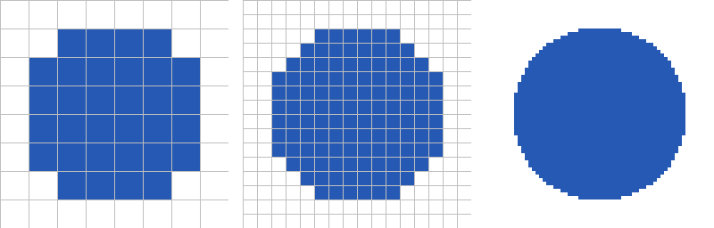
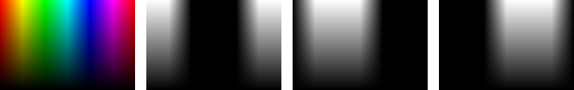
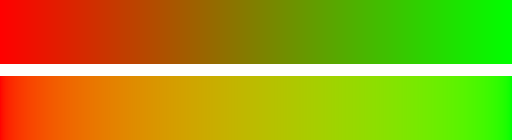
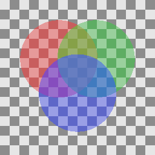

デジタル画像
============

CG の計算の最終的な出力は、デジタル画像である。本章では、画像をプログラムで扱うための基礎として、画素、色の表現、ガンマ補正、半透明の合成を説明する。

本章のコードは ``cg_utils.py`` と ``image_basics.py`` にある。

画素と解像度
------------

ディスプレイや画像ファイルの画像は、縦横に並んだ小さな点の集まりである。この点を画素（ピクセル）という。画素ごとに 1 つの色を持たせて画像を表す形式を、ラスター画像という。これに対して、図形を「始点と終点の座標」や「中心と半径」のような数値で表す形式を、ベクター画像という。ベクター画像も、ディスプレイに表示するときには最終的にラスター画像に変換される。この変換をラスタライズといい、:doc:`raster2d`\ で扱う。

画像の縦と横の画素の数を、解像度という。:numref:`fig-resolution` は、同じ円を 8 × 8、16 × 16、64 × 64 の解像度で表したものである。解像度が低いほど、円の輪郭が階段状になる。

.. _fig-resolution:

   同じ円を 8 × 8（左）、16 × 16（中）、64 × 64（右）の解像度で表したもの

この図では、画素の中心が円の内側にあれば青、外側にあれば白にしている。画素は面積を持つ正方形であり、本資料では、左から i 番目、上から j 番目の画素の中心の座標を :math:`(i + 0.5, j + 0.5)` とする。

.. literalinclude:: ../examples/image_basics.py
   :language: python
   :pyobject: pixel_centers
   :lineno-match:

画像を配列として扱う
--------------------

ディスプレイは、赤（R）、緑（G）、青（B）の 3 色の光を混ぜて色を表示する。そのため、カラー画像は画素ごとに R、G、B の 3 つの値を持つ。それぞれの色の値だけを集めた画像を、チャンネルという。

本資料では、画像を形状が（高さ, 幅, 3）の NumPy 配列で表す。``image[y, x]`` が、左から x 番目、上から y 番目の画素の (R, G, B) の値である。行の番号（y）が先にくることに注意する。:numref:`fig-channels` は、カラー画像と、その R、G、B の各チャンネルを灰色の濃淡で表したものである。

.. _fig-channels:

   カラー画像（左端）と、その R、G、B のチャンネル（左から 2 番目から右端）

画像ファイルでは、各チャンネルの値を 8 ビット（0 から 255 の整数）で記録するのが一般的である。一方、CG の計算では、値を 0.0 から 1.0 の実数で扱うほうが都合がよい。光を足し合わせたり、係数を掛けたりする計算を、範囲を気にせずに行えるからである。本資料では、計算は実数で行い、画像を保存するときだけ整数に変換する。

.. literalinclude:: ../examples/cg_utils.py
   :language: python
   :pyobject: to_pil
   :lineno-match:

0.5 を足してから整数に変換しているのは、小数点以下を切り捨てではなく四捨五入にするためである。

明るさが 1.0 を超える値も扱う画像を、HDR（ハイダイナミックレンジ）画像という。屋外の太陽と室内の照明のように、明るさが大きく異なる場面の計算では、値を 1.0 で打ち切らずに実数のまま扱い、最後に表示できる範囲に収める。この処理をトーンマッピングという。本資料のコードは、簡単のため 1.0 を超える値を 1.0 に切り詰めている。

ガンマ補正
----------

画像ファイルに記録された値は、多くの場合、光の強さに比例していない。一般的な画像の色空間である sRGB では、値が 0.5 の灰色が出す光の強さは、値が 1.0 の白のおよそ 21% である。これは、人間の目が暗い色の違いに敏感であることに合わせて、暗い側に多くの段階を割り当てるためである。この非線形な変換をガンマ補正という。

sRGB の値 :math:`C`\ （R、G、B のそれぞれ）と、光の強さに比例する線形な値 :math:`C_{\mathrm{linear}}` の関係は、次の式で表される。

.. math::

   C_{\mathrm{linear}} =
   \begin{cases}
   \dfrac{C}{12.92} & (C \le 0.04045) \\[2ex]
   \left( \dfrac{C + 0.055}{1.055} \right)^{2.4} & (C > 0.04045)
   \end{cases}

.. literalinclude:: ../examples/cg_utils.py
   :language: python
   :pyobject: srgb_to_linear
   :lineno-match:

光の物理的な振る舞いにもとづく計算は、線形な値で行う必要がある。たとえば、光の足し合わせ、照明の計算、色の補間、画像の縮小とぼかしである。sRGB の値のまま計算すると、結果が暗く濁る。

:numref:`fig-gamma-blend` は、赤から緑へのグラデーションを 2 つの方法で作ったものである。上の帯は sRGB の値をそのまま補間しており、中央付近が暗く濁っている。下の帯は、線形な値に変換してから補間し、sRGB の値に戻しており、中央付近も明るい。

.. _fig-gamma-blend:

   sRGB の値で補間したグラデーション（上）と、線形な値で補間したグラデーション（下）

本資料のレンダラーは、照明の計算を線形な値で行い、画像を保存する直前に ``linear_to_srgb()`` で sRGB の値に変換する。テクスチャのように画像ファイルから読み込んだ色は、計算に使う前に ``srgb_to_linear()`` で線形な値に変換する。

アルファ値と半透明の合成
------------------------

ガラスや煙のような半透明の物体、文字の輪郭のなめらかな縁を表すには、画素の色に加えて不透明度を持たせる。この不透明度をアルファ値という。アルファ値は、0.0 で完全に透明、1.0 で完全に不透明である。

色 :math:`C_f`、アルファ値 :math:`\alpha` の前景を、色 :math:`C_b` の背景の上に重ねた結果の色 :math:`C` は、次の式で求められる。この合成の方法を over 演算子という。

.. math::

   C = \alpha C_f + (1 - \alpha) C_b

.. literalinclude:: ../examples/image_basics.py
   :language: python
   :pyobject: over
   :lineno-match:

:numref:`fig-alpha-over` は、市松模様の背景の上に、アルファ値 0.6 の赤、緑、青の円を順に重ねたものである。

.. _fig-alpha-over:

   アルファ値 0.6 の円を順に重ねた結果

over 演算子の結果は、重ねる順序によって変わる。そのため、半透明の物体を含む 3 次元の場面では、奥のものから順に描く必要がある。これは、:doc:`rasterization`\ で説明する Z バッファー法だけでは解決できない問題の 1 つである。

色にあらかじめアルファ値を掛けておく形式（乗算済みアルファ）もよく使われる。乗算済みアルファでは、合成の式が :math:`C = C'_f + (1 - \alpha) C_b`\ （:math:`C'_f = \alpha C_f`）となり、画像の縮小や合成を繰り返しても縁に不自然な色が出にくい。

画像のファイル形式
------------------

計算した画像を保存するファイル形式には、主に次のものがある。

.. list-table::
   :header-rows: 1
   :widths: 20 25 55

   * - 形式
     - 圧縮
     - 特徴
   * - PNG
     - 可逆
     - 画質が劣化しない。アルファ値を持てる。図やスクリーンショットに向いている。本資料の図は全て PNG である。
   * - JPEG
     - 非可逆
     - ファイルが小さい。写真に向いているが、輪郭の周りにノイズが出る。
   * - WebP、AVIF
     - 可逆と非可逆
     - Web 向けの新しい形式。JPEG より小さいファイルで同等の画質を得られる。
   * - OpenEXR
     - 可逆と非可逆
     - 値を浮動小数点数で記録できる。HDR 画像や、映像制作での中間データに使われる。
