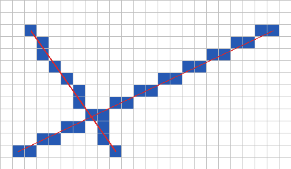
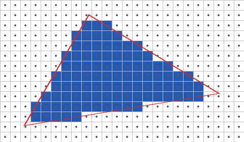
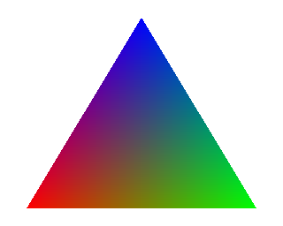
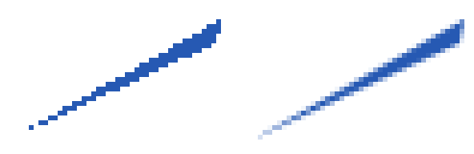

2 次元の図形のラスタライズ
==========================

数値で表された図形を、画素の集まりに変換する処理をラスタライズという。本章では、2 次元の線分と三角形のラスタライズを実装する。三角形のラスタライズは、:doc:`rasterization`\ で 3 次元の物体を描くときの中心的な処理になる。

本章のコードは ``raster2d.py`` にある。考え方が分かりやすいように、画素を 1 つずつ調べる素朴な書き方をしている。

線分の描画
----------

始点 :math:`(x_0, y_0)` と終点 :math:`(x_1, y_1)` を結ぶ線分を描くことを考える。単純な方法は、x を 1 ずつ増やしながら、直線の式 :math:`y = y_0 + (x - x_0)(y_1 - y_0) / (x_1 - x_0)` で y を計算し、四捨五入した位置の画素を塗ることである。ただし、この方法では傾きが急な線分の画素がとびとびになり、また割り算と実数の計算が必要になる。

ブレゼンハムのアルゴリズムは、整数の加算と比較だけで線分を描く方法である。進む向き（x 方向、y 方向、またはその両方）に 1 画素進むたびに、理想的な線分からのずれを表す値 ``err`` を更新し、ずれが大きくなりすぎたら、もう一方の向きにも 1 画素進む。

.. literalinclude:: ../examples/raster2d.py
   :language: python
   :pyobject: draw_line
   :lineno-match:

このコードは、``err`` を「x 方向のずれと y 方向のずれの差」の形で持つことで、傾きの大きさと向きによらず同じ処理で全ての線分を描けるようにしている。:numref:`fig-line` は、このアルゴリズムで描いた 2 本の線分（青い画素）と、元の線分（赤い線）を重ねたものである。元の線分の近くの画素が、すき間なく選ばれている。

.. _fig-line:

   ブレゼンハムのアルゴリズムで描いた線分（1 マスが 1 画素）

三角形の塗りつぶし
------------------

3 次元の CG では、物体の表面を三角形の集まりで表すことが多い。三角形は、次の性質を持つからである。

* 3 つの頂点は必ず 1 つの平面の上にある。4 つ以上の頂点を持つ多角形では、そうとは限らない。
* 常に凸形状であり、内側と外側の判定が簡単である。
* 任意の多角形や曲面を、三角形の集まりで近似できる。

エッジ関数
~~~~~~~~~~

三角形を塗りつぶすには、各画素の中心が三角形の内側にあるかを判定すればよい。この判定には、エッジ関数を使う。点 :math:`\mathbf{a}` から点 :math:`\mathbf{b}` に向かう辺に対する、点 :math:`\mathbf{p}` のエッジ関数は次の式で定義される。

.. math::

   E(\mathbf{a}, \mathbf{b}, \mathbf{p}) = (b_x - a_x)(p_y - a_y) - (b_y - a_y)(p_x - a_x)

これは、ベクトル :math:`\mathbf{b} - \mathbf{a}` と :math:`\mathbf{p} - \mathbf{a}` の外積の z 成分（:doc:`math`\ ）である。:math:`E` の符号は、点 :math:`\mathbf{p}` が辺のどちら側にあるかを表し、:math:`E` の絶対値は 3 点が作る三角形の面積の 2 倍に等しい。

.. literalinclude:: ../examples/raster2d.py
   :language: python
   :pyobject: edge_function
   :lineno-match:

三角形 :math:`\mathbf{v}_0 \mathbf{v}_1 \mathbf{v}_2` の 3 本の辺 :math:`\mathbf{v}_0 \to \mathbf{v}_1`、:math:`\mathbf{v}_1 \to \mathbf{v}_2`、:math:`\mathbf{v}_2 \to \mathbf{v}_0` について、点 :math:`\mathbf{p}` のエッジ関数の符号が全て同じであれば、:math:`\mathbf{p}` は三角形の内側にある。

ラスタライズの実装
~~~~~~~~~~~~~~~~~~

画面の全ての画素を調べるのは無駄が多いので、三角形を囲む長方形（バウンディングボックス）の中の画素だけを調べる。

.. literalinclude:: ../examples/raster2d.py
   :language: python
   :pyobject: rasterize_triangle
   :lineno-match:

内側の判定には、次の節で説明する重心座標を使っている。重心座標は、3 つのエッジ関数を三角形全体のエッジ関数で割ったものなので、頂点が時計回りと反時計回りのどちらに並んでいても、内側では 3 つとも 0 以上になる。

.. literalinclude:: ../examples/raster2d.py
   :language: python
   :pyobject: barycentric
   :lineno-match:

:numref:`fig-triangle` は、この方法で塗った三角形である。黒い点は画素の中心を表す。中心が赤い輪郭の内側にある画素だけが塗られている。

.. _fig-triangle:

   エッジ関数で塗りつぶした三角形（黒い点は画素の中心）

各画素の判定は互いに独立しているので、多数の画素を同時に計算できる。GPU は、この性質を利用して、多数の画素の判定を並列に行っている。:doc:`rasterization`\ では、同じ計算を NumPy の配列演算でまとめて行う。

なお、隣り合う 2 つの三角形が共有する辺の上にちょうど画素の中心がある場合、このコードでは両方の三角形がその画素を塗る。半透明の三角形では、その画素だけが 2 回合成されて濃くなってしまう。GPU では、トップレフトルールと呼ばれる規則で、辺の上の画素をどちらか一方の三角形だけに割り当てている。

重心座標による補間
------------------

点 :math:`\mathbf{p}` の重心座標 :math:`(w_0, w_1, w_2)` は、次の式で定義される。

.. math::

   w_0 = \frac{E(\mathbf{v}_1, \mathbf{v}_2, \mathbf{p})}{E(\mathbf{v}_0, \mathbf{v}_1, \mathbf{v}_2)}, \quad
   w_1 = \frac{E(\mathbf{v}_2, \mathbf{v}_0, \mathbf{p})}{E(\mathbf{v}_0, \mathbf{v}_1, \mathbf{v}_2)}, \quad
   w_2 = \frac{E(\mathbf{v}_0, \mathbf{v}_1, \mathbf{p})}{E(\mathbf{v}_0, \mathbf{v}_1, \mathbf{v}_2)}

:math:`w_0` は、点 :math:`\mathbf{p}` と辺 :math:`\mathbf{v}_1 \mathbf{v}_2` が作る三角形の面積が、三角形全体の面積に占める割合である。:math:`\mathbf{p}` が頂点 :math:`\mathbf{v}_0` に近づくほど 1 に近づき、辺 :math:`\mathbf{v}_1 \mathbf{v}_2` に近づくほど 0 に近づく。3 つの値の合計は常に 1 であり、点 :math:`\mathbf{p}` は次のように表せる。

.. math::

   \mathbf{p} = w_0 \mathbf{v}_0 + w_1 \mathbf{v}_1 + w_2 \mathbf{v}_2

同じ重みを使えば、頂点に与えた任意の値（色、法線、テクスチャ座標など）を、三角形の内部でなめらかに補間できる。頂点の値を :math:`a_0`、:math:`a_1`、:math:`a_2` とすると、点 :math:`\mathbf{p}` での値は :math:`w_0 a_0 + w_1 a_1 + w_2 a_2` である。頂点に与える値を、頂点の属性という。

:numref:`fig-barycentric` は、3 つの頂点に赤、緑、青を与え、内部の色を重心座標で補間したものである。

.. literalinclude:: ../examples/raster2d.py
   :language: python
   :pyobject: barycentric_figure
   :lineno-match:

.. _fig-barycentric:

   重心座標で頂点の色を補間した三角形

3 次元の物体を透視投影で描く場合、画面上の重心座標で属性をそのまま補間すると、奥行きの方向にゆがみが生じる。この問題と対処方法は、:doc:`rasterization`\ で説明する。

エイリアシングとアンチエイリアシング
------------------------------------

ここまでの方法では、画素の中心という 1 点だけで、その画素を塗るかどうかを決めている。そのため、図形の輪郭は階段状になり、画素より細い部分は途切れてしまう。このように、連続的な形を粗い間隔で標本化（サンプリング）することで生じる誤差をエイリアシングという。

エイリアシングを減らす処理を、アンチエイリアシングという。最も単純な方法は、1 つの画素の中で複数の点を調べ、図形に覆われる点の割合（カバレッジ）に応じて色を混ぜることである。この方法をスーパーサンプリング（SSAA）という。

.. literalinclude:: ../examples/raster2d.py
   :language: python
   :pyobject: coverage
   :lineno-match:

:numref:`fig-aliasing` は、細長い三角形を、画素の中心の 1 点で判定した場合と、画素ごとに 4 × 4 = 16 点で判定した場合を比べたものである。16 点で判定した右の図では、輪郭がなめらかになり、細い先端も途切れずに表れている。

.. _fig-aliasing:

   画素ごとに 1 点で判定した三角形（左）と、16 点で判定した三角形（右）

スーパーサンプリングは、点の数に比例して計算量が増える。そのため、GPU では、輪郭の判定だけを複数の点で行い、色の計算は画素ごとに 1 回で済ませる MSAA（マルチサンプルアンチエイリアシング）がよく使われる。また、描画した後の画像から輪郭を検出してぼかす FXAA などの方法や、前のフレームの結果を利用する TAA（テンポラルアンチエイリアシング）もある。

エイリアシングは輪郭だけの問題ではない。遠くにある細かい模様がちらつく現象もエイリアシングの一種であり、:doc:`texture`\ で扱う。
