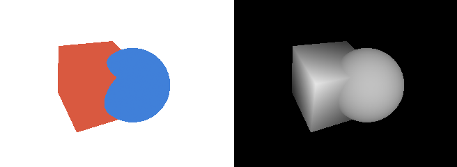
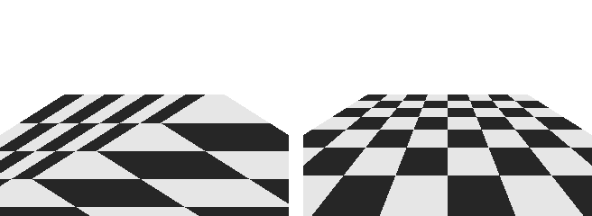

3 次元のラスタライズ
====================

本章では、:doc:`raster2d`\ の三角形のラスタライズと、:doc:`transform`\ の座標変換を組み合わせて、3 次元の物体を描くレンダラーを作る。複数の物体が重なるときに手前のものだけを描く方法（隠面消去）と、透視投影で属性を正しく補間する方法も説明する。

本章のコードは ``renderer.py`` にある。

三角形メッシュ
--------------

3 次元の物体の表面は、多数の三角形をつなぎ合わせたもので表す。これを三角形メッシュ（ポリゴンメッシュ）という。三角形メッシュは、次の 2 つの配列で表すのが一般的である。

* 頂点の配列: 頂点ごとの属性（位置、法線、テクスチャ座標など）を並べたもの
* 面の配列: 三角形ごとに、3 つの頂点の番号を並べたもの

隣り合う三角形は頂点を共有するので、頂点の番号で面を表すと、同じ座標を何度も記録せずに済む。

.. literalinclude:: ../examples/renderer.py
   :language: python
   :pyobject: Mesh
   :lineno-match:

面の頂点は、物体の外側から見て反時計回りに並べる。この順序で、三角形の表と裏を区別する。

1 つの頂点が持てる法線は 1 つだけである。立方体の角の頂点は 3 つの面に属するが、面ごとに法線の向きが異なる。そのため、立方体は面ごとに専用の頂点を持たせ、24 個（6 面 × 4 頂点）の頂点で表す。一方、球のように表面がなめらかな物体では、隣り合う三角形で頂点を共有し、頂点の法線を表面の本来の向きに合わせる。

.. literalinclude:: ../examples/renderer.py
   :language: python
   :pyobject: make_sphere
   :lineno-match:

描画の流れ
----------

本資料のレンダラーは、次の順に処理を行う。

#. 頂点の処理: 全ての頂点の座標に MVP 行列を掛け、クリップ座標に変換する。続いて透視除算とビューポート変換を行い、スクリーン座標を求める。
#. 三角形ごとの処理: 裏を向いた三角形を捨てる（背面カリング）。
#. ラスタライズ: 三角形が覆う画素を求め、頂点の属性を補間する。
#. 深度テスト: 画素ごとに、すでに描かれている面より手前にあるかを調べ、手前にある場合だけ書き込む（Z バッファー法）。
#. シェーディング: 書き込まれた属性から、画素の色を計算する。

1 から 4 を行うのが ``draw_mesh()`` で、結果をフレームバッファーに書き込む。フレームバッファーは、画素ごとの深度と、画素ごとに補間した属性を格納する配列の集まりである。

.. literalinclude:: ../examples/renderer.py
   :language: python
   :pyobject: FrameBuffer
   :lineno-match:

5 のシェーディングは、:doc:`shading`\ と\ :doc:`texture`\ で、フレームバッファーの属性を使って画像全体の色をまとめて計算する。このように、先に全ての物体の可視性を確定させ、後から見えている画素だけの色を計算する方法を、遅延シェーディング（ディファードシェーディング）という。GPU の標準的な描画では、ラスタライズした画素ごとにすぐ色を計算するが、計算の内容は同じである。

``draw_mesh()`` の全体は次のとおりである。:doc:`raster2d`\ の ``rasterize_triangle()`` で 1 画素ずつ行っていた判定を、三角形を囲む長方形の画素について NumPy の配列演算でまとめて行っている。

.. literalinclude:: ../examples/renderer.py
   :language: python
   :pyobject: draw_mesh
   :lineno-match:

以降の節では、このコードの要素を順に説明する。

背面カリング
------------

閉じた物体（中身の詰まった物体）では、裏を向いた面は必ず表を向いた面の陰に隠れる。そのため、裏を向いた三角形は描かずに捨ててよい。これを背面カリングという。描く三角形の数がおよそ半分になるので、処理が速くなる。

三角形の表と裏は、スクリーン座標での頂点の並び順で判定できる。外側から見て反時計回りに並べた三角形は、カメラから表が見えていれば画面上でも反時計回りに、裏が見えていれば時計回りに並ぶ。並び順は、:doc:`raster2d`\ のエッジ関数で求めた三角形の符号付きの面積で分かる。ただし、スクリーン座標は y 軸が下向きなので、y 軸が上向きの場合と符号が逆になる。``draw_mesh()`` では、``area`` が正の三角形を裏向きとして捨てている。

背面カリングは、閉じていない物体（1 枚の板など）では使えない。そのため、``draw_mesh()`` では引数 ``cull_back`` で無効にできるようにしている。

Z バッファー法による隠面消去
----------------------------

複数の三角形が同じ画素に重なるとき、最も手前の三角形だけを描く必要がある。これを隠面消去という。

単純な方法は、カメラから遠い三角形から順に描き、手前の三角形で上書きすることである。これを画家のアルゴリズムという。しかし、この方法では、三角形の並べ替えに時間がかかるうえ、互いに交差する三角形や、互いに覆い合う三角形を正しく描けない。

Z バッファー法は、画素ごとに「これまでに描いた面のうち最も手前のものの深度」を記録しておく方法である。深度を記録する配列を、Z バッファー（深度バッファー）という。

#. 描画を始める前に、Z バッファーの全ての画素を無限遠（本資料では ``np.inf``）で初期化する。
#. 三角形をラスタライズするとき、画素ごとに深度を補間する。
#. 補間した深度が Z バッファーの値より小さい（手前にある）場合だけ、その画素の色と属性を書き込み、Z バッファーも更新する。

三角形を描く順序によらず、正しい結果が得られる。:numref:`fig-depth` は、互いに交差する立方体と球を描いた結果と、Z バッファーに書き込まれた深度を濃淡で表したもの（手前ほど明るい）である。立方体と球が交わる部分も正しく描かれている。

.. _fig-depth:

   描画結果（左）と Z バッファーの深度（右、手前ほど明るい）

``draw_mesh()`` では、深度として正規化デバイス座標の z を使っている。:doc:`transform`\ の透視投影の行列から分かるとおり、この値はカメラからの奥行き :math:`d` に対して :math:`1/d` の 1 次式で変化する。近い範囲では細かく、遠い範囲では粗く変化するので、遠くで重なった 2 つの面の前後を判定できず、描画がちらつくことがある。これを Z ファイティングという。ニアクリップ面の距離 :math:`n` をむやみに小さくしないことが、基本的な対策である。

透視補正補間
------------

画面上の重心座標は、3 次元の空間での重心座標とは一致しない。透視投影では、奥にある部分ほど画面上で縮んで写るからである。そのため、:doc:`raster2d`\ と同じように画面上の重心座標で属性を補間すると、奥行きの方向に属性がゆがむ。

正しく補間するには、各頂点の属性 :math:`a_i` をその頂点のクリップ座標の :math:`w_i`\ （透視投影ではカメラからの奥行き）で割った値と、:math:`1 / w_i` を、それぞれ画面上の重心座標 :math:`b_i` で補間し、最後に割り算をする。

.. math::

   a = \frac{\displaystyle \sum_{i=0}^{2} b_i \frac{a_i}{w_i}}{\displaystyle \sum_{i=0}^{2} b_i \frac{1}{w_i}}

:math:`a_i / w_i` と :math:`1 / w_i` は、画面上で線形に変化する量なので、画面上の重心座標で正しく補間できる。これを透視補正補間という。``draw_mesh()`` の ``perspective_correct`` が真の場合の処理が、この式に当たる。なお、深度として使う正規化デバイス座標の z は、もともと画面上で線形に変化する量なので、補正せずに補間してよい。

:numref:`fig-perspective-correct` は、2 つの三角形でできた床に市松模様を描いたものである。左の図は透視補正をせずに補間したもので、模様が三角形の対角線で折れ曲がり、奥行きの間隔も不自然である。右の図は透視補正補間を行ったもので、模様が正しく描かれている。

.. _fig-perspective-correct:

   透視補正なし（左）と透視補正あり（右）

GPU は、頂点の属性を自動的に透視補正して補間する。

クリッピング
------------

カメラの後ろにある頂点は :math:`w \le 0` となり、透視除算の結果が意味を持たなくなる。そのため、正しくは、クリップ座標で三角形をニアクリップ面で切り取り、見える部分だけを新しい三角形として描く。これをクリッピングという。画面の上下左右からはみ出す部分も、同様に切り取る場合がある。

本資料のレンダラーでは、簡単のため、ニアクリップ面より手前に頂点がある三角形を丸ごと捨てている。そのため、カメラのすぐ近くを通る大きな三角形は描かれない。:doc:`texture`\ の床の図では、この制約を避けるため、床をカメラの少し前から奥に向かって広げている。画面の上下左右へのはみ出しは、ラスタライズする範囲を画面の内側に限ることで処理している。
