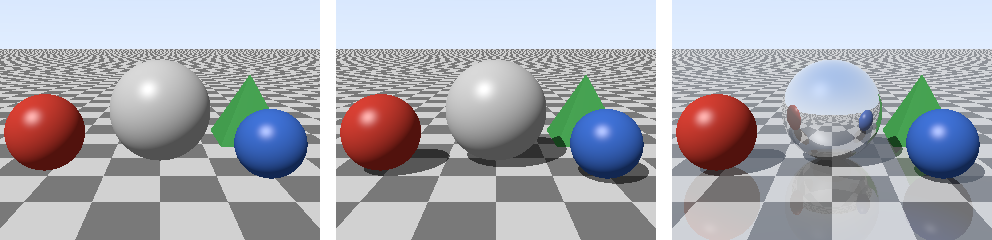
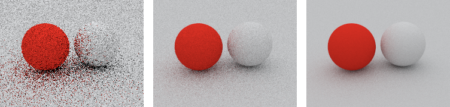

レイトレーシング
================

ここまでの章では、物体を画面に投影して塗るラスタライズ法で画像を描いた。本章では、もう 1 つの方法であるレイトレーシング法を実装する。レイトレーシング法は、影、反射、屈折のように、光が物体の間を行き来する現象を自然に表現できる。

本章のコードは ``raytracer.py`` にある。全ての画素のレイを NumPy の配列にまとめ、交差判定と照明の計算を一度に行う。

レイトレーシングの考え方
------------------------

現実の世界では、光源から出た光が物体の表面で反射を繰り返し、その一部が目に届く。しかし、光源から出る光のうち目に届くのはごく一部なので、光源から光を追いかけるのは無駄が多い。

そこで、レイトレーシング法では、光の経路を逆にたどる。カメラから各画素を通る半直線（レイ）を飛ばし、最初に当たる物体を探す。当たった点の色は、その点から光源やほかの物体に向けてさらにレイを飛ばして求める。

レイは、始点 :math:`\mathbf{o}` と単位ベクトルの向き :math:`\mathbf{d}` を使って、次の式で表される。:math:`t` はレイの始点からの距離である。

.. math::

   \mathbf{p}(t) = \mathbf{o} + t \mathbf{d} \quad (t > 0)

カメラからのレイの生成
----------------------

カメラからのレイは、カメラの位置を始点とし、カメラの前方の距離 1 の位置に置いたスクリーン上の各画素の中心に向かう向きとする。スクリーンの大きさは、:doc:`transform`\ の透視投影と同じく、視野角と画面の縦横比から決める。

.. literalinclude:: ../examples/raytracer.py
   :language: python
   :pyobject: camera_rays
   :lineno-match:

透視投影の行列は使っていないが、レイが 1 点（カメラの位置）から放射状に広がるので、遠くの物体ほど小さく写る。

交差判定
--------

レイトレーシング法の中心的な処理は、レイと物体が交わるかを調べ、交わる場合はその距離 :math:`t` を求めることである。これを交差判定という。

球との交差判定
~~~~~~~~~~~~~~

中心 :math:`\mathbf{c}`、半径 :math:`r` の球の表面の点 :math:`\mathbf{p}` は、:math:`|\mathbf{p} - \mathbf{c}|^2 = r^2` を満たす。この式にレイの式を代入し、:math:`|\mathbf{d}| = 1` を使って整理すると、:math:`t` の 2 次方程式になる。

.. math::

   t^2 + 2bt + c' = 0, \quad
   b = (\mathbf{o} - \mathbf{c}) \cdot \mathbf{d}, \quad
   c' = |\mathbf{o} - \mathbf{c}|^2 - r^2

判別式 :math:`b^2 - c'` が負であれば、レイは球と交わらない。0 以上であれば、:math:`t = -b \pm \sqrt{b^2 - c'}` の 2 つの解のうち、正で小さいほうが最初に交わる点までの距離である。

.. literalinclude:: ../examples/raytracer.py
   :language: python
   :pyobject: Sphere.intersect
   :lineno-match:

交点で新しいレイを飛ばすとき、計算の誤差によって、交点が面のわずかに内側に入ることがある。すると、新しいレイがその面自身と交わってしまい、表面に黒い斑点が現れる。これを防ぐため、:math:`t` がごく小さな値 ``EPSILON`` 以下の交点は無視している。

平面との交差判定
~~~~~~~~~~~~~~~~

点 :math:`\mathbf{q}` を通り、法線が :math:`\mathbf{n}` の平面上の点 :math:`\mathbf{p}` は、:math:`(\mathbf{p} - \mathbf{q}) \cdot \mathbf{n} = 0` を満たす。レイの式を代入すると、:math:`t = (\mathbf{q} - \mathbf{o}) \cdot \mathbf{n} / (\mathbf{d} \cdot \mathbf{n})` が得られる。:math:`\mathbf{d} \cdot \mathbf{n} = 0` のときは、レイが平面と平行なので交わらない。

.. literalinclude:: ../examples/raytracer.py
   :language: python
   :pyobject: Plane.intersect
   :lineno-match:

三角形との交差判定
~~~~~~~~~~~~~~~~~~

三角形メッシュをレイトレーシング法で描くには、レイと三角形の交差判定が必要である。三角形の内部の点は、:doc:`raster2d`\ の重心座標を使って :math:`\mathbf{v}_0 + u(\mathbf{v}_1 - \mathbf{v}_0) + v(\mathbf{v}_2 - \mathbf{v}_0)` と表せる。これをレイの式と等しいとおくと、:math:`t`、:math:`u`、:math:`v` の 3 元連立 1 次方程式になる。メラー-トランボアの方法は、この方程式を外積と内積を使って効率よく解く方法である。:math:`u \ge 0`、:math:`v \ge 0`、:math:`u + v \le 1` であれば、交点は三角形の内側にある。

.. literalinclude:: ../examples/raytracer.py
   :language: python
   :pyobject: Triangle.intersect
   :lineno-match:

最も近い交点
~~~~~~~~~~~~

場面に複数の物体がある場合は、全ての物体との交差判定を行い、最も距離 :math:`t` が小さい物体を選ぶ。これは、ラスタライズ法の Z バッファー法による隠面消去と同じ役割を果たす。

.. literalinclude:: ../examples/raytracer.py
   :language: python
   :pyobject: closest_hit
   :lineno-match:

このコードは、全てのレイについて全ての物体との交差判定を行う。物体の数が増えると計算量はそれに比例して増えるので、実用的なレイトレーサーでは、物体を階層的な箱で囲むデータ構造（BVH、バウンディングボリューム階層）を使って、交わる可能性のない物体の判定を省く。

影と反射
--------

レイトレーシング法では、交点からさらにレイを飛ばすことで、影と反射を簡単に表現できる。

* 影: 交点から光源の向きにレイ（シャドウレイ）を飛ばす。途中で物体に当たれば、その点は影の中にあるので、光源からの光（拡散反射と鏡面反射）を加えない。
* 反射: 交点から、視線を鏡のように反射させた向きにレイを飛ばし、その先に見える色を混ぜる。反射した先でもさらに反射が起こりうるので、この処理は再帰的になる。

向き :math:`\mathbf{d}` を、法線 :math:`\mathbf{n}` の面で反射させた向きは :math:`\mathbf{d} - 2(\mathbf{d} \cdot \mathbf{n})\mathbf{n}` である。

.. literalinclude:: ../examples/raytracer.py
   :language: python
   :pyobject: reflect
   :lineno-match:

交点の色の計算には、:doc:`shading`\ の ``lambert()`` と ``blinn_phong()`` をそのまま使う。

.. literalinclude:: ../examples/raytracer.py
   :language: python
   :pyobject: trace
   :lineno-match:

反射の回数には上限（``depth``）を設けている。2 枚の鏡を向かい合わせたような場面では、反射が無限に続くからである。

:numref:`fig-raytrace` は、市松模様の床に、3 つの球と、4 枚の三角形でできた四角錐を置いた場面である。左は影も反射もない画像で、物体が床から浮いているように見える。中は影を加えた画像で、物体と床の位置関係が分かるようになる。右は、中央の球と床に反射を加えた画像である。中央の球には周りの景色が映り込み、床にも物体がうっすらと映っている。

.. _fig-raytrace:

   影も反射もなし（左）、影を追加（中）、影と反射を追加（右）

ラスタライズ法で影や反射を表現するには、:doc:`texture`\ で紹介したシャドウマップや環境マップのように、別途画像を描いておく工夫が必要になる。一方、レイトレーシング法では、レイを 1 本追加するだけで済む。

屈折も、同じように表現できる。ガラスや水のような透明な物体では、交点からスネルの法則にしたがって曲がる向きに、レイを飛ばせばよい。

レンダリング方程式とパストレーシング
------------------------------------

ここまでのレイトレーシングでは、光源から直接届く光と、鏡のような反射だけを扱った。しかし、現実には、拡散反射する表面も周りに光を放ち、ほかの物体を照らしている。白い壁の近くに赤い物を置くと、壁がうっすら赤く色づくのはこのためである。物体の間で何度も反射してから届く光を間接光といい、直接光と間接光の両方を考慮した照明の計算を、大域照明（グローバルイルミネーション）という。

表面上の点 :math:`\mathbf{x}` から向き :math:`\omega_o` に出ていく光の強さ（放射輝度）\ :math:`L_o` は、次のレンダリング方程式で表される。

.. math::

   L_o(\mathbf{x}, \omega_o) = L_e(\mathbf{x}, \omega_o)
   + \int_{\Omega} f_r(\mathbf{x}, \omega_i, \omega_o)\, L_i(\mathbf{x}, \omega_i)\, (\mathbf{n} \cdot \omega_i)\, d\omega_i

:math:`L_e` は点 :math:`\mathbf{x}` 自身が発する光、:math:`f_r` は\ :doc:`shading`\ で触れた BRDF、:math:`L_i` は向き :math:`\omega_i` から届く光、:math:`\Omega` は法線 :math:`\mathbf{n}` の側の半球である。右辺の積分は「あらゆる向きから届く光のうち、:math:`\omega_o` の向きに反射される分の合計」を表す。:math:`L_i` は、別の点から出ていく :math:`L_o` そのものなので、この式は再帰的になっている。

この積分を解析的に解くことは一般にできない。パストレーシングは、この積分をモンテカルロ法（乱数を使った数値積分）で推定する方法である。

#. カメラからレイを飛ばし、物体に当たったら、反射する向きを乱数で 1 つ選んでレイを続ける。
#. これを、レイが光源（本資料の例では空）に届くか、反射の回数が上限に達するまで繰り返す。
#. 光源に届いたら、その光の強さに、それまでの反射で掛かった係数の積を掛けた値を、その経路の推定値とする。
#. 1 つの画素について、多数の経路の推定値を平均する。

拡散反射の向きを、:math:`\mathbf{n} \cdot \omega_i` に比例する確率で選ぶと、ランバート反射では係数が表面の色 :math:`k_d` だけになり、計算が簡単になる。

.. literalinclude:: ../examples/raytracer.py
   :language: python
   :pyobject: path_trace
   :lineno-match:

:numref:`fig-pathtrace` は、空を光源として、拡散反射する 2 つの球と床をパストレーシングで描いたものである。1 画素あたりの経路の数（サンプル数）を、左から 1、16、128 と増やしている。サンプル数が少ないとノイズが目立つが、増やすほど推定の誤差が減り、なめらかな画像になる。白い球の左側が赤い球に照らされてうっすら赤く色づいていることや、物体と床が接する部分が暗くなっていることが分かる。これらは、直接光だけを扱う照明モデルでは表現できない。

.. _fig-pathtrace:

   1 画素あたりのサンプル数 1（左）、16（中）、128（右）

モンテカルロ法の誤差（ノイズの標準偏差）は、サンプル数の平方根に反比例する。ノイズを半分にするには、4 倍のサンプル数が必要になる。そのため、実用的なレンダラーでは、光源の方向を重点的に調べる重点的サンプリングや、少ないサンプル数の画像からノイズを取り除くデノイザーを組み合わせて、計算時間を短くしている。
