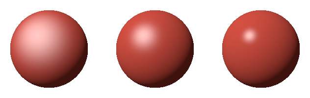
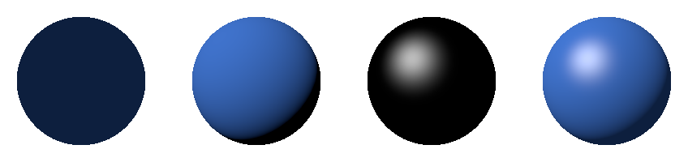
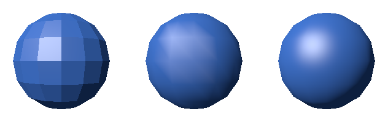

ライティングとシェーディング
============================

:doc:`rasterization`\ では、物体ごとに 1 つの色で塗ったため、物体の立体感が分からなかった。本章では、光源と表面の向きから画素の色を計算し、立体感のある画像を描く。光の当たり方を計算することをライティング、その結果で表面に陰影を付けることをシェーディングという。

本章のコードは ``shading.py`` にある。

光と表面の反射
--------------

物体が見えるのは、光源から出た光が物体の表面で反射し、目に届くからである。表面での光の反射は、大きく次の 2 つに分けて考える。

.. list-table::
   :header-rows: 1
   :widths: 20 40 40

   * - 反射
     - 様子
     - 見え方
   * - 拡散反射
     - 光が表面の内部で散乱し、あらゆる方向に均等に出ていく。
     - 見る方向によらず同じ明るさに見える。物体の色を決める。紙、布、素焼きの陶器など。
   * - 鏡面反射
     - 光が表面で鏡のように反射し、特定の方向に強く出ていく。
     - 見る方向によって明るさが変わり、つやのあるハイライトになる。金属、プラスチック、濡れた面など。

正確には、光の反射の仕方は、入射する方向と出ていく方向の組ごとに決まる。これを表す関数を、双方向反射率分布関数（BRDF）という。本章で扱う照明モデルは、BRDF を簡単な式で近似したものである。

光源の種類
----------

CG でよく使う光源には、次のものがある。

.. list-table::
   :header-rows: 1
   :widths: 20 80

   * - 光源
     - 特徴
   * - 平行光源
     - 無限に遠くにあり、場面のどこでも同じ向きから光が届く。太陽光を表すのに使う。
   * - 点光源
     - 1 点から全ての方向に光を出す。電球を表すのに使う。光源からの距離の 2 乗に反比例して暗くなる。
   * - スポットライト
     - 点光源のうち、特定の向きの円錐の範囲にだけ光を出すもの。
   * - 環境光
     - あらゆる方向から均等に届く光。周りの物体で反射した間接的な光を、ごく大まかに近似したもの。

本章の例では、平行光源と環境光を使う。光源の向きは、表面から光源に向かう単位ベクトル :math:`\mathbf{L}` で表す。

拡散反射（ランバート反射）
--------------------------

拡散反射の明るさは、表面に当たる光の量で決まる。光が表面に斜めに当たると、同じ量の光がより広い面積に広がるので、単位面積あたりの光の量が減る。表面の法線 :math:`\mathbf{N}` と光源の向き :math:`\mathbf{L}` のなす角を :math:`\theta` とすると、単位面積あたりの光の量は :math:`\cos \theta` に比例する。これをランバートの余弦則という。

:math:`\mathbf{N}` と :math:`\mathbf{L}` が単位ベクトルであれば :math:`\cos \theta = \mathbf{N} \cdot \mathbf{L}` なので、拡散反射の明るさは次の式で表される。:math:`k_d` は表面の色（拡散反射率）である。光が裏から当たる場合（内積が負の場合）は 0 とする。

.. math::

   I_{\mathrm{diffuse}} = k_d \max(\mathbf{N} \cdot \mathbf{L}, 0)

.. literalinclude:: ../examples/shading.py
   :language: python
   :pyobject: lambert
   :lineno-match:

鏡面反射（フォンとブリン-フォン）
----------------------------------

鏡面反射のハイライトは、光が鏡のように反射する向きの近くから見たときに明るく見える。フォンの反射モデルでは、光源の向き :math:`\mathbf{L}` を法線について反射させた向き :math:`\mathbf{R} = 2(\mathbf{N} \cdot \mathbf{L})\mathbf{N} - \mathbf{L}` と、表面から視点に向かう向き :math:`\mathbf{V}` のなす角が小さいほど明るくする。

.. math::

   I_{\mathrm{specular}} = k_s \max(\mathbf{R} \cdot \mathbf{V}, 0)^{\alpha}

ブリン-フォンの反射モデルは、:math:`\mathbf{R}` の代わりに、:math:`\mathbf{L}` と :math:`\mathbf{V}` の中間の向き（ハーフベクトル）\ :math:`\mathbf{H}` を使う。:math:`\mathbf{H}` が法線 :math:`\mathbf{N}` に近いほど、鏡のように反射する向きに近い。

.. math::

   \mathbf{H} = \frac{\mathbf{L} + \mathbf{V}}{|\mathbf{L} + \mathbf{V}|}, \quad
   I_{\mathrm{specular}} = k_s \max(\mathbf{N} \cdot \mathbf{H}, 0)^{\alpha}

ブリン-フォンのほうが計算が少なく、視線が表面に浅い角度で当たるときの見え方も自然なため、広く使われている。本資料でもブリン-フォンを使う。

.. literalinclude:: ../examples/shading.py
   :language: python
   :pyobject: blinn_phong
   :lineno-match:

:math:`k_s` は鏡面反射の強さ、:math:`\alpha` は光沢度である。光沢度が大きいほど、ハイライトは小さく鋭くなり、つやのある表面に見える。:numref:`fig-shininess` は、光沢度を 8、32、128 に変えた球である。

.. _fig-shininess:

   光沢度 8（左）、32（中）、128（右）

照明モデルの全体
----------------

環境光、拡散反射、鏡面反射の 3 つの成分を足し合わせると、表面の色は次の式になる。:math:`k_a` は環境光の強さである。光源の色は白とし、式から省いている。

.. math::

   I = k_a k_d + k_d \max(\mathbf{N} \cdot \mathbf{L}, 0) + k_s \max(\mathbf{N} \cdot \mathbf{H}, 0)^{\alpha}

.. literalinclude:: ../examples/shading.py
   :language: python
   :pyobject: shade
   :lineno-match:

:numref:`fig-shading-terms` は、球の各成分と、その合計を並べたものである。環境光だけでは平坦な円にしか見えないが、拡散反射を加えると球の丸みが、鏡面反射を加えると表面のつやが表れる。

.. _fig-shading-terms:

   環境光（左端）、拡散反射（左から 2 番目）、鏡面反射（左から 3 番目）、合計（右端）

照明の計算は、:doc:`image`\ で説明したとおり、光の強さに比例する線形な値で行う。表面の色 ``material.color`` は sRGB の値で指定するので、``shade()`` の中で ``srgb_to_linear()`` を使って線形な値に変換している。計算した結果は、画像を保存する前に ``linear_to_srgb()`` で sRGB の値に戻す。この変換を省くと、陰の部分が暗くなりすぎ、明るい部分との境目が不自然になる。

この照明モデルは経験的なもので、物理的には正確ではない。たとえば、光源の明るさや光沢度を変えると、反射する光の総量が変わってしまう（エネルギー保存則を満たさない）。現在の映像制作やゲームでは、物理的な性質にもとづいて BRDF を決める物理ベースレンダリング（PBR）が主流である。PBR では、表面を微小な鏡（マイクロファセット）の集まりとみなし、表面の粗さ（ラフネス）と金属かどうか（メタリック）などの少数のパラメーターで質感を指定する。

シェーディングの方法
--------------------

照明の計算を、どの単位で行うかによって、次の 3 つの方法がある。

.. list-table::
   :header-rows: 1
   :widths: 25 45 30

   * - 方法
     - 計算の仕方
     - 特徴
   * - フラットシェーディング
     - 三角形ごとに、面の法線で 1 回だけ計算し、三角形全体を同じ色で塗る。
     - 計算が少ない。面の境目がはっきり見え、角張った見た目になる。
   * - グーローシェーディング
     - 頂点ごとに頂点の法線で計算し、その色を三角形の内部で補間する。
     - 計算が少ない。ハイライトが頂点の間でぼやけたり、形がゆがんだりする。
   * - フォンシェーディング
     - 頂点の法線を画素ごとに補間し、画素ごとに計算する。
     - 計算が多い。頂点が少なくても、なめらかなハイライトが得られる。

フォンシェーディングは、フォンの反射モデルとは別のものであることに注意する。フォンシェーディングでは、どの照明モデルを使ってもよい。

本資料のレンダラーでは、フォンシェーディングは、フレームバッファーに書き込まれた画素ごとの位置と法線から照明を計算することで実現する。

.. literalinclude:: ../examples/shading.py
   :language: python
   :pyobject: render_phong
   :lineno-match:

グーローシェーディングは、頂点ごとに照明を計算した色を頂点の属性として渡し、ラスタライズで補間させる。

.. literalinclude:: ../examples/shading.py
   :language: python
   :pyobject: render_gouraud
   :lineno-match:

フラットシェーディングは、頂点を三角形ごとに複製して、法線を面の法線に置き換えたメッシュ（``renderer.py`` の ``flatten()``）を、``render_phong()`` で描いて実現している。

:numref:`fig-shading-models` は、経線 16 本、緯線 8 本で区切った頂点の少ない球を、3 つの方法で描いたものである。グーローシェーディングでは、ハイライトが三角形の形に沿ってゆがんでいる。フォンシェーディングでは、頂点が少なくてもなめらかなハイライトが得られている。ただし、どの方法でも、球の輪郭の角張りは消えない。輪郭の形をなめらかにするには、三角形の数を増やす必要がある。

.. _fig-shading-models:

   フラットシェーディング（左）、グーローシェーディング（中）、フォンシェーディング（右）

現在の GPU は画素ごとの計算を十分に速く行えるので、フォンシェーディング（画素ごとのライティング）が標準である。
