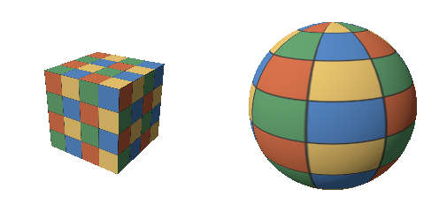
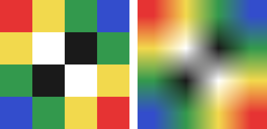
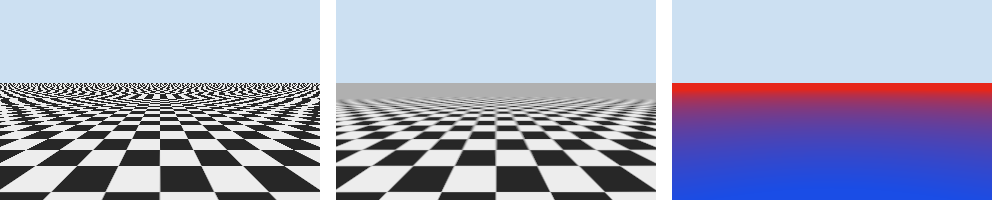

テクスチャマッピング
====================

現実の物体の表面には、木目、レンガ、文字などの細かい模様がある。これらを全て三角形の頂点の色で表そうとすると、膨大な数の三角形が必要になる。そこで、模様を画像として用意し、三角形の表面に貼り付ける。これをテクスチャマッピングといい、貼り付ける画像をテクスチャという。

本章のコードは ``texture.py`` にある。

テクスチャ座標
--------------

テクスチャの画素を、画像の画素と区別してテクセルという。メッシュの各頂点には、テクスチャのどの位置を対応させるかを表す 2 次元の座標を、頂点の属性として持たせる。これをテクスチャ座標（UV 座標）という。本資料では、テクスチャの左下を :math:`(u, v) = (0, 0)`、右上を :math:`(1, 1)` とする。

ラスタライズでは、テクスチャ座標を他の属性と同じように画素ごとに補間する（透視補正補間が必要である）。シェーディングでは、補間したテクスチャ座標の位置にあるテクスチャの色を読み取り、表面の色として使う。テクスチャから色を読み取ることを、サンプリングという。

:numref:`fig-textured` は、立方体と球にテクスチャを貼り、拡散反射の照明を加えたものである。立方体は 6 つの面それぞれに、球は経度を u、緯度を v として、全体に 1 枚のテクスチャを巻き付けている。球では、極に近いほどテクスチャが横方向に縮んでいる。球面を 1 枚の平面の画像にゆがみなく対応させることはできないので、どこかにこのようなゆがみが生じる。

.. _fig-textured:

   テクスチャを貼った立方体（左）と球（右）

.. literalinclude:: ../examples/texture.py
   :language: python
   :pyobject: render_textured
   :lineno-match:

テクスチャの色はふつう sRGB の値で保存されているので、照明の計算に使う前に線形な値に変換している。一方、本章の最後で紹介する法線マップのように、色ではなく数値のデータを記録したテクスチャは、変換せずにそのまま使う。

テクスチャの拡大と補間
----------------------

テクスチャ座標をテクセルの位置に変換すると、一般に整数にならない。そこで、周りのテクセルからどのように色を決めるかを選ぶ必要がある。

.. literalinclude:: ../examples/texture.py
   :language: python
   :pyobject: texel_coords
   :lineno-match:

最近傍補間は、最も近いテクセルの色をそのまま使う方法である。計算は簡単だが、テクスチャを拡大して表示すると、テクセルの形がそのまま四角く見える。

.. literalinclude:: ../examples/texture.py
   :language: python
   :pyobject: sample_nearest
   :lineno-match:

バイリニア補間は、周りの 4 つのテクセルの色を、距離に応じた重みで混ぜる方法である。x 方向に 2 回、y 方向に 1 回の線形補間を行う。

.. literalinclude:: ../examples/texture.py
   :language: python
   :pyobject: sample_bilinear
   :lineno-match:

:numref:`fig-texture-filter` は、4 × 4 テクセルのテクスチャを 256 × 256 画素に拡大したものである。最近傍補間では色の境目がはっきりしたままで、バイリニア補間では色がなめらかにつながっている。ドット絵のように境目を残したい場合は最近傍補間を、写真のようなテクスチャではバイリニア補間を使う。

.. _fig-texture-filter:

   最近傍補間（左）とバイリニア補間（右）

テクスチャ座標が 0 から 1 の範囲を外れた場合の扱いを、ラップモードという。テクスチャを繰り返す（repeat）方法と、端のテクセルの色を延長する（clamp）方法がよく使われる。床や壁のように同じ模様を敷き詰める場合は繰り返しを使う。:numref:`fig-texture-filter` では、テクスチャの端の色が反対側の端の色と混ざらないように、端のテクセルを延長している。

.. literalinclude:: ../examples/texture.py
   :language: python
   :pyobject: fetch
   :lineno-match:

テクスチャの縮小とミップマップ
------------------------------

遠くにある物体では、1 つの画素に多数のテクセルが対応する。このとき、画素の中心の 1 点だけでテクスチャをサンプリングすると、その間にあるテクセルが無視される。その結果、模様がちらついたり、本来の模様とは異なるしま模様（モアレ）が現れたりする。これは、:doc:`raster2d`\ で説明したエイリアシングの一種である。

1 画素に対応する全てのテクセルの平均を毎回計算すれば正しい色が得られるが、計算量が大きすぎる。そこで、あらかじめテクスチャを縦横半分ずつに縮小した画像を、1 × 1 テクセルになるまで用意しておく。これをミップマップという。元のテクスチャを 0 段とし、縮小するごとに段の番号を 1 ずつ増やす。全ての段を合わせても、元のテクスチャの 4/3 倍の大きさで済む。

.. literalinclude:: ../examples/texture.py
   :language: python
   :pyobject: build_mipmaps
   :lineno-match:

サンプリングするときは、1 画素が何テクセル分に当たるかを求め、その量に合った段を使う。1 画素が :math:`\rho` テクセル分に当たるとき、使う段（詳細度、LOD）は :math:`\log_2 \rho` である。:math:`\rho` は、隣の画素とのテクスチャ座標の差から求める。

.. literalinclude:: ../examples/texture.py
   :language: python
   :pyobject: mip_level
   :lineno-match:

段の番号は一般に整数にならないので、前後の 2 つの段をバイリニア補間で読み、さらに段の間で線形補間する。これをトライリニア補間という。

.. literalinclude:: ../examples/texture.py
   :language: python
   :pyobject: sample_trilinear
   :lineno-match:

:numref:`fig-mipmap` は、遠くまで続く市松模様の床を描いたものである。左の図はミップマップを使わずにバイリニア補間だけで描いたもので、奥に向かってモアレが生じている。中の図はミップマップを使ったもので、奥の模様は細かすぎて見分けられない代わりに、平均の色である灰色になっている。右の図は、中の図で使った段を色で表したもので、青が 0 段、赤に近いほど縮小した段である。

.. _fig-mipmap:

   ミップマップなし（左）、ミップマップあり（中）、使ったミップマップの段（右）

床のように画面に対して斜めに見える面では、1 画素に対応するテクセルの範囲が細長くなる。ミップマップはこの範囲を正方形とみなして段を選ぶので、奥がぼやけすぎる。中の図で奥の模様が早めに灰色になっているのはこのためである。GPU には、細長い範囲に沿って複数回サンプリングする異方性フィルタリングという機能があり、斜めの面をよりくっきりと描ける。

テクスチャのいろいろな使い方
----------------------------

テクスチャは、表面の色以外のデータを記録するのにも使われる。

.. list-table::
   :header-rows: 1
   :widths: 25 75

   * - 種類
     - 内容
   * - 法線マップ
     - 表面の細かな凹凸による法線の向きを記録する。三角形の数を増やさずに、凹凸による陰影を表現できる。
   * - ラフネスマップ、メタリックマップ
     - 物理ベースレンダリングで使う、表面の粗さや金属かどうかを、場所ごとに記録する。
   * - 環境マップ
     - 周りの景色を記録する。つやのある物体への映り込みや、空の表現に使う。
   * - シャドウマップ
     - 光源から見た深度を記録する。描画する点が光源から見えるかを判定し、影を付けるのに使う。
