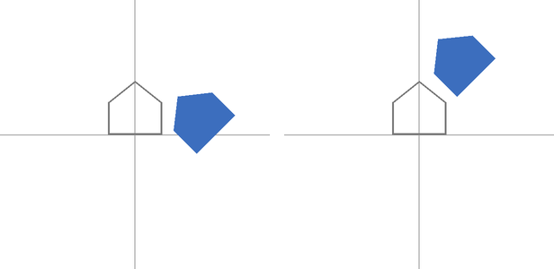
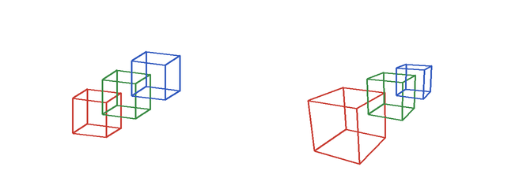

座標変換と投影
==============

3 次元の物体を画面に描くには、物体の頂点の座標を、いくつかの座標系を経由して画面上の画素の座標に変換する。本章では、物体を動かす変換、カメラから見た座標への変換、3 次元を 2 次元に写す投影を、:doc:`math`\ で説明した 4 × 4 の行列で表す。

本章のコードは ``transform.py`` にある。

2 次元の基本的な変換
--------------------

まず、考え方を 2 次元で確かめる。2 次元の点 :math:`(x, y)` を同次座標 :math:`(x, y, 1)` で表すと、拡大縮小、回転、平行移動は、それぞれ次の 3 × 3 の行列で表せる。

.. list-table::
   :header-rows: 1
   :widths: 20 40 40

   * - 変換
     - 行列
     - 意味
   * - 拡大縮小
     - :math:`\begin{pmatrix} s_x & 0 & 0 \\ 0 & s_y & 0 \\ 0 & 0 & 1 \end{pmatrix}`
     - 原点を中心に、x 方向に :math:`s_x` 倍、y 方向に :math:`s_y` 倍する。
   * - 回転
     - :math:`\begin{pmatrix} \cos \theta & -\sin \theta & 0 \\ \sin \theta & \cos \theta & 0 \\ 0 & 0 & 1 \end{pmatrix}`
     - 原点を中心に、反時計回りに :math:`\theta` だけ回転する。
   * - 平行移動
     - :math:`\begin{pmatrix} 1 & 0 & t_x \\ 0 & 1 & t_y \\ 0 & 0 & 1 \end{pmatrix}`
     - x 方向に :math:`t_x`、y 方向に :math:`t_y` だけ移動する。

.. literalinclude:: ../examples/transform.py
   :language: python
   :pyobject: rotate_2d
   :lineno-match:

変換の合成と順序
~~~~~~~~~~~~~~~~

複数の変換は、行列の積で 1 つにまとめられる。ただし、:doc:`math`\ で見たとおり、行列の積は順序を入れ替えると結果が変わる。:numref:`fig-transform-order` は、原点に置いた家の形（灰色の輪郭）に、45 度の回転と x 方向への 1.5 の平行移動を、異なる順序で行った結果（青）である。

.. _fig-transform-order:

   回転してから平行移動した結果（左、:math:`TR`）と、平行移動してから回転した結果（右、:math:`RT`）

.. literalinclude:: ../examples/transform.py
   :language: python
   :pyobject: transform_order_figure
   :lineno-match:

左の図では、家はその場で回転してから右に移動している。右の図では、家は先に右に移動し、その後に原点を中心に回転したため、斜め上に移動している。回転と拡大縮小は常に原点を中心に行われるので、物体をその場で回転させたい場合は、物体の中心が原点にある状態で回転してから、目的の位置に平行移動する。つまり、変換の行列は :math:`T R S`\ （拡大縮小 :math:`S`、回転 :math:`R`、平行移動 :math:`T` の順に行う）の形にするのが基本である。

3 次元の変換
------------

3 次元でも考え方は同じで、4 × 4 の行列を使う。拡大縮小と平行移動は、2 次元の行列に z の成分を加えたものになる。回転は、どの軸のまわりに回転するかによって行列が異なる。たとえば、y 軸のまわりの回転の行列は次のとおりである。

.. math::

   R_y(\theta) =
   \begin{pmatrix}
   \cos \theta & 0 & \sin \theta & 0 \\
   0 & 1 & 0 & 0 \\
   -\sin \theta & 0 & \cos \theta & 0 \\
   0 & 0 & 0 & 1
   \end{pmatrix}

.. literalinclude:: ../examples/transform.py
   :language: python
   :pyobject: rotate_y
   :lineno-match:

任意の向きへの回転は、x 軸、y 軸、z 軸のまわりの回転を組み合わせて表せる。ただし、3 つの角度で回転を表す方法（オイラー角）には、組み合わせによって回転の自由度が 1 つ失われる問題（ジンバルロック）がある。そのため、ゲームエンジンなどでは、回転を四元数（クォータニオン）で表すことが多い。

座標系の流れ
------------

3 次元の頂点が画面上の画素の位置になるまでに、座標は次の座標系を順に経由する。

.. list-table::
   :header-rows: 1
   :widths: 25 40 35

   * - 座標系
     - 意味
     - 次の座標系への変換
   * - モデル座標
     - 物体ごとに決めた座標系。物体の中心を原点にすることが多い。
     - モデル変換（:math:`M`）
   * - ワールド座標
     - 場面全体で共通の座標系。
     - ビュー変換（:math:`V`）
   * - カメラ座標
     - カメラを原点とし、カメラが -z 方向を向く座標系。
     - 投影変換（:math:`P`）
   * - クリップ座標
     - 投影変換の結果の同次座標 :math:`(x, y, z, w)`。画面の外にはみ出す部分の切り取り（クリッピング）をこの座標系で行う。
     - 透視除算（:math:`w` で割る）
   * - 正規化デバイス座標（NDC）
     - 画面に映る範囲が、x、y、z のいずれも -1 から 1 になる座標系。
     - ビューポート変換
   * - スクリーン座標
     - 画素を単位とする画面上の座標。
     - （ラスタライズ）

モデル変換、ビュー変換、投影変換は、掛け合わせて 1 つの行列 :math:`PVM` にまとめられる。この行列を MVP 行列ということがある。

.. literalinclude:: ../examples/transform.py
   :language: python
   :pyobject: to_clip
   :lineno-match:

ビュー変換
----------

ビュー変換は、ワールド座標をカメラ座標に変換する。カメラの位置 :math:`\mathbf{e}`、注視する点 :math:`\mathbf{t}`、カメラの上の向きの目安 :math:`\mathbf{u}` を与えて、次のようにカメラの 3 つの軸を求める。

#. 前方: :math:`\mathbf{f} = \mathrm{normalize}(\mathbf{t} - \mathbf{e})`
#. 右: :math:`\mathbf{r} = \mathrm{normalize}(\mathbf{f} \times \mathbf{u})`
#. 上: :math:`\mathbf{u}' = \mathbf{r} \times \mathbf{f}`

ビュー変換は、カメラの位置を原点に移す平行移動と、カメラの 3 つの軸をそれぞれ x 軸、y 軸、-z 軸に重ねる回転を組み合わせたものになる。回転の行列は、3 つの軸のベクトルを行として並べるだけで作れる。3 つの軸が互いに直交する単位ベクトルなので、その逆行列が転置行列に等しいからである。

.. literalinclude:: ../examples/transform.py
   :language: python
   :pyobject: look_at
   :lineno-match:

物体を動かす代わりにカメラを動かしても、画面に映る結果は同じである。ビュー変換は、カメラを動かす変換の逆変換になっている。

投影変換
--------

投影変換は、3 次元の空間のうち画面に映る範囲を、正規化デバイス座標の -1 から 1 の立方体に写す。投影の方法には、平行投影と透視投影がある。

平行投影
~~~~~~~~

平行投影は、カメラ座標の x、y をそのまま画面上の位置にする方法である。奥にある物体も手前にある物体も同じ大きさに見える。設計図、CAD、2 次元のゲームなどで使われる。

透視投影
~~~~~~~~

透視投影は、遠くの物体ほど小さく写す方法である。人間の目やカメラと同じ見え方になる。カメラ座標の点 :math:`(x, y, z)` を、カメラから距離 1 の位置にあるスクリーンに写すと、相似な三角形の関係から、スクリーン上の位置は :math:`(x / (-z), y / (-z))` になる（カメラは -z 方向を向いているので、見える範囲では :math:`z < 0` である）。

この「:math:`-z` で割る」処理は、行列の掛け算だけでは表せない。そこで、投影変換の行列で :math:`w = -z` となるようにしておき、後で透視除算として :math:`w` で割る。縦方向の視野角を :math:`\theta`、画面の縦横比（幅 / 高さ）を :math:`a`、カメラから見える範囲の手前の距離（ニアクリップ面）を :math:`n`、奥の距離（ファークリップ面）を :math:`f` とすると、透視投影の行列は次のとおりである。

.. math::

   P =
   \begin{pmatrix}
   \dfrac{s}{a} & 0 & 0 & 0 \\
   0 & s & 0 & 0 \\
   0 & 0 & \dfrac{f + n}{n - f} & \dfrac{2 f n}{n - f} \\
   0 & 0 & -1 & 0
   \end{pmatrix},
   \quad s = \frac{1}{\tan(\theta / 2)}

3 行目は、透視除算の後の z が、カメラからの距離 :math:`n` で -1、:math:`f` で 1 になるように決めたものである。この z は、:doc:`rasterization`\ で物体の前後関係を判定するために使う。

.. literalinclude:: ../examples/transform.py
   :language: python
   :pyobject: perspective
   :lineno-match:

:numref:`fig-projection` は、奥に向かって並べた同じ大きさの 3 つの立方体を、平行投影と透視投影で描いたものである。透視投影では、奥の立方体ほど小さく写り、平行な辺が奥で 1 点に近づいていく。

.. _fig-projection:

   平行投影（左）と透視投影（右）

ビューポート変換
----------------

最後に、透視除算で得た正規化デバイス座標を、画素を単位とするスクリーン座標に変換する。正規化デバイス座標の x、y は -1 から 1 の範囲で、y 軸は上向きである。一方、画像の座標は左上が原点で、y 軸は下向きである。そのため、y の符号を反転する。

.. literalinclude:: ../examples/transform.py
   :language: python
   :pyobject: to_screen
   :lineno-match:

法線の変換
----------

面の法線のような向きのベクトルは、頂点の座標と同じ行列では正しく変換できない場合がある。たとえば、物体を x 方向にだけ 2 倍に引き伸ばすと、斜めの面の傾きが変わる。このとき、法線にも同じ拡大縮小を掛けると、法線は面に垂直でなくなる。

法線を正しく変換するには、モデル変換の左上の 3 × 3 の部分 :math:`M_3` の逆行列の転置 :math:`(M_3^{-1})^{\mathsf{T}}` を掛ける。回転だけ、または全ての方向に同じ倍率の拡大縮小だけを含む変換であれば、:math:`(M_3^{-1})^{\mathsf{T}}` は :math:`M_3` の定数倍になるので、正規化すれば同じ結果になる。本資料のレンダラーでは、次の関数で法線を変換する。

.. literalinclude:: ../examples/renderer.py
   :language: python
   :pyobject: transform_normals
   :lineno-match:
