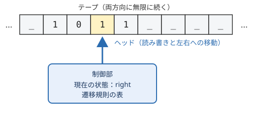

計算の理論
==========

「:doc:`02_what_is_computer`」では、計算を「入力を、決められた規則に従って、出力に変換する手続き」と定義しました。しかし、「決められた規則」とは具体的に何でしょうか。この章では、この曖昧さを取り除くために考案されたチューリングマシンを紹介し、計算できることとできないことの境界を考えます。最後に、計算できる問題でも、それを解くのにどれだけの時間がかかるかを議論する計算量の考え方を紹介します。

アルゴリズム
------------

アルゴリズムとは、問題を解くための明確で有限な手順のことです。最も古いアルゴリズムの一つに、2 つの正の整数の最大公約数を求めるユークリッドの互除法があります。

#. 2 つの数を :math:`a`、:math:`b` とする。
#. :math:`b` が 0 なら、:math:`a` が最大公約数である。終了する。
#. :math:`a` を :math:`b` で割った余りを :math:`r` とする。
#. :math:`a` を :math:`b` に、:math:`b` を :math:`r` に置き換えて、手順 2 に戻る。

Python で書くと次のようになります。

.. code-block:: python
   :linenos:

   def gcd(a: int, b: int) -> int:
       while b != 0:
           a, b = b, a % b
       return a

   print(gcd(1071, 1029))  # 21 と表示される

この手順は、次の性質を持っています。

* 各手順は、誰が実行しても同じ結果になるほど明確です。
* 手順の数は有限です。
* :math:`b` は繰り返しのたびに必ず小さくなるので、いつか 0 になり、必ず停止します。

20 世紀の初めまで、アルゴリズムは「明確な手順」という直感的な概念にすぎませんでした。直感的な概念のままでは、「この問題を解くアルゴリズムは存在しない」と証明することはできません。存在しないことを証明するには、考えられるすべての手順を対象にする必要があり、そのためには「手順」を数学的に定義しなければならないからです。

この課題に答えたのが、1930 年代に提案された複数の計算モデルです。その代表がチューリングマシンです。

チューリングマシン
------------------

チューリングマシンは、アラン・チューリングが 1936 年の論文で提案した仮想的な機械です。チューリングは、紙と鉛筆で計算をする人間の動作を観察し、それを極限まで単純化しました。

   チューリングマシンの構成

チューリングマシンは次の要素から構成されます。

テープ
   セルに区切られた、両方向に無限に長いテープです。各セルには記号を 1 つ書き込めます。何も書かれていないセルには空白記号が入っています。計算を行う人間が使う紙に相当します。

ヘッド
   テープ上の 1 つのセルを指し、そのセルの記号を読み書きします。1 ステップごとに左右どちらかに 1 セル移動します。

状態
   機械は、有限個の状態のうちのどれか 1 つにあります。人間が「今、計算のどの段階にいるか」を覚えていることに相当します。

遷移規則
   「現在の状態」と「ヘッドが読んだ記号」の組から、「書き込む記号」「ヘッドの移動方向」「次の状態」を決める規則の表です。これがチューリングマシンのプログラムに当たります。

チューリングマシンは、次の動作を繰り返します。

#. ヘッドの位置の記号を読む。
#. 現在の状態と読んだ記号から、遷移規則に従って、記号を書き込み、ヘッドを移動し、状態を変える。
#. 停止状態になったら終了する。

数学的には、チューリングマシンは、状態の集合 :math:`Q`、テープ記号の集合 :math:`\Gamma`、遷移関数 :math:`\delta`、開始状態 :math:`q_0`、停止状態などの組として定義されます。遷移関数は次の形をしています。

.. math::

   \delta : Q \times \Gamma \to \Gamma \times \{L, R\} \times Q

ここで :math:`L`、:math:`R` は、ヘッドを左または右に移動することを表します。

チューリングマシンの例
~~~~~~~~~~~~~~~~~~~~~~

テープに書かれた 2 進数に 1 を足すチューリングマシンを考えます。ヘッドは最初、数の左端にあるものとします。状態は、right（右端へ移動中）、carry（繰り上がりを処理中）、halt（停止）の 3 つです。

.. list-table:: 2 進数に 1 を足すチューリングマシンの遷移規則（_ は空白を表す）
   :header-rows: 1
   :widths: 20 15 15 20 30

   * - 現在の状態
     - 読んだ記号
     - 書く記号
     - 移動方向
     - 次の状態
   * - right
     - 0
     - 0
     - 右
     - right
   * - right
     - 1
     - 1
     - 右
     - right
   * - right
     - _
     - _
     - 左
     - carry
   * - carry
     - 1
     - 0
     - 左
     - carry
   * - carry
     - 0
     - 1
     - 左
     - halt
   * - carry
     - _
     - 1
     - 左
     - halt

状態が right の間は、ヘッドを右端まで進めます。右端を越えて空白を読んだら、1 つ左に戻って carry 状態になります。carry 状態では、1 を読んだら 0 に書き換えて左へ進み（繰り上がり）、0 または空白を読んだら 1 を書いて停止します。これは、筆算で 1 を足すときに人間が行う手順と同じです。

サンプルコード :download:`turing_machine.py <../examples/turing_machine.py>` は、この遷移規則でチューリングマシンを動かすシミュレータです。

.. literalinclude:: ../examples/turing_machine.py
   :language: python
   :linenos:
   :caption: turing_machine.py

1011（10 進数の 11）を入力として実行すると、次のように表示されます。[ ] で囲まれた記号がヘッドの位置です。

.. code-block:: text

    0: right [1] 0  1  1
    1: right  1 [0] 1  1
    2: right  1  0 [1] 1
    3: right  1  0  1 [1]
    4: right  1  0  1  1 [_]
    5: carry  1  0  1 [1] _
    6: carry  1  0 [1] 0  _
    7: carry  1 [0] 0  0  _
    8: halt  [1] 1  0  0  _
   結果: 1100 (10 進数の 12)

万能チューリングマシン
----------------------

上の例のチューリングマシンは、1 を足すことしかできない専用の機械です。別の計算をさせるには、別の遷移規則を持つ別のチューリングマシンが必要です。

しかしチューリングは、遷移規則そのものを記号の列としてテープに書き込んでおけば、それを読み取って、そのチューリングマシンの動作を 1 ステップずつ模倣するチューリングマシンが作れることを示しました。これを\ **万能チューリングマシン**\ と呼びます。

万能チューリングマシンは、テープに書かれたプログラム（遷移規則）とデータを読み込んで実行する機械であり、プログラム内蔵方式の汎用計算機の理論的なモデルになっています。上の Python のシミュレータも、遷移規則を辞書として受け取って実行するので、万能チューリングマシンと同じ考え方で作られています。

チャーチ＝チューリングのテーゼ
------------------------------

1930 年代には、チューリングマシン以外にも、計算を定義するさまざまなモデルが提案されました。アメリカのアロンゾ・チャーチ（Alonzo Church）によるラムダ計算や、帰納的関数などです。これらのモデルは見た目がまったく異なりますが、計算できる関数の範囲がすべて同じであることが証明されました。

この結果を踏まえ、次の主張が広く受け入れられています。

   直感的な意味で「アルゴリズムによって計算できる」関数は、チューリングマシンで計算できる関数と一致する。

これを\ **チャーチ＝チューリングのテーゼ**\ と呼びます。「直感的な意味で計算できる」こと自体が数学的に定義されていないので、この主張は証明できる定理ではなく、計算という概念の定義として採用されている主張です。それでも、これまでに考案された合理的な計算モデルは、どれもチューリングマシンと同等以下の計算能力しか持たないことが確かめられています。

チューリング完全
~~~~~~~~~~~~~~~~

万能チューリングマシンを模倣できる計算モデルやプログラミング言語は\ **チューリング完全**\ であるといいます。Python、C、Java などの一般的なプログラミング言語はチューリング完全です。

ただし、実際の計算機は記憶容量が有限なので、厳密にはテープが無限に長いチューリングマシンと同等ではありません。記憶容量が十分に大きければ、事実上チューリングマシンと同等に扱えると考えます。

チャーチ＝チューリングのテーゼとチューリング完全の概念から、次の重要な結論が得られます。

* チューリング完全な計算機は、どれも原理的には同じ範囲の問題を解けます。スーパーコンピュータとスマートフォンの違いは、計算の速さと記憶容量の違いであって、解ける問題の範囲の違いではありません。
* 「:doc:`02_what_is_computer`」で述べた計算の汎用性とは、この性質のことです。

計算できない問題
----------------

計算の定義が定まると、「どんなアルゴリズムでも解けない問題」が存在することを証明できるようになります。その最も有名な例が\ **停止問題**\ です。

   任意のプログラムと、それに与える入力が与えられたとき、そのプログラムがいつか停止するか、それとも永遠に動き続けるかを判定せよ。

停止問題を解くアルゴリズムは存在しないことが、チューリングによって証明されています。ここでは、その証明の考え方を Python の形で説明します。

まず、停止問題を解く関数 ``halts`` が存在すると仮定します。``halts(program, data)`` は、ソースコード ``program`` のプログラムに ``data`` を入力したときに停止するなら ``True`` を、停止しないなら ``False`` を、必ず有限の時間で返すものとします。

この ``halts`` を使って、次の関数 ``paradox`` を作ります。

.. code-block:: python
   :linenos:

   def paradox(program: str) -> None:
       if halts(program, program):
           while True:  # 停止すると判定されたら、無限ループに入る
               pass
       # 停止しないと判定されたら、すぐに終了する

``paradox`` は、プログラム自身のソースコードを入力として与えたときの動作を ``halts`` で判定し、その逆の動作をします。では、``paradox`` に ``paradox`` 自身のソースコードを入力すると、どうなるでしょうか。

* ``halts`` が「停止する」と判定した場合、``paradox`` は無限ループに入るので、停止しません。
* ``halts`` が「停止しない」と判定した場合、``paradox`` はすぐに終了するので、停止します。

どちらの場合も ``halts`` の判定が誤っていることになり、矛盾します。したがって、すべてのプログラムについて正しく判定する ``halts`` は存在しません。

この証明の考え方は、プログラムを入力として受け取るプログラムを作れるという、万能チューリングマシンの性質に基づいています。

停止問題が解けないことは、実務にも影響しています。例えば、「任意のプログラムに無限ループがないかを完全に検出するツール」や「任意の 2 つのプログラムが同じ動作をするかを完全に判定するツール」は作れません。静的解析ツールやコンパイラの警告は、判定できる範囲に対象を限定したり、誤検出や見逃しをある程度許容したりすることで、この限界と折り合いをつけています。

計算量
------

計算できる問題であっても、解くのに天文学的な時間がかかるなら実用的ではありません。そこで、問題を解くのに必要な計算の手間を評価する\ **計算量**\ の考え方が使われます。計算量には、必要な時間を表す時間計算量と、必要な記憶容量を表す空間計算量があります。以下では時間計算量を扱います。

オーダー記法
~~~~~~~~~~~~

計算の手間は、計算機の速さやプログラムの書き方によって定数倍程度は変わります。そこで、入力の大きさ :math:`n` が大きくなったときに、手間がどのような関数に比例して増えるかだけに注目します。これを表すのがオーダー記法（:math:`O` 記法）です。

ある定数 :math:`c > 0` と :math:`n_0` が存在して、:math:`n \geq n_0` であるすべての :math:`n` について :math:`f(n) \leq c \cdot g(n)` が成り立つとき、:math:`f(n) = O(g(n))` と書きます。例えば、:math:`3n^2 + 5n + 2 = O(n^2)` です。

.. list-table:: 主な計算量の例
   :header-rows: 1
   :widths: 20 40 40

   * - 計算量
     - 代表的な処理
     - :math:`n = 10^6` のときの手間の目安
   * - :math:`O(1)`
     - 配列の要素へのアクセス
     - 1
   * - :math:`O(\log n)`
     - ソート済み配列の二分探索
     - 20
   * - :math:`O(n)`
     - 配列の線形探索
     - :math:`10^6`
   * - :math:`O(n \log n)`
     - 効率のよい並べ替え（マージソートなど）
     - :math:`2 \times 10^7`
   * - :math:`O(n^2)`
     - 単純な並べ替え（挿入ソートなど）
     - :math:`10^{12}`
   * - :math:`O(2^n)`
     - 全組み合わせの探索
     - 天文学的な数

表の「手間の目安」で対数の底は 2 としています。1 秒間に :math:`10^9` 回の演算ができる計算機でも、:math:`O(n^2)` のアルゴリズムで :math:`n = 10^6` の入力を処理すると約 1000 秒かかります。一方、:math:`O(n \log n)` のアルゴリズムなら 0.02 秒程度で済みます。計算機を速くするよりも、アルゴリズムを改善するほうが効果が大きい場合が多いのはこのためです。

P と NP
~~~~~~~

入力の大きさ :math:`n` の多項式（:math:`n^2` や :math:`n^3` など）で表される時間で解ける問題の集まりを **P** と呼びます。P に属する問題は、一般に効率よく解ける問題とみなされます。

一方、答えの候補が与えられたときに、それが正しい答えかどうかを多項式時間で検証できる問題の集まりを **NP** と呼びます。例えば、「与えられた論理式を真にする変数の値の組み合わせがあるか」という問題（充足可能性問題、SAT）は、候補となる値の組み合わせを示されれば、それが式を真にするかを簡単に確かめられるので、NP に属します。しかし、候補を一から見つけるための効率のよい方法は知られていません。

P に属する問題は NP にも属しますが、P と NP が等しいかどうか（P = NP か）は、計算機科学で最も重要な未解決問題の一つです。多くの研究者は P ≠ NP であると予想しています。

NP に属する問題の中でも最も難しい問題の集まりを NP 完全と呼びます。SAT や、巡回セールスマン問題の判定版（「総距離が :math:`k` 以下で全都市を回る経路があるか」）などが NP 完全です。NP 完全な問題のどれか 1 つでも多項式時間で解ければ、NP に属するすべての問題が多項式時間で解けることになります。

実務で NP 完全な問題に出会った場合は、厳密な最適解を諦めて近似的な解を求めるアルゴリズムや、問題の大きさを制限する方法がよく使われます。また、暗号の安全性は、ある種の問題を効率よく解く方法が知られていないことに依存しています。この点は「:doc:`09_modern_computers`」の量子計算機の節でも触れます。

この章のまとめ
--------------

* チューリングマシンは、テープ、ヘッド、有限個の状態、遷移規則からなる単純な計算モデルで、計算を数学的に定義するために使われます。
* 万能チューリングマシンは、プログラムをデータとして読み込んで実行する機械であり、汎用計算機の理論的なモデルです。
* チャーチ＝チューリングのテーゼにより、チューリング完全な計算機は、どれも原理的には同じ範囲の問題を解けると考えられています。
* 停止問題のように、どんなアルゴリズムでも解けない問題が存在します。
* 解ける問題でも、計算量によって実用的に解けるかどうかが決まります。P と NP の関係は未解決です。
