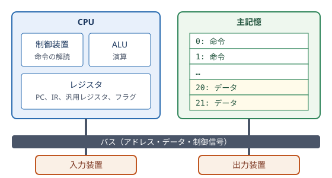

計算機の構成
============

「:doc:`06_logic_circuits`」では、論理ゲートから ALU とレジスタを作りました。この章では、これらの部品を組み立てて、プログラムを実行できる計算機を構成します。また、現代の計算機が性能を高めるために使っている工夫を紹介します。

ノイマン型アーキテクチャ
------------------------

現代の計算機のほとんどは、「:doc:`03_history`」で紹介したフォン・ノイマンの報告書に記述された構成に基づいています。これを\ **ノイマン型アーキテクチャ**\ と呼びます。その特徴は次のとおりです。

* プログラムとデータを、同じ記憶装置に格納する（プログラム内蔵方式）。
* 記憶装置は、番号（アドレス）で区別された記憶場所の並びであり、アドレスを指定して読み書きする。
* 命令を記憶装置から 1 つずつ順に読み出して実行する（逐次実行）。
* 次に実行する命令のアドレスを保持するレジスタ（プログラムカウンタ）を持ち、分岐命令でその値を書き換えることで、実行の流れを変える。

ノイマン型の計算機は、機能の面から次の 5 つの装置に分けて説明されることがあります。

.. list-table:: 計算機の 5 大装置
   :header-rows: 1
   :widths: 20 45 35

   * - 装置
     - 役割
     - 例
   * - 制御装置
     - 命令を解読し、他の装置に指示を出す。
     - CPU の制御部
   * - 演算装置
     - 算術演算や論理演算を行う。
     - CPU の ALU
   * - 記憶装置
     - プログラムとデータを記憶する。
     - 主記憶（DRAM）、SSD
   * - 入力装置
     - 外部から計算機にデータを取り込む。
     - キーボード、マウス、カメラ
   * - 出力装置
     - 計算機から外部にデータを送り出す。
     - ディスプレイ、プリンタ

制御装置と演算装置をまとめたものが **CPU**\ （Central Processing Unit：中央処理装置）です。CPU、主記憶、入出力装置は、データやアドレスを運ぶ信号線の束である\ **バス**\ でつながれています。

   ノイマン型計算機の構成

CPU の構成
----------

CPU は、主に次の要素から構成されます。

ALU
   「:doc:`06_logic_circuits`」で作った、算術演算と論理演算を行う回路です。

レジスタ
   CPU の内部にある、少数の高速な記憶回路です。用途によって次のような種類があります。

   * プログラムカウンタ（PC）：次に実行する命令のアドレスを保持します。
   * 命令レジスタ（IR）：実行中の命令を保持します。
   * 汎用レジスタ：演算の対象となるデータや演算結果を保持します。x86-64 には 16 個、ARM（AArch64）には 31 個、RISC-V（RV64I）には 32 個（そのうち x0 は常に 0 を返す）の汎用レジスタがあります。
   * フラグレジスタ（ステータスレジスタ）：ALU が出力したフラグを保持します。

制御装置
   命令レジスタの命令を解読し、ALU にどの演算をさせるか、どのレジスタの値を使うか、主記憶を読み書きするかなどを指示する制御信号を生成します。

命令セットアーキテクチャ
------------------------

CPU が実行できる命令の種類、命令の形式、レジスタの構成などの仕様をまとめたものを\ **命令セットアーキテクチャ**\ （ISA：Instruction Set Architecture）と呼びます。命令セットアーキテクチャは、ハードウェアとソフトウェアの境界を定める約束事です。同じ命令セットアーキテクチャに従う CPU であれば、内部の回路の作り方が異なっていても、同じ機械語のプログラムを実行できます。

命令の形式
~~~~~~~~~~

機械語の命令は、命令の種類を表す\ **オペコード**\ と、演算の対象（レジスタの番号、アドレス、定数など）を表す\ **オペランド**\ からなるビット列です。例えば RISC-V では、すべての基本命令が 32 ビットの固定長で、レジスタ同士を加算する命令は次のような形式をしています。

.. list-table:: RISC-V の R 形式の命令（合計 32 ビット）
   :header-rows: 1
   :widths: 20 20 15 45

   * - フィールド
     - ビット位置
     - ビット数
     - 意味
   * - funct7
     - 31〜25
     - 7
     - 演算の種類（opcode と funct3 の補足）
   * - rs2
     - 24〜20
     - 5
     - 2 番目の入力レジスタの番号
   * - rs1
     - 19〜15
     - 5
     - 1 番目の入力レジスタの番号
   * - funct3
     - 14〜12
     - 3
     - 演算の種類（opcode の補足）
   * - rd
     - 11〜7
     - 5
     - 結果を格納するレジスタの番号
   * - opcode
     - 6〜0
     - 7
     - 命令の大分類

opcode、funct3、funct7 の組み合わせで演算の種類（加算、減算、AND など）が決まります。レジスタの番号が 5 ビットなので、32 個のレジスタを指定できます。

命令の種類
~~~~~~~~~~

どの命令セットアーキテクチャにも、おおむね次の種類の命令があります。

.. list-table:: 命令の種類
   :header-rows: 1
   :widths: 25 75

   * - 種類
     - 例
   * - データ転送命令
     - 主記憶からレジスタへの読み込み（ロード）、レジスタから主記憶への書き込み（ストア）
   * - 算術演算命令
     - 加算、減算、乗算、除算
   * - 論理演算命令
     - AND、OR、XOR、ビットシフト
   * - 比較・分岐命令
     - 条件が成り立つときに指定したアドレスに移る（条件分岐）、無条件に移る（ジャンプ）
   * - サブルーチン呼び出し命令
     - 戻り先のアドレスを保存してから、サブルーチン（関数）に移る
   * - システム命令
     - オペレーティングシステムの機能を呼び出す、割り込みを制御する

アドレッシングモード
~~~~~~~~~~~~~~~~~~~~

オペランドで演算の対象を指定する方法をアドレッシングモードと呼びます。主なものに、命令の中に定数を直接書く即値アドレッシング、レジスタを指定するレジスタアドレッシング、レジスタの値に定数を足したアドレスの主記憶を指定するベース相対アドレッシングなどがあります。ベース相対アドレッシングは、配列の要素や構造体のメンバへのアクセスに使われます。

CISC と RISC
~~~~~~~~~~~~

「:doc:`03_history`」で紹介したように、命令セットの設計方針には CISC と RISC の 2 つの流れがあります。

.. list-table:: CISC と RISC の比較
   :header-rows: 1
   :widths: 20 40 40

   * - 観点
     - CISC
     - RISC
   * - 命令の数と機能
     - 多数の複雑な命令を持つ
     - 少数の単純な命令に絞る
   * - 命令の長さ
     - 可変長
     - 固定長が多い
   * - 主記憶へのアクセス
     - 演算命令が主記憶を直接扱える
     - ロード命令とストア命令だけが主記憶を扱う（ロード・ストア方式）
   * - 代表例
     - x86、x86-64
     - ARM、RISC-V、MIPS

現在の x86-64 プロセッサは、内部で複雑な命令をマイクロ命令と呼ばれる単純な命令に分解して実行しており、実装の面では RISC と同様の技術が使われています。

命令サイクル
------------

CPU は、次の手順（命令サイクル）を繰り返してプログラムを実行します。

#. **フェッチ**：プログラムカウンタが指すアドレスから命令を読み出し、命令レジスタに格納する。プログラムカウンタを次の命令のアドレスに進める。
#. **デコード**：命令を解読し、オペコードとオペランドに分解する。必要なレジスタの値を読み出す。
#. **実行**：ALU で演算を行う。ロード命令やストア命令なら主記憶を読み書きする。分岐命令なら、条件に応じてプログラムカウンタを書き換える。
#. **書き戻し**：演算結果をレジスタに書き込む。

この繰り返しは、電源が入っている限り続きます。

簡易 CPU のシミュレーション
~~~~~~~~~~~~~~~~~~~~~~~~~~~

サンプルコード :download:`toy_cpu.py <../examples/toy_cpu.py>` は、アキュムレータ（ACC）と呼ばれるレジスタを 1 個だけ持つ簡易 CPU のシミュレータです。命令は 10 進数 3 桁で表し、百の位がオペコード、下 2 桁がアドレスです。プログラムとデータは同じメモリに格納されています。

.. list-table:: 簡易 CPU の命令
   :header-rows: 1
   :widths: 15 20 65

   * - オペコード
     - 命令
     - 動作
   * - 0
     - HALT
     - 停止する。
   * - 1
     - LOAD a
     - アドレス a の値を ACC に読み込む。
   * - 2
     - STORE a
     - ACC の値をアドレス a に書き込む。
   * - 3
     - ADD a
     - ACC にアドレス a の値を足す。
   * - 4
     - SUB a
     - ACC からアドレス a の値を引く。
   * - 5
     - JUMP a
     - アドレス a の命令に移る。
   * - 6
     - JZ a
     - ACC が 0 ならアドレス a の命令に移る。
   * - 7
     - OUT
     - ACC の値を出力する。

サンプルコードのプログラムは、:math:`5 + 4 + 3 + 2 + 1` を計算します。アドレス 20 に残りの回数 n、アドレス 21 に合計 sum を置き、n を 1 ずつ減らしながら sum に足していきます。

.. literalinclude:: ../examples/toy_cpu.py
   :language: python
   :linenos:
   :caption: toy_cpu.py

実行結果の最初と最後の部分は次のとおりです。各行は、左から順に、命令のアドレス、命令（3 桁の数）、ニーモニック、オペランド、命令を実行した後の ACC と PC の値を表しています。

.. code-block:: text

   00: 121 LOAD  21 | ACC= 0 PC=01
   01: 320 ADD   20 | ACC= 5 PC=02
   02: 221 STORE 21 | ACC= 5 PC=03
   03: 120 LOAD  20 | ACC= 5 PC=04
   04: 422 SUB   22 | ACC= 4 PC=05
   05: 220 STORE 20 | ACC= 4 PC=06
   06: 608 JZ    08 | ACC= 4 PC=07
   07: 500 JUMP  00 | ACC= 4 PC=00
   00: 121 LOAD  21 | ACC= 5 PC=01
   （中略）
   06: 608 JZ    08 | ACC= 0 PC=08
   08: 121 LOAD  21 | ACC=15 PC=09
   09: 700 OUT   00 | ACC=15 PC=10
       出力: 15
   10: 000 HALT  00 | ACC=15 PC=11

JUMP 命令でプログラムカウンタがアドレス 00 に戻ることでループが作られ、n が 0 になると JZ 命令でループを抜けていることが分かります。実際の CPU も、規模は大きく異なりますが、同じ原理で動作しています。

CPU の性能
~~~~~~~~~~

プログラムの実行にかかる時間は、次の式で表せます。

.. math::

   \text{実行時間} = \text{命令数} \times \text{CPI} \times \text{クロック周期}

CPI（Clock cycles Per Instruction）は 1 命令あたりに必要な平均のクロック数です。この式から、性能を高めるには、命令数を減らす（よいアルゴリズムやコンパイラを使う）、CPI を小さくする（1 クロックにより多くの命令を処理する）、クロック周期を短くする（クロック周波数を上げる）という 3 つの方法があることが分かります。後で説明するパイプラインやスーパースカラは、CPI を小さくするための工夫です。

メモリ階層
----------

CPU の処理速度に比べて、主記憶（DRAM）の読み書きは非常に遅く、主記憶から 1 回データを読むあいだに、CPU は数百回の演算を行えます。この速度差によって CPU が主記憶を待つ時間が長くなる問題は、プログラムとデータが同じ経路を通って主記憶とやり取りされるノイマン型の構成に由来することから、\ **ノイマン・ボトルネック**\ と呼ばれます。

一般に、記憶装置は高速なものほど容量あたりの価格が高く、容量を大きくできません。そこで、高速で小容量の記憶装置と、低速で大容量の記憶装置を階層的に組み合わせて使います。これを\ **メモリ階層**\ と呼びます。

.. list-table:: メモリ階層（数値は目安）
   :header-rows: 1
   :widths: 25 30 45

   * - 階層
     - アクセス時間
     - 容量
   * - レジスタ
     - 1 ns 未満
     - 数百バイト〜数 KB
   * - L1 キャッシュ
     - 約 1 ns
     - 数十 KB
   * - L2 キャッシュ
     - 数 ns
     - 数百 KB〜数 MB
   * - L3 キャッシュ
     - 10〜数十 ns
     - 数 MB〜数百 MB
   * - 主記憶（DRAM）
     - 50〜100 ns 程度
     - 数 GB〜数 TB
   * - SSD
     - 数十〜数百 µs
     - 数百 GB〜数十 TB
   * - HDD
     - 数 ms
     - 数 TB〜数十 TB

表の上ほど高速で、下ほど大容量です。レジスタから HDD まで、アクセス時間には 1000 万倍程度の差があります。

局所性
~~~~~~

メモリ階層がうまく機能するのは、多くのプログラムのメモリアクセスに、次の 2 つの\ **局所性**\ があるからです。

時間的局所性
   一度アクセスしたデータには、近いうちに再びアクセスする可能性が高いという性質です。ループの中で繰り返し使われる変数などが該当します。

空間的局所性
   あるアドレスにアクセスすると、その近くのアドレスにもアクセスする可能性が高いという性質です。配列を先頭から順に処理する場合や、命令を順に実行する場合が該当します。

キャッシュメモリ
~~~~~~~~~~~~~~~~

\ **キャッシュメモリ**\ は、CPU と主記憶の間に置かれる高速な SRAM で、最近使ったデータの写しを保持します。CPU が読みたいデータがキャッシュにあれば（ヒット）すぐに読めますが、なければ（ミス）主記憶から読み込む必要があります。

キャッシュは、主記憶とのデータのやり取りを、数十バイト程度のブロック（キャッシュラインとも呼ばれます）単位で行います。あるアドレスを読むとき、その周辺のデータもまとめてキャッシュに読み込まれるので、空間的局所性を活かせます。

主記憶のブロックをキャッシュのどこに置くかの決め方には、次のような方式があります。

ダイレクトマップ方式
   ブロックのアドレスから、格納先のラインを 1 つに決める方式です。回路が単純ですが、同じラインに割り当てられるブロックを交互に使うと、互いに追い出し合ってミスが続きます。

セットアソシアティブ方式
   格納先の候補を複数（例えば 8 ライン）用意し、その中の空いているラインや、最も長く使われていないラインに格納する方式です。現在の CPU のキャッシュの多くはこの方式です。

キャッシュを使った場合の平均のメモリアクセス時間は、次の式で見積もれます。

.. math::

   \text{平均アクセス時間} = \text{ヒット時間} + \text{ミス率} \times \text{ミスペナルティ}

例えば、ヒット時間が 1 ns、ミス率が 5%、ミスのときに主記憶から読み込む時間（ミスペナルティ）が 100 ns なら、平均アクセス時間は :math:`1 + 0.05 \times 100 = 6` ns です。ミス率が 1% に下がれば 2 ns になり、ミス率のわずかな違いが性能に大きく影響することが分かります。

サンプルコード :download:`cache_sim.py <../examples/cache_sim.py>` は、ダイレクトマップ方式のキャッシュで、アクセスパターンによってヒット率がどう変わるかを調べます。

.. literalinclude:: ../examples/cache_sim.py
   :language: python
   :linenos:
   :caption: cache_sim.py

実行結果は次のとおりです。

.. code-block:: text

   キャッシュ: 8 ライン x 4 ワード = 32 ワード
     連続アクセス: ヒット 192 / ミス  64  ヒット率  75.0%
     同じ範囲の繰り返し: ヒット 156 / ミス   4  ヒット率  97.5%
     競合するアドレスの交互: ヒット   0 / ミス 100  ヒット率   0.0%
     競合しないアドレスの交互: ヒット  98 / ミス   2  ヒット率  98.0%

結果から次のことが分かります。

* 連続アクセスでは、ブロックの先頭のワードでミスすると、残りの 3 ワードはヒットします（空間的局所性）。
* 同じ範囲の繰り返しでは、最初の 1 回だけミスし、以降はすべてヒットします（時間的局所性）。
* アドレス 0 と 32 は同じラインに割り当てられるので、交互にアクセスすると互いに追い出し合い、すべてミスします。キャッシュの容量には十分な余裕があるのにミスが続く点に注意してください。セットアソシアティブ方式は、このようなミスを減らすための方式です。

プログラムを書くときも、データを連続した領域に置き、順にアクセスするように工夫すると、キャッシュが有効に働いて処理が速くなります。例えば 2 次元配列を処理するときは、メモリ上で連続している方向に沿ってループを回すのが有効です。

入出力
------

CPU は、キーボード、ディスプレイ、ストレージ、ネットワークなどの入出力装置と、各装置の制御回路（コントローラ）を介してデータをやり取りします。コントローラには、データや状態を保持するレジスタがあり、CPU はこれを読み書きして装置を操作します。多くの計算機では、コントローラのレジスタを主記憶と同じアドレス空間に割り当て、通常のロード命令やストア命令で読み書きできるようにしています（メモリマップド I/O）。

入出力装置は CPU に比べて非常に遅いので、装置の処理が終わったことを CPU がどのように知るかが問題になります。

ポーリング
   CPU が装置の状態を繰り返し確認する方式です。単純ですが、確認している間、CPU は他の処理ができません。

割り込み
   装置の処理が終わったときに、装置が CPU に信号を送る方式です。CPU は、割り込みの信号を受け取ると、実行中のプログラムを一時中断し、割り込みを処理するプログラム（割り込みハンドラ）を実行した後、元のプログラムに戻ります。CPU は、装置を待つ間に他の処理を進められます。

DMA（Direct Memory Access）
   大量のデータを転送するときに、CPU を介さずに、装置と主記憶の間で直接データを転送する方式です。転送が終わると、割り込みで CPU に通知します。

CPU の高速化の工夫
------------------

パイプライン
~~~~~~~~~~~~

命令サイクルの各段階は、CPU の異なる回路で処理されます。そこで、1 つの命令の処理が終わるのを待たずに、各段階を流れ作業のように重ねて実行する方式を\ **パイプライン**\ と呼びます。

.. list-table:: 5 段パイプラインの動作（IF：フェッチ、ID：デコード、EX：実行、MEM：メモリアクセス、WB：書き戻し）
   :header-rows: 1
   :widths: 16 12 12 12 12 12 12 12

   * -
     - 1
     - 2
     - 3
     - 4
     - 5
     - 6
     - 7
   * - 命令 1
     - IF
     - ID
     - EX
     - MEM
     - WB
     -
     -
   * - 命令 2
     -
     - IF
     - ID
     - EX
     - MEM
     - WB
     -
   * - 命令 3
     -
     -
     - IF
     - ID
     - EX
     - MEM
     - WB

表の列はクロックの番号です。1 つの命令の処理には 5 クロックかかりますが、パイプラインが満たされると、1 クロックごとに 1 つの命令が完了します。理想的には CPI が 1 になります。

ただし、次のような状況（ハザード）では、パイプラインを一時的に止める必要があります。

データハザード
   前の命令の結果を次の命令が使う場合、結果が出るまで待つ必要があります。演算結果を書き戻しの前に次の命令へ直接渡す回路（フォワーディング）で、待ち時間を減らします。

制御ハザード
   分岐命令の結果が分かるまで、次にどの命令をフェッチすべきか決まりません。過去の実行履歴から分岐の結果を予測し、予測した先の命令を先に実行する\ **分岐予測**\ が使われます。予測が外れた場合は、先に実行した命令の結果を破棄してやり直します。現在の CPU の分岐予測は、多くのプログラムで高い精度で的中します。

構造ハザード
   複数の命令が同時に同じ回路を使おうとする場合に生じます。命令用とデータ用のキャッシュを分けるなど、回路を増やして避けます。

スーパースカラとアウトオブオーダー実行
~~~~~~~~~~~~~~~~~~~~~~~~~~~~~~~~~~~~~~

\ **スーパースカラ**\ は、パイプラインを複数本持ち、1 クロックに複数の命令を同時に実行する方式です。CPI を 1 未満にできます。

さらに、命令をプログラムに書かれた順序ではなく、必要なデータが揃った命令から先に実行し、結果だけをプログラムの順序どおりに確定させる方式を\ **アウトオブオーダー実行**\ と呼びます。主記憶を待っている命令があっても、それに依存しない後続の命令を先に進められます。

これらの工夫により、現在の高性能な CPU は、プログラムの意味を変えずに、1 クロックあたり数個の命令を実行しています。プログラマから見ると命令は 1 つずつ順に実行されているように見えますが、内部では大規模な並列処理が行われているのです。

ノイマン型以外の構成
--------------------

ノイマン型に対して、命令用の記憶装置とデータ用の記憶装置を分け、別々の経路でアクセスする構成をハーバード・アーキテクチャと呼びます。命令とデータを同時に読めるため、高速化に有利です。現在の CPU の多くは、主記憶はノイマン型のまま、L1 キャッシュを命令用とデータ用に分けることで、両方の利点を取り入れています。また、組込み用のマイクロコントローラや DSP（Digital Signal Processor）には、ハーバード・アーキテクチャを採用したものが多くあります。

この章のまとめ
--------------

* ノイマン型の計算機は、プログラムとデータを同じ記憶装置に格納し、命令を順に読み出して実行します。
* 命令セットアーキテクチャは、ハードウェアとソフトウェアの境界を定める仕様です。
* CPU は、フェッチ、デコード、実行、書き戻しの命令サイクルを繰り返します。
* CPU と主記憶の速度差を埋めるために、局所性を利用したメモリ階層とキャッシュが使われます。
* 入出力には、ポーリング、割り込み、DMA などの方式があります。
* パイプライン、分岐予測、スーパースカラ、アウトオブオーダー実行によって、CPU は 1 クロックに複数の命令を処理しています。
