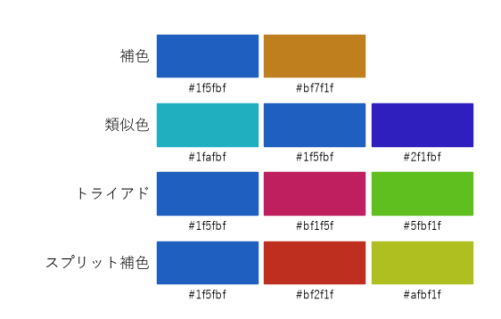
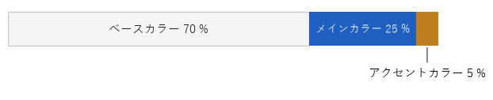
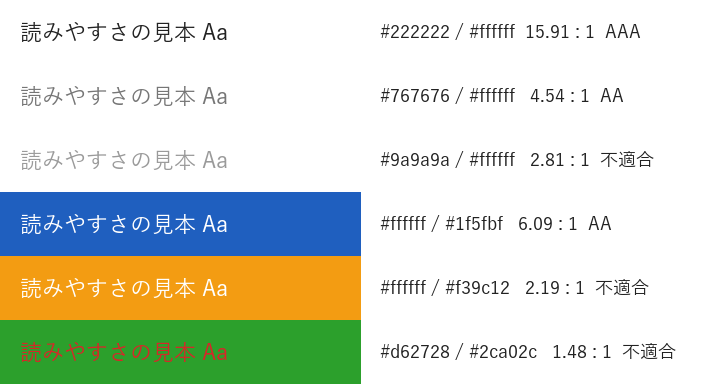
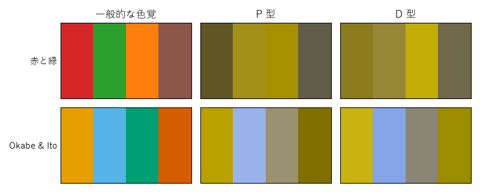

色彩
====

色は、情報を区別したり強調したりする強力な手段です。一方で、使い方を誤ると、読み手に存在しない意味を読み取らせたり、一部の読み手には区別できなかったりします。本章では、色を数値として扱う方法と、読みやすさを確保するための基準を説明します。

色の三属性
----------

人が感じる色は、次の 3 つの属性で表せます。

.. list-table::
   :header-rows: 1
   :widths: 20 80

   * - 属性
     - 内容
   * - 色相
     - 赤・黄・緑・青といった色味の違いです。色相を円状に並べたものを色相環と呼びます。
   * - 彩度
     - 色の鮮やかさです。彩度が低いほど灰色に近づきます。
   * - 明度
     - 色の明るさです。明度が高いほど白に、低いほど黒に近づきます。

デザインで特に重要なのは明度です。文字の読みやすさ、グレースケールで印刷したときの見え方、色覚が異なる人にとっての区別のしやすさは、いずれも明度の差に大きく左右されます。

色空間
------

プログラムで色を扱うときは、目的に応じて色空間を使い分けます。

.. list-table::
   :header-rows: 1
   :widths: 22 39 39

   * - 色空間
     - 特徴
     - 主な用途
   * - RGB（sRGB）
     - 赤・緑・青の光の強さで表します。ディスプレイの表示方式に対応します。
     - 画像データ、画面の表示色の指定
   * - HSV、HSL
     - 色相・彩度・明るさで表します。RGB を変換したもので、人が色を調整しやすい形式です。
     - 色相を回転させて配色を作る
   * - CIE L\*a\*b\*
     - 明度 L\* と、色味を表す a\*、b\* で表します。数値の差が、知覚される色の差に近くなるよう設計されています。
     - 明度の比較、色の差の評価

HSL の L（Lightness）は、知覚される明るさとは一致しません。たとえば、HSL で同じ L の黄色と青では、黄色の方がはるかに明るく見えます。明るさを比べたいときは、CIE L\*a\*b\* の L\* や、後述する相対輝度を使います。

Python の標準ライブラリ ``colorsys`` には、RGB と HSV・HLS を相互に変換する関数があります。HSL を扱う関数の名前は ``rgb_to_hls`` であり、戻り値の順序も（色相、明るさ、彩度）である点に注意してください。

配色の作り方
------------

色相環上の位置関係を使うと、調和の取れた配色を機械的に作れます。

.. list-table::
   :header-rows: 1
   :widths: 22 30 48

   * - 配色パターン
     - 色相の関係
     - 印象と用途
   * - 補色
     - 180 度離れた 2 色
     - 最も強い対比になります。強調したい 1 点に使います。
   * - 類似色
     - 隣り合う（± 30 度程度の）色
     - 統一感があり落ち着いた印象になります。同じグループ内の区別に使います。
   * - トライアド
     - 120 度ずつ離れた 3 色
     - バランスがよく、にぎやかな印象になりやすい配色です。
   * - スプリット補色
     - 補色の両隣（150 度と 210 度）の 2 色と基準色
     - 補色より対比が穏やかで、扱いやすい配色です。

次の関数は、基準色の HLS の明るさ（L）と彩度（S）を保ったまま、色相だけを回転させます。ただし、前述のとおり知覚される明るさは色相によって変わるため、:numref:`fig-color-scheme` のトライアドの緑は基準色の青よりかなり明るく見えます。明るさを揃えたい場合は、CIE L\*a\*b\* の L\* で確認して調整します。

.. literalinclude:: ../examples/ch02_color_scheme.py
   :language: python
   :pyobject: rotate_hue

.. _fig-color-scheme:

   基準色 ``#1f5fbf`` から生成した配色パターン

色の面積比
~~~~~~~~~~

使う色を決めたら、それぞれの色が占める面積の比率も決めます。目安としてよく使われるのが、ベースカラー 70 %、メインカラー 25 %、アクセントカラー 5 % の比率です（:numref:`fig-color-ratio`）。

.. _fig-color-ratio:

   配色の面積比の目安

ベースカラーは背景など最も広い面積に使う色で、白や薄い灰色が一般的です。メインカラーは見出しや帯など、全体の印象を決める色です。アクセントカラーは最も注目してほしい箇所だけに使います。アクセントカラーは、ほかに使われていない色が小さな面積にだけ現れることで目立ちます。多用すると効果がなくなります。

色に意味を持たせる
~~~~~~~~~~~~~~~~~~

色は、反復の原則（:doc:`principles`）に従い、同じ意味には同じ色を使います。特に、赤はエラーや危険、緑は成功や正常、というように、多くの人が共通して持つ連想があります。このような色を無関係な用途に使うと、読み手を混乱させます。

コントラスト比
--------------

文字と背景の明るさの差が小さいと、文字は読みにくくなります。Web コンテンツのアクセシビリティの国際的なガイドラインである WCAG 2.2 では、この差を「コントラスト比」という数値で定義しています。

まず、sRGB の各成分（0〜1 に正規化した値 :math:`C`）からガンマ補正を取り除き、光の強さに比例する値 :math:`C_{\mathrm{lin}}` にします。

.. math::

   C_{\mathrm{lin}} =
   \begin{cases}
   \dfrac{C}{12.92} & (C \le 0.04045) \\[2ex]
   \left( \dfrac{C + 0.055}{1.055} \right)^{2.4} & (C > 0.04045)
   \end{cases}

次に、人の目が緑に最も敏感であることを反映した重みを付けて、相対輝度 :math:`L` を求めます。:math:`L` は黒で 0、白で 1 になります。

.. math::

   L = 0.2126 R_{\mathrm{lin}} + 0.7152 G_{\mathrm{lin}} + 0.0722 B_{\mathrm{lin}}

2 色のうち明るい方の相対輝度を :math:`L_1`、暗い方を :math:`L_2` とすると、コントラスト比は次の式で表され、1（同じ色）から 21（黒と白）までの値を取ります。

.. math::

   \text{コントラスト比} = \frac{L_1 + 0.05}{L_2 + 0.05}

WCAG 2.2 の達成基準では、文字について次のコントラスト比を求めています。「大きな文字」とは、18 pt 以上、または 14 pt 以上の太字を指します。画面上の CSS の px に換算すると、約 24 px 以上、太字なら約 18.7 px 以上です（1 pt は 4/3 px）。

.. list-table::
   :header-rows: 1
   :widths: 40 30 30

   * - 達成基準
     - 通常の文字
     - 大きな文字
   * - 1.4.3 コントラスト（最低限）：レベル AA
     - 4.5 : 1 以上
     - 3 : 1 以上
   * - 1.4.6 コントラスト（高度）：レベル AAA
     - 7 : 1 以上
     - 4.5 : 1 以上

また、達成基準 1.4.11 では、ボタンの輪郭やグラフの線など、文字以外の要素にも 3 : 1 以上のコントラスト比を求めています。

上の式は、次のように実装できます。

.. literalinclude:: ../examples/ch02_color_contrast.py
   :language: python
   :pyobject: srgb_to_linear

.. literalinclude:: ../examples/ch02_color_contrast.py
   :language: python
   :pyobject: relative_luminance

.. literalinclude:: ../examples/ch02_color_contrast.py
   :language: python
   :pyobject: contrast_ratio

:numref:`fig-contrast` は、いくつかの色の組み合わせについて計算した結果です。白地に ``#767676`` の灰色は 4.54 : 1 で、AA を満たす最も明るい灰色としてよく知られています。オレンジ地に白い文字や、緑地に赤い文字は、鮮やかで目立つ色どうしでも明度の差が小さいため、基準を満たしません。

.. _fig-contrast:

   文字色と背景色の組み合わせとコントラスト比

色覚の多様性への配慮
--------------------

色の見え方は人によって異なります。日本では、男性の約 5 %（20 人に 1 人）、女性の約 0.2 %（500 人に 1 人）が、一般的な色覚とは異なる色覚を持つといわれています。代表的なものは、赤を感じる錐体の働きが異なる P 型と、緑を感じる錐体の働きが異なる D 型で、どちらも赤と緑の区別がつきにくくなります。

:numref:`fig-color-vision` は、Machado らが 2009 年に発表した変換行列を使い、P 型と D 型の 2 色覚での見え方を近似したものです。赤と緑を中心とした配色は、P 型と D 型ではほとんど同じ茶色や黄土色に見えます。一方、Okabe と Ito が提案した配色（図では「Okabe & Ito」）は、明度と色味の差が保たれています。

.. _fig-color-vision:

   色覚シミュレーションによる配色の比較

シミュレーションでは、sRGB を線形 RGB に変換してから行列を掛け、再び sRGB に戻します。コントラスト比の計算と同じく、ガンマ補正を取り除いた値で計算する点が重要です。

.. literalinclude:: ../examples/ch02_color_vision.py
   :language: python
   :pyobject: simulate

シミュレーションはあくまで近似であり、実際の見え方には個人差があります。色覚の多様性に配慮するには、次の点を守ることが基本です。

* 色だけで情報を区別しません。線の種類、マーカーの形、直接書き込んだラベルなどを併用します。
* 区別したい色どうしには、色味だけでなく明度にも差を付けます。
* 赤と緑、赤と茶、青と紫など、区別しにくい組み合わせを避けます。

まとめ
------

* 明るさを比べるときは、HSL の L ではなく、相対輝度や CIE L\*a\*b\* の L\* を使います。
* 色相環上の位置関係を使うと、調和の取れた配色を機械的に作れます。
* アクセントカラーは、面積を小さく保つことで効果を発揮します。
* 文字と背景のコントラスト比は、通常の文字で 4.5 : 1 以上を目安にします。
* 色だけに頼らず、形やラベル、明度の差を併用して情報を区別します。

サンプルコード
--------------

* :download:`ch02_color_scheme.py <../examples/ch02_color_scheme.py>`：:numref:`fig-color-scheme` と\ :numref:`fig-color-ratio` を描画します。``--base`` で基準色を変更できます。
* :download:`ch02_color_contrast.py <../examples/ch02_color_contrast.py>`：コントラスト比を計算し、:numref:`fig-contrast` を描画します。
* :download:`ch02_color_vision.py <../examples/ch02_color_vision.py>`：:numref:`fig-color-vision` を描画します。
