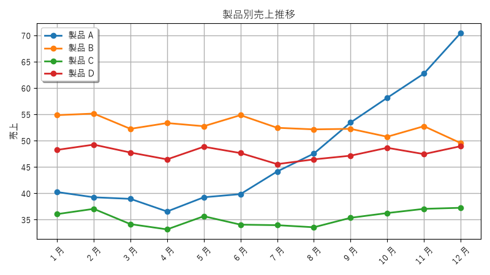
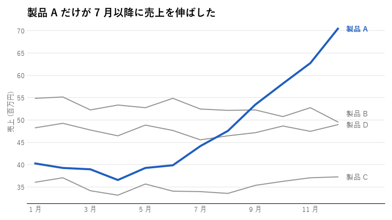
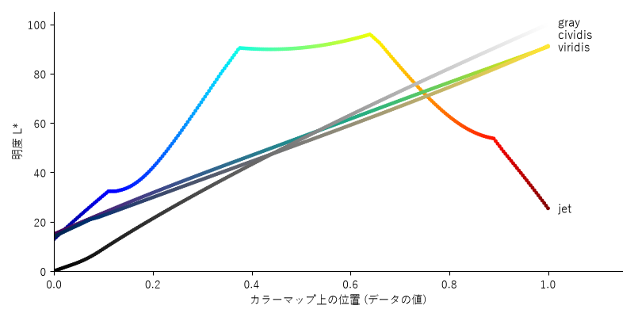
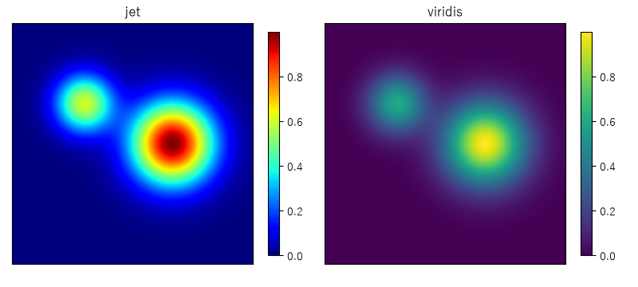

データ可視化のデザイン
======================

グラフは、数値の表だけでは気付きにくい傾向や差を、ひと目で伝えるための道具です。matplotlib の既定の設定でもグラフは描けますが、そのままでは「何を読み取ってほしいのか」が伝わりにくいことがあります。本章では、目的に合ったグラフを選び、要点が伝わるように仕上げる方法を説明します。

目的に応じたグラフの選び方
--------------------------

グラフの種類は、データの形ではなく、伝えたいことで選びます。

.. list-table::
   :header-rows: 1
   :widths: 22 38 40

   * - 伝えたいこと
     - 適したグラフ
     - 注意点
   * - 量の比較
     - 棒グラフ（項目名が長い場合は横棒）
     - 値の軸は必ず 0 から始めます。項目に順序がなければ値の順に並べます。
   * - 時間的な推移
     - 折れ線グラフ
     - 軸は 0 から始めなくてもよいものの、変化を誇張しないようにします。
   * - 構成比
     - 積み上げ棒グラフ、並べ替えた棒グラフ
     - 円グラフは項目が少なく、差が大きい場合に限ります。
   * - 分布
     - ヒストグラム、箱ひげ図
     - ヒストグラムは、ビンの幅によって印象が変わります。
   * - 2 つの量の関係
     - 散布図
     - 点が重なる場合は、点を半透明にするか小さくします。

棒グラフは、棒の長さで量を表します。値の軸を 0 から始めないと、棒の長さの比が値の比と一致しなくなり、差が誇張されて見えます。折れ線グラフは、線の傾きで変化を表すため、軸を 0 から始める必要はありません。

円グラフは、扇形の角度や面積で割合を表します。人は角度や面積の差を正確に比べるのが苦手なため、項目が多い場合や、割合が近い項目を比べたい場合には向きません。

データインク比とチャートジャンク
--------------------------------

統計学者の Edward Tufte は、グラフの描画に使うインクのうち、データそのものを表すインクの割合を「データインク比」と呼び、この比を高くすべきだと主張しました。データを表さない装飾、たとえば 3D 効果、影、濃いグリッド線、背景の模様などは「チャートジャンク」と呼ばれ、読み手の注意をデータからそらします。

ただし、目盛りや軸ラベルのように、データを正しく読むために必要な要素まで削ってはいけません。削るのは「なくても読み方が変わらないもの」に限ります。

グラフを改善する手順
--------------------

:numref:`fig-chart-before` は、製品 A〜D の月次売上を matplotlib で描いたものです。

.. _fig-chart-before:

   改善前：どの系列に注目すればよいか分からない

このグラフには、次の問題があります。

* 4 本の線が同じ強さで描かれ、どれに注目すればよいか分かりません。
* 凡例と線を目で往復して、色の対応を確認する必要があります。
* 濃いグリッド線、影付きの凡例、すべての点のマーカーが、線の形を見えにくくしています。
* 縦軸に単位がありません。

このグラフで伝えたいことが「製品 A だけが 7 月以降に売上を伸ばした」であれば、次の手順で改善します。

1. **結論をタイトルにする**：グラフの内容を説明するタイトル（「製品別売上推移」）ではなく、読み取ってほしい結論をタイトルにします。
2. **強調する系列を 1 つに絞る**：注目してほしい系列だけにアクセントカラーを使い、ほかは灰色にします。
3. **凡例をやめて直接ラベルを付ける**：線の右端に系列名を書き、凡例との往復をなくします。
4. **不要な要素を消す**：上・右・左の枠線、目盛りの線、縦のグリッド線、マーカーを消し、横のグリッド線は薄くします。
5. **単位を明記する**：軸ラベルに「（百万円）」などの単位を書きます。

.. _fig-chart-after:

   改善後：結論をタイトルにし、製品 A だけを強調した

改善後のグラフを描くコードは次のとおりです。強調しない系列を先に描き、強調する系列を最後に描くことで、強調する線が常に最前面に表示されます。

.. literalinclude:: ../examples/ch05_chart_before_after.py
   :language: python
   :pyobject: plot_after

直接ラベルは、線の終点が近いと重なってしまいます。次の関数で、ラベルどうしの間隔が一定以上になるように y 座標を調整しています。

.. literalinclude:: ../examples/ch05_chart_before_after.py
   :language: python
   :pyobject: spread_labels

カラーマップの選び方
--------------------

ヒートマップや等高線図のように、数値を色で表すときに使う色の並びをカラーマップと呼びます。カラーマップは、データの性質に合わせて次の 3 種類から選びます。

.. list-table::
   :header-rows: 1
   :widths: 20 45 35

   * - 種類
     - 用途
     - matplotlib の例
   * - 順序（sequential）
     - 小さい値から大きい値へ、一方向に変化するデータ
     - ``viridis``、``cividis``、``Blues``
   * - 発散（diverging）
     - 基準値（0 や平均値）からの上下の差を表すデータ
     - ``coolwarm``、``RdBu``
   * - 質的（qualitative）
     - 順序のないカテゴリの区別
     - ``tab10``、``Set2``

順序のあるデータを表すカラーマップでは、値が大きくなるにつれて明度も一方向に変化することが重要です。色相には自然な大小の順序がないため、色相の違いから数値の大小を読み取るのは難しい一方で、明度の違いからは直感的に読み取れるためです。

明度の変化を確認するため、カラーマップ上の各色の CIE L\*a\*b\* の明度 :math:`L^*` を計算します。:math:`L^*` は、相対輝度（:doc:`color`\ を参照）と同じ方法で求めた輝度 :math:`Y` から、次の式で計算できます。:math:`Y` は、白で 1、黒で 0 になります。

.. math::

   L^* = 116 f(Y) - 16, \qquad
   f(t) =
   \begin{cases}
   t^{1/3} & \left( t > \left( \frac{6}{29} \right)^3 \right) \\[2ex]
   \dfrac{t}{3 \left( \frac{6}{29} \right)^2} + \dfrac{4}{29} & (\text{それ以外})
   \end{cases}

.. literalinclude:: ../examples/ch05_colormap.py
   :language: python
   :pyobject: lightness

:numref:`fig-colormap-lightness` は、4 つのカラーマップについて、位置と明度 :math:`L^*` の関係を描いたものです。点の色は、その位置のカラーマップの色です。

.. _fig-colormap-lightness:

   カラーマップの位置と明度 :math:`L^*` の関係

``viridis``、``cividis``、``gray`` では、明度が位置に応じて単調に増えています（``viridis`` と ``cividis`` はほぼ一直線です）。一方、``jet`` は、明度が途中で急に上がって平らになり、その後は下がります。このため、``jet`` には次の問題があります。

* 明度が急に変わる位置に、データにはない境界線が見えます。
* 明度が単調に増えないため、グレースケールで印刷すると値の大小が分からなくなります。
* 赤と緑を含むため、色覚によっては区別しにくくなります。

:numref:`fig-colormap-compare` は、同じデータを ``jet`` と ``viridis`` で描いたものです。``jet`` では、山の周囲に水色の輪のような境界が見えますが、これはデータにはない構造です。

.. _fig-colormap-compare:

   同じデータを jet と viridis で描いた比較

matplotlib は、バージョン 2.0 から既定のカラーマップを ``jet`` から ``viridis`` に変更しています。特別な理由がない限り、順序のあるデータには ``viridis`` を使います。色覚の多様性への配慮をより重視する場合は ``cividis`` を使います。

まとめ
------

* グラフの種類は、伝えたいこと（比較・推移・構成比・分布・関係）で選びます。
* 棒グラフの値の軸は 0 から始めます。
* 結論をタイトルにし、強調する系列を 1 つに絞ります。
* 凡例より直接ラベルを使い、データを表さない装飾は消します。
* 順序のあるデータには、明度が単調に変化する ``viridis`` などのカラーマップを使います。

サンプルコード
--------------

* :download:`ch05_chart_before_after.py <../examples/ch05_chart_before_after.py>`：:numref:`fig-chart-before` と\ :numref:`fig-chart-after` を描画します。
* :download:`ch05_colormap.py <../examples/ch05_colormap.py>`：:numref:`fig-colormap-lightness` と\ :numref:`fig-colormap-compare` を描画します。
