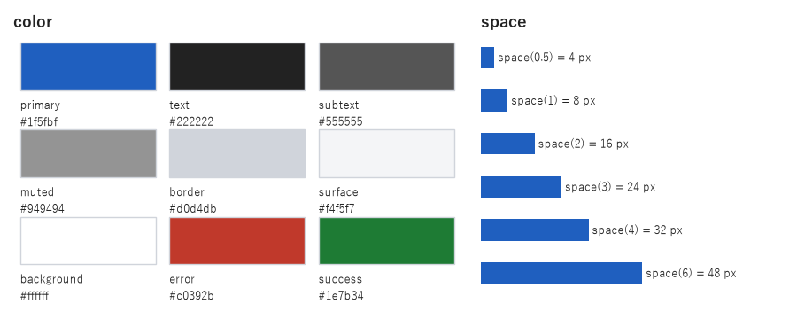
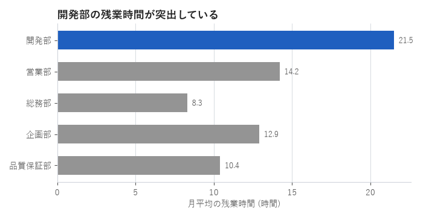

一貫性とデザインシステム
========================

これまでの章では、色・文字・余白などの決め方を個別に説明してきました。しかし、決めた値がグラフごと、画面ごとに少しずつ異なっていては、反復の原則が崩れます。本章では、決めた値を 1 か所で管理し、グラフにも UI にも同じ値を適用する方法を説明します。

一貫性が重要な理由
------------------

見た目に一貫性があると、次の利点があります。

* 読み手は、一度覚えた見た目の意味（「青は強調」「赤はエラー」など）を、ほかの画面や資料でもそのまま使えます。
* 見た目の差が、意味の差として正しく伝わります。一貫性がないと、読み手は意図しない差にも意味を探してしまいます。
* 作る側は、色や余白を毎回考える必要がなくなり、内容に集中できます。

見た目を揃えるための規則と部品の集まりを、デザインシステムと呼びます。大規模なデザインシステムには、部品の見本やガイドラインの文書なども含まれますが、その中心となるのが次に説明するデザイントークンです。

デザイントークン
----------------

デザイントークンは、色・余白・文字の大きさなど、見た目を決める値に名前を付けたものです。コードの中に ``"#1f5fbf"`` や ``16`` といった値を直接書くのではなく、``tokens.color.primary`` や ``tokens.space(2)`` のように、名前の付いたトークンを通して参照します。

トークンの名前は、値そのもの（「青」「16 px」）ではなく、用途（「主要な操作の色」「段落間の余白」）で付けます。用途で名前を付けておけば、後で主要な色を青から緑に変えるときも、名前を変えずに値だけを変えられます。

.. list-table::
   :header-rows: 1
   :widths: 30 30 40

   * - よくない名前
     - よい名前
     - 理由
   * - ``blue``
     - ``primary``
     - 色を変えても名前と値が矛盾しません。
   * - ``gray_light``
     - ``border``
     - 同じ灰色でも、用途が異なれば別々に調整できます。
   * - ``red``
     - ``error``
     - 赤をエラー以外の用途に使うことを防げます。

Python では、``dataclass`` を使うとトークンを簡潔に定義できます。``frozen=True`` を指定すると、実行中に値が書き換えられることを防げます。

.. literalinclude:: ../examples/ch08_design_tokens.py
   :language: python
   :pyobject: ColorTokens

.. literalinclude:: ../examples/ch08_design_tokens.py
   :language: python
   :pyobject: SpaceTokens

``SpaceTokens`` は ``__call__`` を定義しているため、インスタンスを関数のように呼び出せます。たとえば ``tokens.space(2)`` は、基本単位 8 px の 2 倍の 16 px を返します。余白の値そのものではなく「基本単位の何倍か」で指定することで、余白の大きさが基本単位に基づく決まった段階に揃います。

.. literalinclude:: ../examples/ch08_design_tokens.py
   :language: python
   :pyobject: TypeTokens

.. literalinclude:: ../examples/ch08_design_tokens.py
   :language: python
   :pyobject: DesignTokens

:numref:`fig-token-sheet` は、定義したトークンを一覧にしたものです。このような一覧を用意しておくと、チームで値を共有しやすくなります。

.. _fig-token-sheet:

   デザイントークンの一覧

トークンの適用
--------------

matplotlib への適用
~~~~~~~~~~~~~~~~~~~

matplotlib では、``rcParams`` にトークンの値を設定すると、以降に描くすべてのグラフに適用されます。

.. literalinclude:: ../examples/ch08_design_tokens.py
   :language: python
   :pyobject: apply_to_matplotlib

``rcParams`` を設定した後は、グラフを描く関数では強調する要素の色を指定するだけで済みます（:numref:`fig-token-chart`）。

.. _fig-token-chart:

   デザイントークンを適用したグラフ

同じ設定を複数のプロジェクトで使う場合は、matplotlib のスタイルファイル（拡張子 ``.mplstyle``）にまとめ、``plt.style.use`` で読み込む方法もあります。ただし、スタイルファイルは tkinter などほかのライブラリと共有できません。グラフと UI の両方で同じ値を使うには、本章のように Python のコードでトークンを定義します。

tkinter への適用
~~~~~~~~~~~~~~~~

tkinter では、同じトークンを ``ttk.Style`` に適用します。

.. literalinclude:: ../examples/ch08_design_tokens.py
   :language: python
   :pyobject: apply_to_tkinter

サンプルコードを ``--show-ui`` を付けて実行すると、トークンを適用した tkinter の画面が表示されます。グラフと同じ色・余白・文字の大きさが使われていることを確認してください。

運用のポイント
--------------

* トークンは 1 つのモジュールにまとめ、各プログラムから ``import`` して使います。
* コードに色や余白の値を直接書きません。新しい値が必要になったら、まずトークンに追加します。
* トークンの数は必要最小限にします。色が 30 種類もあれば、トークンを使っても統一感は生まれません。
* トークンの一覧（:numref:`fig-token-sheet` のような図）と用途の説明を、文書として残します。

まとめ
------

* 見た目の一貫性は、読み手の理解を助け、作る側の負担も減らします。
* 色・余白・文字の大きさは、用途で名前を付けたデザイントークンとして定義します。
* 同じトークンを matplotlib と tkinter の両方に適用すると、グラフと UI の見た目が揃います。

サンプルコード
--------------

* :download:`ch08_design_tokens.py <../examples/ch08_design_tokens.py>`：:numref:`fig-token-sheet` と\ :numref:`fig-token-chart` を描画します。``--show-ui`` で tkinter の画面も表示します。
