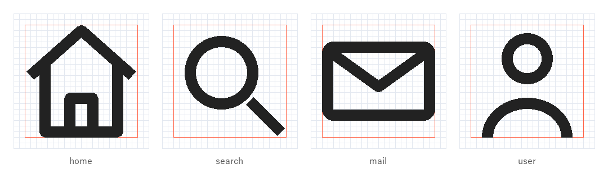
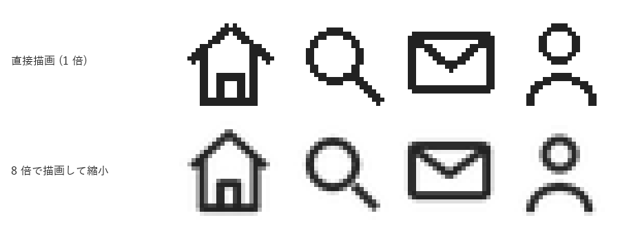
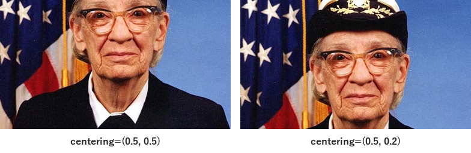
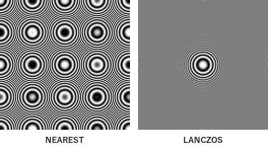
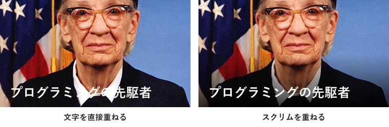

アイコンと画像加工
==================

アイコンや写真は、文字だけでは伝えにくい情報を補い、画面や資料の要素を見分けやすくします。本章では、Pillow を使って、アイコンを一貫した規則で描画する方法と、写真を資料や UI に載せるときの基本的な加工を説明します。

アイコンの役割
--------------

アイコンは、意味を記号で表すことで、読み手が要素を素早く見分けられるようにします。一方で、アイコンの意味は見る人によって解釈が分かれることがあります。たとえば、歯車のアイコンは「設定」を表すことが多いものの、「詳細」「ツール」などと受け取られる場合もあります。

誤解を防ぐため、アイコンは原則としてラベル（文字）と組み合わせて使います。アイコンだけで意味が通じると考えてよいのは、「ホーム」「検索」「閉じる」のように、広く定着しているものに限ります。

グリッドとセーフエリア
----------------------

複数のアイコンを並べたときに統一感を出すには、すべてのアイコンを同じ規則で描きます。一般的には、次の規則を決めます。

.. list-table::
   :header-rows: 1
   :widths: 25 75

   * - 規則
     - 内容
   * - 基準のグリッド
     - アイコンを描く正方形の領域です。24 × 24 のグリッドがよく使われます。
   * - セーフエリア
     - 図形を収める範囲です。グリッドの外周に余白（24 × 24 の場合は 2 単位程度）を残し、その内側に描きます。
   * - 線の太さ
     - すべてのアイコンで同じ太さにします。24 × 24 の場合は 2 単位がよく使われます。
   * - 角の形
     - 線の端や角を丸めるかどうかを統一します。
   * - スタイル
     - 線で描く（アウトライン）か、塗りつぶすかを統一します。

:numref:`fig-icon-keyline` は、4 つのアイコンを 24 × 24 のグリッド上に描き、拡大したものです。赤い枠がセーフエリアを表します。線の太さと角の丸め方がすべてのアイコンで共通であるため、形が異なっても 1 つのセットとして見えます。

.. _fig-icon-keyline:

   グリッドとセーフエリアを重ねて表示したアイコン

サンプルコードでは、アイコンの形をピクセルではなくグリッド単位の座標で定義しています。描画するときに「1 グリッド単位あたりのピクセル数」を掛けることで、同じ定義から任意の大きさのアイコンを作れます。ただし、16 px 程度の小さな大きさでは、後述のように別の定義を用意した方が見やすくなります。

.. literalinclude:: ../examples/ch06_icon_grid.py
   :language: python
   :pyobject: icon_search

アンチエイリアス
----------------

Pillow の ``ImageDraw`` で描いた線や円は、アンチエイリアス（輪郭を中間色でぼかして滑らかに見せる処理）が行われません。そのため、小さな画像に直接描くと、斜めの線や曲線の輪郭がギザギザになります。

これを避けるには、目的の大きさの数倍（ここでは 8 倍）の大きさで描画してから、``Image.resize`` で縮小します（補間方法には ``LANCZOS`` を使います。補間方法については後述します）。縮小するときの補間によって輪郭に中間色が生まれ、滑らかに見えます。この方法をスーパーサンプリングと呼びます。

.. literalinclude:: ../examples/ch06_icon_grid.py
   :language: python
   :pyobject: render_icon

:numref:`fig-icon-antialias` は、24 × 24 px のアイコンを 6 倍に拡大して、ピクセルが見えるようにしたものです。上段が直接描画した結果、下段が 8 倍で描画してから縮小した結果です。

.. _fig-icon-antialias:

   直接描画と、拡大描画してから縮小した結果の比較

アイコンを配布する形式
~~~~~~~~~~~~~~~~~~~~~~

アイコンは、表示する大きさごとに用意するのが理想です。たとえば 16 px で表示するアイコンは、24 px 用のアイコンをそのまま縮小するのではなく、細部を省略して形を単純にした方が見やすくなります。また、高解像度のディスプレイに対応するため、表示する大きさの 2 倍の画像も用意します。

大きさを自由に変えたい場合は、SVG などのベクター形式を使います。PNG などのラスター形式は、拡大すると輪郭がぼやけたりギザギザになったりします。サンプルコードでは、``--export`` を指定すると、各アイコンを 24 px、48 px、96 px の PNG として書き出します。

写真のトリミング
----------------

写真を資料や UI に載せるときは、配置する枠の縦横比（アスペクト比）に合わせて切り抜く（トリミングする）必要があります。Pillow では、``ImageOps.fit`` を使うと、指定した大きさに合わせて縮小と切り抜きを同時に行えます。

``ImageOps.fit`` は、既定では画像の中央を切り抜きます。人物の写真を横長に切り抜くと、中央を切り抜いた場合には顔の上部が切れることがあります。引数 ``centering`` を使うと、切り抜く位置を（横、縦）の比率で指定できます。縦の値を 0.0 に近づけるほど、画像の上側を残します。

.. literalinclude:: ../examples/ch06_image_processing.py
   :language: python
   :pyobject: crop_comparison

.. _fig-crop:

   切り抜く位置の比較（写真：matplotlib 同梱のサンプル画像）

主題（ここでは人物の顔）を画面のどこに置くかは、写真の印象を大きく左右します。画面を縦横それぞれ 3 等分する線を引き、その線上や交点に主題を置く「三分割法」は、構図を決める手がかりとしてよく使われます。

縮小時の補間方法
----------------

画像を縮小するときは、補間方法（``resample``）の選び方で画質が大きく変わります。:numref:`fig-resample` は、中心から外側へ行くほど縞が細かくなる同心円の画像を、1/4 に縮小した結果です。違いが見やすいように、縮小した画像を 2 倍に拡大して表示しています。

.. _fig-resample:

   補間方法による縮小結果の違い

``NEAREST`` は、元の画像から一定間隔でピクセルを拾うだけなので、細かい縞が元の画像にはない模様（モアレ）として現れます。この現象を折り返しひずみ（エイリアシング）と呼びます。``LANCZOS`` は、周囲のピクセルを考慮して値を計算するため、表現しきれない細かい縞は灰色に平均化されます。

写真を縮小するときは ``LANCZOS`` か ``BICUBIC`` を使います。``Image.resize`` の既定値は、RGB 画像などでは ``BICUBIC`` です。``NEAREST`` は、ドット絵やピクセルの境界をそのまま見せたい場合に使います。:numref:`fig-icon-antialias` で拡大表示に ``NEAREST`` を使っているのはこのためです。

写真に文字を重ねる
------------------

写真の上に文字を重ねると、写真の明るい部分と暗い部分が文字の背景になるため、場所によってコントラストが不足します。:numref:`fig-overlay` の左側では、白い襟の部分で白い文字が読みにくくなっています。

このような場合は、文字の背後に半透明の黒を重ねます。これをスクリムと呼びます。右側では、下へ向かって濃くなる黒のグラデーションを重ね、写真の見た目を保ちながら文字のコントラストを確保しています。

.. _fig-overlay:

   スクリムの有無による読みやすさの比較

.. literalinclude:: ../examples/ch06_image_processing.py
   :language: python
   :pyobject: add_scrim

保存形式
--------

画像の保存形式は、内容に応じて選びます。

.. list-table::
   :header-rows: 1
   :widths: 15 45 40

   * - 形式
     - 特徴
     - 向いている内容
   * - JPEG
     - 非可逆圧縮の形式です。写真を小さなファイルにできますが、文字や線の周囲にノイズが出ます。透過はできません。
     - 写真
   * - PNG
     - 可逆圧縮の形式です。画質が劣化せず、透過もできます。写真ではファイルが大きくなります。
     - グラフ、スクリーンショット、アイコン、図
   * - SVG
     - ベクター形式です。大きさを変えても画質が劣化しません。
     - アイコン、ロゴ、図

Pillow で JPEG を保存するときは、``image.save("photo.jpg", quality=85)`` のように画質を指定できます。既定値は 75 です。値を大きくすると画質は上がりますが、ファイルも大きくなります。

まとめ
------

* アイコンは、原則としてラベルと組み合わせて使います。
* アイコンは、共通のグリッド・セーフエリア・線の太さで描き、統一感を出します。
* Pillow で小さな図形を描くときは、拡大して描画してから縮小します。
* 写真は ``ImageOps.fit`` の ``centering`` で主題が残るように切り抜きます。
* 写真の縮小には ``LANCZOS`` か ``BICUBIC`` を使います。
* 写真に文字を重ねるときは、スクリムでコントラストを確保します。

サンプルコード
--------------

* :download:`ch06_icon_grid.py <../examples/ch06_icon_grid.py>`：:numref:`fig-icon-keyline` と\ :numref:`fig-icon-antialias` を描画します。
* :download:`ch06_image_processing.py <../examples/ch06_image_processing.py>`：:numref:`fig-crop`、:numref:`fig-resample`、:numref:`fig-overlay` を描画します。``--input`` で任意の画像を指定できます。

本章で使用した写真は、matplotlib に同梱されているサンプル画像（``grace_hopper.jpg``）です。プログラミング言語 COBOL の開発に大きく貢献した Grace Hopper の肖像で、米国海軍が撮影したパブリックドメインの写真です。
