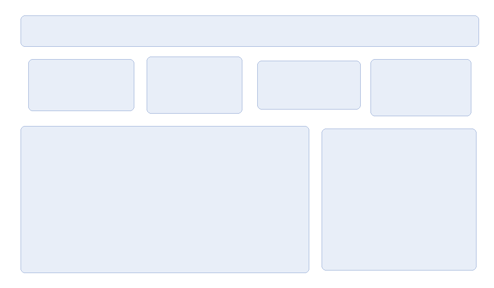
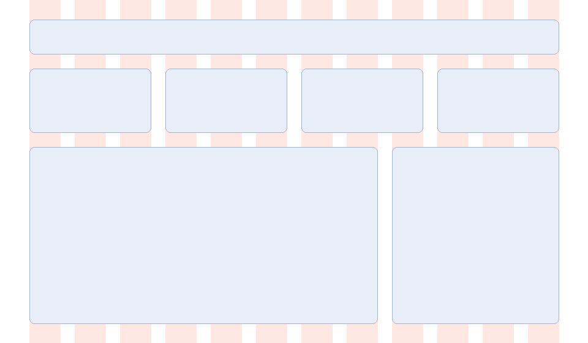

レイアウト
==========

レイアウトとは、限られた領域の中に要素を配置することです。整列と近接の原則（:doc:`principles`）を、画面や資料の全体に適用する方法として、グリッドシステムと余白の規則を説明します。

グリッドシステム
----------------

グリッドシステムは、画面をあらかじめ等しい幅の列（カラム）に分割しておき、すべての要素をカラムの境界に揃えて配置する方法です。グリッドは次の 3 つの値で決まります。

.. list-table::
   :header-rows: 1
   :widths: 20 80

   * - 用語
     - 内容
   * - カラム
     - 要素を配置する列です。要素の幅は、カラム何個分かで決めます。
   * - ガター
     - カラムとカラムの間の余白です。
   * - マージン
     - 画面の端とカラムの間の余白です。

画面の幅を :math:`W`、マージンを :math:`m`、ガターを :math:`g`、カラム数を :math:`n` とすると、1 カラムの幅 :math:`w` は次の式で求められます。

.. math::

   w = \frac{W - 2m - (n - 1)g}{n}

たとえば、:math:`W = 960`、:math:`m = 48`、:math:`g = 24`、:math:`n = 12` のとき、:math:`w = (960 - 96 - 264) / 12 = 50` px です。

カラム数には 12 がよく使われます。12 は 2、3、4、6 で割り切れるため、画面を 2 等分、3 等分、4 等分、6 等分するいずれの配置にも対応できるからです。

:numref:`fig-no-grid` と\ :numref:`fig-grid` は、ダッシュボード風の画面の骨組みです。改善前は、要素の位置と大きさを目分量で決めています。改善後は、12 カラムのグリッドに沿って、指標カードを 3 カラムずつ、グラフを 8 カラム、表を 4 カラムにしています。薄い赤の帯がカラムを表します。

.. _fig-no-grid:

   改善前：位置と大きさを目分量で決めた配置

.. _fig-grid:

   改善後：12 カラムのグリッドに沿った配置

改善前の配置は、一見するとそれほど悪くありません。しかし、カードの上端や高さ、間隔がわずかにずれているため、全体として落ち着かない印象を与えます。このような小さなずれは、読み手が意識しなくても「整っていない」と感じる原因になります。

グリッドの計算は、次のようなクラスにまとめておくと扱いやすくなります。

.. literalinclude:: ../examples/ch04_layout_grid.py
   :language: python
   :pyobject: Grid

余白の規則
----------

縦方向の余白や要素の大きさにも規則を設けます。よく使われるのは、すべての余白を 8 px の倍数（8、16、24、32 …）にする方法です。細かい調整が必要な場合に限り、4 px を使います。

規則を決めておくと、次の利点があります。

* 余白の大きさを迷わずに決められます。
* 余白の段階がはっきりするため、グループ内とグループ間の区別がつきやすくなります。
* 複数の人が作業しても、見た目が揃います。

:numref:`fig-grid` では、ヘッダーの上端を 32 px、指標カードの上端を 112 px とするなど、縦方向の位置もすべて 8 の倍数にしています。

視覚的な階層
------------

画面の中で、どの要素が重要かを示すことを「視覚的な階層を作る」といいます。階層は、次の要素の組み合わせで表します。

.. list-table::
   :header-rows: 1
   :widths: 20 80

   * - 手段
     - 重要な要素を目立たせる方法
   * - 大きさ
     - 大きくします。カードやグラフなら、より多くのカラムを割り当てます。
   * - 太さ
     - 文字を太くします。
   * - 色
     - アクセントカラーを使います。背景とのコントラストを高くします。
   * - 位置
     - 左上など、最初に見られる位置に置きます。
   * - 余白
     - 周囲に余白を多く取り、ほかの要素から独立させます。

すべての要素を目立たせようとすると、結果として何も目立たなくなります。最も重要な要素を 1 つ決め、それ以外は控えめにすることが、階層を作るコツです。

比率について
------------

レイアウトの比率として、黄金比と白銀比がよく紹介されます。

.. math::

   \text{黄金比} \quad 1 : \varphi = 1 : \frac{1 + \sqrt{5}}{2} \approx 1 : 1.618

.. math::

   \text{白銀比} \quad 1 : \sqrt{2} \approx 1 : 1.414

白銀比は、A 判や B 判の用紙の縦横比でもあります。半分に折っても縦横比が変わらないという性質があります。

ただし、これらの比率に合わせること自体には、伝わりやすさを高める効果はありません。まず、グリッドと余白の規則で整列と近接を確保してください。比率は、要素の大きさを決める手がかりがないときの参考程度に使います。

まとめ
------

* グリッドシステムを使うと、要素の位置と大きさに規則ができ、整列が保たれます。
* 余白は 8 px の倍数などの規則で決めます。
* 視覚的な階層は、大きさ・太さ・色・位置・余白の組み合わせで作ります。
* 最も重要な要素を 1 つに決めます。

サンプルコード
--------------

* :download:`ch04_layout_grid.py <../examples/ch04_layout_grid.py>`：:numref:`fig-no-grid` と\ :numref:`fig-grid` を描画します。
