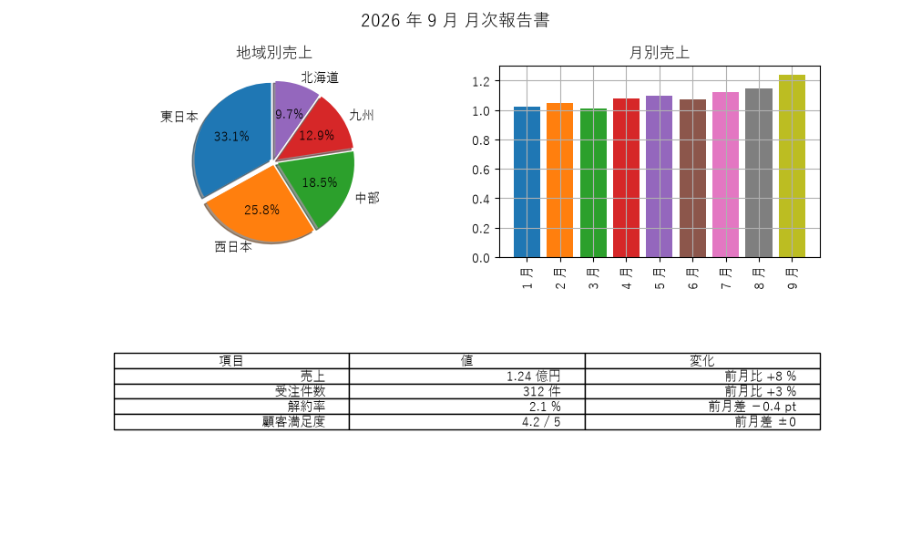
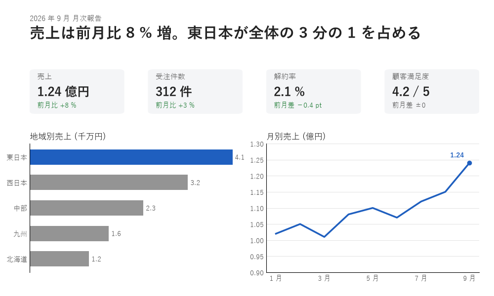

実践：レビューと改善
====================

本章では、これまでの章で学んだ原則を使って、1 枚の資料を改善する過程を示します。また、自分や同僚が作ったものを見直すためのチェックリストを紹介します。

改善の進め方
------------

見た目を改善するときは、いきなり色や書体を変えるのではなく、次の順序で進めます。前の段階が決まっていないと、後の段階の判断ができないためです。

1. **目的と読み手を決める**：誰が、何のために見るのかを決めます。
2. **伝える内容を整理する**：最も伝えたい結論を 1 つ決め、それ以外の情報に優先順位を付けます。優先順位の低い情報は、削ることも検討します。
3. **配置を決める**：優先順位に従って、情報を置く位置と大きさを決めます（:doc:`layout`）。
4. **見た目を整える**：色・書体・線などを決めます（:doc:`color`、:doc:`typography`）。

総合演習：月次報告の改善
------------------------

:numref:`fig-report-before` は、ある部署の月次報告の資料です。地域別の売上、月別の売上、主な指標を 1 枚にまとめています。

.. _fig-report-before:

   改善前：情報は揃っているが、要点が分からない

この資料は、必要な情報をすべて含んでいます。しかし、読み手は「結局、今月はよかったのか悪かったのか」を自分で読み解かなければなりません。

改善の進め方に沿って、次のように決めます。

1. **目的と読み手**：部長が、今月の業績の要点を 1 分以内に把握するための資料とします。
2. **伝える内容**：最も伝えたい結論は「売上は前月比 8 % 増で、東日本が全体の 3 分の 1 を占める」とします。次に重要なのは 4 つの主な指標で、地域別と月別の売上は結論の根拠とします。
3. **配置**：上から、結論 → 指標 → 根拠のグラフの順に置きます。
4. **見た目**：アクセントカラーは青の 1 色だけにし、結論に関係する東日本の棒と売上の推移の線に使います。指標の変化に使う緑は、強調のためではなく、「成功・正常」という状態を表す色として使います（:doc:`color`）。

.. _fig-report-after:

   改善後：結論 → 指標 → 根拠の順に上から読める

改善した点と、その根拠となる原則は次のとおりです。

.. list-table::
   :header-rows: 1
   :widths: 30 35 35

   * - 改善前
     - 改善後
     - 根拠
   * - タイトルが「月次報告書」で、内容を表していない
     - 結論をタイトルにし、左上に最も大きな文字で置いた
     - 視線の流れ、視覚的な階層（:doc:`principles`、:doc:`layout`）
   * - 指標が表の中に埋もれている
     - 指標をカードにし、数値を最も大きく表示した
     - コントラスト、ジャンプ率（:doc:`typography`）
   * - 地域別の構成比を円グラフで示している
     - 値の順に並べた横棒グラフにした
     - グラフの選び方（:doc:`dataviz`）
   * - 月別の棒がすべて異なる色で、色に意味がない
     - 折れ線グラフにし、最新の月だけに値を書き込んだ
     - 反復、グラフの選び方（:doc:`dataviz`）
   * - 強調したい東日本が目立たない
     - 東日本だけを青、ほかを灰色にした
     - 強調する系列を 1 つに絞る（:doc:`dataviz`）
   * - 要素の配置に規則がなく、下部に大きな空白がある
     - グリッドに沿って 4 等分と 2 等分で配置した
     - グリッドシステム（:doc:`layout`）

指標カードの変化の表示には、望ましい方向に変化した場合だけ緑を使い、変化のない「顧客満足度」は灰色にしています。すべての変化に色を付けると、色の意味が薄れるためです。

.. literalinclude:: ../examples/ch09_report_makeover.py
   :language: python
   :pyobject: draw_kpi_card

チェックリスト
--------------

作ったものを見直すときは、次の項目を確認します。

.. list-table::
   :header-rows: 1
   :widths: 20 80

   * - 観点
     - 確認する項目
   * - 目的
     - 最も伝えたいことを、ひと言で説明できますか。それが最初に目に入りますか。
   * - 近接
     - 関係の深い要素が近くにまとまり、関係の浅い要素と離れていますか。
   * - 整列
     - 要素の端が、見えない線に揃っていますか。揃っていない要素に理由がありますか。
   * - 反復
     - 同じ意味の要素が、同じ色・形・大きさで表されていますか。
   * - コントラスト
     - 見出しと本文、主要な操作とそれ以外が、はっきり区別できますか。
   * - 色
     - 使う色の数が絞られていますか。アクセントカラーが本当に強調したい箇所だけに使われていますか。
   * - 読みやすさ
     - 文字と背景のコントラスト比が 4.5 : 1 以上ですか。文字が小さすぎませんか。
   * - 色覚
     - 色だけで情報を区別していませんか。グレースケールにしても読めますか。
   * - 余白
     - 余白の大きさに規則がありますか。情報を詰め込みすぎていませんか。
   * - グラフ
     - グラフの種類は伝えたいことに合っていますか。単位は書かれていますか。棒グラフの値の軸は 0 から始まっていますか。
   * - UI
     - 押せる要素が押せるように見えますか。エラーの理由と直し方が分かりますか。
   * - 表記
     - 用語や表記が統一されていますか。

チェックリストのすべての項目を満たす必要はありません。満たしていない項目があれば、それが意図したものかどうかを確認してください。

よくある失敗
------------

最後に、エンジニアが作るものでよく見られる失敗をまとめます。

* **すべてを強調する**：太字・赤字・大きな文字を多用すると、どれも目立たなくなります。
* **余白を削って情報を詰め込む**：1 画面に多くの情報が入っても、読み取れなければ意味がありません。
* **既定の設定のまま使う**：ライブラリの既定の設定は、多くの用途で無難に使えるように作られており、伝えたいことを強調するようには作られていません。
* **装飾で解決しようとする**：影やグラデーション、3D 効果を加えても、情報の整理ができていなければ伝わりやすくはなりません。
* **一度に全部を直そうとする**：改善の進め方の順序に従い、目的と内容を先に決めます。

まとめ
------

* 改善は、目的と読み手 → 内容の整理 → 配置 → 見た目の順に進めます。
* 最も伝えたい結論を 1 つ決め、最初に目に入る位置に置きます。
* チェックリストを使い、原則から外れている箇所が意図したものかを確認します。

サンプルコード
--------------

* :download:`ch09_report_makeover.py <../examples/ch09_report_makeover.py>`：:numref:`fig-report-before` と\ :numref:`fig-report-after` を描画します。
