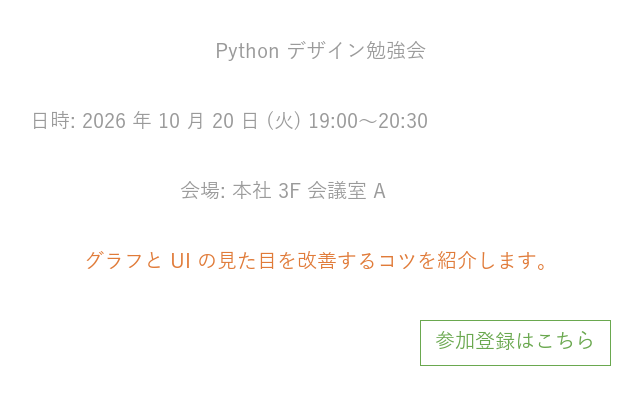
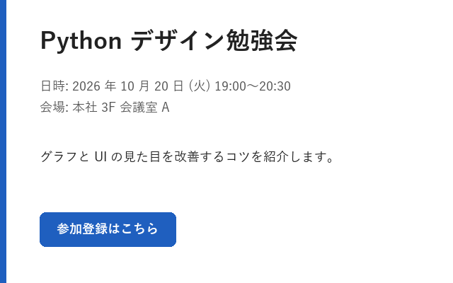

デザインの基本原則
==================

デザインの目的
--------------

デザインの目的は、読み手が情報を「速く」「正しく」受け取れるようにすることです。見た目の好みは人によって異なりますが、情報が整理されているかどうかは、読み手がどれだけ迷わずに要点をつかめるかで判断できます。

本章では、あらゆる媒体に共通する 4 つの原則と、その原則が有効である理由となる視覚の性質を説明します。

デザインの 4 原則
-----------------

デザインを専門としない人向けの入門書として広く読まれている『ノンデザイナーズ・デザインブック』（Robin Williams 著）では、デザインの基本として次の 4 原則を挙げています。

.. list-table::
   :header-rows: 1
   :widths: 18 42 40

   * - 原則
     - 内容
     - エンジニアの成果物での例
   * - 近接
     - 関係の深い要素を近づけ、関係の浅い要素を離します。距離によってグループを表します。
     - グラフの凡例を対応する線の近くに置きます。入力欄のラベルを入力欄のすぐ上に置きます。
   * - 整列
     - すべての要素を、見えない線に揃えて配置します。
     - 画面内のラベルと入力欄の左端を揃えます。
   * - 反復
     - 同じ意味を持つ要素には、同じ色・形・大きさを繰り返し使います。
     - 資料全体で、強調には同じ 1 色だけを使います。
   * - コントラスト
     - 異なるものは、はっきりと異ならせます。中途半端な差を作りません。
     - 見出しは本文より十分に大きく太くします。主要なボタンだけを塗りつぶします。

:numref:`fig-principles-before` と\ :numref:`fig-principles-after` は、同じ内容のイベント告知カードです。

.. _fig-principles-before:

   改善前：要素が散らばり、どこから読めばよいか分からない

.. _fig-principles-after:

   改善後：4 原則を適用して情報を整理した

改善前のカードでは、4 原則が次のように守られていません。

* 整列：中央揃えと左揃えが混在し、要素の位置に規則がありません。
* 近接：すべての要素が等間隔に並び、日時と会場のまとまりが分かりません。
* コントラスト：タイトルも本文も同じ大きさで、背景との明度差も小さくなっています。
* 反復：説明文はオレンジ、ボタンは緑と、色に意味がありません。

改善後のカードでは、すべての要素の左端を x 座標 56 px の位置に揃えています。日時と会場は間隔を詰めて 1 つのグループにし、グループ間には大きな余白を取っています。タイトルは大きく太くし、アクセントカラーの青を左端の帯とボタンの 2 か所で繰り返しています。

改善後のカードを描画するコードは次のとおりです。座標や色を数値で指定するため、「なぜその位置なのか」を説明できる値にしておくことが大切です。

.. literalinclude:: ../examples/ch01_principles.py
   :language: python
   :pyobject: draw_after

視覚の性質：ゲシュタルトの法則
------------------------------

4 原則が有効なのは、人の視覚には、個々の要素をまとまりとして捉えようとする性質があるためです。この性質は、ゲシュタルト心理学で「ゲシュタルトの法則（群化の法則）」としてまとめられています。

.. list-table::
   :header-rows: 1
   :widths: 18 42 40

   * - 法則
     - 内容
     - 活用例
   * - 近接の法則
     - 近くにある要素は、同じグループに見えます。
     - 余白の大小だけで、区切り線を使わずにグループを表します。
   * - 類同の法則
     - 色や形が似ている要素は、同じグループに見えます。
     - 同じ系列のデータ点を同じ色で描きます。
   * - 共通領域の法則
     - 線や枠で囲まれた領域の中にある要素は、同じグループに見えます。
     - 関連する設定項目をカードや枠で囲みます。
   * - 連続の法則
     - 滑らかにつながる線上の要素は、一続きに見えます。
     - 折れ線グラフで、線を追えば推移が読めるようにします。

4 原則との対応でいえば、近接の原則は近接の法則を、反復の原則は類同の法則を利用しています。整列の原則は、揃った端が 1 本の線に見える連続の法則を利用しています。反対に、関係のない要素に同じ色を使ったり、無関係な要素を近くに置いたりすると、読み手は存在しない関係を読み取ってしまいます。

視線の流れ
----------

横書きの文化圏では、読み手の視線は基本的に左上から右下へ流れます。よく知られた型として、次の 2 つがあります。

Z 型
   文字が少なく、図や写真が中心の画面では、視線は左上 → 右上 → 左下 → 右下と Z 字を描くように動く傾向があります。ポスターやスライドの表紙が該当します。

F 型
   文章が多い画面では、読み手は上部を横に読み、その後は左端を縦に流し読みする傾向があります。Nielsen Norman Group の視線計測調査で報告された型です。

どちらの型でも、左上は最初に見られる位置です。最も重要な情報（結論やタイトル）は左上に置き、フォームやダイアログで操作の最後に押すボタンは右下に置くと、視線の流れに沿った配置になります。:numref:`fig-principles-after` のカードでは、整列を優先してボタンも左端に揃えています。

余白の役割
----------

余白は「何もない空間」ではなく、要素のまとまりと区切りを表すための要素です。エンジニアが作る画面や資料では、情報を詰め込みすぎて余白が不足する例がよく見られます。余白を十分に取ると情報量が減ったように感じられますが、実際には読み手が 1 つひとつの要素を認識しやすくなります。

余白の大きさは、関係の深さに応じて段階を付けます。グループ内の余白は小さく、グループ間の余白は大きくします。段階の決め方は\ :doc:`layout`\ で説明します。

まとめ
------

* デザインの目的は、情報を速く正しく伝えることです。
* 近接・整列・反復・コントラストの 4 原則は、人の視覚の性質に基づいています。
* 最も重要な情報は、最初に見られる左上に置きます。
* 余白は、要素のまとまりを表すために積極的に使います。

サンプルコード
--------------

* :download:`ch01_principles.py <../examples/ch01_principles.py>`：:numref:`fig-principles-before` と\ :numref:`fig-principles-after` を描画します。
