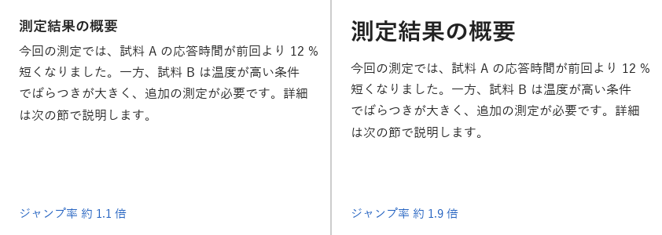
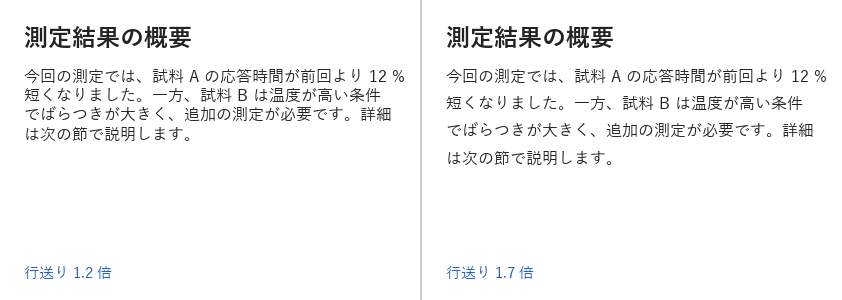

タイポグラフィ
==============

タイポグラフィとは、文字の書体・大きさ・太さ・間隔・配置を決めて、文章を読みやすく、かつ意図どおりに伝わるようにする技術です。資料や画面の情報の大部分は文字であるため、タイポグラフィの影響は大きくなります。

書体の分類
----------

日本語の書体（フォント）は、大きく明朝体とゴシック体に分けられます。欧文の書体では、これに近い分類としてセリフ体とサンセリフ体があります。

.. list-table::
   :header-rows: 1
   :widths: 25 40 35

   * - 分類
     - 特徴
     - 向いている用途
   * - 明朝体・セリフ体
     - 横線が細く縦線が太い書体です。線の端に「うろこ」や「セリフ」と呼ばれる飾りがあります。
     - 印刷物の長い本文
   * - ゴシック体・サンセリフ体
     - 線の太さがほぼ均一で、飾りがない書体です。小さくても形がつぶれにくい特徴があります。
     - 画面の本文、見出し、スライド、グラフのラベル

画面に表示する文字や、スライドのように離れた位置から読む文字には、ゴシック体が適しています。Windows に標準で含まれる游ゴシックやメイリオ、BIZ UD ゴシックはその例です。BIZ UD ゴシックは、読み間違えにくさに配慮して設計された UD（ユニバーサルデザイン）フォントです。

1 つの資料や画面で使う書体は、原則として 1〜2 種類に絞ります。書体の種類を増やすと、反復の原則が崩れ、全体の統一感がなくなります。強弱を付けたい場合は、書体を変えるのではなく、大きさや太さ（ウェイト）を変えます。

ジャンプ率
----------

見出しと本文の文字の大きさの比率を、ジャンプ率と呼びます。:numref:`fig-jump-ratio` は、本文を 16 px に固定し、見出しの大きさを変えた例です。

.. _fig-jump-ratio:

   ジャンプ率の比較

ジャンプ率が低いと、見出しと本文の区別がつきにくく、どこに何が書いてあるかを把握するのに時間がかかります。ジャンプ率を高くすると、見出しが目に入りやすくなり、文章の構造がひと目で分かります。

ジャンプ率は高いほどよいわけではありません。落ち着いた印象にしたい場合や、見出しの数が多い場合は、ジャンプ率を控えめにして、太さや余白で区別する方法もあります。重要なのは、コントラストの原則に従い、「違うものははっきり違える」ことです。見出しと本文の大きさの差がわずかだと、意図的な差なのか誤差なのかが読み手に伝わりません。

行送りと行長
------------

行の基準線（ベースライン）どうしの間隔を行送り、行と行の間の空き（行送りから文字の大きさを引いたもの）を行間と呼びます。CSS の ``line-height`` は、行送りに相当する値です。

:numref:`fig-line-height` は、文字の大きさ 16 px の本文を、行送り 1.2 倍と 1.7 倍で描画した例です。

.. _fig-line-height:

   行送りの比較

行送りが狭いと、次の行へ移るときに読む位置を見失いやすくなります。日本語は漢字や仮名が正方形に近い形で詰まって見えるため、欧文より広めの行送りが適しています。画面の本文では、文字の大きさの 1.5〜1.8 倍が目安です。

1 行の長さ（行長）も読みやすさに影響します。行長が長すぎると、行の終わりから次の行の始まりへ視線を戻すのが難しくなります。日本語の本文では、1 行あたり 40 字程度までを目安にします。行長が長くなる場合は、行送りも広げます。

文字の揃え方
--------------

横書きの本文は、左揃えを基本とします。行の始まりの位置が一定になるため、次の行を見つけやすくなります。中央揃えは、1〜2 行の短い見出しや、ボタンの中の文字に限って使います。複数行の文章を中央揃えにすると、行ごとに始まりの位置が変わり、読みにくくなります。

和文と欧文が混在するときの表記
------------------------------

日本語の文章に英単語や数字を混ぜるときは、次の点に注意します。

* 英数字には半角文字を使います。全角の英数字は、字形のバランスが悪く、検索や置換でも扱いにくくなります。
* 英単語や数字の前後に半角の空白を入れます。和文と欧文の境目が分かりやすくなります。本書もこの規則に従っています。
* 表記の規則を決めたら、資料全体で統一します。たとえば「ユーザー」と「ユーザ」を混在させません。

2 番目の規則は必須ではなく、空白を入れない表記もあります。どちらを選ぶ場合も、資料全体で統一することが大切です。

Pillow での文章の描画
---------------------

Pillow の ``ImageDraw.text`` は、文字列を自動では折り返しません。Pillow 12 で追加された ``ImageText.Text.wrap`` には折り返しの機能がありますが、空白の位置で折り返す仕組みのため、空白を含まない日本語の文章は折り返せません。そこで、``FreeTypeFont.getlength`` で文字列の幅を測りながら、自分で折り返す位置を決めます。

次の関数は、日本語は 1 文字単位で、英数字は単語単位で折り返します。また、句読点や閉じ括弧が行頭に来ないように、それらの文字は前の行の末尾に残します。このような規則を禁則処理と呼びます。

.. literalinclude:: ../examples/ch03_typography.py
   :language: python
   :pyobject: wrap_text

折り返した各行は、行送り（文字の大きさ × 倍率）ずつ y 座標をずらして描画します。

.. literalinclude:: ../examples/ch03_typography.py
   :language: python
   :pyobject: draw_paragraph

まとめ
------

* 画面やスライドの文字には、ゴシック体を使います。
* 書体は 1〜2 種類に絞り、強弱は大きさと太さで付けます。
* 見出しと本文の大きさは、はっきりと違えます。
* 日本語の本文の行送りは、文字の大きさの 1.5〜1.8 倍を目安にします。
* 本文は左揃えにし、中央揃えは短い見出しに限ります。

サンプルコード
--------------

* :download:`ch03_typography.py <../examples/ch03_typography.py>`：:numref:`fig-jump-ratio` と\ :numref:`fig-line-height` を描画します。
