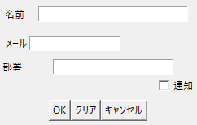
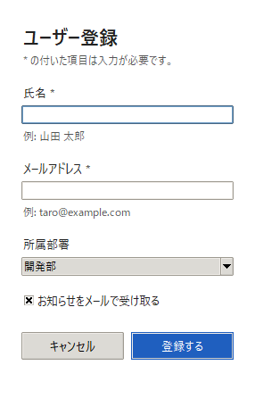
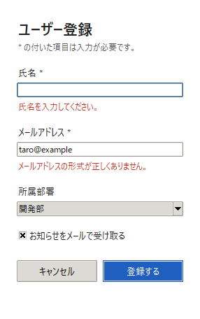

UI デザインの基礎
=================

エンジニアが作る業務ツールや社内アプリケーションは、機能が正しく動くことが最優先にされ、画面の使いやすさは後回しにされがちです。しかし、使いにくい画面は入力ミスや問い合わせを増やし、結果として作った人の負担にもなります。本章では、使いやすい UI の原則と、tkinter での実装方法を説明します。

ユーザビリティの原則
--------------------

使いやすさ（ユーザビリティ）を評価する観点として、Jakob Nielsen が提唱した「ユーザビリティの 10 原則（10 Usability Heuristics）」が広く使われています。ここでは、業務ツールで特に問題になりやすい 5 つを取り上げます。

.. list-table::
   :header-rows: 1
   :widths: 25 40 35

   * - 原則
     - 内容
     - 業務ツールでの例
   * - システムの状態を見えるようにする
     - 今何が起きているかを、適切な時間内に利用者へ伝えます。
     - 保存が完了したら画面内に「保存しました」と表示します。時間のかかる処理では進捗を表示します。
   * - 一貫性と標準
     - 同じ意味のものは同じ言葉・同じ見た目・同じ位置にします。OS や一般的なアプリケーションの慣習に従います。
     - 「登録」と「保存」を混在させません。主要なボタンは常に右下に置きます。
   * - エラーの防止
     - エラーが起きにくい設計にします。取り返しのつかない操作の前には確認します。
     - 選択肢が決まっている項目は選択式にします。「すべて消去」ボタンを「登録」ボタンの隣に置きません。
   * - 記憶より認識
     - 利用者に情報を覚えさせず、画面上で選べるようにします。
     - 入力の形式を、入力欄のそばに例として表示します。
   * - エラーの認識・診断・回復を助ける
     - エラーメッセージでは、何が問題で、どうすれば解決するかを平易な言葉で示します。
     - 「入力エラーです」ではなく「メールアドレスの形式が正しくありません」と表示します。

アフォーダンスとシグニファイア
------------------------------

ドアの取っ手を見れば、押すのか引くのかが分かるように、物の形はその使い方を示します。心理学者の J. J. Gibson は、物と人の間にある「その物で何ができるか」という関係をアフォーダンスと名付けました。Donald Norman はこの考え方をデザインに応用し、後に、何ができるかを人に伝える手がかりをシグニファイアと呼んで区別しました。

画面上では、次のような見た目がシグニファイアになります。

* 塗りつぶされた角丸の四角形は、押せるボタンに見えます。
* 下線の付いた青い文字は、クリックできるリンクに見えます。
* 枠で囲まれた白い領域は、文字を入力できる欄に見えます。

逆に、押せない要素をボタンのように装飾したり、押せる要素を普通の文字と同じ見た目にしたりすると、利用者は操作に迷います。

操作にかかる時間の法則
----------------------

フィッツの法則
~~~~~~~~~~~~~~

フィッツの法則は、マウスなどで目標を指し示すまでの時間 :math:`T` が、目標までの距離 :math:`D` と目標の大きさ :math:`W` で決まることを表します。:math:`a` と :math:`b` は、機器や人によって決まる定数です。

.. math::

   T = a + b \log_2 \left( 1 + \frac{D}{W} \right)

この式から、よく使うボタンは大きくし、直前に操作する場所の近くに置くと、操作が速くなることが分かります。たとえば、入力フォームの「登録する」ボタンは、最後の入力欄の近くに置きます。

ヒックの法則
~~~~~~~~~~~~

ヒックの法則は、選択肢の中から 1 つを選ぶまでの時間 :math:`T` が、同じ確率で選ばれる選択肢の数 :math:`n` の対数に比例して増えることを表します。:math:`b` は定数です。

.. math::

   T = b \log_2 (n + 1)

選択肢が増えるほど、選ぶのに時間がかかります。1 つの画面に並べるボタンやメニューの項目は必要なものに絞り、数が多くなる場合はグループに分けます。

入力フォームの設計
------------------

:numref:`fig-form-bad` と\ :numref:`fig-form-good` は、同じ項目を持つユーザー登録フォームを tkinter で作ったものです。

.. _fig-form-bad:

   改善前：原則を意識せずに作ったフォーム

.. _fig-form-good:

   改善後：原則に沿って作ったフォーム

改善前のフォームには、次の問題があります。

* ラベルの位置が中央揃え・右揃え・左揃えと混在し、入力欄の幅もばらばらです。
* 余白の大きさに規則がありません。
* 必須の項目がどれか分かりません。
* 所属部署は選択肢が決まっているのに、自由入力になっています。
* 「OK」「クリア」「キャンセル」が同じ見た目で並び、どれが主要な操作か分かりません。「クリア」は確認なしで入力をすべて消しますが、「OK」の隣にあるため押し間違えやすくなっています。
* エラーが起きると「入力エラーです。」というメッセージボックスが表示されるだけで、どこをどう直せばよいか分かりません。

改善後のフォームでは、次のように設計しています。

.. list-table::
   :header-rows: 1
   :widths: 35 65

   * - 設計
     - 理由
   * - ラベルを入力欄の上に置き、すべての部品の左端を揃える
     - 視線が上から下へ一直線に動くため、速く入力できます。
   * - 余白を 8 px の倍数（ラベルと入力欄の間などの細かい調整には 4 px）にし、項目間を項目内より広くする
     - ラベルと入力欄が 1 つのまとまりに見えます（近接）。
   * - 必須の項目に「*」を付け、その意味を冒頭で説明する
     - 入力が必要な項目を事前に把握できます。
   * - 入力欄の下に入力例を表示する
     - 入力の形式を覚えていなくても入力できます（記憶より認識）。
   * - 所属部署を選択式（Combobox）にする
     - 入力の誤りや表記の揺れが起きません（エラーの防止）。
   * - 「登録する」を右下に置き、塗りつぶして強調する
     - 主要な操作がひと目で分かります（コントラスト、視線の流れ）。
   * - ボタンの文字を「OK」ではなく「登録する」とする
     - 押すと何が起きるかが分かります。
   * - 入力をすべて消すボタンを置かない
     - 誤操作で入力が失われません（エラーの防止）。
   * - 最初の入力欄にフォーカスを置き、Enter キーで登録、Esc キーで閉じる
     - キーボードだけで操作できます。

エラーの伝え方
~~~~~~~~~~~~~~

:numref:`fig-form-error` は、改善後のフォームで、氏名を空欄にし、メールアドレスを誤った形式で入力して「登録する」を押した状態です。エラーメッセージは、メッセージボックスではなく、該当する入力欄のすぐ下に赤い文字で表示しています。どの項目をどう直せばよいかが、その場で分かります。

.. _fig-form-error:

   エラーメッセージを入力欄のそばに表示した例

メッセージボックスは、閉じるまでほかの操作ができず、閉じた後にはメッセージの内容が画面から消えてしまいます。入力内容の誤りのように、利用者がその場で直せるエラーには向きません。

エラーメッセージの表示欄は、普段は入力例を表示する欄として使っています。エラーの有無によって欄が増えたり減ったりしないため、エラーを表示しても縦方向の配置が変わりません。メッセージが長いとウィンドウの幅が変わってしまうため、エラーメッセージは短く具体的に書きます。なお、エラーを表示している間は入力例が隠れるため、メッセージ自体で直し方が分かるようにします。

.. literalinclude:: ../examples/ch07_tkinter_form.py
   :language: python
   :pyobject: GoodForm.submit

tkinter での実装のポイント
--------------------------

ttk とスタイル
~~~~~~~~~~~~~~

tkinter には、従来の ``tk`` の部品と、テーマに対応した ``ttk`` の部品があります。``ttk`` の部品は、``ttk.Style`` でスタイルを定義し、各部品に ``style`` 引数で割り当てます。色や文字の大きさを部品ごとに指定するのではなく、スタイルとしてまとめて定義することで、反復の原則を守りやすくなります。

Windows の既定のテーマ（``vista``）では、ボタンの背景色などの指定が反映されません。色を指定したい場合は、``clam`` などのテーマに切り替えます。

.. literalinclude:: ../examples/ch07_tkinter_form.py
   :language: python
   :pyobject: setup_style

部品の配置
~~~~~~~~~~

改善後のフォームでは、すべての部品を 1 列の ``grid`` に上から順に配置しています。部品を配置するたびに行番号を 1 つ進めるメソッド（``_place``）を用意すると、行番号の指定の誤りを防げます。余白は ``pady`` に 8 の倍数を指定し、規則どおりの間隔にしています。

.. literalinclude:: ../examples/ch07_tkinter_form.py
   :language: python
   :pyobject: GoodForm._place

.. literalinclude:: ../examples/ch07_tkinter_form.py
   :language: python
   :pyobject: GoodForm._add_field

画面の撮影
~~~~~~~~~~

サンプルコードで ``--screenshot`` を指定すると、ウィンドウを表示した直後に、Pillow の ``ImageGrab.grab`` で画面を撮影して保存します。本章の図はこの機能で作成しました。Windows では、画面の拡大率が 100 % 以外の場合に座標がずれないよう、撮影の前に DPI 対応を有効にしています。

.. code-block:: console

   python ch07_tkinter_form.py --variant good --screenshot form.png
   python ch07_tkinter_form.py --variant good --demo-error --screenshot error.png

まとめ
------

* 使いやすさは、ユーザビリティの原則に沿って確認します。
* 押せる要素は押せるように、押せない要素は押せないように見せます。
* よく使うボタンは大きくし、直前の操作の近くに置きます。選択肢は必要なものに絞ります。
* 入力フォームでは、ラベルを入力欄の上に置き、左端を揃えます。
* エラーメッセージは、該当する項目のそばに、直し方が分かる言葉で表示します。
* tkinter では、``ttk.Style`` でスタイルをまとめて定義します。

サンプルコード
--------------

* :download:`ch07_tkinter_form.py <../examples/ch07_tkinter_form.py>`：:numref:`fig-form-bad`、:numref:`fig-form-good`、:numref:`fig-form-error` のフォームを表示します。``--variant`` で ``bad`` と ``good`` を切り替えます。
