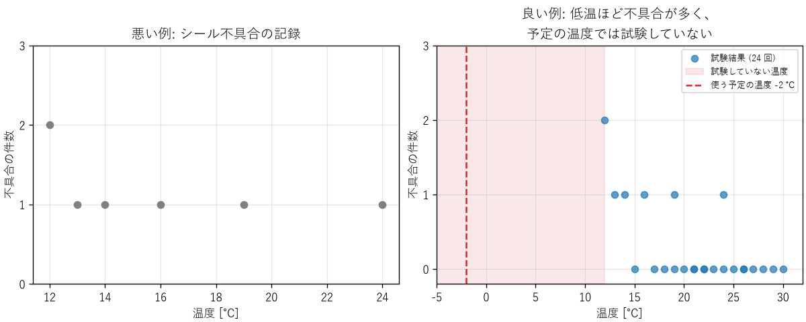

技術文書とデータの伝え方
========================

どれだけ正しい解析や試験をしても、その結果が意思決定者や他のエンジニアに正しく伝わらなければ、役に立ちません。第 16 章で取り上げるチャレンジャーの事故では、エンジニアは低温の危険に気付いていましたが、その根拠を意思決定者に納得させることができませんでした。本章では、技術的な内容を文書、図、口頭で正確に伝えるための基本を説明します。

技術文書の種類
--------------

エンジニアが書く文書には、次のようなものがあります。文書ごとに、読み手と目的が異なります。

.. list-table::
   :header-rows: 1
   :widths: 25 35 40

   * - 文書
     - 主な読み手
     - 目的
   * - 要求仕様書
     - 設計者、試験の担当者、顧客
     - 何を満たせば成功なのかを合意する（第 9 章）
   * - 設計書
     - 実装の担当者、レビューの担当者、将来の保守の担当者
     - 何をどう作るのか、なぜそう決めたのかを伝える
   * - 試験報告書
     - 設計者、品質保証の担当者、顧客
     - 何をどの条件で確かめ、結果がどうだったのかを示す（第 12 章）
   * - 不具合報告書
     - 修正の担当者、管理者
     - 不具合を再現し、原因を特定するための情報を伝える（第 13 章）
   * - 手順書
     - 製造、運用、保守の担当者
     - 誰が実施しても同じ結果になるように、作業を伝える

文章の書き方
------------

技術文書の文章は、文学的な文章とは目的が違います。読み手が短い時間で、誤解なく理解できることを最優先にします。

* **結論を先に書く**: 文書の冒頭に要約と結論を書き、詳細は後に回します。段落も、最初の文でその段落の要点を述べます。忙しい読み手は、最初の数行しか読まないことがあります。
* **読み手を決める**: 読み手が何を知っていて、何を知りたいのかを考えて、説明の詳しさと用語を選びます。
* **事実と意見を区別する**: 「温度は 85 ℃ だった」（事実）と「85 ℃ なら問題ない」（判断）を、読み手が区別できるように書きます。判断には根拠を添えます。
* **あいまいな言葉を避ける**: 「十分に速い」「ほぼ問題ない」ではなく、「95 % のリクエストが 200 ms 以内」「10 回中 10 回成功」のように、数値で書きます。
* **数値には単位と条件を付ける**: 単位（第 2 章）、測定の条件、不確かさ（第 4 章）を書きます。条件のない数値は、他の人が使えません。
* **用語を統一する**: 同じものを指すのに、文書の中で別の言葉を使わないようにします。読み手は、別の言葉は別のものを指すと考えます。
* **再現できる情報を書く**: 試験や不具合の報告には、製品の版、ソフトウェアの版、手順、環境を書き、他の人が同じことを再現できるようにします。

報告書の構成
^^^^^^^^^^^^

試験や調査の報告書は、次の構成にすると、読み手が必要な情報を見つけやすくなります。

1. **要約**: 目的、結論、推奨する行動を数行で書きます。
2. **目的と背景**: なぜこの試験や調査をしたのかを書きます。
3. **方法**: 対象、条件、手順、使った機器とソフトウェアを書きます。
4. **結果**: 測定値や観察した事実を、図表を使って示します。この部分には解釈を混ぜません。
5. **考察**: 結果から何が言えるのか、何が言えないのか、結果の限界（試験していない条件、不確かさ）を書きます。
6. **結論と今後の課題**: 結論と、残っている課題を書きます。

「何が言えないのか」を明記することは、特に重要です。試験した条件の外のことは、試験の結果からは分かりません。

データを図で示す
----------------

グラフは、数値の表だけでは気付きにくい傾向を、ひと目で伝えるための道具です。しかし、同じデータでも、示し方によって伝わる結論が変わります。

:download:`ch15_chart_makeover.py <../examples/ch15_chart_makeover.py>` は、ゴム製のシール部品について、試験時の温度とシールの不具合の件数を 24 回の試験で記録した、という想定の模擬データを描きます。この部品を −2 ℃ で使う計画があるとします。

.. code-block:: text

   10〜17 ℃: 試験  6 回のうち 4 回で不具合 (67%)
   18〜30 ℃: 試験 18 回のうち 2 回で不具合 (11%)
   試験した最低温度: 12 ℃、使う予定の温度: -2.0 ℃

.. _fig-chart-makeover:

   同じデータの 2 つの示し方

:numref:`fig-chart-makeover` の左のグラフは、不具合が起きた試験だけを描いています。不具合は 12 ℃ でも 24 ℃ でも起きているように見え、「温度とは関係がない」と読めてしまいます。右のグラフは、不具合のなかった試験も含めてすべて描いています。すると、不具合のなかった試験はすべて 15 ℃ 以上に集まっており、低温ほど不具合が多いことが分かります。さらに、横軸を使う予定の温度まで広げると、計画が試験の範囲から大きく外れていることが一目で分かります。

この例は、チャレンジャーの事故の前に議論されたデータの示し方の問題を、模擬データで再現したものです。グラフを作るときは、次の点に注意します。

* **すべてのデータを示す**: 都合の良いデータや、「何も起きなかった」データを除くと、結論が変わることがあります。
* **判断に必要な範囲を示す**: 実際に使う条件、規格の上限と下限、目標値を、グラフの中に示します。
* **結論をタイトルにする**: 「温度と不具合の関係」ではなく「低温ほど不具合が多い」のように、読み取ってほしいことをタイトルにします。
* **軸には量と単位を書く**: 「温度 [℃]」のように書きます（第 2 章）。
* **ばらつきを示す**: 平均値だけでなく、ばらつきや不確かさ（誤差範囲、信頼区間）を示します（第 4 章、第 11 章）。
* **誤解を招く表現を避ける**: 棒グラフの軸を 0 から始めない、3D 効果で大きさを歪める、異なる尺度の 2 つの軸で相関を強調する、といった表現は、読み手を誤らせます。

口頭での報告と議論
------------------

会議やレビューでの説明でも、文書と同じ原則が当てはまります。加えて、次の点に注意します。

* **悪い知らせは早く伝える**: 問題は、早く分かるほど対策の選択肢が多くなります。確証が得られるまで報告を待つより、「現時点で分かっていること」と「まだ分かっていないこと」を分けて、早く伝えます。
* **不確かさを言葉で薄めない**: 「おそらく大丈夫」のような表現は、聞き手によって受け取り方が大きく異なります。「試験した範囲では 0 件、試験していない低温側は不明」のように、根拠の範囲を具体的に伝えます。
* **立証の責任を確かめる**: 議論の前提が「安全であることを示せたら進める」なのか「危険であることを示せなければ進める」なのかを確かめます。第 16 章で述べるように、この前提の逆転は事故の原因になります。

ソフトウェアの文書
------------------

ソフトウェアの開発では、コードそのものも文書の一部です。

* **コメント**: コードを読めば分かること（何をしているか）ではなく、コードからは分からないこと（なぜそうしているのか、どの仕様に基づくのか）を書きます。本書のサンプルコードも、この方針で書いています。
* **コミットメッセージ**: 変更の理由を書きます。後で変更の経緯を調べるときの、最も重要な手がかりになります（第 9 章の構成管理）。
* **不具合の報告**: 再現の手順、期待した結果、実際の結果、環境（OS、版）を書きます。再現できない報告は、修正できません。
* **README と手順書**: 新しい担当者が、文書だけを見て、ビルド、試験、実行ができるように書きます。

まとめ
------

* 技術文書は、読み手と目的を決め、結論を先に、事実と判断を区別して書きます。
* 数値には単位、条件、不確かさを付け、あいまいな言葉を避けます。
* 報告書では、結果から何が言えないのか、試験の範囲の限界も明記します。
* グラフでは、すべてのデータと判断に必要な範囲を示し、結論をタイトルにします。
* 悪い知らせは早く伝え、不確かさを具体的に説明します。
