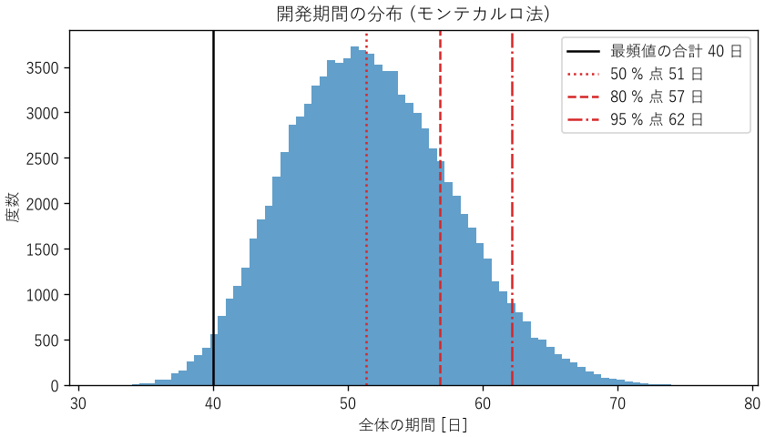

設計プロセス
============

設計とは、要求を満たすものの姿を決め、作れる形で表すことです。本章では、要求を明確にする方法、設計を段階的に進める方法、複数の案から根拠を持って選ぶ方法を説明します。さらに、設計を製品として世に出すまでに必要な、規格と認証、構成管理、見積もりについても説明します。

要求を明確にする
----------------

設計の失敗の多くは、技術的な誤りではなく、要求の誤解や漏れから生じます。作る前に、何を満たせば成功なのかを明確にします。要求は、次の 3 種類に分けて整理します。

.. list-table::
   :header-rows: 1
   :widths: 20 40 40

   * - 種類
     - 内容
     - 例
   * - 機能要求
     - システムが何をするか
     - 温度を 1 秒ごとに測定し、記録する
   * - 非機能要求
     - どの程度うまく行うか（性能、信頼性、安全性、保守性など）
     - 測定の誤差は ±0.5 ℃ 以内。年間の停止時間は 1 時間以内
   * - 制約条件
     - 設計の自由を制限する外部の条件
     - 単価 3000 円以下。既存の通信規格を使う。電波法に適合する

良い要求には、次の性質があります。

* **検証できる**: 「高速に応答する」ではなく「95 % のリクエストに 200 ms 以内に応答する」のように、満たしているかどうかを試験で判定できる形で書きます。検証できない要求は、達成したかどうかを誰も判断できません。
* **あいまいでない**: 読む人によって解釈が変わらないように書きます。「通常の使用条件で」と書くなら、通常の使用条件を定義します。
* **実現方法を決めすぎない**: 「ファンで冷却する」ではなく「周囲温度 40 ℃ で部品の温度を 85 ℃ 以下に保つ」と書けば、設計者がより良い方法を選べます。
* **理由が分かる**: なぜその要求があるのかを残しておくと、後で要求を見直すときに判断できます。

要求は、利用者や顧客が最初から明確に持っているとは限りません。利用場面を観察する、試作品を触ってもらう、といった活動を通じて引き出し、合意する作業が必要です。

設計の段階
----------

複雑なシステムは、一度に細部まで設計できません。全体から部分へ、抽象から具体へと、段階的に設計を進めます。

.. list-table::
   :header-rows: 1
   :widths: 20 40 40

   * - 段階
     - 決めること
     - 主な成果物
   * - 概念設計
     - 要求を満たす実現方式。複数の案を出し、比較して選ぶ
     - 方式の比較表、全体構成図
   * - 基本設計
     - システムを構成する要素（サブシステム）と、その間のインターフェース
     - ブロック図、インターフェース仕様書
   * - 詳細設計
     - 各要素を作るのに必要なすべての情報
     - 回路図、図面、部品表、モジュールの詳細仕様

上流の段階ほど、決めたことの影響が大きく、後から変えるときの費用も大きくなります。製品のライフサイクル全体の費用の大部分は、概念設計と基本設計の段階で決まると言われます。上流の段階では、時間をかけて複数の案を比較する価値があります。

V 字モデル
^^^^^^^^^^

設計の各段階と、それを確かめる試験の対応を表したのが V 字モデルです。左側を上から下へ進んで設計し、右側を下から上へ進んで試験します。

.. list-table::
   :header-rows: 1
   :widths: 50 50

   * - 設計の段階（左側）
     - 対応する試験（右側）
   * - 要求定義
     - 受け入れ試験（利用者の要求を満たすか）
   * - 概念設計（システムの仕様の決定）
     - システム試験（システム全体が仕様を満たすか）
   * - 基本設計（要素とインターフェースの決定）
     - 結合試験（要素を組み合わせて正しく動くか）
   * - 詳細設計
     - 単体試験（各要素が詳細仕様どおりに動くか）

V 字モデルの要点は、設計の各段階で「これをどう確かめるか」を同時に決めることです。試験の方法を考えると、要求や仕様のあいまいさに早く気付けます。試験については第 12 章で詳しく説明します。

V 字モデルは、試作や出荷後の変更の費用が大きいハードウェアや、安全性が重要なシステムで広く使われます。一方、ソフトウェアの開発では、短い周期で設計・実装・試験を繰り返す反復型の開発もよく使われます。反復型の開発でも、各周期の中で「何を作り、どう確かめるか」を対応付けるという考え方は同じです。

インターフェース
----------------

システムを要素に分けると、要素の間にインターフェースが生まれます。ハードウェアとソフトウェアの境界は、特に問題が起きやすい場所です。インターフェース仕様書には、少なくとも次の内容を書きます。

* 信号やデータの意味、型、単位、範囲、分解能
* 電圧のレベル、タイミング、通信のプロトコル
* 異常時の振る舞い（値が範囲外のとき、通信が途絶えたとき）
* 起動と停止の手順、初期状態

第 2 章のマーズ・クライメイト・オービターは、インターフェースの単位の取り違えが原因でした。インターフェースの両側を別の担当者や組織が作る場合は、仕様書を両者で確認し、結合試験で実際に確かめることが欠かせません。

トレードオフ分析
----------------

設計では、性能、コスト、消費電力、信頼性、開発期間などの要求が互いに両立しないことがよくあります。このような関係をトレードオフと呼びます。トレードオフのある選択では、何を重視し、何を諦めたのかを明確にして、根拠を持って選ぶことが大切です。

重み付き評価マトリクス
^^^^^^^^^^^^^^^^^^^^^^

複数の案を複数の観点で比較する簡単な方法が、重み付き評価マトリクスです。評価項目ごとに重みを決め、各案を採点し、重み付きの合計で比べます。

:download:`ch09_decision_matrix.py <../examples/ch09_decision_matrix.py>` は、工場内の温度センサー 50 台からデータを集める通信方式を、3 つの案から選ぶ例です。

.. list-table::
   :header-rows: 1
   :widths: 25 15 20 20 20

   * - 評価項目
     - 重み
     - 有線（RS-485）
     - Wi-Fi
     - BLE メッシュ
   * - 導入コスト
     - 0.25
     - 2
     - 4
     - 4
   * - 消費電力
     - 0.20
     - 4
     - 2
     - 5
   * - 通信の信頼性
     - 0.30
     - 5
     - 3
     - 3
   * - 設置の容易さ
     - 0.15
     - 1
     - 4
     - 4
   * - 開発工数
     - 0.10
     - 4
     - 4
     - 2
   * - **総合点**
     -
     - **3.35**
     - **3.30**
     - **3.70**

この評価では BLE メッシュが 1 位です。しかし、重みや点数は主観的に決めたものなので、少し変えただけで順位が入れ替わるなら、この結果は信頼できません。そこで、サンプルコードでは、各重みを ±0.05 ずつ変えたすべての組み合わせ（:math:`3^5 = 243` 通り）で、どの案が 1 位になるかを数えています。

.. literalinclude:: ../examples/ch09_decision_matrix.py
   :language: python
   :pyobject: sensitivity
   :lineno-match:

.. code-block:: text

   各重みを ±0.05 変えた 243 通りで 1 位になった回数
     有線 (RS-485)   :   10 回 (4%)
     Wi-Fi         :    0 回 (0%)
     BLE メッシュ      :  233 回 (96%)

96 % の組み合わせで BLE メッシュが 1 位なので、この結論は重みの多少の違いに左右されないと言えます。このように、結論が前提の変化にどれだけ影響されるかを調べることを感度分析と呼びます。

評価マトリクスを使うときは、次の点に注意します。

* 必須の要求（法規、安全など）を満たさない案は、点数で比べる前に除外します。点数の合計では、致命的な欠点が他の長所で埋め合わされてしまうためです。
* 評価項目どうしが重複しないようにします。似た項目が複数あると、その観点が過大に評価されます。
* 点数の根拠（「通信の信頼性 5 点: 有線のため電波干渉の影響を受けない」など）を記録します。
* 評価マトリクスは議論の道具であり、計算結果に従うこと自体が目的ではありません。結果が直感と食い違う場合は、評価項目や重みに漏れがないかを見直すきっかけにします。

設計余裕
--------

設計では、計算どおりの条件でぎりぎり動くのではなく、余裕を持たせます。材料の強度のばらつき、負荷の想定外の変動、モデルの誤差、経年劣化など、設計時に把握しきれない不確かさがあるためです。

安全率
   機械や構造物の設計では、材料が壊れる応力を、想定する最大の応力で割った値を安全率と呼び、用途に応じて 1.5〜数倍程度を確保します。

ディレーティング
   電子部品は、定格（最大で許される電圧、電流、温度など）より低い条件で使います。たとえば、コンデンサーを定格電圧の 50〜80 % 以下で使うと、寿命が延び、故障率が下がります。

性能の余裕
   ソフトウェアでも、CPU の使用率やメモリの使用量に余裕を持たせます。第 3 章の待ち行列モデルで見たように、利用率が 1 に近づくと応答時間は急激に悪化します。

余裕は大きいほど安全ですが、コスト、重量、消費電力が増えます。どの程度の余裕を持たせるかもトレードオフであり、不確かさの大きさ（第 4 章、第 11 章）と、壊れたときの影響の大きさ（第 14 章）に基づいて決めます。

ライフサイクルを考慮した設計
----------------------------

性能や機能だけでなく、製品のライフサイクルのほかの段階を考慮して設計することを、DfX（Design for X）と呼びます。

.. list-table::
   :header-rows: 1
   :widths: 30 70

   * - 考慮する段階
     - 設計の工夫の例
   * - 製造（DfM）
     - 部品の種類を減らす。組み立ての向きをそろえる。加工の難しい形状を避ける
   * - 試験（DfT）
     - 試験用の端子やログ出力を設ける。ソフトウェアの要素を単体で試験できる構造にする
   * - 保守
     - 消耗部品を交換しやすくする。故障の原因を特定できる診断機能を持たせる
   * - 廃棄・リサイクル
     - 材料を分別しやすくする。有害物質を使わない

持続可能性
^^^^^^^^^^

製品が環境に与える影響は、使っている間だけでなく、材料の採掘、製造、輸送、使用、廃棄のすべての段階で生じます。製品の一生にわたる環境への影響を定量的に評価する方法を、ライフサイクルアセスメント（LCA）と呼びます。LCA の手順は ISO 14040 と ISO 14044 で定められています。

LCA で評価すると、直感と異なる結果が出ることがあります。たとえば、スマートフォンやノートパソコンでは、温室効果ガスの排出の多くが、使用中の電力ではなく製造の段階で生じると報告されています。この場合、消費電力を下げるより、製品を長く使えるようにする（修理しやすくする、ソフトウェアの更新を長く提供する）ほうが、環境への影響を大きく減らせます。

設計で考慮できる主な項目は、次のとおりです。

* **使用中のエネルギー**: 効率を上げ、待機電力を減らします（第 8 章）。ソフトウェアの処理の効率も含まれます。
* **長寿命と修理のしやすさ**: 故障した部品だけを交換できる構造にし、交換部品とソフトウェアの更新を長く提供します。
* **材料**: 使う材料の量を減らし、リサイクルしやすい材料を選び、有害物質を使いません。電気・電子機器の特定有害物質の使用を制限する EU の RoHS 指令のように、法規で定められている場合もあります。
* **廃棄とリサイクル**: 分解しやすい構造にし、材料の種類を表示します。

規格・法規と認証
----------------

製品は、要求を満たして動くだけでは出荷できません。販売する国や地域の法規に適合し、必要な認証を受ける必要があります。規格や法規は、過去の事故や不具合の教訓を集めたものでもあり、設計の早い段階から確認します。

規格の種類
^^^^^^^^^^

.. list-table::
   :header-rows: 1
   :widths: 25 75

   * - 種類
     - 例
   * - 国際規格
     - ISO（国際標準化機構）、IEC（国際電気標準会議）、ITU（国際電気通信連合）の規格
   * - 国家規格
     - JIS（日本産業規格）。多くは国際規格と整合している
   * - 業界・団体の規格
     - IEEE の規格（無線 LAN の IEEE 802.11 など）、USB や Bluetooth の仕様
   * - 社内規格
     - 自社の設計基準、部品の選定基準

規格は、それ自体には多くの場合、法的な強制力はありません。しかし、法規が規格を引用している場合や、取引先が規格への適合を求める場合には、事実上守らなければなりません。また、規格に従うことは、製品の互換性（ねじ、コネクター、通信規格）と、設計の妥当性を説明する根拠になります。

日本で関わることの多い法規と認証
^^^^^^^^^^^^^^^^^^^^^^^^^^^^^^^^

.. list-table::
   :header-rows: 1
   :widths: 30 70

   * - 法規・認証
     - 内容
   * - 電気用品安全法（PSE マーク）
     - コンセントにつなぐ電気製品の多くが対象。感電や火災を防ぐための技術基準への適合が求められる
   * - 電波法（技適マーク）
     - Wi-Fi や Bluetooth などの無線機器は、技術基準への適合の証明を受けたものでなければ使えない
   * - 製造物責任法（PL 法）
     - 製品の欠陥によって損害が生じた場合、製造業者は過失がなくても賠償の責任を負う
   * - 海外の認証
     - EU の CE マーキング、米国の FCC の認証など。販売する国ごとに必要な認証が異なる

ソフトウェアも、法規と無関係ではありません。個人情報の扱い（個人情報保護法、EU の GDPR）、医療機器のソフトウェア（医薬品医療機器等法）、自動車のソフトウェアの更新（道路運送車両法）などが関係します。

認証の試験には時間と費用がかかり、不合格になれば設計をやり直すことになります。特に EMC（第 12 章）は、設計の終盤で問題が見つかると対策が難しいため、基板の設計の段階から考慮し、開発の途中で予備的な試験を行います。

構成管理と変更管理
------------------

製品は、多くの設計書、図面、部品、ソフトウェアの組み合わせでできており、それぞれが開発の途中で何度も変更されます。どの版の要素を組み合わせたものが、どの製品として出荷されたのかを正確に把握し、変更を管理する活動を構成管理と呼びます。

構成管理で管理するもの
^^^^^^^^^^^^^^^^^^^^^^

.. list-table::
   :header-rows: 1
   :widths: 30 35 35

   * - 対象
     - ソフトウェア
     - ハードウェア
   * - 版の管理
     - バージョン管理システム（Git など）でソースコードの履歴を管理する
     - 図面と回路図に版数を付け、改訂の履歴を残す
   * - 構成の一覧
     - 依存するライブラリーとその版の一覧
     - 部品表（BOM）。部品の型番、メーカー、数量
   * - 基準となる版
     - リリースごとのタグ
     - 試作や量産の開始時点で凍結した図面と部品表（ベースライン）
   * - 製品との対応
     - 出荷したソフトウェアの版を、ログや画面で確認できるようにする
     - 製品の製造番号から、使った部品のロットと図面の版をたどれるようにする

構成管理ができていれば、市場で不具合が見つかったとき、同じ問題を持つ製品の範囲（どの製造番号の、どの版のソフトウェアを載せた製品か）を特定できます。ソフトウェアとハードウェアの組み合わせによって動作が変わる製品では、両方の版の対応表を管理します。

変更管理
^^^^^^^^

ベースラインを決めた後の変更は、次の手順で管理します。

1. **変更の要求**: 変更の内容と理由を文書にします。
2. **影響の分析**: 変更が、ほかの要素、インターフェース、性能、安全性、試験、認証にどう影響するかを分析します。
3. **承認**: 影響を理解できる立場の人が、変更を承認または却下します。
4. **実施と検証**: 変更を行い、影響のある範囲の試験（回帰試験、第 12 章）をやり直します。
5. **記録**: 変更の内容、理由、承認者、検証の結果を記録します。

第 16 章のハイアットリージェンシーの事故は、製作の段階での「小さな」設計変更が、十分な影響の分析なしに承認されたことが原因でした。変更が小さく見えるときほど、影響の分析を省略しがちです。変更管理の手順は、規模の小さな変更にも適用します。

設計レビュー
------------

設計の誤りは、早く見つけるほど修正の費用が小さくなります。設計の各段階の区切りで、設計者以外の人が設計書を確認する設計レビューを行います。設計者自身は、自分の前提を疑うのが難しいためです。

レビューでは、次の観点で確認します。

* 要求をすべて満たしているか（要求と設計の対応表で確認する）
* 前提条件と仮定は妥当か、明記されているか
* 異常時や境界の条件での振る舞いは考えられているか
* 過去の不具合の教訓が反映されているか

レビューの指摘と、それへの対応は記録に残します。記録は、後で同じような設計をするときの知識になります。

見積もりとプロジェクトのリスク管理
----------------------------------

設計の作業そのものも、限られた期間と費用の中で行います。開発期間や工数の見積もりにも、不確かさの考え方（第 4 章、第 11 章）が使えます。

3 点見積もり
^^^^^^^^^^^^

作業の日数を 1 つの値で見積もると、多くの場合「順調に進んだ場合」の値になりがちです。そこで、楽観値 :math:`a`、最頻値 :math:`m`、悲観値 :math:`b` の 3 つを見積もります。PERT と呼ばれる手法では、作業日数の期待値を次の式で近似します。

.. math::
   :label: eq-pert

   E = \frac{a + 4m + b}{6}

作業の日数は、予定より早く終わる余地は小さく、遅れる余地は大きいため、分布は右に裾が長くなります。そのため、期待値は最頻値より大きくなります。

:download:`ch09_schedule.py <../examples/ch09_schedule.py>` は、順番に行う 5 つの作業の 3 点見積もりから、作業の日数が三角分布に従うと仮定して、全体の期間の分布をモンテカルロ法（第 11 章）で求めます。

.. list-table::
   :header-rows: 1
   :widths: 40 20 20 20

   * - 作業
     - 楽観値 [日]
     - 最頻値 [日]
     - 悲観値 [日]
   * - 要求定義
     - 3
     - 5
     - 10
   * - 回路・機構の設計
     - 8
     - 10
     - 20
   * - ソフトウェアの実装
     - 10
     - 15
     - 30
   * - 結合試験
     - 4
     - 5
     - 15
   * - 環境試験と修正
     - 3
     - 5
     - 12

.. code-block:: text

   最頻値の合計      :  40.0 日
   PERT の期待値の合計:  45.8 日
   最頻値の合計 (40 日) 以内に終わる確率: 2%
    50 % の確率で終わる日数:  51.4 日
    80 % の確率で終わる日数:  56.9 日
    95 % の確率で終わる日数:  62.2 日

.. _fig-schedule:

   開発期間の分布

各作業の最頻値を足した 40 日の計画は、この仮定のもとでは 2 % の確率でしか達成できません（:numref:`fig-schedule`）。それぞれの作業が「最もありそうな日数」で終わることは、すべてが同時に起きるとほとんどありえないからです。計画を示すときは「80 % の確率で 57 日以内」のように、確率とともに示すと、計画の確からしさが伝わります。

なお、PERT の期待値の合計（45.8 日）とモンテカルロ法の中央値（51.4 日）が異なるのは、作業日数の分布の仮定が異なる（PERT はベータ分布、サンプルコードは三角分布）ためです。分布の仮定によって結果が変わるので、仮定を明記し、実績のデータで見積もりの方法を検証します。

プロジェクトのリスク管理
^^^^^^^^^^^^^^^^^^^^^^^^

開発には、技術的な課題が解決できない、部品が入手できない、試験に合格しない、といったリスクがあります。製品の安全のリスク（第 14 章）と同じように、発生確率と影響の大きさで評価し、対策を決めます。

.. list-table::
   :header-rows: 1
   :widths: 20 40 40

   * - 対応
     - 内容
     - 例
   * - 回避
     - リスクの原因を取り除く
     - 実績のない新技術を使わない
   * - 軽減
     - 発生確率や影響を小さくする
     - 難しい部分を先に試作する。代替部品を選定しておく
   * - 移転
     - 影響を他者に移す
     - 保険をかける。専門の業者に委託する
   * - 受容
     - リスクを受け入れ、発生したときのために予備の期間や費用を確保する
     - 影響の小さいリスク

最も効果的な対策の 1 つは、不確かさの大きい作業を、プロジェクトの早い段階に行うことです。難しい技術課題の見通しが早く立てば、計画を見直す余地が残ります。リスクの一覧は、プロジェクトの間、定期的に見直します。

まとめ
------

* 要求は、機能要求、非機能要求、制約条件に分け、検証できる形で書きます。
* 設計は概念設計から詳細設計へ段階的に進めます。V 字モデルでは、各段階の確かめ方を同時に決めます。
* インターフェースには、意味、単位、範囲、異常時の振る舞いを明記します。
* トレードオフのある選択は、評価マトリクスなどで根拠を明確にし、感度分析で結論の頑健さを確かめます。
* 不確かさに備えて設計余裕を持たせます。余裕の大きさもトレードオフです。
* 製品のライフサイクル全体での環境への影響を考え、長く使える製品を設計します。
* 規格・法規と認証は、設計の早い段階から確認します。
* 構成管理で製品の構成を正確に把握し、変更は影響を分析してから承認します。
* 見積もりは 3 点見積もりで不確かさを表し、計画は確率とともに示します。
