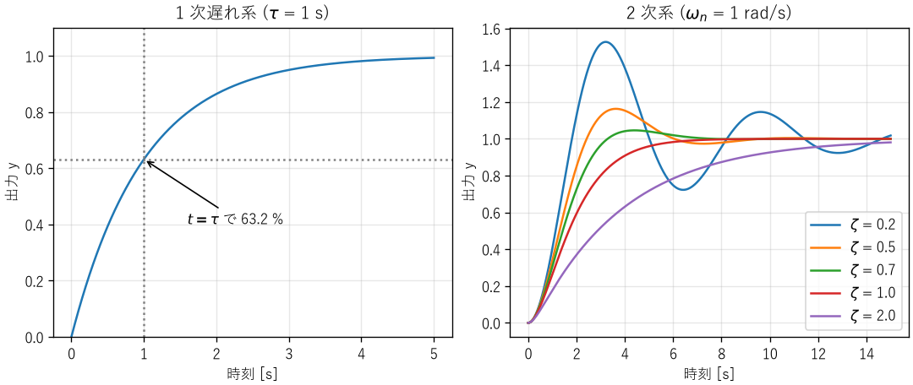
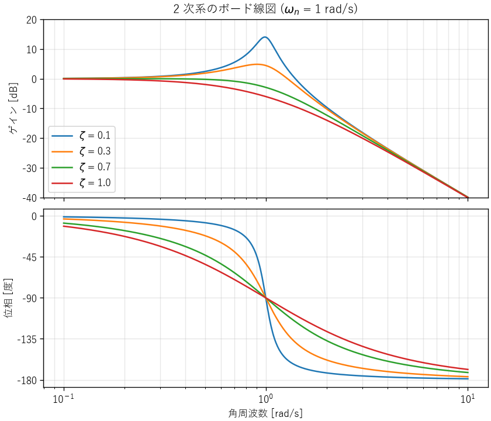
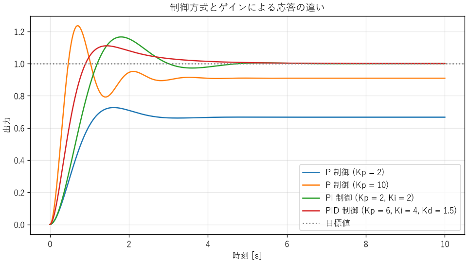

動的システムと制御
==================

モーターの回転速度、部屋の温度、サーバーの台数など、時間とともに変化する対象を、目的の状態に保ちたい場面は数多くあります。本章では、時間変化する系の基本的な振る舞いと、それを目的どおりに動かすフィードバック制御の考え方を説明します。

動的システム
------------

入力を受け取り、出力を返すものをシステムと呼びます。出力が現在の入力だけで決まるシステムを静的システム、過去の入力の影響も受けるシステムを動的システムと呼びます。たとえば、抵抗に流れる電流は現在の電圧だけで決まるので静的です。一方、コンデンサーの電圧は、それまでに流れ込んだ電流の積み重ねで決まるので動的です。

動的システムは、過去の影響を「状態」として内部に持っています。コンデンサーの電荷、物体の位置と速度、容器の温度などが状態です。状態の変化は微分方程式で表されます。

入力を 2 倍にすると出力も 2 倍になり、2 つの入力の和に対する出力が、それぞれの出力の和になる（重ね合わせの原理が成り立つ）システムを線形システムと呼びます。さらに、性質が時間によって変わらないものを線形時不変システムと呼びます。現実のシステムは厳密には非線形ですが、動作点の近くで線形化して（第 3 章）、線形時不変システムとして扱うことがよくあります。

1 次遅れ系
----------

最も基本的な動的システムは、次の微分方程式で表される 1 次遅れ系です。:math:`u` は入力、:math:`y` は出力、:math:`K` はゲイン、:math:`\tau` は時定数です。

.. math::
   :label: eq-first-order

   \tau \frac{dy}{dt} + y = K u

1 次遅れ系は、さまざまな分野に現れます。

.. list-table::
   :header-rows: 1
   :widths: 25 25 25 25

   * - 例
     - 入力 :math:`u`
     - 出力 :math:`y`
     - 時定数 :math:`\tau`
   * - RC 回路
     - 電源電圧
     - コンデンサーの電圧
     - :math:`RC`
   * - 物体の加熱
     - ヒーターの電力
     - 物体の温度
     - 熱容量 × 熱抵抗
   * - モーターの回転
     - 駆動トルク
     - 回転速度
     - 慣性モーメント / 粘性摩擦係数
   * - 指数移動平均
     - 測定値
     - 平滑化した値
     - サンプリング周期と平滑化係数で決まる

時刻 0 で入力を 0 から 1 に変えたとき（ステップ入力）の出力をステップ応答と呼びます。1 次遅れ系のステップ応答は次の式になります。

.. math::
   :label: eq-first-order-step

   y(t) = K\left(1 - e^{-t/\tau}\right)

時刻 :math:`t = \tau` で最終値の :math:`1 - e^{-1} \approx 63.2` %、:math:`3\tau` で約 95 %、:math:`5\tau` で約 99.3 % に達します（:numref:`fig-step-response` の左）。このことから、ステップ応答を測定すれば、最終値からゲインを、63.2 % に達する時刻から時定数を求められます。また「時定数の 5 倍待てば、ほぼ落ち着く」という目安が得られます。

2 次系
------

ばね・質量・ダンパーの系や、RLC 回路（第 3 章の\ :eq:`eq-analogy`）は、2 次の微分方程式で表されます。これを、固有角周波数 :math:`\omega_n` と減衰比 :math:`\zeta` を使って次の標準形に書き直します。

.. math::
   :label: eq-second-order

   \frac{d^2y}{dt^2} + 2\zeta\omega_n \frac{dy}{dt} + \omega_n^2 y = \omega_n^2 u

ばね・質量・ダンパーの系では、:math:`\omega_n = \sqrt{k/m}`、:math:`\zeta = c / (2\sqrt{mk})` です。2 次系のステップ応答は、減衰比によって形が大きく変わります（:numref:`fig-step-response` の右）。

* :math:`\zeta < 1`\ （不足減衰）: 目標値を行き過ぎて振動しながら落ち着きます。
* :math:`\zeta = 1`\ （臨界減衰）: 振動せずに最も速く落ち着きます。
* :math:`\zeta > 1`\ （過減衰）: 振動しませんが、ゆっくり落ち着きます。

.. _fig-step-response:

   1 次遅れ系と 2 次系のステップ応答

不足減衰の場合、出力が最終値を超える割合（最大行き過ぎ量）は次の式で求められます。

.. math::
   :label: eq-overshoot

   M_p = \exp\left(-\frac{\zeta\pi}{\sqrt{1 - \zeta^2}}\right)

:download:`ch06_step_response.py <../examples/ch06_step_response.py>` で計算すると、:math:`\zeta = 0.2` で 52.7 %、:math:`\zeta = 0.5` で 16.3 %、:math:`\zeta = 0.7` で 4.6 % です。:math:`\zeta = 0.7` 付近は、行き過ぎが小さく応答も速いため、設計の目標によく使われます。

周波数応答と共振
----------------

ステップ応答は、入力を急に変えたときの振る舞い（時間領域の特性）を表します。もう 1 つの重要な見方が、さまざまな周波数の正弦波を入力したときの振る舞い（周波数領域の特性）です。振動、音、交流の電気信号、周期的な負荷など、工学で扱う入力の多くは、正弦波の重ね合わせとして表せるからです（第 7 章）。

伝達関数
^^^^^^^^

線形時不変システムに正弦波を入力すると、十分に時間がたった後の出力は、同じ周波数の正弦波になります。変わるのは、振幅と位相だけです。入力に対する出力の振幅の比をゲイン、出力の遅れを位相と呼び、これらを周波数の関数として表したものを周波数応答と呼びます。

周波数応答は、伝達関数を使うと簡単に計算できます。伝達関数は、微分方程式の時間微分 :math:`d/dt` を複素数の変数 :math:`s` に置き換えて（ラプラス変換して）、出力と入力の比として表したものです。たとえば、1 次遅れ系の\ :eq:`eq-first-order` と 2 次系の\ :eq:`eq-second-order` の伝達関数は、次のようになります。

.. math::
   :label: eq-transfer-function

   G_1(s) = \frac{K}{\tau s + 1}, \qquad
   G_2(s) = \frac{\omega_n^2}{s^2 + 2\zeta\omega_n s + \omega_n^2}

伝達関数に :math:`s = j\omega`\ （:math:`j` は虚数単位、:math:`\omega` は角周波数）を代入した複素数 :math:`G(j\omega)` の絶対値がゲイン、偏角が位相です（複素数については付録の\ :doc:`math`\ を参照）。

1 次遅れ系のゲインは、:math:`\omega = 1/\tau` で直流のときの :math:`1/\sqrt{2}` 倍（−3 dB）になり、それより高い周波数では、周波数が 10 倍になるごとに 1/10（−20 dB）ずつ小さくなります。1 次遅れ系は、ゆっくりした変化は通し、速い変化は通さないローパスフィルターとして働きます。ゲインが −3 dB になる周波数を遮断周波数と呼び、系が追従できる速さの目安（帯域幅）になります。

ボード線図と共振
^^^^^^^^^^^^^^^^

ゲイン（dB）と位相を、対数目盛りの周波数に対して描いた図をボード線図と呼びます。:download:`ch06_frequency_response.py <../examples/ch06_frequency_response.py>` で描いた 2 次系のボード線図が\ :numref:`fig-frequency-response` です。

.. _fig-frequency-response:

   2 次系のボード線図（:math:`\omega_n = 1` rad/s）

減衰比 :math:`\zeta` が小さいと、固有角周波数 :math:`\omega_n` の近くでゲインが鋭く大きくなります。この現象を共振と呼びます。:math:`\zeta < 1/\sqrt{2}` のとき、ゲインが最大になる角周波数（共振角周波数）:math:`\omega_r` と、そのときのゲイン（共振ピーク）:math:`M_r` は次の式で求められます。

.. math::
   :label: eq-resonance

   \omega_r = \omega_n \sqrt{1 - 2\zeta^2}, \qquad
   M_r = \frac{1}{2\zeta\sqrt{1 - \zeta^2}}

.. code-block:: text

   減衰比  共振角周波数[rad/s]  共振ピーク[倍]  [dB]
      0.1                0.990            5.03   14.0
      0.3                0.906            1.75    4.8
      0.7                0.141            1.00    0.0
      1.0  共振しない

:math:`\zeta = 0.1` では、固有角周波数の入力に対して、出力の振幅が入力の約 5 倍になります。:math:`\zeta = 0.7` は :math:`1/\sqrt{2} \approx 0.707` よりわずかに小さいため、計算上は共振しますが、ピークはほぼ 1 倍で、実質的に共振しません。

共振は、機械と電気の両方で、破損や誤動作の主な原因になります。

* **機械**: モーターやファンの回転、路面からの振動などが、部品や基板の固有振動数と一致すると、小さな力でも大きく振動し、疲労破壊（第 13 章）を早めます。回転機械では、固有振動数と一致する回転速度（危険速度）を避けて運転します。
* **電気**: LC 回路は特定の周波数で共振します。無線の同調回路のように共振を利用する場合もありますが、電源回路で意図しない共振が起きると、電圧が大きく振れて部品を壊すことがあります。
* **制御**: 制御対象の機械的な共振を、フィードバック制御が励起して、振動が止まらなくなることがあります。

共振への対策は、固有振動数を外部からの加振の周波数から離す（剛性や質量を変える）、減衰を加える（ダンパー、制振材、抵抗）、加振の周波数の成分を取り除く（フィルター）の 3 つが基本です。設計の段階で、固有振動数と加振の周波数を一覧にして、近いものがないかを確かめます。

フィードバック制御の安定性
^^^^^^^^^^^^^^^^^^^^^^^^^^

周波数応答は、次の節で説明するフィードバック制御の安定性の評価にも使われます。フィードバックのループを一周したときに、位相が 180° 遅れる周波数で、ゲインが 1 以上あると、偏差を打ち消すはずの修正が逆に偏差を強めるため、振動が持続または拡大します。そこで、位相が 180° 遅れる周波数でゲインがどれだけ 1 より小さいか（ゲイン余裕）と、ゲインが 1 になる周波数で位相が 180° までどれだけ余っているか（位相余裕）を、安定性の余裕の指標として使います。次の節で述べる「遅れがあるのに強く修正すると不安定になる」という現象を、定量的に評価する方法です。

フィードバック制御
------------------

制御の方法は、大きく 2 つに分けられます。

フィードフォワード制御（開ループ制御）
   入力と出力の関係があらかじめ分かっているものとして、目標に応じた入力を与えます。たとえば「ヒーターを 500 W で 10 分間動かす」という制御です。単純ですが、外気温の変化（外乱）や、ヒーターの特性のばらつきの影響を受けます。

フィードバック制御（閉ループ制御）
   出力を測定し、目標値との差（偏差）に応じて入力を調整します。たとえば「温度を測り、目標より低ければヒーターを強くする」という制御です。外乱やばらつきがあっても、出力を目標に近づけられます。

フィードバック制御の基本的な構成を次に示します。

.. list-table::
   :header-rows: 1
   :widths: 25 75

   * - 要素
     - 役割
   * - 目標値
     - 出力をどの値にしたいか
   * - コントローラー
     - 偏差（目標値 − 測定値）から操作量を計算する
   * - 操作量
     - 制御対象に加える入力（ヒーターの電力、モーターの電圧など）
   * - 制御対象
     - 制御したいもの。プラントとも呼ぶ
   * - センサー
     - 出力を測定し、コントローラーに返す
   * - 外乱
     - 制御対象に外から加わる予期しない影響

フィードバック制御は強力ですが、注意も必要です。フィードバックの経路に遅れがあるのに、強く修正しようとすると、修正が行き過ぎて振動し、最悪の場合は振幅が増え続けて不安定になります。シャワーの温度を調整するとき、お湯が出てくるまでの遅れのせいで、熱すぎたり冷たすぎたりを繰り返すのと同じ現象です。

PID 制御
--------

産業界で最も広く使われているコントローラーが PID 制御です。偏差 :math:`e(t)` から、次の式で操作量 :math:`u(t)` を計算します。

.. math::
   :label: eq-pid

   u(t) = K_p e(t) + K_i \int_0^t e(\sigma)\,d\sigma + K_d \frac{de(t)}{dt}

3 つの項には、それぞれ次の役割があります。

.. list-table::
   :header-rows: 1
   :widths: 20 40 40

   * - 項
     - 役割
     - 大きくしすぎると
   * - 比例（P）
     - 現在の偏差に比例して修正する
     - 振動しやすくなる
   * - 積分（I）
     - 偏差の累積に応じて修正し、残る偏差（定常偏差）をなくす
     - 応答が遅れて行き過ぎが大きくなる
   * - 微分（D）
     - 偏差の変化の速さに応じて修正し、行き過ぎを抑える
     - 測定の雑音に過敏になる

P 制御だけでは、一般に定常偏差が残ります。ゲイン :math:`K` の制御対象を比例ゲイン :math:`K_p` で P 制御すると、目標値 1 のステップ入力に対する定常偏差は :math:`1/(1 + K K_p)` になります。:math:`K_p` を大きくすれば偏差は小さくなりますが、振動しやすくなります。積分項を加えると、偏差が残っている間は操作量が増え続けるため、定常偏差をなくせます。

シミュレーション
^^^^^^^^^^^^^^^^

:download:`ch06_pid.py <../examples/ch06_pid.py>` は、時定数 1.0 s と 0.5 s の 1 次遅れ要素を直列につないだ制御対象（ゲイン 1）を、P 制御、PI 制御、PID 制御で目標値 1 に追従させます。結果を\ :numref:`fig-pid` と次の表に示します。

.. list-table::
   :header-rows: 1
   :widths: 40 20 20 20

   * - 制御方式とゲイン
     - 最大行き過ぎ量
     - 整定時間（±2 %）
     - 定常偏差
   * - P 制御（:math:`K_p = 2`）
     - 9.0 %
     - 2.44 s
     - 0.333
   * - P 制御（:math:`K_p = 10`）
     - 35.9 %
     - 2.39 s
     - 0.091
   * - PI 制御（:math:`K_p = 2, K_i = 2`）
     - 16.6 %
     - 4.05 s
     - 0.000
   * - PID 制御（:math:`K_p = 6, K_i = 4, K_d = 1.5`）
     - 11.0 %
     - 3.53 s
     - 0.000

.. _fig-pid:

   制御方式とゲインによる応答の違い

P 制御では、定常偏差が理論値 :math:`1/(1 + K_p)` のとおり残ります。:math:`K_p` を 10 にすると偏差は小さくなりますが、大きく振動します。PI 制御では定常偏差がなくなります。PID 制御では、微分項が行き過ぎを抑えるため、比例ゲインを大きくして応答を速くしつつ、行き過ぎを PI 制御より小さくできています。

実装上の注意
^^^^^^^^^^^^

実際のコントローラーは、マイコンやコンピューターのプログラムとして、一定の周期で計算します。サンプルコードのコントローラーは次のとおりです。

.. literalinclude:: ../examples/ch06_pid.py
   :language: python
   :pyobject: PidController
   :lineno-match:

PID 制御を実装するときは、次の点に注意します。

* **計算周期**: 計算周期は、制御対象の時定数より十分に短くします（目安として 1/10 以下）。周期が長いと、その分だけフィードバックが遅れ、不安定になりやすくなります。
* **微分キック**: 目標値が急に変わると、偏差の微分が非常に大きくなり、操作量が跳ね上がります。サンプルコードのように、偏差ではなく測定値を微分すると避けられます。
* **雑音**: 微分は測定の雑音を拡大します。微分項には、ローパスフィルター（第 7 章）を組み合わせるのが一般的です。
* **積分の飽和（ワインドアップ）**: ヒーターの最大出力のように、操作量には上限があります。操作量が上限に張り付いている間も積分を続けると、積分値が過大になり、目標値に達した後に大きく行き過ぎます。操作量が上限に達している間は積分を止める、などの対策をします。

ゲインの調整
^^^^^^^^^^^^

PID のゲインは、制御対象のモデルを使って、シミュレーションで調整するのが基本です。モデルがない場合は、ステップ応答の測定結果からゲインを決める経験的な方法（ジーグラー・ニコルスの方法など）を出発点にし、実機で微調整します。いずれの場合も、制御対象の特性のばらつきや変化（負荷、温度、経年劣化）があっても安定であることを確かめます。

リアルタイム性
--------------

制御、計測、通信などのソフトウェアでは、計算結果が正しいことに加えて、決められた時刻までに計算を終えることが求められます。この性質をリアルタイム性と呼びます。計算を終えるべき期限をデッドラインと呼びます。

デッドラインを守れなかったときの影響によって、リアルタイムシステムは次の 2 つに分けられます。

.. list-table::
   :header-rows: 1
   :widths: 25 40 35

   * - 種類
     - デッドラインを守れなかったとき
     - 例
   * - ハードリアルタイム
     - システムの失敗となり、重大な結果を招く
     - エアバッグ、エンジン制御、ブレーキ制御
   * - ソフトリアルタイム
     - 品質は下がるが、システムは機能を続ける
     - 動画の再生、音声通話、ウェブサービスの応答

時間に関する指標
^^^^^^^^^^^^^^^^

レイテンシー
   イベントが起きてから、それに対する処理が始まる（または終わる）までの時間です。

ジッター
   周期的な処理の開始時刻や、レイテンシーのばらつきです。制御では、周期がばらつくと、離散時間で設計したコントローラーの性能が低下します。

最悪実行時間
   処理にかかる時間の最大値です。リアルタイムシステムでは、平均ではなく最悪の場合にデッドラインを守れるかが問題になります。

周期処理の作り方
^^^^^^^^^^^^^^^^

:download:`ch06_jitter.py <../examples/ch06_jitter.py>` は、約 2 ms かかる処理を、周期 10 ms で 200 回繰り返す 2 つの方法を比べます。

.. literalinclude:: ../examples/ch06_jitter.py
   :language: python
   :pyobject: run_deadline
   :lineno-match:

実行結果の一例を次に示します。結果は実行する環境によって変わります。

.. code-block:: text

   目標の周期 10.0 ms、200 回
   方法 1: 毎回、周期と同じ時間だけ待つ
     周期の平均   :   12.41 ms
     周期の標準偏差:    0.18 ms
     周期の最大   :   12.80 ms
     累積のずれ   :   480.1 ms
   方法 2: 次に実行すべき時刻まで待つ
     周期の平均   :   10.00 ms
     周期の標準偏差:    0.24 ms
     周期の最大   :   10.58 ms
     累積のずれ   :     0.2 ms

方法 1 では、処理時間と待ち時間の誤差の分だけ毎回の周期が延び、200 回で約 0.5 秒もずれました。方法 2 では、1 回ごとのばらつき（ジッター）はありますが、ずれは積み重なりません。周期処理は、「前回からの経過時間」ではなく「次に実行すべき時刻」を基準に作ります。

汎用の OS（Windows、macOS、一般的な Linux）は、多くのプログラムを公平に動かすことを優先するため、待ち時間の上限を保証しません。ハードリアルタイムの処理には、マイコンのタイマー割り込みや、優先度に従って確実に処理を切り替えるリアルタイム OS（RTOS）を使います。

リアルタイムシステムの注意点
^^^^^^^^^^^^^^^^^^^^^^^^^^^^

* **割り込み処理は短くする**: 割り込みの処理中は、ほかの割り込みが待たされます。割り込みでは最小限の処理（データの受け取りなど）だけを行い、重い処理は通常の処理に回します。
* **優先度の逆転**: 優先度の低いタスクが共有資源を使っている間、それを待つ優先度の高いタスクが、中間の優先度のタスクに割り込まれて長く待たされる現象です。1997 年に火星に着陸した探査機マーズ・パスファインダーでは、この現象によってシステムのリセットが繰り返されました。RTOS の優先度継承の機能を有効にすることで解決されました。
* **最悪の場合を測る**: 処理時間は、キャッシュの状態や入力によって変わります。平均値だけでなく、最大値を、負荷の高い条件で測定します（第 4 章）。

ソフトウェアのフィードバック制御
--------------------------------

フィードバック制御の考え方は、ソフトウェアのシステムにも数多く現れます。

* **オートスケーリング**: CPU の使用率を測定し、目標より高ければサーバーを増やし、低ければ減らします。サーバーの起動には時間がかかる（遅れがある）ため、反応を強くしすぎると、増やしすぎと減らしすぎを繰り返します。増減の後に一定時間は判断を止める（クールダウン）、増やす条件と減らす条件に差を設ける（ヒステリシス）といった対策は、制御工学の考え方そのものです。
* **TCP の輻輳制御**: パケットの損失や遅延を測定し、送信の速さを調整します。
* **流量制限とバックプレッシャー**: 処理が追い付かない場合に、上流の送信を抑えます。

これらの仕組みを設計するときも、遅れ、ゲイン（反応の強さ）、安定性という制御工学の観点が役に立ちます。

まとめ
------

* 過去の影響を状態として持つシステムを動的システムと呼び、微分方程式で表します。
* 1 次遅れ系は時定数で、2 次系は固有角周波数と減衰比で特徴付けられます。
* フィードバック制御は外乱やばらつきに強い一方、遅れがあると振動や不安定を招きます。
* PID 制御の各項には役割があります。実装では、計算周期、微分キック、雑音、積分の飽和に注意します。
* オートスケーリングなど、ソフトウェアのシステムにもフィードバック制御の考え方が使えます。
* 周波数応答はゲインと位相で表し、ボード線図で描きます。減衰比が小さいと共振し、破損や誤動作の原因になります。
* リアルタイムシステムでは、最悪の場合にもデッドラインを守ることが求められます。周期処理は次に実行すべき時刻を基準に作ります。
