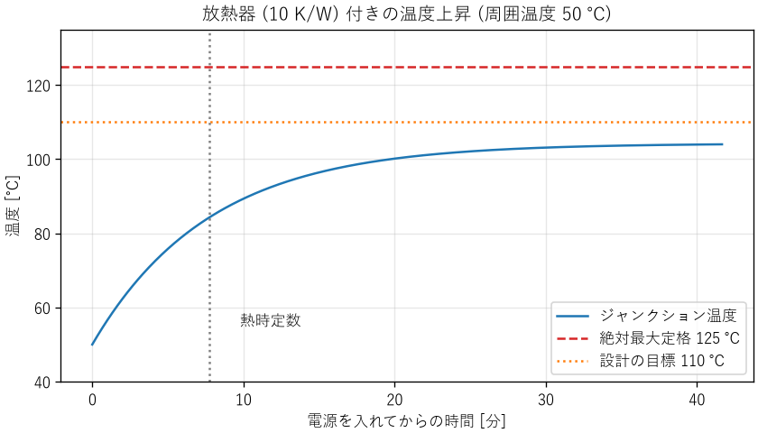

エネルギーと熱
==============

あらゆる機器はエネルギーを使って動き、使ったエネルギーの多くは最終的に熱になります。電池で何時間動くか、部品が熱で壊れないか、データセンターの電力をどれだけ減らせるか。これらはすべて、エネルギーと熱の問題です。本章では、エネルギーと電力の基本、効率、熱の伝わり方、電子機器の熱設計を説明します。

エネルギーと電力
----------------

エネルギーは仕事をする能力で、単位はジュール（J）です。単位時間あたりのエネルギーを仕事率（電気の場合は電力）と呼び、単位はワット（W = J/s）です。エネルギーは電力と時間の積なので、電力量はワット時（Wh）やキロワット時（kWh）でも表します。1 Wh は 3600 J です。

電池の容量は、ミリアンペア時（mAh）で表されることがよくあります。これは電荷の量なので、エネルギーにするには電圧を掛けます。たとえば、3.7 V、3000 mAh の電池のエネルギーは約 11 Wh です。

電気の回路では、電力は電圧と電流の積です。抵抗 :math:`R` に電流 :math:`I` が流れると、次の電力が熱になります（ジュール熱）。

.. math::
   :label: eq-electric-power

   P = VI = I^2 R = \frac{V^2}{R}

ジュール熱は電流の 2 乗に比例します。同じ電力を送るなら、電圧を高くして電流を小さくするほど、電線での損失が減ります。送電線が高電圧を使うのはこのためです。基板の配線やコネクターでも、大きな電流を流す部分では、抵抗による発熱と電圧降下を確かめます。

効率
----

エネルギーは、形を変えても総量は変わりません（エネルギー保存の法則）。しかし、変換のたびに一部が目的以外の形（主に熱）になります。入力に対する、目的の出力の割合を効率と呼びます。

.. math::
   :label: eq-efficiency

   \eta = \frac{P_{\mathrm{out}}}{P_{\mathrm{in}}}, \qquad
   P_{\mathrm{loss}} = P_{\mathrm{in}} - P_{\mathrm{out}} = P_{\mathrm{out}}\left(\frac{1}{\eta} - 1\right)

複数の変換を直列につなぐと、全体の効率は各段の効率の積になります。たとえば、効率 95 % の AC アダプター、90 % の DC-DC コンバーター、85 % のモーターをつなぐと、全体の効率は :math:`0.95 \times 0.90 \times 0.85 \approx 0.73` です。入力の約 27 % が熱になります。

損失の式から分かるように、同じ出力でも、効率が 90 % から 95 % に上がると、損失は約半分になります。高効率の領域では、わずかな効率の改善が、発熱を大きく減らします。

ソフトウェアと消費電力
----------------------

ソフトウェアの作り方も、消費電力を大きく左右します。

CPU の電力
   CMOS の論理回路が状態を切り替えるときの電力（動的電力）は、おおよそ :math:`P \approx \alpha C V^2 f` で表されます。:math:`\alpha` は回路のうち切り替わる割合、:math:`C` は容量、:math:`V` は電源電圧、:math:`f` はクロック周波数です。電圧の 2 乗に比例するため、負荷に応じて電圧と周波数を下げる制御（DVFS）が広く使われています。

間欠動作
   電池で動く IoT 機器は、ほとんどの時間を消費電流の小さいスリープ状態で過ごし、短時間だけ起きて測定と通信を行います。平均の消費電流は、各状態の電流と時間の加重平均です。

   .. math::

      I_{\mathrm{avg}} = \frac{\sum_i I_i t_i}{T}

   たとえば、スリープ中の電流が 5 μA で、60 秒ごとに 50 ms だけ 20 mA で測定と通信をする場合、平均の電流は :math:`5\ \mu\mathrm{A} + 20\ \mathrm{mA} \times 0.05\ \mathrm{s} / 60\ \mathrm{s} \approx 21.7\ \mu\mathrm{A}` です。容量 220 mAh のコイン電池なら、約 :math:`220 / 0.0217 \approx 10\,000` 時間（約 1.2 年）動く計算になります。通信の間隔を 2 倍にするか、通信の時間を半分にするソフトウェアの工夫で、電池の寿命は約 1.6 倍に延びます。実際には、電池の自己放電や低温での容量の低下も考慮します。

データセンター
   サーバーの消費電力の多くは熱になり、それを冷却するためにさらに電力を使います。計算量の小さいアルゴリズム（第 5 章）や、使っていないサーバーを止める運用は、電力の削減に直結します。

熱の伝わり方
------------

熱は、温度の高いところから低いところへ、次の 3 つの仕組みで伝わります。

.. list-table::
   :header-rows: 1
   :widths: 15 45 40

   * - 仕組み
     - 内容
     - 熱の流れ :math:`q` [W]
   * - 伝導
     - 物体の中を、温度の高い側から低い側へ伝わる
     - :math:`q = kA\Delta T / L`\ （:math:`k`: 熱伝導率、:math:`A`: 断面積、:math:`L`: 長さ）
   * - 対流
     - 物体の表面から、流れる空気や液体に伝わる
     - :math:`q = hA\Delta T`\ （:math:`h`: 熱伝達率、:math:`A`: 表面積）
   * - 放射
     - 電磁波（赤外線）として空間に放出される
     - :math:`q = \varepsilon\sigma A (T^4 - T_a^4)`\ （:math:`\varepsilon`: 放射率、:math:`\sigma`: シュテファン・ボルツマン定数）

熱伝導率の目安は、銅が約 400 W/(m·K)、アルミニウムが約 200 W/(m·K)、プリント基板の材料（ガラスエポキシ）が約 0.3 W/(m·K)、空気が約 0.026 W/(m·K) です。空気は非常に熱を伝えにくいため、部品と放熱器の間のわずかな隙間も、大きな熱抵抗になります。この隙間を埋めるのが放熱グリースや放熱シートです。

対流の熱伝達率は、自然対流（空気が自然に動く）で数 W/(m²·K) 〜十数 W/(m²·K) 程度、ファンで風を送る強制対流では数十 W/(m²·K) 以上になります。ファンを付けると放熱の能力が大きく上がるのはこのためです。

熱抵抗
------

伝導の式と対流の式は、どちらも「熱の流れは温度差に比例する」という形をしています。そこで、温度差を熱の流れで割った値を熱抵抗 :math:`R_\theta` [K/W] と定義すると、熱の流れは電気回路と同じように扱えます（第 3 章の類似性）。

.. list-table::
   :header-rows: 1
   :widths: 34 33 33

   * - 熱の量
     - 対応する電気の量
     - 関係式
   * - 温度差 :math:`\Delta T` [K]
     - 電圧 :math:`V` [V]
     - :math:`\Delta T = P R_\theta`
   * - 熱の流れ :math:`P` [W]
     - 電流 :math:`I` [A]
     - :math:`V = I R`
   * - 熱抵抗 :math:`R_\theta` [K/W]
     - 電気抵抗 :math:`R` [Ω]
     -
   * - 熱容量 :math:`C_\theta` [J/K]
     - 静電容量 :math:`C` [F]
     -

半導体の内部で発熱する部分（ジャンクション）から周囲の空気まで、熱はパッケージ、放熱グリース、放熱器を順に通って流れます。これは熱抵抗の直列回路なので、ジャンクションの温度 :math:`T_j` は次の式で求められます。

.. math::
   :label: eq-junction-temperature

   T_j = T_a + P\left(R_{\theta jc} + R_{\theta cs} + R_{\theta sa}\right)

:math:`T_a` は周囲温度、:math:`R_{\theta jc}` はジャンクションとケースの間、:math:`R_{\theta cs}` はケースと放熱器の間、:math:`R_{\theta sa}` は放熱器と周囲の空気の間の熱抵抗です。

例: リニアレギュレーターの熱設計
--------------------------------

:download:`ch08_thermal.py <../examples/ch08_thermal.py>` は、12 V から 5 V を作り、0.5 A を流すリニアレギュレーターの熱設計を計算します。周囲温度は、機器の筐体の中で想定される最高の 50 ℃ とします。ジャンクション温度の絶対最大定格は 125 ℃ ですが、余裕を持たせて 110 ℃ 以下を設計の目標にします（第 9 章の設計余裕）。

.. code-block:: text

   1. リニアレギュレーターの損失: 3.50 W (効率 42%)
      放熱器なし: Tj = 225 ℃ (定格 125 ℃ を超える)
   2. Tj を 110 ℃ 以下にするには、熱抵抗の合計を 17.1 K/W 以下にする必要があります。
      放熱器の熱抵抗: 11.6 K/W 以下
      10 K/W の放熱器を使うと: Tj = 104.2 ℃
   3. 効率 90% のスイッチングレギュレーター: 損失 0.28 W、放熱器なしで Tj = 64 ℃
   4. 熱時定数: 465 s (約 7.8 分)

リニアレギュレーターは、入力と出力の電圧の差に電流を掛けた電力を、すべて熱にします。この例では効率が 42 % しかなく、3.5 W が熱になります。放熱器がなければジャンクション温度は 225 ℃ に達し、部品は壊れます。熱抵抗 11.6 K/W 以下の放熱器を付ければ目標を満たせます。一方、効率 90 % のスイッチングレギュレーターに替えると、損失は 0.28 W になり、放熱器は不要になります。熱の問題は、放熱を強化するだけでなく、発熱そのものを減らす（効率を上げる）ことでも解決できます。

.. literalinclude:: ../examples/ch08_thermal.py
   :language: python
   :start-at: # 2. 必要な放熱器の熱抵抗
   :end-before: # 3. スイッチングレギュレーターの損失
   :lineno-match:

温度の時間変化
^^^^^^^^^^^^^^

部品と放熱器には熱容量があるため、電源を入れても温度はすぐには上がりません。熱容量と熱抵抗の組は、RC 回路と同じ 1 次遅れ系（第 6 章）になり、時定数は :math:`\tau = R_\theta C_\theta` です。この例では約 8 分です（:numref:`fig-thermal`）。

.. _fig-thermal:

   放熱器付きのリニアレギュレーターの温度上昇

このことは、試験の方法に注意が必要であることを示しています。電源を入れて数分後に温度を測っても、まだ最終的な温度に達していません。温度の試験は、温度が十分に落ち着くまで（時定数の 5 倍程度）続けます。逆に、短時間だけ大きな電力を使う場合は、熱容量のおかげで温度上昇が小さく済むこともあります。

熱設計の実務
------------

* **最悪の条件で計算する**: 周囲温度は、部屋の温度ではなく、筐体の中の最高温度を使います。筐体の中は、ほかの部品の発熱で外より 10〜20 ℃ 高くなることがよくあります。
* **温度と寿命**: 電子部品の寿命は温度に強く依存します。アルミ電解コンデンサーの寿命は、温度が 10 ℃ 上がるごとにおよそ半分になります（第 12 章）。定格の範囲内でも、温度を下げるほど信頼性は上がります。
* **温度による保護**: CPU は温度が上がると自動的にクロック周波数を下げます（サーマルスロットリング）。夏に処理が遅くなる、筐体に入れると性能が出ない、といったソフトウェアの性能の問題の原因が、熱であることがあります。
* **測定で確かめる**: 計算は概算にすぎません。試作品で、熱電対やサーモグラフィーを使って実際の温度を測り、計算と比べます。

まとめ
------

* エネルギーは電力と時間の積です。ジュール熱は電流の 2 乗に比例します。
* 変換の効率は各段の効率の積です。高効率の領域では、わずかな効率の改善が損失を大きく減らします。
* ソフトウェアの作り方（間欠動作、計算量、電圧と周波数の制御）が消費電力を大きく左右します。
* 熱は伝導、対流、放射で伝わります。熱抵抗を使うと、熱の流れを電気回路と同じように計算できます。
* 熱設計は最悪の条件で行い、発熱を減らすことと放熱を強化することの両方を検討します。温度は試作品で測定して確かめます。
