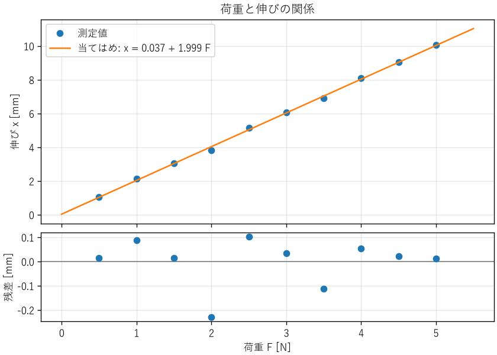

計測と誤差
==========

設計が正しいかどうかは、最終的には測定で確かめます。しかし、どんな測定値にも誤差が含まれます。本章では、誤差の種類、測定結果の確からしさを表す不確かさ、測定データから関係式を求める最小二乗法を説明します。最後に、ソフトウェアの性能測定にも同じ考え方が使えることを示します。

誤差の種類
----------

測定値と真の値（真値）の差を誤差と呼びます。誤差は、性質によって次の 2 つに分けられます。

系統誤差
   同じ条件で測定すると、毎回同じ向き・同じ大きさで現れる誤差です。測定器の校正のずれ、温度の影響、測定方法の偏りなどが原因です。何度測定して平均しても小さくなりません。校正や補正で取り除きます。

偶然誤差
   測定のたびにばらばらに現れる誤差です。電気的な雑音、読み取りのばらつきなどが原因です。測定を繰り返して平均すると小さくなります。

測定の良さは、正確さと精密さの 2 つの観点で評価します。正確さは測定値の平均が真値にどれだけ近いかを表し、系統誤差が小さいほど高くなります。精密さは測定値どうしがどれだけそろっているかを表し、偶然誤差が小さいほど高くなります。精密でも正確とは限らない、という点に注意が必要です。たとえば、目盛りのずれた定規で何度測っても、同じように間違った値がそろって得られます。

これらとは別に、測定器が区別できる最小の変化を分解能と呼びます。デジタルマルチメーターの表示の桁数が多ければ分解能は高くなりますが、正確さが高いとは限りません。正確さは、測定器の特性と校正の状態で決まります。

有効数字
--------

測定値を書くときは、意味のある桁だけを書きます。この桁を有効数字と呼びます。たとえば、最小目盛りが 1 mm の定規で測った長さは「123.4 mm」のように、最小目盛りの 1/10 までを目分量で読みます。「123.4000 mm」と書くと、実際にはない精度を主張することになります。

計算結果の桁数も、入力の有効数字に合わせます。電卓やプログラムが出力した 15 桁の数値をそのまま報告書に書くのは避けます。後で説明する不確かさを求めた場合は、不確かさを 1〜2 桁で表し、測定値の桁をそれに合わせます（例: 100.15 ± 0.22 Ω）。

不確かさ
--------

真値は知ることができないため、誤差そのものも厳密には分かりません。そこで、測定の国際的な指針である GUM（Guide to the Expression of Uncertainty in Measurement）では、測定結果の確からしさを不確かさで表します。不確かさは「真値が存在すると考えられる範囲の広さ」を表す量で、標準偏差の形で表したものを標準不確かさと呼びます。

不確かさの評価方法には、2 つの種類があります。

A タイプの評価
   繰り返し測定したデータの統計から評価します。:math:`n` 回の測定値の標準偏差を :math:`s` とすると、平均値の標準不確かさは :math:`s/\sqrt{n}` です。

B タイプの評価
   統計以外の情報から評価します。測定器の仕様書の精度、校正証明書の値、分解能などを使います。たとえば、仕様書に「±a 以内」とだけ書かれている場合は、その範囲に一様に分布すると考え、標準不確かさを :math:`a/\sqrt{3}` とします。

複数の要因の標準不確かさは、互いに独立であれば 2 乗和の平方根で合成します。合成した標準不確かさに包含係数 :math:`k`\ （通常は :math:`k = 2`）を掛けたものを拡張不確かさと呼び、正規分布を仮定すると、真値が約 95 % の確率でその範囲に入ると解釈できます。

不確かさの伝播
^^^^^^^^^^^^^^

測定値 :math:`x_1, x_2, \ldots` から計算で求める量 :math:`y = f(x_1, x_2, \ldots)` の不確かさは、各測定値の不確かさが互いに独立であれば、次の式で求めます。

.. math::
   :label: eq-propagation

   u(y)^2 = \sum_{i} \left( \frac{\partial f}{\partial x_i} \right)^2 u(x_i)^2

積や商の形の式では、相対不確かさ（不確かさを値で割ったもの）で考えると簡単になります。:math:`y = x_1^{a} x_2^{b}` の場合、:eq:`eq-propagation` から次の関係が得られます。

.. math::
   :label: eq-relative-uncertainty

   \left( \frac{u(y)}{y} \right)^2 = a^2 \left( \frac{u(x_1)}{x_1} \right)^2 + b^2 \left( \frac{u(x_2)}{x_2} \right)^2

例として、電圧 :math:`V` と電流 :math:`I` を測定して抵抗 :math:`R = V/I` を求める場合を考えます。電圧の相対不確かさが 0.3 %、電流の相対不確かさが 0.4 % なら、抵抗の相対不確かさは :math:`\sqrt{0.3^2 + 0.4^2} = 0.5` % です。

この式から、次の 2 つの実用的な教訓が得られます。

* 指数の大きい量の不確かさは、結果に大きく効きます。たとえば、円の面積 :math:`\pi r^2` では、半径の相対不確かさが 2 倍になって効きます。精度を上げたい場合は、指数の大きい量の測定に力を入れます。
* 不確かさの大きい要因が 1 つあると、ほかの要因をいくら改善しても全体はほとんど改善しません。2 乗和では大きい項が支配的になるためです。改善する前に、どの要因が支配的かを確かめます。

最小二乗法
----------

測定データから、量の間の関係式を求めたいことがよくあります。たとえば、ばねに荷重 :math:`F` をかけたときの伸び :math:`x` を測定し、直線 :math:`x = a + bF` を当てはめて、ばね定数を求める場合です。

最小二乗法は、測定値と直線の差（残差）の 2 乗の和が最小になるように、係数を決める方法です。:math:`n` 組のデータ :math:`(x_i, y_i)` に直線 :math:`y = a + bx` を当てはめる場合、係数は次の式で求められます。ここで :math:`\bar{x}, \bar{y}` はそれぞれの平均です。

.. math::
   :label: eq-least-squares

   \begin{aligned}
   b &= \frac{S_{xy}}{S_{xx}}, & a &= \bar{y} - b\bar{x}, \\
   S_{xx} &= \sum_i (x_i - \bar{x})^2, & S_{xy} &= \sum_i (x_i - \bar{x})(y_i - \bar{y})
   \end{aligned}

係数の標準不確かさは、残差の標準偏差 :math:`s` を使って、次のように求められます。:math:`s` の計算で :math:`n - 2` で割るのは、データから 2 つの係数を決めたため、自由度が 2 つ減るからです。

.. math::
   :label: eq-least-squares-uncertainty

   \begin{aligned}
   s &= \sqrt{\frac{\sum_i \left(y_i - a - bx_i\right)^2}{n - 2}} \\
   u(b) &= \frac{s}{\sqrt{S_{xx}}}, \qquad
   u(a) = s\sqrt{\frac{1}{n} + \frac{\bar{x}^2}{S_{xx}}}
   \end{aligned}

:download:`ch04_least_squares.py <../examples/ch04_least_squares.py>` は、ばね定数 0.5 N/mm のばねを想定した模擬データに直線を当てはめます。:eq:`eq-least-squares` と\ :eq:`eq-least-squares-uncertainty` は、次の関数で計算しています。

.. literalinclude:: ../examples/ch04_least_squares.py
   :language: python
   :pyobject: fit_line
   :lineno-match:

実行すると、次の結果が得られます。

.. code-block:: text

   切片 a = 0.037 ± 0.072 mm
   傾き b = 1.9990 ± 0.0232 mm/N
   残差の標準偏差 s = 0.106 mm
   ばね定数 k = 0.5003 ± 0.0058 N/mm (模擬データの真値 0.5 N/mm)

ばね定数 :math:`k = 1/b` の相対不確かさは、:eq:`eq-relative-uncertainty` で指数が :math:`-1` の場合にあたるため、:math:`b` の相対不確かさと同じです。

.. _fig-least-squares:

   最小二乗法による直線の当てはめと残差

:numref:`fig-least-squares` の下段のように、残差は必ず図にして確かめます。残差が 0 のまわりにランダムに散らばっていれば、直線のモデルは妥当です。残差に曲線状の傾向があれば、関係が直線ではない（ばねが非線形の領域に入っているなど）可能性があります。決定係数 :math:`R^2` が 1 に近くても、モデルが正しいとは限りません。

測定の実務
----------

ハードウェアの測定では、次の点に注意します。

* **校正**: 測定器は、トレーサビリティ（国家標準までたどれる校正の連鎖）が確保された基準で定期的に校正します。
* **測定器が対象に与える影響**: 電圧計の入力抵抗が回路に電流を流す、熱電対が対象から熱を奪うなど、測定器をつなぐことで対象の状態が変わることがあります。測定器の影響が十分に小さいことを確かめます。
* **環境条件**: 温度、湿度、電源電圧、電磁的な雑音など、結果に影響する条件を記録します。
* **ゼロ点と範囲**: 入力がゼロのときの指示値（オフセット）と、測定範囲の両端での誤差を確かめます。

ソフトウェアの性能測定
----------------------

処理時間やスループットの測定も、計測の一種です。同じプログラムでも、実行のたびに処理時間はばらつきます。OS のスケジューリング、CPU のクロック周波数の変化、キャッシュの状態、ガベージコレクションなどが原因です。

:download:`ch04_benchmark.py <../examples/ch04_benchmark.py>` は、20 万個の数値の並べ替えにかかる時間を 30 回測定し、ばらつきを要約します。測定には、単調増加で分解能の高い ``time.perf_counter`` 関数を使います。

.. literalinclude:: ../examples/ch04_benchmark.py
   :language: python
   :pyobject: measure
   :lineno-match:

実行結果の一例を次に示します。結果は実行する環境によって変わります。

.. code-block:: text

   最初の 3 回の測定値 [ms]: 72.544, 45.992, 51.684
   全測定値の要約:
     回数      : 30
     最小値    :   42.651 ms
     第 1 四分位:   45.646 ms
     中央値    :   47.425 ms
     平均値    :   48.178 ms
     第 3 四分位:   49.021 ms
     最大値    :   72.544 ms
     標準偏差  :    5.183 ms
   中央値の 1.5 倍を超えた測定値: 1 個

この結果から、次のことが分かります。

* 最初の 1 回は、ほかより 5 割ほど遅くなっています。メモリの確保やキャッシュへの読み込みなどが原因と考えられます。このような立ち上がりの影響を除くため、本番の測定の前に数回実行しておく（ウォームアップ）ことがあります。
* 最大値は外れ値に引きずられるため、平均値は中央値より大きくなっています。処理時間の分布は右に裾が長くなることが多いため、代表値には中央値を使うのが一般的です。
* 「処理の速さそのもの」を比べたい場合は最小値が、「利用者が体感する遅さ」を評価したい場合は 95 パーセンタイル値や 99 パーセンタイル値などの上位の値が、適した指標になります。

性能を比較するときは、ハードウェアの測定と同様に、測定条件（CPU、メモリ、OS、言語処理系のバージョン、ほかに動いていた処理）を記録します。また、比較する 2 つの測定は、同じ条件で交互に行うと、時間とともに変わる条件の影響を減らせます。2 つの測定結果の差が偶然のばらつきで説明できるかどうかを判断する方法は、第 11 章で説明します。

まとめ
------

* 誤差には、繰り返しても減らない系統誤差と、平均すると減る偶然誤差があります。精密さと正確さは別のものです。
* 測定結果の確からしさは不確かさで表します。計算で求める量の不確かさは、伝播の式で求めます。
* 最小二乗法で関係式を求めたら、係数の不確かさと残差を確かめます。
* ソフトウェアの性能測定も計測の一種です。繰り返し測定し、目的に合った代表値を選び、測定条件を記録します。
