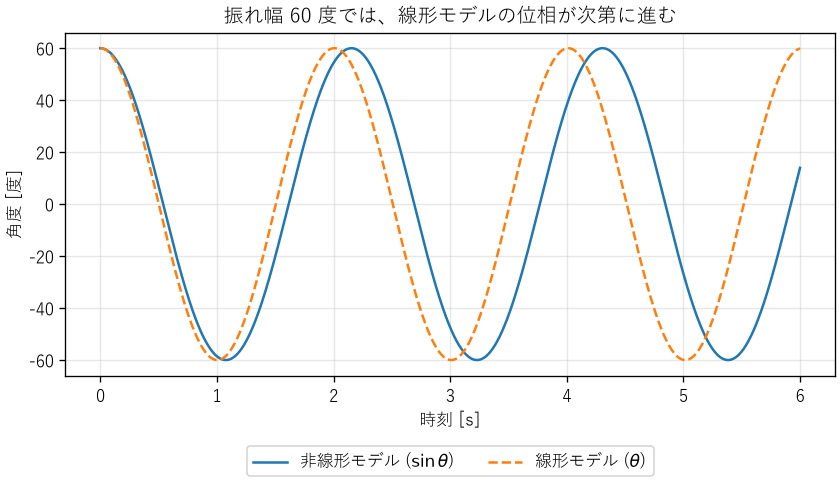
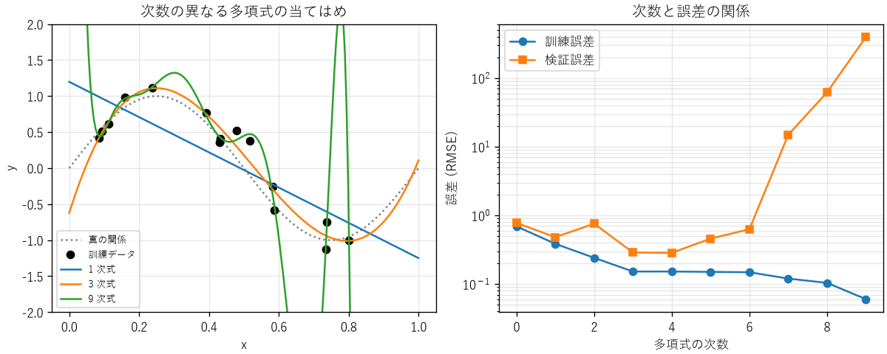

モデル化と近似
==============

エンジニアは、作る前に振る舞いを予測するために、対象を単純化したモデルを使います。本章では、モデルの種類、近似の方法、モデルの適用範囲の考え方を説明します。

モデルとは何か
--------------

モデルとは、対象の本質的な性質だけを取り出し、それ以外を省略した表現です。地図が土地のすべてを描かずに、目的に必要な道や建物だけを描くのと同じです。工学では、対象の振る舞いを数式で表した数理モデルを主に使います。

統計学者ジョージ・ボックスは「すべてのモデルは間違っているが、役に立つものもある」と述べました。モデルは必ず何かを省略しているので、現実と完全には一致しません。大切なのは、目的に対して十分に正確かどうかです。

モデルは、作り方によって次の 3 種類に分けられます。

.. list-table::
   :header-rows: 1
   :widths: 20 40 40

   * - 種類
     - 作り方
     - 長所と短所
   * - 物理モデル
     - 物理法則（運動方程式、回路の法則など）から式を導く
     - 適用範囲の外でもある程度信頼できる。導出に専門知識が必要
   * - 経験モデル
     - 測定データに簡単な式を当てはめる
     - 作るのが簡単。データの範囲の外では信頼できない
   * - データ駆動モデル
     - 大量のデータから機械学習などで関係を学習する
     - 複雑な関係を表せる。根拠の説明が難しく、データの範囲の外では予測が保証されない

実際には、物理モデルの未知のパラメーターを測定データから決める、というように、これらを組み合わせて使うことがよくあります。

モデル化の手順
--------------

モデル化は、おおむね次の手順で進めます。

1. **目的を決める**: 何を予測したいのか、どの程度の精度が必要なのかを決めます。目的によって、同じ対象でも適したモデルが変わります。
2. **仮定を置く**: 無視する現象を決め、明記します（例: 空気抵抗を無視する、温度は一様とみなす）。
3. **式を立てる**: 物理法則や測定データから、入力と出力の関係を式にします。
4. **解く**: 式を解析的に、または数値計算で解きます。
5. **検証する**: 実験データや、より詳しいモデルの結果と比べ、目的の精度を満たすかを確かめます。満たさなければ、仮定を見直します。

手順 2 の仮定は、モデルの適用範囲を決めるものです。仮定を書き残しておかないと、後でモデルを使う人が、適用範囲の外で使ってしまう危険があります。

線形化
------

多くの物理現象は非線形ですが、非線形の式は解析が難しくなります。そこで、注目する動作点の近くで、関数を 1 次式で近似する線形化がよく使われます。関数 :math:`f(x)` を点 :math:`x_0` のまわりでテイラー展開すると、次のようになります。

.. math::
   :label: eq-taylor

   f(x) = f(x_0) + f'(x_0)(x - x_0) + \frac{f''(x_0)}{2}(x - x_0)^2 + \cdots

:math:`x` が :math:`x_0` に十分近ければ 2 次以降の項は小さいので、最初の 2 項で近似できます。代表的な近似を次に示します（:math:`x` は 0 に近いとします）。

.. list-table::
   :header-rows: 1
   :widths: 40 60

   * - 近似式
     - 使われる場面の例
   * - :math:`\sin x \approx x`
     - 振り子、小さな角度の光学
   * - :math:`\cos x \approx 1 - x^2/2`
     - 傾きによる長さの変化
   * - :math:`(1 + x)^n \approx 1 + nx`
     - 根号や逆数を含む式の近似（例: :math:`1/(1+x) \approx 1 - x`）
   * - :math:`e^{x} \approx 1 + x`
     - 小さな成長率の複利計算
   * - :math:`\ln(1 + x) \approx x`
     - 相対変化の計算

例: 振り子
^^^^^^^^^^

長さ :math:`L` の糸の先におもりを付けた振り子の運動方程式は、糸と鉛直線のなす角を :math:`\theta` とすると、次のようになります。

.. math::
   :label: eq-pendulum

   \frac{d^2\theta}{dt^2} = -\frac{g}{L}\sin\theta

:math:`\sin\theta` を含むため、この式は非線形で、初等関数では解けません。振れ幅が小さいときは :math:`\sin\theta \approx \theta` と近似でき、次の線形の式になります。

.. math::
   :label: eq-pendulum-linear

   \frac{d^2\theta}{dt^2} = -\frac{g}{L}\theta

この式の解は :math:`\theta(t) = \theta_0 \cos(\omega_0 t)`、ただし :math:`\omega_0 = \sqrt{g/L}` で、周期は :math:`T_0 = 2\pi\sqrt{L/g}` です。第 2 章の次元解析で決まらなかった定数は :math:`2\pi` でした。線形モデルでは、周期は振れ幅によりません。

では、振れ幅がどこまで大きくなると、この近似が使えなくなるのでしょうか。:download:`ch03_pendulum.py <../examples/ch03_pendulum.py>` は、長さ 1 m の振り子について、厳密な周期と線形モデルの周期を比べます。

.. code-block:: text

   振れ幅[°]  厳密な周期[s]  線形モデル[s]  誤差[%]
          5         2.0074         2.0064    -0.05
         10         2.0102         2.0064    -0.19
         20         2.0218         2.0064    -0.76
         30         2.0413         2.0064    -1.71
         45         2.0866         2.0064    -3.84
         60         2.1532         2.0064    -6.82
         90         2.3682         2.0064   -15.28

振れ幅 10° までなら誤差は 0.2 % 未満で、多くの目的に十分です。60° では誤差が約 7 % になり、:numref:`fig-pendulum` のように、線形モデルの波形は時間とともに実際の波形からずれていきます。

.. _fig-pendulum:

   振れ幅 60° の振り子（非線形モデルと線形モデルの比較）

厳密な周期は、サンプルコードの ``exact_period`` 関数で計算しています。厳密な周期は第 1 種完全楕円積分で表され、算術幾何平均（AGM）を使うと少ない計算で正確に求められます。

.. literalinclude:: ../examples/ch03_pendulum.py
   :language: python
   :pyobject: exact_period
   :lineno-match:

このように、近似を使うときは、どの範囲で誤差がどの程度になるかを確かめ、適用範囲として明記します。

類似性（アナロジー）
--------------------

異なる分野の現象が、同じ形の微分方程式で表されることがあります。たとえば、ばね・質量・ダンパーからなる機械系と、抵抗・コイル・コンデンサーからなる電気回路は、次のように同じ形の式になります。

.. math::
   :label: eq-analogy

   \begin{aligned}
   m\frac{d^2x}{dt^2} + c\frac{dx}{dt} + kx &= F(t) && \text{（機械系）} \\
   L\frac{d^2q}{dt^2} + R\frac{dq}{dt} + \frac{1}{C}q &= V(t) && \text{（電気系）}
   \end{aligned}

.. list-table::
   :header-rows: 1
   :widths: 30 35 35

   * - 役割
     - 機械系
     - 電気系
   * - 状態を表す量
     - 変位 :math:`x`
     - 電荷 :math:`q`
   * - 変化の速さ
     - 速度 :math:`dx/dt`
     - 電流 :math:`i = dq/dt`
   * - 慣性（変化を妨げる）
     - 質量 :math:`m`
     - インダクタンス :math:`L`
   * - エネルギーの散逸
     - 減衰係数 :math:`c`
     - 抵抗 :math:`R`
   * - エネルギーの蓄積
     - ばね定数 :math:`k`
     - 静電容量の逆数 :math:`1/C`
   * - 外から加えるもの
     - 力 :math:`F`
     - 電圧 :math:`V`

同じ形の式は同じ振る舞いをするので、一方の分野で得た知識を他方に使えます。熱の流れ（温度差・熱抵抗・熱容量）や流体の流れ（圧力差・管路抵抗）にも、同様の対応があります。たとえば、電子部品の発熱と温度上昇は、電気回路の RC 回路と同じ 1 次遅れの式で表せます（第 6 章）。

ソフトウェアのモデル: 待ち行列
------------------------------

モデル化は物理現象だけのものではありません。サーバーの応答時間のように、ソフトウェアシステムの性能もモデルで予測できます。

リクエストが平均到着率 :math:`\lambda` [件/s] でランダムに到着し、1 台のサーバーが平均処理率 :math:`\mu` [件/s] で処理する系を考えます。到着の間隔と処理時間がどちらも指数分布（付録の\ :doc:`math`\ を参照）に従う場合（M/M/1 待ち行列）、サーバーの利用率 :math:`\rho` と、リクエストがシステムに滞在する平均時間 :math:`W` は次のようになります。

.. math::
   :label: eq-mm1

   \rho = \frac{\lambda}{\mu}, \qquad W = \frac{1}{\mu - \lambda} = \frac{1/\mu}{1 - \rho} \quad (\rho < 1)

平均処理時間 :math:`1/\mu` が 10 ms のサーバーで、利用率と平均滞在時間の関係を計算すると、次のようになります。

.. list-table::
   :header-rows: 1
   :widths: 30 35 35

   * - 利用率 :math:`\rho`
     - 平均滞在時間 :math:`W`
     - 処理時間に対する倍率
   * - 0.5
     - 20 ms
     - 2 倍
   * - 0.8
     - 50 ms
     - 5 倍
   * - 0.9
     - 100 ms
     - 10 倍
   * - 0.99
     - 1000 ms
     - 100 倍

利用率が 1 に近づくと、待ち時間は急激に長くなります。「CPU 使用率が 90 % なら、まだ 10 % の余裕がある」とは言えないことが、このモデルから分かります。

もう 1 つ、待ち行列の基本的な関係にリトルの法則があります。系が定常状態にあるとき、系の中にいる平均の件数 :math:`L`、平均到着率 :math:`\lambda`、平均滞在時間 :math:`W` の間には、到着や処理の分布によらず次の関係が成り立ちます。

.. math::
   :label: eq-little

   L = \lambda W

たとえば、毎秒 200 件のリクエストが平均 50 ms ずつ滞在するなら、システムの中には平均 :math:`200 \times 0.05 = 10` 件のリクエストがあります。同時に処理できる件数（スレッド数や接続数）の上限を決めるときに使えます。

状態機械
--------

ここまでのモデルは、連続的に変化する量を扱うものでした。一方、機器の動作モードや通信の手順のように、「待機」「加熱」「異常」といった区別できる状態の間を、イベントをきっかけに移り変わる対象もあります。このような振る舞いは、状態機械（有限状態機械）でモデル化します。状態機械は、組込みソフトウェアの設計で最もよく使われるモデルの 1 つで、通信プロトコルや業務システムの画面遷移にも使われます。

状態機械は、次の要素で表します。

.. list-table::
   :header-rows: 1
   :widths: 25 75

   * - 要素
     - 意味
   * - 状態
     - システムがとりうる区別された状況（待機、加熱、保温、異常など）
   * - イベント
     - 状態を変えるきっかけ（ボタンが押された、センサーが沸騰を検出した、など）
   * - 遷移
     - ある状態で、あるイベントが起きたときに移る先の状態
   * - 動作
     - 各状態で行うこと、または遷移のときに行うこと（ヒーターの通電など）

:download:`ch03_state_machine.py <../examples/ch03_state_machine.py>` は、電気ポットの制御を状態機械で表したものです。状態とイベントの組から次の状態を決める表（状態遷移表）を、辞書で表しています。

.. literalinclude:: ../examples/ch03_state_machine.py
   :language: python
   :start-at: # 状態遷移表
   :end-before: class InvalidTransition
   :lineno-match:

コントローラーは、表にない組み合わせのイベントを受け取ると、例外を送出して拒否します。実行すると、次のように状態が移り変わります。

.. code-block:: text

   状態遷移表の性質を確認しました。
   待機  --[沸騰ボタン]--> 加熱   ヒーター ON
   加熱  --[沸騰を検出]--> 保温   ヒーター OFF
   保温  --[設定温度を下回った]--> 加熱   ヒーター ON
   加熱  --[沸騰を検出]--> 保温   ヒーター OFF
   保温  --[空だきを検出]--> 異常   ヒーター OFF
   拒否: 状態「異常」ではイベント「沸騰ボタン」を受け付けません
   異常  --[リセット]--> 待機   ヒーター OFF

状態機械でモデル化すると、次の利点があります。

* **漏れを見つけやすい**: すべての状態とイベントの組み合わせを表にすると、「加熱中にふたが開いたらどうするか」のような、考え漏れていた組み合わせに気付けます。
* **想定外の入力を確実に扱える**: 表にない組み合わせを一律に拒否すれば、想定していない順序でイベントが来ても、システムがおかしな状態に入りません。
* **性質を機械的に確かめられる**: 「異常の状態から抜けられるのはリセットだけ」「空だきを検出したら、どの状態からでも異常に移る」といった安全上の性質を、表を調べるだけで確かめられます。サンプルコードの ``check_properties`` 関数がその例です。

``if`` 文を積み重ねて状態を管理するプログラムは、状態が増えると、どの条件でどこに移るのかが分かりにくくなります。状態遷移表を明示的に持つ設計は、状態遷移試験（第 12 章）とも対応付けやすくなります。

データ駆動モデルの検証
----------------------

データ駆動モデル（経験モデルを含む）は、作るときに使ったデータによく合うように調整されます。そのため、手元のデータへの当てはまりの良さだけでは、モデルの良し悪しは判断できません。

過学習
^^^^^^

:download:`ch03_overfitting.py <../examples/ch03_overfitting.py>` は、真の関係が :math:`y = \sin 2\pi x` で、雑音を含む 15 点の模擬データに、次数の異なる多項式を当てはめます。当てはめに使ったデータ（訓練データ）での誤差と、当てはめに使っていない 200 点のデータ（検証データ）での誤差を比べた結果を次に示します。

.. code-block:: text

   次数  訓練誤差  検証誤差  5 分割交差検証
      0     0.691     0.777           0.707
      1     0.385     0.481           0.443
      2     0.241     0.756           0.311
      3     0.152     0.288           0.191
      4     0.152     0.284           0.226
      5     0.150     0.459           0.363
      6     0.148     0.628           1.264
      7     0.120    14.887           2.727
      8     0.104    61.921           3.445
      9     0.060   394.778           3.676
   交差検証で選んだ次数: 3

.. _fig-overfitting:

   多項式の次数と当てはめの様子（左）、誤差（右）

訓練誤差は、次数を上げるほど小さくなります。しかし検証誤差は、次数 3〜4 で最小になった後、急激に大きくなります。:numref:`fig-overfitting` の左の 9 次式は、訓練データの点の近くを通るように大きく曲がり、点のない場所では真の関係から大きく外れています。このように、モデルが雑音まで覚えてしまい、新しいデータでの予測が悪くなる現象を過学習と呼びます。

訓練データと検証データ
^^^^^^^^^^^^^^^^^^^^^^

過学習を見抜くには、モデルを作るのに使わなかったデータで、予測の誤差を評価します。手元のデータを、モデルを作るための訓練データと、性能を評価するための検証データに分けるのが基本です。最終的な性能を報告するときは、モデルの選択にも使っていない、さらに別のデータ（テストデータ）で評価します。

データが少なく、検証用に分ける余裕がない場合は、交差検証を使います。:math:`k` 分割交差検証では、データを :math:`k` 個のグループに分け、1 つを検証用、残りを訓練用にして評価することを、検証用のグループを替えながら :math:`k` 回繰り返し、誤差を平均します。上の例では、訓練データの 15 点だけを使った 5 分割交差検証で次数 3 が選ばれ、検証データでの評価とほぼ同じ結論が得られています。

.. literalinclude:: ../examples/ch03_overfitting.py
   :language: python
   :pyobject: cross_validation
   :lineno-match:

データ駆動モデルを使うときの注意
^^^^^^^^^^^^^^^^^^^^^^^^^^^^^^^^

* **データの漏れ**: 検証データの情報が、何らかの形で訓練に入り込むと、評価が実際より良くなります。たとえば、時系列データをランダムに分けると、未来のデータで過去を予測することになります。時系列データは、時刻で区切って分けます。
* **分布の変化**: 製品の仕様変更、季節、センサーの交換などで、使うときのデータの性質が、訓練データと変わることがあります。運用中も予測の誤差を監視します。
* **外挿**: 上の例の検証誤差が大きく悪化したのは、訓練データの点のない範囲（:math:`x` が 0.8 以上など）での予測が外れたためです。データ駆動モデルは、訓練データの範囲の外では信頼できません。
* **単純なモデルとの比較**: 複雑なモデルを使う前に、平均値や線形モデルなどの単純なモデルの性能を確かめます。複雑なモデルがそれを大きく上回らなければ、説明しやすい単純なモデルを選びます。

モデルの妥当性を確かめる
------------------------

モデルを使う前には、次の点を確かめます。

* **仮定は成り立っているか**: M/M/1 モデルは到着がランダムであることを仮定しています。バッチ処理のように一斉にリクエストが来る場合、待ち時間はモデルの予測より長くなります。
* **パラメーターは正しいか**: モデルが正しくても、入力するパラメーターが間違っていれば結果は役に立ちません。パラメーターは測定で確かめます。
* **実測と合うか**: モデルの予測を実測と比べ、差が目的に対して許容できるかを確かめます。
* **適用範囲の内側か**: 経験モデルやデータ駆動モデルは、作るときに使ったデータの範囲の外では信頼できません。

まとめ
------

* モデルは対象の本質だけを取り出した表現で、必ず何かを省略しています。目的に対して十分に正確かどうかが大切です。
* モデルを作るときは、仮定と適用範囲を明記します。
* 線形化は解析を簡単にしますが、近似の誤差を確かめてから使います。
* 機械系・電気系・熱系には同じ形の式で表せる類似性があり、分野を越えて知識を使えます。
* ソフトウェアの性能も、待ち行列モデルやリトルの法則で予測できます。
* 状態の間を移り変わる対象は状態機械でモデル化し、状態遷移表で漏れと想定外の入力を扱います。
* データ駆動モデルは、作るときに使わなかったデータで評価し、過学習を見抜きます。
