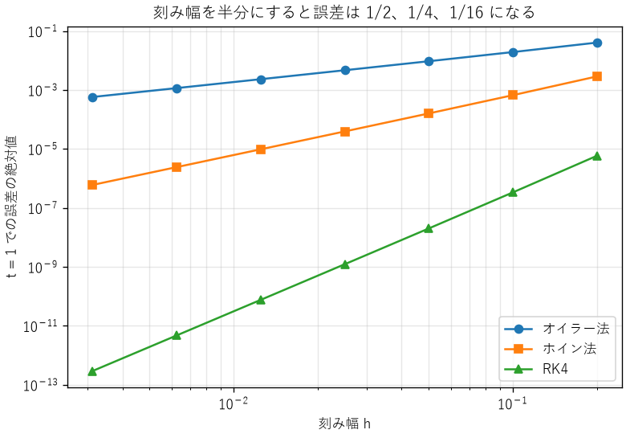
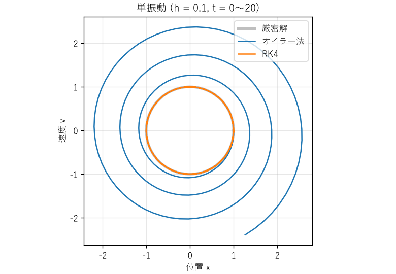

数値計算の基礎
==============

現代の工学では、設計の計算やシミュレーションの多くをコンピューターで行います。しかし、コンピューターは実数を有限の桁数でしか表せないため、計算結果には誤差が入り込みます。本章では、数値の表現に起因する誤差と、微分・積分・微分方程式を数値的に解く方法の誤差を説明します。

浮動小数点数
------------

多くのプログラミング言語では、実数を IEEE 754 規格の浮動小数点数で表します。浮動小数点数は、符号、指数、仮数の組で数を表します。Python の ``float`` 型は倍精度（64 ビット）です。

.. list-table::
   :header-rows: 1
   :widths: 30 35 35

   * - 項目
     - 単精度（32 ビット）
     - 倍精度（64 ビット）
   * - 符号・指数・仮数のビット数
     - 1・8・23
     - 1・11・52
   * - 10 進数での有効桁数
     - 約 7 桁
     - 約 16 桁
   * - 正の正規化数の範囲
     - 約 :math:`1.2 \times 10^{-38}` 〜 :math:`3.4 \times 10^{38}`
     - 約 :math:`2.2 \times 10^{-308}` 〜 :math:`1.8 \times 10^{308}`
   * - 計算機イプシロン
     - 約 :math:`1.2 \times 10^{-7}`
     - 約 :math:`2.2 \times 10^{-16}`

計算機イプシロンは、1 と、1 の次に大きい表現可能な数との差です。浮動小数点数の計算では、1 回の演算ごとに、結果に計算機イプシロンの半分程度の相対誤差（丸め誤差）が生じます。単精度は、マイコンや GPU で計算を速くするために使われますが、有効桁数が約 7 桁しかないことに注意が必要です。

浮動小数点数の落とし穴
----------------------

:download:`ch05_float.py <../examples/ch05_float.py>` は、浮動小数点数で起きる代表的な現象を確かめます。実行結果を次に示します。

.. code-block:: text

   1. 0.1 の表現
      0.1 + 0.2 == 0.3       -> False
      0.1 + 0.2              -> 0.30000000000000004
      0.1 の内部の値          -> 0.1000000000000000055511151231257827021181583404541015625
      math.isclose(0.1 + 0.2, 0.3) -> True
      計算機イプシロン        -> 2.220446049250313e-16
   2. 情報落ち
      (1e16 + 1) - 1e16       -> 0.0
      (1e16 - 1e16) + 1       -> 1.0
   3. 桁落ち (x^2 + 1e8 x + 1 = 0 の解)
      解の公式そのまま -> 小さい解 = -7.450580596923828e-09
      桁落ちを避けた式 -> 小さい解 = -1e-08
      (真の値は約 -1.00000000000000e-08)
   4. 足す順番と合計
      0.1 を 10 回足す        -> 0.9999999999999999
      math.fsum で足す        -> 1.0
      [1e16, 1, -1e16, 1] の和 -> 1.0
      絶対値の小さい順に足す  -> 2.0
      math.fsum で足す        -> 2.0
   5. 整数の桁あふれ (16 ビット符号付き整数)
      30000 + 30000 (Python の int) -> 60000
      30000 + 30000 (np.int16)      -> -5536

10 進数を正確に表せない
^^^^^^^^^^^^^^^^^^^^^^^

10 進数の 0.1 は、2 進数では :math:`0.0001100110011\ldots` と無限に続くため、浮動小数点数では正確に表せません。そのため、``0.1 + 0.2 == 0.3`` は偽になります。浮動小数点数どうしを ``==`` で比べるのは避け、``math.isclose`` 関数のように、許容誤差を指定して比べます。

金額のように 10 進数で正確に計算する必要がある場合は、整数（円や銭の単位）で扱うか、``decimal`` モジュールを使います。

情報落ち
^^^^^^^^

大きさの大きく異なる数を足すと、小さい数の情報が失われます。倍精度の有効桁数は約 16 桁なので、:math:`10^{16}` に 1 を足しても、結果は :math:`10^{16}` のままです。小さい値を何度も足していく計算（時刻の積算、積分など）では、この現象で誤差が蓄積します。

桁落ち
^^^^^^

値の近い 2 つの数を引くと、上位の桁が打ち消し合い、有効数字が大きく減ります。2 次方程式 :math:`ax^2 + bx + c = 0` の解の公式で、:math:`b^2 \gg 4ac` の場合、:math:`-b + \sqrt{b^2 - 4ac}` の計算で桁落ちが起きます。実行結果では、真の値 :math:`-1 \times 10^{-8}` に対し、解の公式をそのまま使うと約 25 % もずれた値になりました。

桁落ちは、式を変形して避けます。この例では、絶対値の大きい解 :math:`x_1` を先に求め、もう一方の解を解と係数の関係 :math:`x_1 x_2 = c/a` から求めます。

.. literalinclude:: ../examples/ch05_float.py
   :language: python
   :pyobject: quadratic_roots_stable
   :lineno-match:

足す順番
^^^^^^^^

浮動小数点数の足し算では、結合法則 :math:`(a + b) + c = a + (b + c)` が成り立ちません。多くの数を足すときは、絶対値の小さい順に足す、誤差を補正しながら足す（``math.fsum`` 関数やカハンの加算アルゴリズム）といった工夫で誤差を減らせます。なお、Python 3.12 以降の組み込み関数 ``sum`` は、浮動小数点数を誤差を補正しながら足します。サンプルコードでは、多くの言語の単純なループと同じ結果になるように、1 つずつ足す関数を使っています。

事例: パトリオットミサイル
^^^^^^^^^^^^^^^^^^^^^^^^^^

1991 年の湾岸戦争で、サウジアラビアのダーランに配備された迎撃ミサイル「パトリオット」のシステムが、飛来したスカッドミサイルの迎撃に失敗し、28 名の兵士が亡くなりました。このシステムは、時刻を 0.1 秒単位の整数で数え、それに 0.1 を掛けて秒に変換していました。ところが 0.1 は 2 進数で正確に表せないため、24 ビットの固定小数点数で表した 0.1 には、約 :math:`9.5 \times 10^{-8}` の切り捨て誤差がありました。

システムは約 100 時間連続で稼働していたため、誤差は :math:`100 \times 3600 \times 10 \times 9.5 \times 10^{-8} \approx 0.34` 秒に蓄積していました。スカッドミサイルは秒速約 1.7 km で飛ぶため、0.34 秒の時刻のずれは、目標の位置の予測で 500 m 以上のずれになり、システムは目標を見失いました。

1 回の誤差は極めて小さくても、長時間の積算で無視できない大きさになります。この問題は事前に把握されており、システムを定期的に再起動すれば避けられることも分かっていました。設計時に想定した運用時間（再起動の間隔）を、運用者に正しく伝えることも、工学の重要な一部です。

整数の桁あふれ
--------------

整数にも落とし穴があります。Python の ``int`` 型は桁数に上限がありませんが、C 言語や NumPy の整数は 8、16、32、64 ビットのように幅が決まっています。16 ビット符号付き整数で表せる範囲は :math:`-32768` 〜 :math:`32767` で、これを超えると多くの場合、例外にならずに値が折り返します。上の実行結果の 5 では、NumPy の 16 ビット整数で 30000 + 30000 を計算すると、−5536 になりました。

.. literalinclude:: ../examples/ch05_float.py
   :language: python
   :pyobject: overflow
   :lineno-match:

事例: アリアン 5
^^^^^^^^^^^^^^^^

1996 年、欧州のロケット「アリアン 5」の初号機は、打ち上げから約 40 秒後に軌道を外れ、自壊しました。原因は、慣性基準装置のソフトウェアで、64 ビットの浮動小数点数で表した水平方向の速度に関係する値を、16 ビットの符号付き整数に変換する処理が桁あふれを起こしたことでした。

このソフトウェアは、先代のアリアン 4 から流用したものでした。アリアン 4 の飛行条件ではこの値が 16 ビットの範囲に収まることが確かめられていたため、変換の範囲検査は省略されていました。しかし、アリアン 5 は水平方向の加速が大きく、値が範囲を超えました。予備の慣性基準装置も同じソフトウェアで動いていたため、同じ原因で直前に停止していました。さらに、問題を起こした処理は、打ち上げ後には不要な機能でした。

この事例から、次の教訓が得られます。

* 流用するソフトウェアや部品は、新しい使用条件で前提が成り立つかを確かめ直します。
* 同じ設計の装置を二重にしても、設計の誤りには効果がありません（第 13 章）。
* 不要な機能は動かさないようにします。

数値微分
--------

関数の微分を数値的に求めるには、微分の定義に従って、小さな刻み幅 :math:`h` で差分をとります。

.. math::
   :label: eq-finite-difference

   \begin{aligned}
   f'(x) &\approx \frac{f(x + h) - f(x)}{h} && \text{（前進差分）} \\
   f'(x) &\approx \frac{f(x + h) - f(x - h)}{2h} && \text{（中心差分）}
   \end{aligned}

テイラー展開（:eq:`eq-taylor`）を使うと、前進差分の誤差は :math:`h` に比例し、中心差分の誤差は :math:`h^2` に比例することが分かります。この誤差を打ち切り誤差と呼びます。

では、:math:`h` は小さいほど良いのでしょうか。:download:`ch05_derivative.py <../examples/ch05_derivative.py>` で、:math:`\sin x` の :math:`x = 1` での微分を計算すると、次の結果になります。

.. code-block:: text

   1. sin x の x = 1 での微分の誤差
      刻み幅 h   前進差分    中心差分
         1e-01    4.29e-02    9.00e-04
         1e-03    4.21e-04    9.01e-08
         1e-05    4.21e-06    1.11e-11
         1e-07    4.18e-08    1.94e-10
         1e-09    5.25e-08    2.97e-09
         1e-11    1.17e-06    1.17e-06
         1e-13    7.34e-04    1.79e-04

:math:`h` を小さくすると、はじめは打ち切り誤差が減って精度が上がります。しかし、ある点を過ぎると、値の近い :math:`f(x + h)` と :math:`f(x)` の引き算で桁落ちが起き、丸め誤差が増えて精度が悪化します。最適な刻み幅は、倍精度の場合、前進差分で :math:`10^{-8}` 程度、中心差分で :math:`10^{-5}` 程度です。測定データのように雑音を含むデータを微分する場合は、雑音が拡大されるため、さらに注意が必要です。

数値積分
--------

関数の積分を数値的に求めるには、積分区間を :math:`n` 個の小区間に分け、各区間で関数を簡単な式で近似して足し合わせます。小区間の幅を :math:`h` とします。

台形公式
   各小区間で関数を直線で近似します。誤差は :math:`h^2` に比例します。

シンプソン公式
   隣り合う 2 つの小区間で、関数を 2 次式で近似します。誤差は :math:`h^4` に比例します。

.. literalinclude:: ../examples/ch05_derivative.py
   :language: python
   :pyobject: simpson
   :lineno-match:

:math:`\sin x` を :math:`0` から :math:`\pi` まで積分した結果（厳密値は 2）を次に示します。分割数を 2 倍にすると、台形公式の誤差は約 1/4、シンプソン公式の誤差は約 1/16 になります。

.. code-block:: text

   2. sin x の 0 から π までの積分の誤差 (厳密値 2)
      分割数 n   台形公式    シンプソン公式
             4    1.04e-01    4.56e-03
             8    2.58e-02    2.69e-04
            16    6.43e-03    1.66e-05
            32    1.61e-03    1.03e-06
            64    4.02e-04    6.45e-08

常微分方程式の数値解法
----------------------

機械の運動、回路の過渡現象、温度の変化など、多くの現象は微分方程式で表されます。解析的に解けない微分方程式は、数値的に解きます。ここでは、次の形の常微分方程式を考えます。

.. math::
   :label: eq-ode

   \frac{dy}{dt} = f(t, y), \qquad y(0) = y_0

時刻を刻み幅 :math:`h` で区切り、:math:`t_n = nh` での解 :math:`y_n` を順に求めます。代表的な方法を次に示します。

オイラー法
   現在の傾き :math:`f(t_n, y_n)` で 1 ステップ進めます。最も単純ですが、精度は低い方法です。

   .. math::

      y_{n+1} = y_n + h f(t_n, y_n)

ホイン法（2 次のルンゲ・クッタ法）
   オイラー法で仮に進めた点での傾きと、現在の傾きの平均で進めます。

4 次のルンゲ・クッタ法（RK4）
   1 ステップの間の 4 か所で傾きを計算し、重み付き平均で進めます。精度と計算量のバランスが良く、広く使われています。

   .. math::

      \begin{aligned}
      k_1 &= f(t_n, y_n) \\
      k_2 &= f\left(t_n + \tfrac{h}{2}, y_n + \tfrac{h}{2}k_1\right) \\
      k_3 &= f\left(t_n + \tfrac{h}{2}, y_n + \tfrac{h}{2}k_2\right) \\
      k_4 &= f(t_n + h, y_n + hk_3) \\
      y_{n+1} &= y_n + \tfrac{h}{6}(k_1 + 2k_2 + 2k_3 + k_4)
      \end{aligned}

:download:`ch05_ode.py <../examples/ch05_ode.py>` では、各方法を次のように実装しています。

.. literalinclude:: ../examples/ch05_ode.py
   :language: python
   :pyobject: rk4_step
   :lineno-match:

精度の次数
^^^^^^^^^^

:math:`dy/dt = -y`、:math:`y(0) = 1` を :math:`t = 1` まで解き、厳密解 :math:`e^{-1}` との誤差を比べたものが\ :numref:`fig-ode-error` です。両対数グラフでの傾きが、各方法の精度の次数を表します。刻み幅を半分にすると、誤差はオイラー法で 1/2、ホイン法で 1/4、RK4 で 1/16 になります。それぞれ 1 次、2 次、4 次の方法と呼ぶのはこのためです。

.. _fig-ode-error:

   刻み幅と誤差の関係

RK4 は 1 ステップあたり 4 回、オイラー法は 1 回 :math:`f` を計算します。同じ計算量で比べても、RK4 のほうがはるかに高い精度が得られます。

長時間の計算と安定性
^^^^^^^^^^^^^^^^^^^^

精度の次数とは別に、長時間の計算で誤差が蓄積しないかも重要です。単振動 :math:`d^2x/dt^2 = -x` を、速度 :math:`v` を加えた 2 つの 1 階の微分方程式 :math:`dx/dt = v`、:math:`dv/dt = -x` に直して、刻み幅 0.1 で解いた結果が\ :numref:`fig-ode-oscillator` です。

.. _fig-ode-oscillator:

   単振動の数値解（位相平面）

厳密解は、エネルギー :math:`(x^2 + v^2)/2` が一定に保たれるため、円を描きます。オイラー法では、1 ステップごとにエネルギーが :math:`1 + h^2` 倍に増えるため、軌跡は外側に広がっていきます。200 ステップ後には、エネルギーは :math:`1.01^{200} \approx 7.3` 倍になります。物理的にありえない「エネルギーの湧き出し」が、数値解法によって生じたのです。

実務では、自分で解法を実装するより、刻み幅を自動で調整し、誤差を管理するライブラリー（SciPy の ``solve_ivp`` 関数など）を使うのが一般的です。ただし、ライブラリーを使う場合も、次の点を確かめます。

* 刻み幅や許容誤差を変えても、結果が変わらないか（結果が数値解法の設定に依存していないか）
* 保存されるはずの量（エネルギー、質量など）が保存されているか
* 時間の尺度が大きく異なる現象が混在する問題（硬い問題）では、陰解法と呼ばれる専用の解法を選んでいるか

計算量
------

数値計算の誤差と並んで重要なのが、計算にかかる時間です。データの数 :math:`n` が増えたときに、計算の手間がどのように増えるかを表したものを計算量と呼び、:math:`O(\cdot)` 記法（オーダー記法）で表します。:math:`O(n^2)` は「手間がおおよそ :math:`n^2` に比例して増える」という意味です。

.. list-table::
   :header-rows: 1
   :widths: 20 40 40

   * - 計算量
     - 例
     - :math:`n` が 1000 倍になると
   * - :math:`O(1)`
     - 配列の要素の参照、ハッシュ表の検索（平均）
     - 変わらない
   * - :math:`O(\log n)`
     - 並べ替え済みの配列の二分探索
     - 約 10 倍
   * - :math:`O(n)`
     - 全要素の合計、線形探索
     - 1000 倍
   * - :math:`O(n \log n)`
     - 効率の良い並べ替え、FFT
     - 約 1 万倍
   * - :math:`O(n^2)`
     - すべての組の比較、素朴な DFT
     - 100 万倍
   * - :math:`O(2^n)`
     - すべての組み合わせの列挙
     - 現実的な時間では終わらない

:download:`ch05_complexity.py <../examples/ch05_complexity.py>` は、リストに重複する値があるかを調べる 3 つの方法の処理時間を、データの数を 2 倍ずつ増やして測定します。実行結果の一例を次に示します。

.. code-block:: text

   データ数          総当たり          並べ替え            集合   (単位: ms、括弧内は n が半分のときに対する倍率)
        500     7.62             0.10             0.06
       1000    29.99(× 3.9)     0.18(× 1.8)     0.08(× 1.5)
       2000   122.42(× 4.1)     0.39(× 2.2)     0.24(× 2.9)
       4000   481.52(× 3.9)     1.00(× 2.6)     0.48(× 2.0)

総当たり（:math:`O(n^2)`）では、データが 2 倍になると処理時間は約 4 倍になります。並べ替え（:math:`O(n \log n)`）と集合（:math:`O(n)`）では、約 2 倍です。処理時間が短い場合は測定のばらつきが大きいため、倍率は理論値からずれます（第 4 章）。4000 件では、総当たりは集合を使う方法の約 1000 倍の時間がかかっています。データが 100 万件になれば、総当たりは計算が終わらなくなります。

.. literalinclude:: ../examples/ch05_complexity.py
   :language: python
   :pyobject: has_duplicate_set
   :lineno-match:

計算量の考え方は、次の場面で役に立ちます。

* **規模の見積もり**: 小さなデータで試して速くても、本番のデータで使えるとは限りません。計算量が分かれば、データが 100 倍になったときの処理時間を、第 2 章の桁の見積もりと同じ方法で予測できます。
* **アルゴリズムの選択**: 計算機の性能を 10 倍にしても、:math:`O(n^2)` の処理で扱えるデータの数は約 3 倍にしかなりません。計算量の小さいアルゴリズムに変えるほうが、多くの場合効果的です。
* **組込み機器**: マイコンでは、処理時間に加えて、使うメモリの量（空間計算量）も重要です。また、制御の周期の中で必ず計算を終える必要があるため、平均ではなく最悪の場合の計算量を考えます（第 6 章のリアルタイム性）。

ただし、計算量は増え方を表すもので、定数倍の違いは表しません。データが小さいうちは、計算量の大きい単純な方法のほうが速いこともあります。最終的には測定で確かめます。

まとめ
------

* 浮動小数点数は有限の桁数しか持たず、10 進数の 0.1 も正確に表せません。浮動小数点数を ``==`` で比べるのは避けます。
* 情報落ち、桁落ち、誤差の蓄積に注意し、必要に応じて式の変形や計算の順番で誤差を減らします。
* 固定幅の整数は桁あふれします。流用するソフトウェアの前提は、新しい使用条件で確かめ直します。
* 数値微分では、刻み幅を小さくしすぎると丸め誤差で精度が悪化します。
* 数値解法には精度の次数があり、刻み幅との関係を確かめることで、結果の信頼性を評価できます。
* 計算量は、データの数が増えたときの計算の手間の増え方を表します。規模の見積もりとアルゴリズムの選択に使います。
