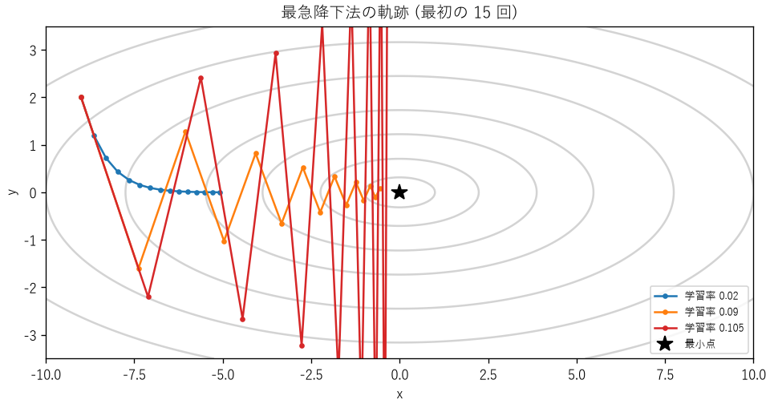
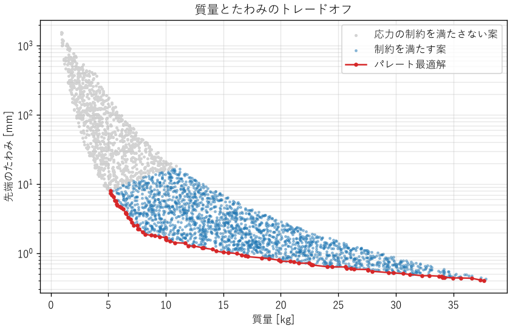

最適化
======

設計では、制約を満たす案の中から、最も良い案を選びたい場面がよくあります。部品の寸法、制御のゲイン、キャッシュの容量、機械学習のパラメーターなど、対象は分野を問いません。本章では、最適化問題の立て方、代表的な解き方である勾配法、目的が複数ある場合の考え方を説明します。

最適化問題の定式化
------------------

最適化問題は、次の 3 つの要素で表します。

設計変数
   設計者が自由に決められる量です。ベクトル :math:`\boldsymbol{x}` で表します。

目的関数
   設計の良さを表す、最小化（または最大化）したい量です。:math:`f(\boldsymbol{x})` で表します。

制約条件
   設計変数が満たさなければならない条件です。不等式 :math:`g_i(\boldsymbol{x}) \le 0` や等式 :math:`h_j(\boldsymbol{x}) = 0` で表します。

これらを使って、最適化問題は次のように書けます。最大化したい場合は、目的関数の符号を変えて最小化します。

.. math::
   :label: eq-optimization

   \begin{aligned}
   \text{minimize} \quad & f(\boldsymbol{x}) \\
   \text{subject to} \quad & g_i(\boldsymbol{x}) \le 0 \quad (i = 1, \ldots, m) \\
   & h_j(\boldsymbol{x}) = 0 \quad (j = 1, \ldots, p)
   \end{aligned}

定式化の例を次に示します。

.. list-table::
   :header-rows: 1
   :widths: 22 26 26 26

   * - 問題
     - 設計変数
     - 目的関数
     - 制約条件
   * - 梁の設計
     - 断面の幅と高さ
     - 質量（最小化）
     - 応力が許容値以下、たわみが許容値以下
   * - 制御ゲインの調整
     - :math:`K_p, K_i, K_d`
     - 整定時間（最小化）
     - 最大行き過ぎ量が 10 % 以下、安定であること
   * - キャッシュの設計
     - キャッシュの容量、保持期間
     - 平均応答時間（最小化）
     - メモリの使用量が上限以下
   * - 生産計画
     - 各製品の生産量
     - 利益（最大化）
     - 機械の稼働時間、材料の在庫

最適化で最も難しく、最も重要なのは、定式化です。目的関数が本当の目的を表していなければ、どんなに上手に解いても役に立ちません。たとえば、応答時間の平均値を最小化すると、一部の利用者の極端に遅い応答が見過ごされることがあります。指標を目標にすると、その指標は良い指標ではなくなる（グッドハートの法則）、という警句もあります。数値を最適化するときは、それが本来の目的を表しているかを常に確かめます。

局所解と大域解
--------------

ある点のまわりで目的関数が最小になる点を局所解、定義域全体で最小になる点を大域解と呼びます。多くの最適化手法は、出発点から目的関数が小さくなる方向へ少しずつ進むため、局所解に到達して止まり、大域解を見つけられない場合があります。

目的関数と制約条件が凸（グラフが下に膨らんだ形）の場合は、局所解が大域解と一致することが保証されます。そうでない場合は、異なる出発点から何度も探索する、確率的に探索する手法を使う、といった工夫が必要です。

勾配法
------

目的関数の勾配 :math:`\nabla f`\ （各設計変数での偏微分を並べたベクトル）は、関数が最も急に増える方向を向いています。その逆方向に少しずつ進めば、関数の値を小さくできます。これを最急降下法と呼びます。

.. math::
   :label: eq-gradient-descent

   \boldsymbol{x}_{k+1} = \boldsymbol{x}_k - \eta \nabla f(\boldsymbol{x}_k)

:math:`\eta` は 1 回に進む幅を決める係数で、機械学習の分野では学習率と呼ばれます。学習率の選び方は、結果に大きく影響します。

:download:`ch10_gradient_descent.py <../examples/ch10_gradient_descent.py>` は、目的関数 :math:`f(x, y) = x^2 + 10y^2` の最小点を、点 :math:`(-9, 2)` から探索します。この関数は、:math:`y` 方向にだけ急な、細長い谷の形をしています。

.. literalinclude:: ../examples/ch10_gradient_descent.py
   :language: python
   :pyobject: gradient_descent
   :lineno-match:

.. code-block:: text

   学習率 0.020: 410 回で収束
   学習率 0.090: 85 回で収束
   学習率 0.105: 54 回で発散 (f = 1.18e+06)

.. _fig-gradient-descent:

   学習率による最急降下法の軌跡の違い

:numref:`fig-gradient-descent` から、次のことが分かります。

* 学習率が小さい（0.02）と、安定して進みますが、緩やかな :math:`x` 方向に進むのに多くの反復が必要です。
* 学習率を大きくする（0.09）と、反復回数は減りますが、急な :math:`y` 方向で谷を飛び越えてジグザグに進みます。
* 学習率が大きすぎる（0.105）と、:math:`y` 方向の振動が増え続けて発散します。

この関数では、:math:`y` 方向の更新式は :math:`y_{k+1} = (1 - 20\eta) y_k` です。:math:`|1 - 20\eta| < 1`、つまり :math:`\eta < 0.1` でなければ発散します。一般に、最急降下法が収束する学習率の上限は、関数の最も急な方向の曲率で決まります。一方、収束の速さは最も緩やかな方向で決まります。方向によって曲率が大きく違う問題（悪条件の問題）では、最急降下法は遅くなります。

この弱点を改善するために、曲率の情報も使うニュートン法や準ニュートン法、過去の進み方を利用するモーメンタム法や Adam などの手法があります。実務では、自分で実装するより、SciPy の ``scipy.optimize`` モジュールなどの実績のあるライブラリーを使うのが一般的です。また、設計変数の尺度をそろえる（たとえば、ミリメートルとキロニュートンのように桁の違う量を、同じ程度の大きさに正規化する）だけで、悪条件が改善されることもあります。

制約の扱い
----------

制約条件のある問題を解く方法には、いくつかの考え方があります。

ペナルティ法
   制約を破った量に応じた罰則を目的関数に加え、制約のない問題として解きます。簡単ですが、罰則の重みの選び方で結果が変わります。

ラグランジュの未定乗数法
   等式制約のある問題で、最適解が満たすべき条件を連立方程式として表し、解析的に解く方法です。

逐次二次計画法など
   制約付きの問題を直接扱う数値解法です。ライブラリーで利用できます。

多くの工学の問題では、最適解はいずれかの制約条件の境界の上にあります。たとえば、軽い梁を作ろうとすると、応力が許容値ぎりぎりになる寸法が最適解になります。これは、最適化した設計は余裕がない設計でもある、ということを意味します。最適化の結果をそのまま採用するのではなく、ばらつきや想定外の負荷に対して余裕があるか（第 9 章の設計余裕、第 11 章の公差解析）を確かめます。

多目的最適化
------------

実際の設計では、目的が 1 つとは限りません。軽くしたいが、たわみも小さくしたい。速くしたいが、消費電力も小さくしたい。このように両立しない複数の目的がある問題を、多目的最適化問題と呼びます。

多目的最適化では、すべての目的で最も良い解は一般に存在しません。そこで、「ほかのどの解と比べても、すべての目的で劣ってはいない解」を考えます。このような解をパレート最適解と呼び、パレート最適解の集まりをパレートフロントと呼びます。パレート最適解でない解は、少なくとも 1 つの目的を悪くせずに別の目的を改善できるので、選ぶ理由がありません。

:download:`ch10_pareto.py <../examples/ch10_pareto.py>` は、長さ 1 m の鋼製の片持ち梁の先端に 1000 N の荷重をかける問題で、断面の幅 :math:`b` と高さ :math:`h` をランダムに 3000 通り作り、質量とたわみを評価します。たわみ :math:`\delta` と、根元の最大曲げ応力 :math:`\sigma` は、材料力学の公式で計算できます。

.. math::
   :label: eq-cantilever

   \begin{aligned}
   \delta &= \frac{F L^3}{3 E I}, & I &= \frac{b h^3}{12}, \\
   \sigma &= \frac{F L}{Z}, & Z &= \frac{b h^2}{6}
   \end{aligned}

:math:`E` はヤング率、:math:`I` は断面二次モーメント、:math:`Z` は断面係数です。

.. literalinclude:: ../examples/ch10_pareto.py
   :language: python
   :pyobject: pareto_mask
   :lineno-match:

.. _fig-pareto:

   片持ち梁の質量とたわみのトレードオフ

:numref:`fig-pareto` の赤い線がパレートフロントです。フロントの上では、質量を減らすとたわみが増え、たわみを減らすと質量が増えます。どの点を選ぶかは、最適化の計算では決まりません。「たわみは 2 mm 以下でよいので、その中で最も軽いもの」のように、設計者が要求に基づいて決めます。パレートフロントは、その判断に必要な選択肢と、トレードオフの大きさを示してくれます。

サンプルコードは、パレート最適解の一部を次のように表示します。

.. code-block:: text

   設計案 3000 個のうち、応力の制約を満たす案: 2028 個
   パレート最適解: 80 個
     質量[kg]  たわみ[mm]  幅[mm]  高さ[mm]
         5.18        8.01    10.9      60.6
         5.99        4.70    10.4      73.6
         7.07        2.78    10.2      88.1
         9.06        1.79    11.9      97.0
        11.94        1.28    15.2      99.9
        16.16        0.99    21.1      97.6
        20.84        0.76    27.0      98.1
        24.47        0.63    31.4      99.2
        29.39        0.52    37.6      99.5
        34.06        0.46    43.8      99.0

質量の小さい側では、幅を下限（10 mm）近くに保ったまま高さを増やしています。高さが上限（100 mm）近くに達すると、今度は幅を増やしています。たわみは :math:`h^3` に、質量は :math:`h` に比例するため、まず高さを大きくするのが効率的で、高さが上限に達してから幅を増やすしかなくなるからです。もし高さの上限を緩められるなら、より良い設計が得られる可能性があります。このように、どの制約が効いているかを知ることも、最適化の重要な成果です。

最適化のその他の手法
--------------------

勾配を計算できない場合や、局所解が多い場合には、次のような手法も使われます。

.. list-table::
   :header-rows: 1
   :widths: 30 70

   * - 手法
     - 特徴
   * - グリッドサーチ、ランダムサーチ
     - 設計変数の候補を網羅的または無作為に試す。単純で確実だが、変数が多いと計算量が膨大になる
   * - 遺伝的アルゴリズム
     - 生物の進化を模して、良い解を組み合わせながら探索する。多目的最適化にも使われる
   * - 焼きなまし法
     - 確率的に悪い方向への移動も許し、局所解から抜け出す
   * - ベイズ最適化
     - 評価に時間のかかる問題（実験や大規模なシミュレーション）で、少ない評価回数で良い解を探す
   * - 線形計画法、整数計画法
     - 目的関数と制約が 1 次式の問題を効率的に解く。生産計画や配送計画に使われる

まとめ
------

* 最適化問題は、設計変数、目的関数、制約条件で定式化します。目的関数が本当の目的を表しているかを確かめます。
* 最急降下法は、学習率が大きすぎると発散し、悪条件の問題では遅くなります。実務ではライブラリーを使い、変数の尺度をそろえます。
* 最適解は制約の境界に張り付くことが多く、余裕のない設計になりがちです。
* 目的が複数ある場合はパレート最適解を求め、その中から要求に基づいて選びます。
