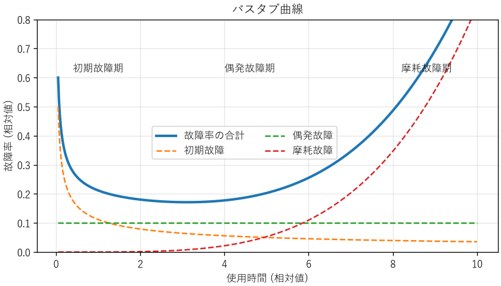
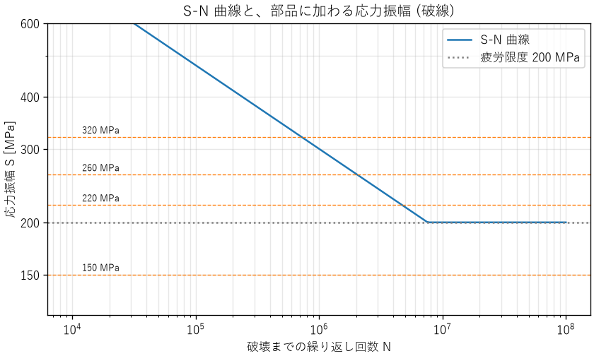

信頼性
======

どんな製品も、いつかは故障します。信頼性工学は、故障を確率の問題として扱い、製品やシステムがどれだけの期間、どれだけの確率で機能を果たし続けられるかを定量的に評価し、改善するための分野です。本章では、信頼性の基本的な指標、摩耗故障の代表的な原因である材料の疲労、冗長化による信頼性の向上、ソフトウェアに特有の信頼性の考え方、不具合から学んで再発を防ぐ方法を説明します。

信頼性の指標
------------

信頼性とは、製品が、与えられた条件で、与えられた期間、要求どおりに機能を果たす能力です。これを定量的に表すため、次の指標を使います。

信頼度 :math:`R(t)`
   時刻 0 で正常だったものが、時刻 :math:`t` まで故障せずに機能を果たす確率です。

故障率 :math:`\lambda(t)`
   時刻 :math:`t` まで正常だったものが、その直後の単位時間に故障する割合です。電子部品では、:math:`10^{9}` 時間あたりの故障数を表す FIT という単位がよく使われます（1 FIT = :math:`10^{-9}` /h）。

故障率が時間によらず一定値 :math:`\lambda` の場合、信頼度は指数関数になります。

.. math::
   :label: eq-reliability-exponential

   R(t) = e^{-\lambda t}

故障するまでの平均時間を、修理しない製品では平均故障寿命（MTTF）、修理して使い続ける製品では平均故障間隔（MTBF）と呼びます。故障率が一定なら、どちらも :math:`1/\lambda` です。

MTBF の解釈には注意が必要です。「MTBF 10 万時間」は、「1 台が約 11 年間故障しない」という意味ではありません。:eq:`eq-reliability-exponential` で :math:`t = 1/\lambda` とおくと :math:`R = e^{-1} \approx 0.368` なので、故障率が一定なら、MTBF の時間が経過した時点で故障せずに残っているのは約 37 % です。また、1000 台を運用すれば、平均して 100 時間に 1 台が故障します。MTBF は、多数の製品をまとめて見たときの故障の頻度を表す指標です。

バスタブ曲線
------------

多くの製品の故障率は、使用時間とともに\ :numref:`fig-bathtub` のように変化します。形が浴槽に似ていることから、バスタブ曲線と呼ばれます。

.. _fig-bathtub:

   バスタブ曲線（初期故障、偶発故障、摩耗故障の故障率の和）

.. list-table::
   :header-rows: 1
   :widths: 18 42 40

   * - 期間
     - 特徴と原因
     - 対策
   * - 初期故障期
     - 使い始めに故障率が高く、時間とともに下がる。製造の欠陥（はんだ付けの不良、部品の不良品など）が原因
     - 出荷前に高温などで一定時間動かし、欠陥のある製品を取り除く（バーンイン、スクリーニング）
   * - 偶発故障期
     - 故障率がほぼ一定。外部からの過大なストレスなど、偶発的な原因による
     - 冗長化、設計余裕の確保
   * - 摩耗故障期
     - 劣化や摩耗によって故障率が上昇する。軸受、電解コンデンサー、電池、接点などで顕著
     - 寿命に達する前の予防保全（定期交換）

故障率の時間変化は、ワイブル分布（付録の\ :doc:`math`\ を参照）でよく表されます。ワイブル分布の形状パラメーター :math:`m` が 1 より小さければ初期故障型、1 なら偶発故障型（故障率が一定）、1 より大きければ摩耗故障型です。故障したデータからワイブル分布のパラメーターを推定すると、どの期間の故障なのかを判断し、適切な対策を選べます。:download:`ch13_reliability.py <../examples/ch13_reliability.py>` の図も、3 つのワイブル分布の故障率を足し合わせて描いています。

材料の強度と疲労
----------------

摩耗故障の代表的な原因の 1 つが、材料の疲労です。ここでは、機械部品やはんだ接合部の寿命を考えるための基礎を説明します。

応力とひずみ
^^^^^^^^^^^^

材料に力を加えると、内部に単位面積あたりの力（応力、単位は Pa = N/m²、実用上は MPa）が生じ、材料は変形します。元の長さに対する変形の割合をひずみと呼びます。小さな応力の範囲では、応力とひずみは比例し、その比をヤング率と呼びます（フックの法則）。

応力を大きくしていくと、力を取り除いても元に戻らない変形が始まります。この応力を降伏応力（降伏点）と呼びます。さらに応力を大きくすると、材料は破断します。破断までに耐えられる最大の応力を引張強さと呼びます。静的な荷重に対する設計では、降伏応力や引張強さに対して安全率（第 9 章）を確保します。

疲労
^^^^

降伏応力よりはるかに小さい応力でも、何度も繰り返し加わると、材料に小さなき裂が生じて少しずつ進み、最後には破断します。この現象を疲労と呼びます。機械部品の破損の多くは、疲労によるものと言われています。

応力振幅 :math:`S` と、破断までの繰り返し回数 :math:`N` の関係を表した曲線を S-N 曲線と呼びます。鋼では、ある応力より小さければ何回繰り返しても破断しない（と見なせる）限界があり、これを疲労限度と呼びます。アルミニウム合金などでは明確な疲労限度がなく、応力が小さくても回数が増えればいずれ破断します。

マイナー則
^^^^^^^^^^

実際の部品には、大きさの異なる応力が不規則に加わります。このような場合の寿命の見積もりには、マイナー則（線形累積損傷則）がよく使われます。応力振幅 :math:`S_i` での破断までの回数を :math:`N_i`、実際にその応力を受けた回数を :math:`n_i` とすると、損傷度 :math:`D` を次の式で計算し、:math:`D = 1` で破断すると考えます。

.. math::
   :label: eq-miner

   D = \sum_i \frac{n_i}{N_i}

:download:`ch13_fatigue.py <../examples/ch13_fatigue.py>` は、S-N 曲線を :math:`N = N_{\mathrm{ref}} (S / S_{\mathrm{ref}})^{-k}` と単純化し、1 年間に 4 段階の応力振幅を受ける部品の寿命を見積もります。

.. code-block:: text

   応力振幅[MPa]  年間の回数  破壊までの回数  年間の損傷度
            150       5e+06          疲労限度以下        0.0000
            220       2e+05        4.72e+06        0.0424
            260       2e+04        2.05e+06        0.0098
            320       1e+03        7.24e+05        0.0014
   応力 1.0 倍: 年間の損傷度 0.0536, 寿命 18.7 年
   応力 1.1 倍: 年間の損傷度 0.0863, 寿命 11.6 年

.. _fig-fatigue:

   S-N 曲線と部品に加わる応力振幅

この結果から、2 つのことが分かります。

* 回数が最も多い 150 MPa の応力は、疲労限度より小さいため損傷に寄与しません。寿命を主に決めているのは、回数は中程度でも応力の大きい 220 MPa の繰り返しです。
* 応力が 10 % 大きくなるだけで、寿命は 18.7 年から 11.6 年に、約 4 割も短くなります。:math:`N` は :math:`S` の :math:`k` 乗（この例では 5 乗）に反比例するためです。疲労寿命は応力に非常に敏感なので、応力の見積もりの誤差や、製造のばらつきに対して大きな余裕が必要です。

マイナー則は簡便ですが、応力の加わる順序の影響を無視するなどの近似を含みます。実際の設計では、材料の試験データ、規格の設計曲線、大きな安全率を組み合わせ、試作品の耐久試験で確かめます。

応力集中と熱疲労
^^^^^^^^^^^^^^^^

穴、切り欠き、角の部分では、局所的に応力が大きくなります（応力集中）。疲労のき裂の多くは、こうした場所から始まります。1950 年代に、世界初のジェット旅客機であるデ・ハビランド・コメットが空中分解する事故が相次ぎました。客室の与圧と減圧の繰り返しによって、機体の開口部の角に生じた疲労き裂が原因とされています。角を丸くする、急な形状の変化を避けるといった設計で、応力集中を小さくします。

電子機器でも疲労は重要です。部品と基板は熱膨張の度合い（線膨張係数）が異なるため、電源の入り切りや周囲温度の変化のたびに、はんだ接合部に繰り返しの応力が加わります。この熱疲労によるはんだのき裂は、電子機器の摩耗故障の代表的な原因です。温度サイクル試験（第 12 章）は、この故障を加速して確かめる試験です。

システムの信頼度
----------------

多数の要素からなるシステムの信頼度は、要素の信頼度と、要素のつながり方で決まります。ここでは、要素の故障が互いに独立であると仮定します。

直列系
   すべての要素が正常なときだけ、システムが機能する構成です。信頼度は各要素の信頼度の積です。

   .. math::

      R_{\mathrm{series}} = \prod_{i} R_i

並列系
   いずれか 1 つの要素が正常なら、システムが機能する構成です。すべての要素が故障したときだけシステムが故障するので、信頼度は次の式になります。

   .. math::

      R_{\mathrm{parallel}} = 1 - \prod_{i} (1 - R_i)

k-out-of-n 系
   :math:`n` 個の要素のうち :math:`k` 個以上が正常なら、システムが機能する構成です。3 つのセンサーの多数決で判断する 2-out-of-3 系がよく使われます。

.. literalinclude:: ../examples/ch13_reliability.py
   :language: python
   :pyobject: k_out_of_n
   :lineno-match:

信頼度 0.95 の要素で計算すると、次のようになります。

.. code-block:: text

   1. 信頼度 (各要素の信頼度 0.95)
      直列 3 個      : 0.8574
      並列 2 個      : 0.9975
      2-out-of-3     : 0.9928

直列系の信頼度は、要素が増えるほど下がります。信頼度 0.999 の部品でも、100 個を直列につなぐと :math:`0.999^{100} \approx 0.905` になります。部品点数の多い製品で高い信頼性を得るには、個々の部品に非常に高い信頼度が求められます。部品点数を減らすことも、信頼性を高める有効な方法です。

冗長化
------

並列系のように、同じ機能を持つ要素を複数用意して、一部が故障しても機能を続けられるようにすることを冗長化と呼びます。

.. list-table::
   :header-rows: 1
   :widths: 25 75

   * - 方式
     - 内容
   * - ホットスタンバイ
     - 予備も常に動かしておき、故障したら即座に切り替える。切り替えは速いが、予備も劣化する
   * - コールドスタンバイ
     - 予備は停止しておき、故障したら起動する。予備は劣化しにくいが、切り替えに時間がかかる
   * - 多数決（2-out-of-3 など）
     - 3 つ以上の要素の出力を比べ、多数派を採用する。1 つの要素が誤った値を出しても検出して除外できる

冗長化で注意しなければならないのが、共通原因故障です。並列系の式は、要素の故障が独立であることを前提にしています。しかし、二重化したサーバーが同じ電源につながっていれば、電源の故障で両方が同時に停止します。同じ設計の部品は、同じ条件で同じように壊れます。第 5 章のアリアン 5 では、二重化した慣性基準装置が、同じソフトウェアの同じ誤りで両方とも停止しました。

共通原因故障を減らすには、次のような方法をとります。

* 電源、通信経路、設置場所を分ける（物理的な分離）
* 異なる設計、異なる製造元の部品、異なる原理のセンサーを使う（多様性）
* 共通の要素が残っていないかを、構成図で確認する

アベイラビリティ
----------------

修理できるシステムでは、故障しないことに加え、故障してもすぐに直せることが重要です。システムが使える状態にある時間の割合をアベイラビリティ（稼働率）と呼びます。

.. math::
   :label: eq-availability

   A = \frac{\mathrm{MTBF}}{\mathrm{MTBF} + \mathrm{MTTR}}

MTTR は平均修復時間です。この式から、アベイラビリティを高めるには、故障を減らす（MTBF を延ばす）だけでなく、修復を速くする（MTTR を縮める）方法もあることが分かります。故障の検知、原因の特定、予備品の確保、手順書の整備などで MTTR を縮めることは、多くの場合、MTBF を延ばすより安く効果的です。

アベイラビリティは、9 の数で表すことがあります。年間の停止時間に換算すると、次のようになります。

.. code-block:: text

   2. アベイラビリティと年間の停止時間
      MTBF 2000 h, MTTR 4 h -> 0.99800 (年間 17.5 時間停止)
      99 % -> 年間   5256.0 分停止
      99.9 % -> 年間    525.6 分停止
      99.99 % -> 年間     52.6 分停止
      99.999 % -> 年間      5.3 分停止

「99.999 %（ファイブナイン）」は年間の停止時間が約 5 分です。9 を 1 つ増やすごとに停止時間は 1/10 になりますが、そのための費用は大きく増えます。要求するアベイラビリティは、停止による損失と、対策の費用を比べて決めます。

ソフトウェアの信頼性
--------------------

ソフトウェアは摩耗しません。同じ入力と同じ状態に対しては、常に同じ動作をします。ソフトウェアの故障は、設計（仕様やコード）に潜む誤りが、特定の入力や条件で表に現れることで起きます。このため、ハードウェアの信頼性の考え方をそのまま当てはめられない部分があります。

* **同じソフトウェアの冗長化は効果がない**: 同じ誤りを持つソフトウェアを二重にしても、同じ条件で同時に故障します。異なるチームが独立に作った複数のソフトウェアで多数決をとる N バージョンプログラミングという方法もありますが、費用が大きく、異なるチームが同じ誤りをすることもあるため、効果は限定的です。
* **使い続けると劣化したように見えることがある**: メモリリークや、第 5 章のパトリオットミサイルの例のような誤差の蓄積によって、長時間動かすと故障しやすくなる現象があります。ソフトウェアエージングと呼ばれ、定期的な再起動（ソフトウェアリジュベネーション）で対処することがあります。
* **試験と修正で信頼性が成長する**: 試験で見つけた誤りを修正するにつれて、故障の発生頻度は下がっていきます。発見した誤りの数の推移から、残っている誤りの数を推定する信頼度成長モデルが使われます。

ソフトウェアを含むシステムの信頼性を高めるには、誤りを減らす努力（レビュー、試験、静的解析）に加えて、誤りが残っていることを前提に、故障の影響を抑える設計を組み合わせます。

.. list-table::
   :header-rows: 1
   :widths: 30 70

   * - 方法
     - 内容
   * - ウォッチドッグタイマー
     - ソフトウェアが一定時間ごとにタイマーをリセットし、リセットが途絶えたら（ソフトウェアが停止したら）ハードウェアがシステムを再起動する。組込み機器で広く使われる
   * - タイムアウトと再試行
     - 応答のない相手を無限に待たない。再試行は間隔を広げながら回数を制限する
   * - サーキットブレーカー
     - 故障している依存先への呼び出しを一時的に止め、故障の連鎖を防ぐ
   * - 機能の縮退
     - 一部の機能が使えなくなっても、重要な機能だけは続ける（グレースフルデグラデーション）

不具合の原因分析と再発防止
--------------------------

どれだけ注意深く設計しても、不具合は起きます。大切なのは、起きた不具合から学び、同じ不具合、さらには同じ原因による別の不具合を繰り返さないことです。第 1 章で述べた「失敗から学ぶ」を、自分たちの不具合について実践する方法を説明します。

原因分析の手順
^^^^^^^^^^^^^^

1. **事実を記録する**: 何が、いつ、どの製品（製造番号、ソフトウェアの版）で、どのような条件で起きたかを、推測を交えずに記録します。時系列の記録（タイムライン）を作ると、出来事の前後関係が明確になります。
2. **再現させる**: 可能であれば、同じ条件で不具合を再現させます。再現できれば、原因の仮説を検証し、対策の効果を確かめられます。
3. **直接原因を特定する**: 不具合を直接引き起こした事象（部品の破損、コードの誤り、設定の誤り）を特定します。
4. **根本原因を掘り下げる**: 直接原因が「なぜ」生じたのか、「なぜ」設計・製造・試験の過程で防げなかったのかを掘り下げます。
5. **対策を決めて実施する**: 暫定対策と恒久対策を決めます。
6. **効果を確認し、水平展開する**: 対策の効果を確かめ、同じ原因を持つ可能性のある他の製品や設計にも対策を広げます。

なぜなぜ分析
^^^^^^^^^^^^

根本原因を掘り下げる方法として、「なぜ」を繰り返し問うなぜなぜ分析があります。例として、出荷した IoT 機器が現場で再起動を繰り返した不具合を考えます。

.. list-table::
   :header-rows: 1
   :widths: 10 45 45

   * - 回
     - 問い
     - 答え
   * - 1
     - なぜ再起動したのか
     - ウォッチドッグタイマーがソフトウェアの停止を検出したから
   * - 2
     - なぜソフトウェアが停止したのか
     - 通信の受信バッファーがあふれ、メモリを破壊したから
   * - 3
     - なぜバッファーがあふれたのか
     - 想定より長いデータが届いたのに、長さを検査していなかったから
   * - 4
     - なぜ長さの検査がなかったのか
     - インターフェース仕様書にデータの最大長が書かれていなかったから
   * - 5
     - なぜ仕様書の不備が見逃されたのか
     - 仕様書のレビューの観点に「異常時の振る舞い」が含まれていなかったから

1 回目や 2 回目の答えに対して対策しても（たとえば、ウォッチドッグタイマーの時間を延ばしても）、不具合は防げません。3 回目の答えに対する対策（長さの検査を追加する）は、この不具合を直します。4 回目と 5 回目の答えに対する対策（仕様書の様式とレビューの観点を改める）は、同じ原因による別の不具合も防ぎます。

なぜなぜ分析では、原因が 1 つとは限らないことに注意します。複数の要因が重なって不具合が起きた場合は、それぞれについて掘り下げます。要因を、人、設備、材料、方法、測定、環境などの分類で網羅的に洗い出す特性要因図（フィッシュボーン図）や、第 14 章の FTA も、原因分析に使えます。

人を責めない
^^^^^^^^^^^^

原因分析の結論が「担当者の不注意」で終わってはいけません。人は必ず誤ります（第 14 章）。問うべきなのは、「なぜ誤りが起きやすい状況だったのか」「なぜ誤りが検出されずに先へ進んだのか」です。

また、原因分析の場で個人の責任を追及すると、人は失敗を報告しなくなり、組織は学ぶ機会を失います。ソフトウェアの運用の分野では、障害の後に、個人を責めずに事実と改善策をまとめる報告書（ポストモーテム）を書く文化が広まっています。航空の分野でも、ヒヤリハットを罰せずに報告させる制度が、安全の向上に大きく貢献してきました。

暫定対策と恒久対策
^^^^^^^^^^^^^^^^^^

不具合が見つかったら、まず被害の拡大を防ぐ暫定対策（出荷の停止、設定の変更、運用での回避）をとります。そのうえで、根本原因を取り除く恒久対策（設計の変更、工程の変更、仕様書と手順の改訂）を行います。暫定対策のまま放置されると、運用の手間や回避策の忘れが新たな不具合を生みます。恒久対策を変更管理（第 9 章）の手順に従って実施し、完了まで追跡します。

まとめ
------

* 故障率が一定なら信頼度は指数関数で表され、MTBF の時点で残っているのは約 37 % です。MTBF は多数の製品の故障の頻度を表す指標です。
* 故障率はバスタブ曲線のように変化し、期間ごとに有効な対策が異なります。
* 直列系の信頼度は要素が増えるほど下がり、並列系（冗長化）で高められます。冗長化では共通原因故障に注意します。
* アベイラビリティは MTBF と MTTR で決まり、修復を速くすることも有効です。
* ソフトウェアは摩耗しませんが、設計の誤りによって故障します。誤りを減らす努力と、故障の影響を抑える設計を組み合わせます。
* 繰り返し荷重は、降伏応力より小さくても疲労破壊を起こします。疲労寿命は応力に非常に敏感です。
* 不具合は、事実の記録から根本原因まで掘り下げ、人を責めずに仕組みを改善して再発を防ぎます。
