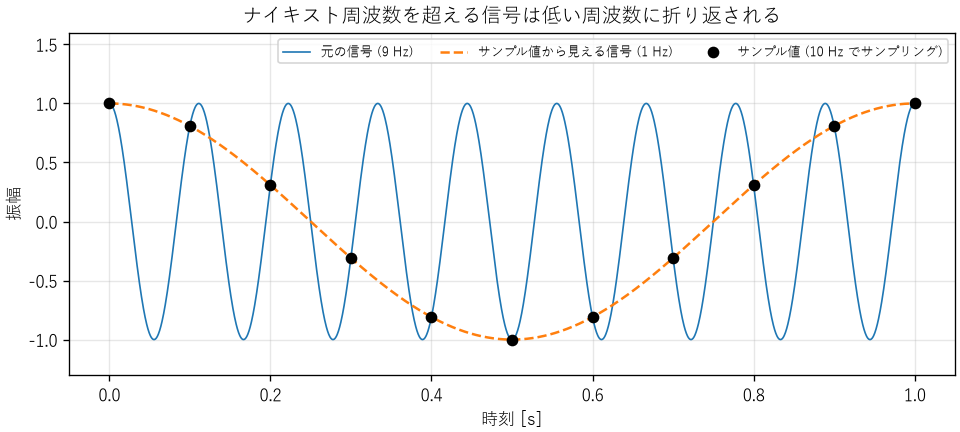
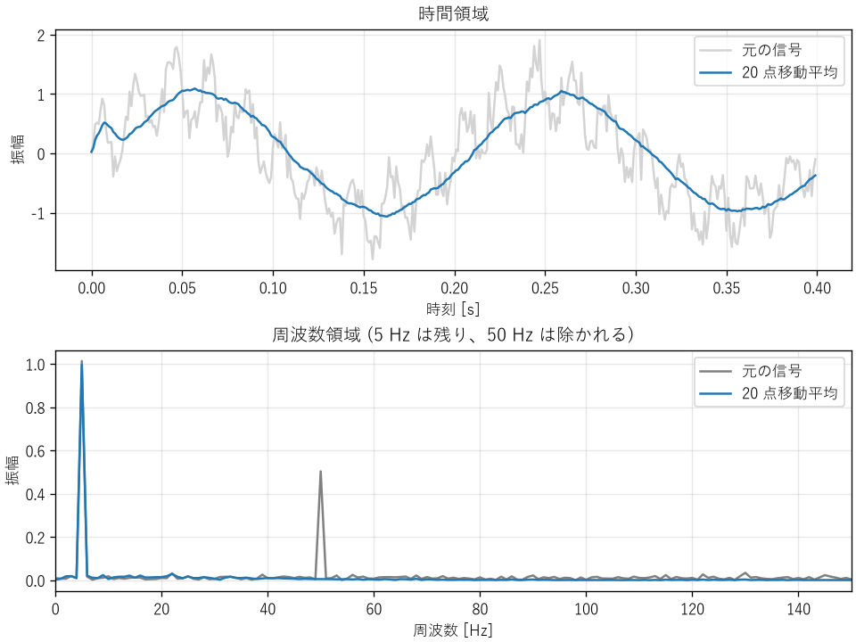

信号処理の基礎
==============

センサーの出力、音声、通信の波形、サーバーの監視データなど、時間とともに変化する量を信号と呼びます。本章では、連続的な信号をコンピューターで扱うためのサンプリングと量子化、信号を周波数の成分に分ける離散フーリエ変換、不要な成分を取り除くフィルターを説明します。

アナログ信号とデジタル信号
--------------------------

自然界の信号の多くは、時間的にも値の大きさの上でも連続なアナログ信号です。コンピューターで扱うには、これを A/D 変換器（ADC）でデジタル信号に変換します。A/D 変換は、次の 2 つの離散化からなります。

サンプリング（標本化）
   一定の時間間隔 :math:`T_s` ごとに信号の値を取り出します。1 秒あたりのサンプル数 :math:`f_s = 1/T_s` をサンプリング周波数と呼びます。

量子化
   取り出した値を、有限のビット数の整数で表します。

それぞれの離散化で情報の一部が失われ、誤差が生じます。順に見ていきます。

サンプリング定理とエイリアシング
--------------------------------

サンプリングした信号から元の信号を正しく復元できる条件を示すのが、サンプリング定理です。

   元の信号に含まれる最も高い周波数を :math:`f_{\max}` とすると、:math:`f_s > 2 f_{\max}` でサンプリングすれば、元の信号を完全に復元できる。

サンプリング周波数の半分 :math:`f_s/2` をナイキスト周波数と呼びます。ナイキスト周波数を超える成分を含む信号をサンプリングすると、その成分は低い周波数の成分と区別できなくなります。この現象をエイリアシング（折り返し）と呼びます。周波数 :math:`f` の成分は、:math:`|f - k f_s|`\ （:math:`k` は整数）のうち、:math:`0` 〜 :math:`f_s/2` の範囲に入る周波数に見えます。

:download:`ch07_aliasing.py <../examples/ch07_aliasing.py>` で、9 Hz の信号を 10 Hz でサンプリングした結果が\ :numref:`fig-aliasing` です。サンプル値（黒い点）は、1 Hz の信号の上にちょうど乗っています。サンプル値だけを見ると、元の信号が 9 Hz だったのか 1 Hz だったのかは区別できません。

.. _fig-aliasing:

   エイリアシング（9 Hz の信号を 10 Hz でサンプリング）

同じプログラムで、ほかの周波数がどう見えるかを計算すると、次のようになります。

.. code-block:: text

   9.0 Hz の信号を 10.0 Hz でサンプリングすると、1.0 Hz に見えます。
       3.0 Hz ->  3.0 Hz
       6.0 Hz ->  4.0 Hz
      11.0 Hz ->  1.0 Hz
      50.0 Hz ->  0.0 Hz

最後の行は、50 Hz の雑音が、ちょうど 10 Hz でサンプリングすると直流（一定の値のずれ）に見えることを示しています。電源の雑音が測定値のオフセットのように見える、という不具合の原因になります。

エイリアシングは、サンプリングした後では取り除けません。そのため、A/D 変換器の手前に、ナイキスト周波数を超える成分を除くアナログのローパスフィルター（アンチエイリアシングフィルター）を置きます。フィルターは急に遮断できないため、実務では、サンプリング周波数を対象の信号の最高周波数の 2 倍ぎりぎりではなく、5〜10 倍程度に選ぶことがよくあります。

エイリアシングは、ソフトウェアでも起きます。

* 信号の間引き（ダウンサンプリング）: 1000 Hz のデータを 10 点ごとに間引いて 100 Hz にするときは、先にデジタルのローパスフィルターで 50 Hz 以上の成分を除きます。
* 監視データ: CPU の使用率を 1 分ごとに取得すると、数秒間だけの急上昇は見逃されるか、たまたま重なったときだけ現れて、実際とは違う傾向に見えます。
* 画像: 細かい縞模様の画像を縮小すると、元の画像にない模様（モアレ）が現れます。

量子化
------

:math:`N` ビットの A/D 変換器は、入力範囲を :math:`2^N` 段階に分けて表します。1 段階の幅を 1 LSB と呼びます。入力範囲が 0〜3.3 V の 12 ビットの A/D 変換器なら、1 LSB は :math:`3.3 / 4096 \approx 0.81` mV です。

量子化によって生じる誤差（量子化誤差）は、最大で ±0.5 LSB です。この誤差が一様に分布すると仮定すると、その実効値は :math:`\text{LSB}/\sqrt{12}` です。入力範囲いっぱいの正弦波を量子化したときの、信号と量子化雑音の電力の比（SQNR）は、次の式で近似できます。

.. math::
   :label: eq-sqnr

   \mathrm{SQNR} \approx 6.02 N + 1.76 \ \mathrm{[dB]}

1 ビット増えるごとに、SQNR は約 6 dB（振幅で 2 倍）良くなります。:download:`ch07_quantization.py <../examples/ch07_quantization.py>` で確かめた結果を次に示します。

.. code-block:: text

   ビット数  シミュレーション[dB]  理論値[dB]
          4                 25.31       25.84
          8                 49.79       49.92
         10                 61.90       61.96
         12                 73.97       74.00
         16                 98.08       98.08

ビット数が少ないと、量子化誤差が信号と相関を持つため、理論値から少しずれます。実際の A/D 変換器では、量子化誤差のほかに回路の雑音やひずみも加わるため、性能は理論値より低くなります。実際の性能をビット数に換算した値を有効ビット数（ENOB）と呼び、仕様書で確認できます。

小さな信号を測定するときは、入力範囲に対して信号が小さすぎないように、増幅器で信号を大きくしてから A/D 変換します。入力範囲の 1/100 の信号しか入力しなければ、実質的に約 7 ビット（:math:`\log_2 100 \approx 6.6`）分の分解能を捨てることになります。

離散フーリエ変換
----------------

どんな信号も、さまざまな周波数の正弦波の重ね合わせで表せます。信号にどの周波数の成分がどれだけ含まれるかを表したものをスペクトルと呼びます。時間の関数として見ていた信号を、周波数の関数として見ることで、雑音の原因の特定や、機械の異常の検出ができます。

:math:`N` 個のサンプル :math:`x_0, x_1, \ldots, x_{N-1}` のスペクトルは、離散フーリエ変換（DFT）で求めます。

.. math::
   :label: eq-dft

   X_k = \sum_{n=0}^{N-1} x_n \, e^{-j 2\pi k n / N}, \qquad k = 0, 1, \ldots, N - 1

:math:`j` は虚数単位です（複素数とこの式の意味は、付録の\ :doc:`math`\ で補足しています）。:math:`X_k` は複素数で、その絶対値が周波数 :math:`k f_s / N` の成分の大きさ、偏角が位相を表します。DFT をそのまま計算すると :math:`N^2` に比例する計算量がかかりますが、高速フーリエ変換（FFT）というアルゴリズムを使うと :math:`N \log N` に比例する計算量で済みます。NumPy では ``numpy.fft`` モジュールで計算できます。

DFT を使うときは、次の点に注意します。

* **周波数分解能**: 区別できる周波数の間隔は :math:`f_s / N`、つまり測定時間の逆数です。1 Hz の違いを見分けるには、1 秒以上のデータが必要です。
* **振幅の尺度**: 片側スペクトルで正弦波の振幅を読み取るには、:math:`|X_k|` を :math:`2/N` 倍します（直流成分は :math:`1/N` 倍）。
* **漏れ**: DFT は、測定区間の信号が周期的に繰り返すとみなして計算します。区間の両端で信号がつながらないと、本来ない周波数にも成分が現れます（スペクトルの漏れ）。漏れを減らすには、区間の両端を滑らかに 0 に近づける窓関数（ハン窓など）を掛けてから DFT を計算します。

デジタルフィルター
------------------

信号から不要な周波数の成分を取り除く処理をフィルターと呼びます。通す周波数の範囲によって、低い周波数を通すローパスフィルター、高い周波数を通すハイパスフィルター、特定の範囲だけを通すバンドパスフィルター、特定の周波数だけを除くノッチフィルターなどがあります。

移動平均フィルター
^^^^^^^^^^^^^^^^^^

最も簡単なローパスフィルターは、直近の :math:`M` 点の平均をとる移動平均です。

.. math::
   :label: eq-moving-average

   y_n = \frac{1}{M} \sum_{i=0}^{M-1} x_{n-i}

移動平均は、周波数 :math:`f` の正弦波の振幅を次の倍率で変えます。

.. math::
   :label: eq-moving-average-response

   |H(f)| = \left| \frac{\sin(\pi f M / f_s)}{M \sin(\pi f / f_s)} \right|

この倍率は、:math:`f` が :math:`f_s / M` の整数倍のときに 0 になります。つまり、周期がちょうど :math:`M` サンプルの成分は、1 周期分の平均がとられて完全に消えます。

:download:`ch07_fft_filter.py <../examples/ch07_fft_filter.py>` は、5 Hz の信号に、電源から混入した 50 Hz の雑音と白色雑音を加えた模擬信号を、1000 Hz でサンプリングしたものとして扱います。20 点の移動平均は、ちょうど 50 Hz の 1 周期分にあたるため、50 Hz の成分が除かれます（:numref:`fig-fft-filter`）。

.. code-block:: text

     5 Hz の振幅: フィルター前 1.014, フィルター後 0.996
    50 Hz の振幅: フィルター前 0.503, フィルター後 0.005
   移動平均による遅れ: 約 9.5 ms

.. _fig-fft-filter:

   移動平均フィルターの効果（上: 時間領域、下: 周波数領域）

移動平均は、信号を :math:`(M - 1)/2` サンプル分だけ遅らせます。この例では 9.5 サンプル、つまり 9.5 ms の遅れです。フィードバック制御のループの中でフィルターを使う場合、この遅れが不安定の原因になることがあります（第 6 章）。雑音を強く除こうとして :math:`M` を大きくするほど、遅れも大きくなるというトレードオフがあります。

指数移動平均
^^^^^^^^^^^^

組込みソフトウェアでよく使われるもう 1 つのフィルターが、指数移動平均です。

.. math::
   :label: eq-ema

   y_n = y_{n-1} + \alpha (x_n - y_{n-1}), \qquad 0 < \alpha \le 1

過去の出力 1 つを覚えておくだけで計算できるため、メモリの少ないマイコンにも向いています。このフィルターは、1 次遅れ系（第 6 章の\ :eq:`eq-first-order`）をデジタルで実現したもので、時定数 :math:`\tau` との間には :math:`\alpha = 1 - e^{-T_s/\tau}` の関係があります。:math:`\alpha` を小さくするほど雑音は減りますが、応答は遅くなります。

FIR フィルターと IIR フィルター
^^^^^^^^^^^^^^^^^^^^^^^^^^^^^^^

移動平均のように、有限個の過去の入力だけから出力を計算するフィルターを FIR フィルター、指数移動平均のように過去の出力も使うフィルターを IIR フィルターと呼びます。FIR フィルターは常に安定で、設計によって全周波数で遅れを一定にできますが、急な遮断特性を得るには多くの係数が必要です。IIR フィルターは少ない計算で急な遮断特性が得られますが、設計を誤ると不安定になります。具体的な設計には、SciPy の ``scipy.signal`` モジュールなどのライブラリーを使うのが一般的です。

まとめ
------

* A/D 変換は、サンプリングと量子化の 2 つの離散化からなります。
* ナイキスト周波数を超える成分はエイリアシングを起こし、サンプリング後には取り除けません。A/D 変換の前にアナログフィルターで除きます。
* 量子化の SQNR は、1 ビットごとに約 6 dB 良くなります。
* 離散フーリエ変換で信号を周波数の成分に分けられます。周波数分解能は測定時間の逆数です。
* フィルターは雑音を除く一方で、信号を遅らせます。雑音の除去と応答の速さはトレードオフの関係にあります。
