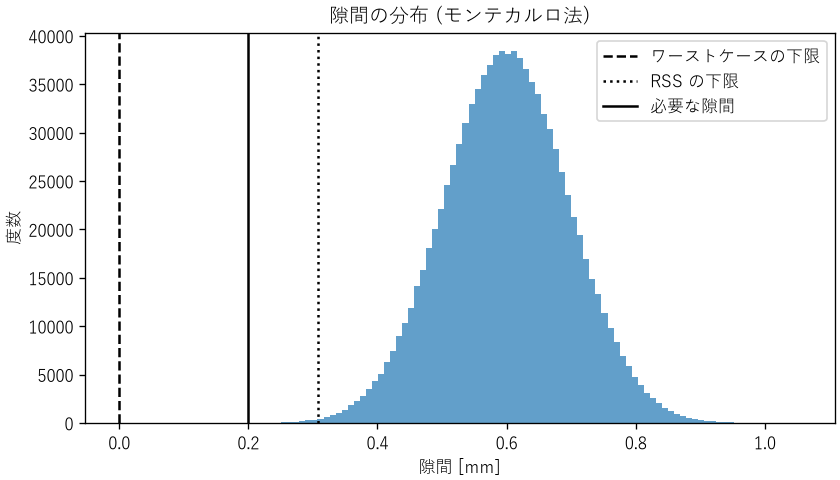
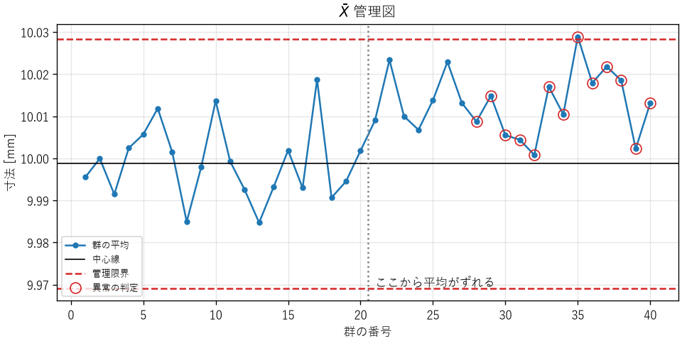

統計と実験計画
==============

測定値も部品の寸法も処理時間も、ばらつきを持っています。ばらつきのあるデータから正しい結論を引き出すには、統計の考え方が必要です。本章では、推定と検定の基本、相関と因果の違い、少ない実験で多くの情報を得る実験計画法、部品のばらつきが製品に与える影響を見積もる公差解析、工程の変化を監視する管理図を説明します。

ばらつきを要約する
------------------

データの中心を表す代表値には、平均値と中央値があります。平均値は外れ値の影響を受けやすく、中央値は受けにくいという違いがあります（第 4 章の処理時間の例）。データの散らばりの大きさは、標準偏差で表します。:math:`n` 個のデータ :math:`x_1, \ldots, x_n` の平均 :math:`\bar{x}` と標準偏差 :math:`s` は、次の式で求めます。

.. math::
   :label: eq-mean-std

   \bar{x} = \frac{1}{n}\sum_{i=1}^{n} x_i, \qquad
   s = \sqrt{\frac{1}{n - 1}\sum_{i=1}^{n} (x_i - \bar{x})^2}

標準偏差の式で :math:`n` ではなく :math:`n - 1` で割るのは、データから求めた平均を使っているため、自由度が 1 つ減るからです。

多くの測定値は、平均を中心に左右対称の釣鐘型に分布します。これを正規分布と呼びます。正規分布では、平均から ±1 標準偏差の範囲に約 68 %、±2 標準偏差に約 95 %、±3 標準偏差に約 99.7 % のデータが入ります。ただし、処理時間のように右に裾の長い分布や、外れ値を含む分布も多いため、正規分布を仮定する前に、ヒストグラムを描いて分布の形を確かめます。

推定
----

統計では、知りたい対象全体（母集団）から一部（標本）を取り出して調べ、母集団の性質を推定します。たとえば、製造した抵抗器のすべてを測定する代わりに、10 個を測定して、全体の平均の抵抗値を推定します。

標本の平均は、母集団の平均の推定値ですが、標本の選び方によってばらつきます。標本の平均のばらつきの大きさを標準誤差と呼び、:math:`s/\sqrt{n}` で推定します。データを 4 倍に増やすと、標準誤差は半分になります。

推定値の確からしさは、信頼区間で表します。データが正規分布に従うとき、母平均の 95 % 信頼区間は次の式で求めます。

.. math::
   :label: eq-confidence-interval

   \bar{x} \pm t_{0.975}(n-1)\frac{s}{\sqrt{n}}

:math:`t_{0.975}(n-1)` は自由度 :math:`n - 1` の t 分布の値で、:math:`n = 10` なら 2.262 です。:math:`n` が大きくなると 1.96 に近づきます。

:download:`ch11_statistics.py <../examples/ch11_statistics.py>` で、公称値 100 Ω の抵抗器 10 個の測定値から信頼区間を求めると、次のようになります。

.. code-block:: text

   1. 抵抗値の測定
      平均 100.150 Ω, 標準偏差 0.303 Ω
      母平均の 95 % 信頼区間: 99.933〜100.367 Ω

「95 % 信頼区間」は、「同じ方法で標本を取り、区間を作ることを何度も繰り返すと、そのうち 95 % の区間が真の平均を含む」という意味です。この区間は公称値 100 Ω を含んでいるので、このデータからは、平均が公称値からずれているとは言えません。

検定
----

「改修によってプログラムが速くなったか」「新しい材料で強度が上がったか」のように、2 つのグループの差が偶然のばらつきで説明できるかどうかを判断する方法が、仮説検定です。

検定では、まず「差はない」という仮説（帰無仮説）を立てます。そして、帰無仮説が正しいとした場合に、実際に観測した以上の差が偶然に生じる確率（p 値）を計算します。p 値が小さい（慣例的には 5 % 未満）場合、「差がないとすると、めったに起きないことが起きた」と考え、帰無仮説を棄却して、差があると判断します。

並べ替え検定
^^^^^^^^^^^^

検定の考え方を直接的に表しているのが、並べ替え検定です。改修前と改修後の処理時間を 20 回ずつ測定したとします。もし改修の効果がなければ、40 個の測定値に付いている「改修前」「改修後」のラベルは意味を持たず、ラベルをでたらめに付け替えても、平均の差の分布は変わらないはずです。そこで、ラベルをランダムに付け替えて平均の差を計算することを何度も繰り返し、実際の差以上の差が出る割合を p 値とします。

.. literalinclude:: ../examples/ch11_statistics.py
   :language: python
   :pyobject: permutation_test
   :lineno-match:

.. code-block:: text

   2. 応答時間の比較
      改修前の平均 51.95 ms, 改修後の平均 49.62 ms
      並べ替え検定の p 値: 0.0003
      有意水準 5 % で「差がない」という仮説を棄却します。

ラベルをランダムに付け替えて、実際の差（2.33 ms）以上の差が出たのは、2 万回のうち数回だけでした。偶然とは考えにくいので、改修によって速くなったと判断できます。並べ替え検定は、データが正規分布に従うことを仮定しないため、処理時間のような分布にも使えます。正規分布を仮定できる場合は、t 検定もよく使われます。

検定の注意点
^^^^^^^^^^^^

検定の結果は誤解されやすいため、次の点に注意します。

* **p 値は「帰無仮説が正しい確率」ではありません。** 帰無仮説が正しいと仮定したときに、観測したデータ以上に極端なデータが得られる確率です。
* **有意であることは、差が大きいことを意味しません。** データが非常に多ければ、実用上は無視できる小さな差でも有意になります。差の大きさ（効果量）とその信頼区間を、p 値と合わせて報告します。
* **有意でないことは、差がないことを意味しません。** データが少なければ、本当に差があっても検出できません。
* **何度も検定すれば、偶然に有意になるものが出てきます。** 有意水準 5 % で 20 個の項目を検定すれば、本当はどれにも差がなくても、平均 1 個は有意になります。多くの項目を検定する場合は、有意水準を厳しくする（ボンフェローニ補正など）か、事前に検定する項目を決めておきます。

相関と因果
----------

2 つの量が一緒に増えたり減ったりする関係を相関と呼びます。相関があっても、一方が他方の原因であるとは限りません。

たとえば、ある工場のデータで「冷却ファンの回転数が高い日ほど、製品の不良率が高い」という相関が見つかったとします。しかし、これはファンが不良の原因なのではなく、気温が高い日にファンの回転数が上がり、同時に高温で不良も増えている、という可能性があります。このように、2 つの量の両方に影響する隠れた要因を交絡因子と呼びます。

因果関係を確かめる最も確実な方法は、原因と考える要因を意図的に変え、ほかの条件をそろえて結果を比べる実験です。ソフトウェアの A/B テストも、利用者をランダムに 2 つのグループに分けて比べる実験で、交絡因子の影響を除くための方法です。

実験計画法
----------

実験には時間と費用がかかります。実験計画法は、少ない実験回数で、多くの要因の影響を正しく調べるための方法です。

1 因子ずつ変える実験の問題
^^^^^^^^^^^^^^^^^^^^^^^^^^

直感的な実験の方法は、基準の条件から、要因（因子）を 1 つずつ変えて結果を見る方法です。しかし、この方法では、要因どうしの組み合わせによる効果（交互作用）を見逃すことがあります。

:download:`ch11_doe.py <../examples/ch11_doe.py>` は、接着剤の硬化条件として、硬化温度（A）、硬化時間（B）、塗布量（C）の 3 つの因子を、それぞれ 2 水準（低・高、短・長、少・多）で変え、全 8 通りの組み合わせで接着強度を測定した例です。水準は −1 と +1 で表します。

.. list-table::
   :header-rows: 1
   :widths: 20 20 20 40

   * - A（温度）
     - B（時間）
     - C（塗布量）
     - 接着強度 [MPa]
   * - −1
     - −1
     - −1
     - 47.1
   * - +1
     - −1
     - −1
     - 49.0
   * - −1
     - +1
     - −1
     - 43.2
   * - +1
     - +1
     - −1
     - 57.3
   * - −1
     - −1
     - +1
     - 46.6
   * - +1
     - −1
     - +1
     - 49.5
   * - −1
     - +1
     - +1
     - 42.9
   * - +1
     - +1
     - +1
     - 56.8

基準の条件（すべて −1）から B だけを +1 に変えると、強度は 47.1 MPa から 43.2 MPa に下がります。1 因子ずつ変える実験では「硬化時間を長くすると強度が下がる」と結論してしまいます。

要因実験
^^^^^^^^

すべての組み合わせを試す実験を要因実験と呼びます。各因子の効果（主効果）は、「その因子が +1 のときの平均 − −1 のときの平均」で求めます。2 つの因子の交互作用は、2 つの水準の積が +1 になる条件の平均と、−1 になる条件の平均の差で求めます。

.. literalinclude:: ../examples/ch11_doe.py
   :language: python
   :pyobject: effect
   :lineno-match:

.. code-block:: text

   効果の大きさ (絶対値の大きい順)
     A     :  +8.20 MPa
     A×B   :  +5.80 MPa
     B     :  +2.00 MPa
     A×B×C :  -0.30 MPa
     C     :  -0.20 MPa
     A×C   :  +0.20 MPa
     B×C   :  -0.20 MPa

温度（A）の効果が最も大きく、次に温度と時間の交互作用（A×B）が大きいことが分かります。交互作用があるということは、時間の効果が温度によって変わるということです。実際、温度が低いとき、時間を長くすると強度は平均 3.8 MPa 下がりますが、温度が高いときは平均 7.8 MPa 上がります。最も強度が高いのは「高温・長時間」の組み合わせです。一方、塗布量（C）が関係する効果はいずれも小さく、塗布量は少なくてよい（材料を節約できる）ことも分かります。

この例では 3 因子なので 8 回で済みましたが、因子が増えると組み合わせの数は急増します（7 因子で 128 通り）。その場合は、直交表を使って、交互作用の一部を調べることを諦める代わりに実験回数を減らす一部実施要因実験が使われます。

実験の 3 原則
^^^^^^^^^^^^^

統計学者フィッシャーは、信頼できる実験のための 3 つの原則を示しました。

繰り返し
   同じ条件で複数回実験し、偶然のばらつきの大きさを評価します。上の例では各条件 1 回だけなので、効果が偶然のばらつきより大きいかどうかを厳密には判断できません。

無作為化
   実験の順番をランダムにします。順番どおりに実験すると、時間とともに変化する要因（装置の温まり、材料のロットなど）の影響が、因子の効果と区別できなくなります。

局所管理
   実験の条件をそろえられる単位（同じ日、同じ装置など）ごとにまとめ、その単位の違いの影響を除きます。

公差解析
--------

部品の寸法や電子部品の特性値には、製造のばらつきがあります。設計図では、許容するばらつきの範囲を公差として指定します（例: 10.0 ± 0.1 mm）。複数の部品を組み合わせると、ばらつきが積み重なります。部品のばらつきが組み立てた製品にどう影響するかを見積もるのが、公差解析です。

:download:`ch11_tolerance.py <../examples/ch11_tolerance.py>` は、内寸 50.6 ± 0.10 mm のケースに、10.0 ± 0.10 mm、20.0 ± 0.20 mm、15.0 ± 0.15 mm、5.0 ± 0.05 mm の 4 つの部品を一列に並べて収める例です。隙間が 0.2 mm 未満になると組み立てられないものとします。隙間の公称値は 0.6 mm です。隙間のばらつきを、3 つの方法で見積もります。

ワーストケース法
   すべての寸法が同時に最悪の側に外れたと仮定し、公差を単純に足します。隙間の公差は :math:`0.10 + 0.10 + 0.20 + 0.15 + 0.05 = 0.60` mm です。最悪の場合は隙間が 0 mm になり、要求を満たしません。

RSS 法（二乗和平方根法）
   各寸法のばらつきが独立で正規分布に従い、公差がそれぞれ標準偏差の 3 倍（:math:`3\sigma`）にあたると仮定します。独立な量の和の分散は、それぞれの分散の和になる（第 4 章の不確かさの伝播と同じ）ので、全体の公差は 2 乗和の平方根になります。

   .. math::

      \begin{aligned}
      T &= \sqrt{0.10^2 + 0.10^2 + 0.20^2 + 0.15^2 + 0.05^2} \\
        &\approx 0.292 \ \mathrm{mm}
      \end{aligned}

   隙間は 0.6 ± 0.292 mm で、最小でも約 0.31 mm あり、要求を満たします。

モンテカルロ法
   各寸法を、仮定した分布に従う乱数で生成し、組み立てを何度もシミュレーションして、隙間の分布を直接求めます。分布が正規分布でない場合や、寸法と結果の関係が非線形の場合にも使えます。

.. code-block:: text

   隙間の公称値: 0.600 mm
   ワーストケース法: 0.600 ± 0.600 mm (最小 0.000 mm)
   RSS 法          : 0.600 ± 0.292 mm (最小 0.308 mm)
   モンテカルロ法  : 平均 0.600 mm, 標準偏差 0.0972 mm
     隙間が 0.2 mm 未満になる割合: 0.0019%

.. _fig-tolerance:

   モンテカルロ法による隙間の分布

モンテカルロ法では、100 万回の試行のうち約 0.0019 %（約 19 回）で隙間が不足しました。これは正規分布から計算される理論値（約 0.0019 %）と一致します。ただし、このように発生頻度の低い事象を調べるときは、試行回数を十分に多くする必要があります。10 万回の試行では、該当するのは平均 2 回程度しかなく、推定値は大きくばらつきます。

ワーストケース法は安全側ですが、すべての寸法が同時に最悪になることは現実にはほとんど起きないため、過剰に厳しい公差を要求することになりがちです。RSS 法は現実的ですが、ばらつきが独立で正規分布に従い、平均が公称値に一致しているという仮定に依存します。製造工程の平均がずれていると、不良率は大きく増えます。安全に関わる部分にはワーストケース法を、それ以外には RSS 法を使う、というように使い分けるのが一般的です。

工程能力指数
^^^^^^^^^^^^

製造工程が規格をどの程度の余裕で満たしているかは、工程能力指数で表します。規格の上限を USL、下限を LSL、工程の平均を :math:`\mu`、標準偏差を :math:`\sigma` とすると、次の式で求めます。

.. math::
   :label: eq-cpk

   \begin{aligned}
   C_p &= \frac{\mathrm{USL} - \mathrm{LSL}}{6\sigma} \\
   C_{pk} &= \min\left(\frac{\mathrm{USL} - \mu}{3\sigma}, \frac{\mu - \mathrm{LSL}}{3\sigma}\right)
   \end{aligned}

:math:`C_p` は規格の幅とばらつきの比で、:math:`C_{pk}` は平均のずれも考慮した指数です。一般に :math:`C_{pk} \ge 1.33`\ （平均から規格の端まで :math:`4\sigma` 以上）が目標とされます。上の例では、下限だけの規格（LSL = 0.2 mm）なので、:math:`C_{pk} = (0.6 - 0.2) / (3 \times 0.0972) \approx 1.37` です。

管理図
------

工程能力指数は、ある時点での工程のばらつきと規格の関係を表します。しかし、工程は時間とともに変化します。工具の摩耗、材料のロットの変更、作業者の交代などで、平均やばらつきが変わることがあります。工程の状態を時系列で監視し、変化を早く見つけるための道具が管理図です。

管理図の考え方の基本は、ばらつきの原因を 2 つに分けることです。

偶然原因
   工程に常に存在する、多くの小さな要因によるばらつきです。工程を根本的に変えない限り減らせません。

異常原因（特殊原因）
   工具の破損や設定の誤りなど、特定できる原因によるばらつきです。原因を見つけて取り除くべきものです。

偶然原因によるばらつきだけの工程を「管理状態にある」と言います。管理図は、異常原因が現れたかどうかを判定します。

平均値の管理図
^^^^^^^^^^^^^^

一定の間隔で少数（たとえば 5 個）のサンプルを取り、その平均を群の平均として点で描きます。工程が管理状態にあった期間のデータから中心線と管理限界を決め、新しい点がその範囲に入っているかを見ます。群の大きさが 5 のとき、管理限界は、群の平均の平均 :math:`\bar{\bar{X}}` と、群の範囲（最大値 − 最小値）の平均 :math:`\bar{R}` から、次の式で求めます。

.. math::
   :label: eq-control-limits

   \mathrm{UCL} = \bar{\bar{X}} + A_2 \bar{R}, \qquad
   \mathrm{LCL} = \bar{\bar{X}} - A_2 \bar{R}, \qquad A_2 = 0.577

これは、群の平均の標準偏差の 3 倍を、範囲から推定したものです。工程が管理状態にあれば、点が管理限界の外に出る確率は約 0.3 % です。

:download:`ch11_control_chart.py <../examples/ch11_control_chart.py>` は、製品の寸法を 1 時間ごとに 5 個ずつ測定した、という想定の模擬データで :math:`\bar{X}` 管理図を描きます。21 番目の群から、工程の平均を標準偏差の 0.5 倍だけずらしてあります。異常の判定には、JIS Z 9020-2 に示されているルールのうち、次の 2 つを使います。

* ルール 1: 点が管理限界の外に出る
* ルール 2: 9 点が続けて中心線の同じ側に並ぶ

.. code-block:: text

   中心線 9.9988 mm, 上方管理限界 10.0284 mm, 下方管理限界 9.9692 mm
   ルール 1 (管理限界の外) の群: [35]
   ルール 2 (9 点連続で同じ側) の群: [28, 29, 30, 31, 32, 33, 34, 35, 36, 37, 38, 39, 40]
   (工程の平均は 21 番目の群からずれています)

.. _fig-control-chart:

   :math:`\bar{X}` 管理図

平均のずれが小さいため、点が管理限界の外に出たのは 35 番目の群が最初でした。一方、ルール 2 は、点が中心線の上側に偏り続けていることから、28 番目の群で変化を検出しています（:numref:`fig-control-chart`）。管理限界の外に出るかどうかだけでなく、点の並び方の癖も見ることで、小さな変化を早く見つけられます。ただし、判定のルールを増やすほど、工程に変化がないのに異常と判定する誤報も増えます。

管理図の使い方の注意
^^^^^^^^^^^^^^^^^^^^

* **管理限界は規格限界とは別のもの**: 管理限界は工程の実際のばらつきから決まり、規格限界は製品に求められる要求から決まります。管理状態にあっても規格を満たさない工程（工程能力が不足している工程）もあれば、規格は満たしていても管理状態にない工程もあります。
* **過剰な調整をしない**: 管理限界の内側での偶然のばらつきに反応して、そのたびに工程を調整すると、かえってばらつきが大きくなります。異常と判定されたときだけ、原因を調べて対処します。
* **ソフトウェアの監視への応用**: サーバーの応答時間やエラー率の監視でも、同じ考え方が使えます。一時的な揺らぎごとに警報を出すと、警報が多すぎて無視されるようになります（第 14 章）。通常のばらつきの範囲を把握し、それを超えた変化や、持続的な偏りを検出するように警報を設計します。

まとめ
------

* データの分布の形を確かめてから、平均値・中央値・標準偏差で要約します。
* 推定値の確からしさは信頼区間で表します。標準誤差はデータ数の平方根に反比例します。
* 検定の p 値は誤解されやすいため、効果の大きさと合わせて報告します。何度も検定すると、偶然に有意になるものが出てきます。
* 相関は因果を意味しません。因果関係は、条件をそろえた実験で確かめます。
* 要因実験では、1 因子ずつ変える実験では見逃す交互作用を調べられます。
* 公差の積み上げは、ワーストケース法、RSS 法、モンテカルロ法で見積もり、目的に応じて使い分けます。
* 管理図で工程の状態を時系列で監視し、異常原因による変化を早く見つけます。
