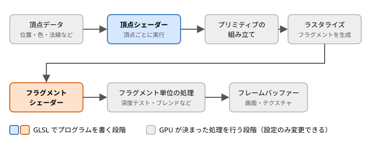

第 2 章 シェーダーと GPU の基礎
===============================

この章では、GLSL を書き始める前に知っておくべき、GPU が画像を描く仕組みと、その中でシェーダーが担う役割を説明します。

シェーダーとは
--------------

シェーダーは、GPU（Graphics Processing Unit）上で実行される小さなプログラムです。3D の物体をどこに表示するか、画面の各点を何色にするか、といった描画の計算を行います。GLSL（OpenGL Shading Language）は、OpenGL、OpenGL ES、WebGL で使われるシェーダーの記述言語で、C 言語に似た文法を持っています。

CPU と GPU の違い
-----------------

CPU と GPU は、得意な処理が異なります。

.. list-table::
   :header-rows: 1
   :widths: 20 40 40

   * - 項目
     - CPU
     - GPU
   * - 演算器の数
     - 少ない（数個〜数十個のコア）
     - 非常に多い（数千個以上の演算器）
   * - 得意な処理
     - 複雑な分岐を含む、順番に進める処理
     - 同じ計算を大量のデータに対して同時に行う処理
   * - 描画での役割
     - 描画の準備と指示（どの物体をどの設定で描くか）
     - 頂点や画面の各点についての計算

画面の解像度が 1920 × 1080 の場合、画面の点は約 200 万個あります。それぞれの点の色を決める計算は互いに独立しているので、GPU はこれらを並列に処理できます。シェーダーは、この「1 つの頂点」や「1 つの点」についての計算を記述するプログラムです。GPU は同じシェーダーを多数の頂点や点に対して同時に実行します。

この仕組みから、シェーダーには次の性質があります。

* シェーダーの 1 回の実行は、1 つの頂点または 1 つのフラグメント（後述）だけを担当します。
* 同時に実行されている、ほかの頂点やフラグメントの計算結果を読むことはできません。
* 前回の描画で計算した値を、変数に残しておくことはできません。値を残したい場合は、テクスチャなどに書き出す必要があります（第 13 章）。

レンダリングパイプライン
------------------------

GPU が頂点データから画像を作るまでの一連の処理を、レンダリングパイプラインと呼びます。WebGL 2.0（OpenGL ES 3.0）のレンダリングパイプラインは、おおよそ次の図のような流れになっています。

   レンダリングパイプライン

.. list-table::
   :header-rows: 1
   :widths: 25 75

   * - 段階
     - 内容
   * - 頂点データ
     - 描きたい形を表す頂点の情報です。位置のほか、色、法線、テクスチャ座標などを頂点ごとに持たせることができます。JavaScript から GPU のメモリに転送します。
   * - 頂点シェーダー
     - 頂点ごとに 1 回実行され、頂点の画面上の位置を計算します（第 7 章）。
   * - プリミティブの組み立て
     - 頂点を 3 個ずつ組み合わせて三角形を作るなど、頂点を図形（プリミティブ）にまとめます。画面の外にはみ出した部分の切り取り（クリッピング）もここで行われます。
   * - ラスタライズ
     - 三角形が画面上のどの画素を覆うかを調べ、覆われた画素ごとにフラグメントを作ります。頂点シェーダーが出力した値は、三角形の内部で補間されてフラグメントに渡されます（第 6 章）。
   * - フラグメントシェーダー
     - フラグメントごとに 1 回実行され、その色を計算します（第 8 章）。
   * - フラグメント単位の処理
     - 深度テスト（手前の物体だけを残す処理）や、ブレンド（半透明の合成）などを行います。
   * - フレームバッファー
     - 最終的な色が書き込まれる領域です。通常は画面（WebGL ではキャンバス）ですが、テクスチャに書き込むこともできます（第 13 章）。

このうち、プログラムを書いて処理の内容を決められるのは、頂点シェーダーとフラグメントシェーダーの 2 つです。それ以外の段階は GPU が決まった処理を行い、プログラムからは設定（深度テストを行うかどうかなど）だけを変更できます。

.. note::

   フラグメントは「画素の候補」です。フラグメントシェーダーが計算した色は、深度テストなどで捨てられることがあり、そのまま画面の画素の色になるとは限りません。そのため、画素とは区別してフラグメントと呼びます。

頂点シェーダーとフラグメントシェーダー
--------------------------------------

2 つのシェーダーの役割をまとめると、次のようになります。

.. list-table::
   :header-rows: 1
   :widths: 20 40 40

   * - 項目
     - 頂点シェーダー
     - フラグメントシェーダー
   * - 実行される単位
     - 頂点ごと
     - フラグメントごと
   * - 主な入力
     - 頂点データ（位置、色、法線など）
     - 頂点シェーダーの出力を補間した値
   * - 主な出力
     - 頂点の位置（``gl_Position``）
     - フラグメントの色
   * - 主な用途
     - 座標変換、頂点の変形
     - 色の計算、テクスチャの貼り付け、ライティング

三角形 1 枚を描く場合、頂点シェーダーは 3 回しか実行されませんが、フラグメントシェーダーは三角形が覆う画素の数だけ実行されます。画面いっぱいの三角形なら数十万回以上です。この実行回数の違いは、性能を考えるときに重要になります（第 15 章）。

GLSL のバージョン
-----------------

GLSL には、使用するグラフィックス API に応じて複数のバージョンがあります。シェーダーの先頭には、どのバージョンで書いたかを ``#version`` で指定します。

.. list-table::
   :header-rows: 1
   :widths: 35 35 30

   * - グラフィックス API
     - GLSL のバージョン
     - ``#version`` の指定
   * - OpenGL 3.3
     - GLSL 3.30
     - ``#version 330``
   * - OpenGL 4.6
     - GLSL 4.60
     - ``#version 460``
   * - OpenGL ES 2.0、WebGL 1.0
     - GLSL ES 1.00
     - ``#version 100``\ （省略可）
   * - OpenGL ES 3.0、WebGL 2.0
     - GLSL ES 3.00
     - ``#version 300 es``
   * - OpenGL ES 3.2
     - GLSL ES 3.20
     - ``#version 320 es``

GLSL ES（ES は Embedded Systems の略）は、スマートフォンなどの組み込み機器向けの OpenGL ES で使われる GLSL です。WebGL は OpenGL ES をもとに作られているため、WebGL でも GLSL ES を使います。

本書では、WebGL 2.0 で使う GLSL ES 3.00 を扱います。デスクトップ向けの GLSL（OpenGL 3.3 以降）とは文法の大部分が共通しているので、本書の内容はデスクトップ向けの GLSL を学ぶ際にもそのまま役立ちます。主な違いは付録 B にまとめています。

.. note::

   Vulkan でも GLSL でシェーダーを書くことができます。ただし、Vulkan では GLSL のソースコードを事前に SPIR-V という中間形式に変換してから使います。
