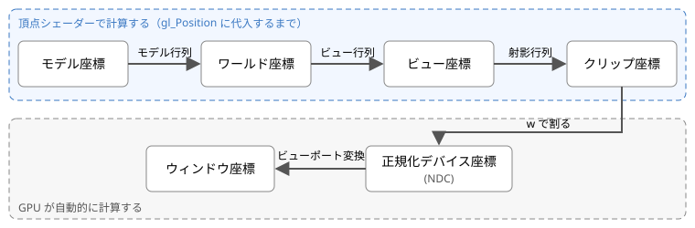

第 7 章 頂点シェーダー
======================

頂点シェーダーの主な仕事は、頂点の位置を計算して ``gl_Position`` に書き込むことです。3D の物体を画面に表示するには、物体の頂点の座標を、画面上の位置に変換する必要があります。この章では、その座標変換の仕組みを説明します。

頂点シェーダーの組み込み変数
----------------------------

頂点シェーダーでは、次の組み込み変数を使えます。

.. list-table::
   :header-rows: 1
   :widths: 25 20 55

   * - 変数
     - 型
     - 内容
   * - ``gl_Position``
     - ``vec4``
     - 出力。頂点のクリップ座標（後述）です。必ず書き込みます。
   * - ``gl_PointSize``
     - ``float``
     - 出力。点（``gl.POINTS``）を描くときの点の大きさ（ピクセル）です。
   * - ``gl_VertexID``
     - ``int``
     - 入力。描画中の頂点の番号です（第 8 章）。
   * - ``gl_InstanceID``
     - ``int``
     - 入力。インスタンス描画（同じ形を 1 回の命令で複数描く機能）での番号です。

座標系と変換の流れ
------------------

3D の物体の頂点の座標は、次の図のように、いくつかの座標系を順に変換されて画面上の位置になります。

   座標変換の流れ

.. list-table::
   :header-rows: 1
   :widths: 25 75

   * - 座標系
     - 内容
   * - モデル座標
     - 物体ごとの座標系です。物体の中心を原点とするなど、形を作りやすいように決めます。ローカル座標とも呼びます。
   * - ワールド座標
     - シーン全体に共通の座標系です。すべての物体をこの座標系に配置します。
   * - ビュー座標
     - カメラを原点とし、カメラが z 軸の負の方向を向くように決めた座標系です。
   * - クリップ座標
     - 射影行列で変換した後の 4 成分の座標です。頂点シェーダーは、この座標を ``gl_Position`` に書き込みます。
   * - 正規化デバイス座標（NDC）
     - クリップ座標の x、y、z を w で割った座標です。x、y、z が -1 から 1 の範囲にある部分が表示されます。
   * - ウィンドウ座標
     - キャンバス上のピクセル単位の座標です。左下が原点です。

頂点シェーダーで計算するのは、モデル座標からクリップ座標までです。それ以降の変換は GPU が自動的に行います。

同次座標
--------

座標変換では、3 次元の点 (x, y, z) を、4 番目の成分 w を加えた 4 次元のベクトル (x, y, z, w) で表します。これを同次座標と呼びます。

* 位置（点）は w = 1 で表します。
* 方向（向きだけを持つベクトル）は w = 0 で表します。

同次座標を使うと、回転、拡大縮小、平行移動をすべて 4 × 4 行列の積で表せます。また、w = 0 の方向ベクトルは、平行移動の行列を掛けても変化しません。方向は位置を持たないので、平行移動の影響を受けないのが正しい結果です。

基本的な変換行列
----------------

平行移動
~~~~~~~~

点を :math:`(t_x, t_y, t_z)` だけ移動する行列です。

.. math::

   T = \begin{pmatrix}
   1 & 0 & 0 & t_x \\
   0 & 1 & 0 & t_y \\
   0 & 0 & 1 & t_z \\
   0 & 0 & 0 & 1
   \end{pmatrix}, \quad
   T \begin{pmatrix} x \\ y \\ z \\ 1 \end{pmatrix} = \begin{pmatrix} x + t_x \\ y + t_y \\ z + t_z \\ 1 \end{pmatrix}

拡大縮小
~~~~~~~~

x、y、z 方向にそれぞれ :math:`s_x, s_y, s_z` 倍する行列です。

.. math::

   S = \begin{pmatrix}
   s_x & 0 & 0 & 0 \\
   0 & s_y & 0 & 0 \\
   0 & 0 & s_z & 0 \\
   0 & 0 & 0 & 1
   \end{pmatrix}

回転
~~~~

x 軸、y 軸、z 軸まわりに角度 :math:`\theta` だけ回転する行列です。回転の向きは、軸の正の方向から原点を見て反時計回りです。

.. math::

   R_x = \begin{pmatrix}
   1 & 0 & 0 & 0 \\
   0 & \cos\theta & -\sin\theta & 0 \\
   0 & \sin\theta & \cos\theta & 0 \\
   0 & 0 & 0 & 1
   \end{pmatrix}

   R_y = \begin{pmatrix}
   \cos\theta & 0 & \sin\theta & 0 \\
   0 & 1 & 0 & 0 \\
   -\sin\theta & 0 & \cos\theta & 0 \\
   0 & 0 & 0 & 1
   \end{pmatrix}

   R_z = \begin{pmatrix}
   \cos\theta & -\sin\theta & 0 & 0 \\
   \sin\theta & \cos\theta & 0 & 0 \\
   0 & 0 & 1 & 0 \\
   0 & 0 & 0 & 1
   \end{pmatrix}

変換の組み合わせ
~~~~~~~~~~~~~~~~

複数の変換は、行列の積で 1 つの行列にまとめられます。点 p に対して、拡大縮小、回転、平行移動の順に変換を行う場合は、次のように書きます。

.. math::

   p' = T R S p

行列は右側にあるものから順に点に作用します。行列の積は交換できないため、掛ける順序を変えると結果も変わります。例えば、原点を中心に回転してから移動すると「その場で回転した物体を移動する」ことになりますが、移動してから回転すると「原点のまわりを公転する」ことになります。

モデル・ビュー・射影行列
------------------------

モデル座標からクリップ座標までの変換は、通常、次の 3 つの行列で行います。

.. list-table::
   :header-rows: 1
   :widths: 25 75

   * - 行列
     - 内容
   * - モデル行列 :math:`M`
     - モデル座標をワールド座標に変換します。物体の位置、向き、大きさを表し、物体ごとに異なります。
   * - ビュー行列 :math:`V`
     - ワールド座標をビュー座標に変換します。カメラの位置と向きを表します。カメラを動かすことは、世界全体を逆向きに動かすことと同じなので、ビュー行列はカメラの位置と向きを表す行列の逆行列になります。
   * - 射影行列 :math:`P`
     - ビュー座標をクリップ座標に変換します。遠くの物を小さく表示する透視投影などを表します。

頂点シェーダーでは、これらを順に掛けてクリップ座標を求めます。

.. math::

   p_{\mathrm{clip}} = P V M p_{\mathrm{model}}

.. code-block:: glsl

   gl_Position = uProjection * uView * uModel * vec4(aPosition, 1.0);

射影行列
~~~~~~~~

透視投影の射影行列は、縦方向の視野角 :math:`\theta`、画面の縦横比 :math:`a`\ （幅 ÷ 高さ）、表示する奥行きの範囲 :math:`n`\ （手前）と :math:`f`\ （奥）から、次のように作ります。

.. math::

   P = \begin{pmatrix}
   \dfrac{c}{a} & 0 & 0 & 0 \\
   0 & c & 0 & 0 \\
   0 & 0 & \dfrac{f + n}{n - f} & \dfrac{2 f n}{n - f} \\
   0 & 0 & -1 & 0
   \end{pmatrix}, \quad
   c = \frac{1}{\tan(\theta / 2)}

この行列で変換すると、w 成分にはビュー座標の -z（カメラからの奥行き）が入ります。この後で GPU が x、y、z を w で割るため、遠くにある点ほど画面の中心に近づき、小さく表示されます。縦横比 :math:`a` で x を割っているのは、横長のキャンバスでも物体が横に引き伸ばされないようにするためです。

w による除算とビューポート変換
------------------------------

頂点シェーダーが出力したクリップ座標 :math:`(x_c, y_c, z_c, w_c)` は、GPU によって次のように変換されます。

まず、w で割って正規化デバイス座標（NDC）にします。

.. math::

   (x_n, y_n, z_n) = \left(\frac{x_c}{w_c}, \frac{y_c}{w_c}, \frac{z_c}{w_c}\right)

:math:`x_n, y_n, z_n` が -1 から 1 の範囲にある部分だけが表示されます。範囲外の部分は、この変換の前にクリッピングで取り除かれます。

次に、ビューポート変換で、キャンバス上のピクセル単位の座標にします。``gl.viewport(x0, y0, width, height)`` で設定した範囲に対して、次のように計算されます。

.. math::

   x_w = \frac{x_n + 1}{2} \cdot \mathrm{width} + x_0, \quad
   y_w = \frac{y_n + 1}{2} \cdot \mathrm{height} + y_0

:math:`z_n` は 0 から 1 の範囲の深度値に変換され、深度テストに使われます。

第 3 章のサンプル 01 で w = 1.0 としていたのは、w で割っても値が変わらないようにするためです。つまり、サンプル 01 では頂点の座標をそのまま正規化デバイス座標として指定していたことになります。

列優先の行列
------------

GLSL の行列は列優先（column-major）でメモリに格納されます。``uniformMatrix4fv`` で渡す 16 個の数値の配列は、先頭の 4 個が 1 列目、次の 4 個が 2 列目、…という順に並べます。例えば、平行移動の行列は、JavaScript では次のように書きます。:math:`t_x, t_y, t_z` が配列の最後の 4 個（4 列目）に入る点に注意してください。

.. code-block:: javascript

   // 列優先：1 行に 1 列分を書いている
   const translation = new Float32Array([
       1, 0, 0, 0,     // 1 列目
       0, 1, 0, 0,     // 2 列目
       0, 0, 1, 0,     // 3 列目
       tx, ty, tz, 1,  // 4 列目
   ]);

``uniformMatrix4fv`` の第 2 引数は転置するかどうかの指定です。本書のサンプルでは常に ``false`` を指定し、列優先の配列をそのまま渡しています。

サンプル
--------

サンプル 03 では、立方体をモデル・ビュー・射影行列で変換して表示します。スライダーで各行列のパラメーターを変更できます。

.. rubric:: サンプル 03：座標変換

`ブラウザーで開く <../examples/03_transform.html>`__／:download:`ダウンロード <../../examples/03_transform.html>`／シェーダー：:download:`03_transform.vert <../../examples/shaders/03_transform.vert>`、:download:`03_transform.frag <../../examples/shaders/03_transform.frag>`

.. raw:: html

   <iframe src="../examples/03_transform.html" title="サンプル 03：座標変換" loading="lazy" style="width: 100%; height: 560px; border: 1px solid #ccc;"></iframe>

.. literalinclude:: ../../examples/shaders/03_transform.vert
   :language: glsl
   :caption: 03_transform.vert（頂点シェーダー）

行列は JavaScript で計算しています。

.. literalinclude:: ../../examples/03_transform.html
   :language: javascript
   :start-after: // ---- 行列の計算 ----
   :end-before: // ---- 行列の計算ここまで ----
   :dedent: 8
   :caption: 行列の計算

このサンプルでは、次の 2 つの機能も有効にしています。

* **深度テスト**：フラグメントごとに深度値を比較し、手前にあるものだけを残します。``gl.enable(gl.DEPTH_TEST)`` で有効にします。無効にすると、後から描いた面が手前の面を上書きしてしまいます。
* **背面カリング**：画面上で頂点が時計回りに並ぶ三角形（裏向きの面）を描かないようにします。``gl.enable(gl.CULL_FACE)`` で有効にします。立方体の各面の頂点は、外側から見て反時計回りになるように並べています。

試してみよう
------------

* 視野角を大きくしたり小さくしたりして、遠近感がどのように変わるかを確かめる。
* 頂点シェーダーの ``uProjection * uView * uModel`` の順序を ``uModel * uView * uProjection`` に変えて、正しく表示されなくなることを確かめる。
* JavaScript のモデル行列の計算で、平行移動と回転の順序を入れ替えて、動き方の違いを確かめる。
