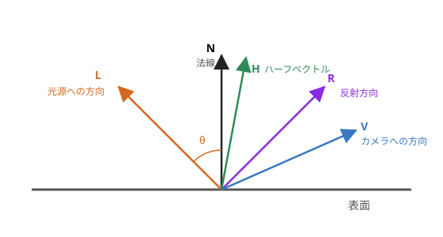

第 10 章 ライティング
=====================

物体に光が当たったときの明るさを計算することを、ライティングと呼びます。ライティングによって陰影が付くと、物体の立体感がはっきりします。この章では、シェーダーでよく使われる基本的なライティングのモデルを説明します。

ライティングに使うベクトル
--------------------------

ライティングの計算では、表面上の点について、次の単位ベクトル（長さが 1 のベクトル）を使います。

   ライティングに使うベクトル

.. list-table::
   :header-rows: 1
   :widths: 15 85

   * - 記号
     - 内容
   * - :math:`N`
     - 法線。表面に垂直で、外側を向くベクトルです。
   * - :math:`L`
     - 表面から光源へ向かうベクトルです。
   * - :math:`V`
     - 表面からカメラ（視点）へ向かうベクトルです。
   * - :math:`R`
     - 光が表面で反射する方向のベクトルです。
   * - :math:`H`
     - :math:`L` と :math:`V` のちょうど中間の方向を向くベクトル（ハーフベクトル）です。

本書のサンプルでは、光源は十分に遠くにあり、どの点から見ても同じ方向にあるものとします（平行光源）。太陽の光がこれにあたります。この場合、:math:`L` はすべての点で同じです。

法線と法線行列
--------------

法線は、頂点属性として頂点ごとに与えます。物体を回転させると、法線も一緒に回転させる必要があります。

位置はモデル行列で変換しますが、法線を同じ行列で変換すると、正しい結果にならない場合があります。例えば、球を x 方向だけに引き伸ばすと、表面の傾きは緩やかになりますが、法線を同じように x 方向に引き伸ばすと、法線は表面に垂直ではなくなってしまいます。

法線を正しく変換するには、モデル行列の左上 3 × 3 の部分 :math:`M_3` の逆行列の転置を使います。これを法線行列と呼びます。

.. math::

   N_{\mathrm{world}} = (M_3^{-1})^{\mathsf{T}} N_{\mathrm{model}}

モデル行列が回転と、すべての方向に等しい拡大縮小だけからなる場合は、法線行列と :math:`M_3` の向きの変え方は同じになります。そのため、法線行列が必要になるのは、方向によって拡大率が異なる場合です。

法線行列は物体ごとに一定なので、サンプル 07 では JavaScript で計算し、uniform 変数で渡しています。

.. code-block:: glsl

   vNormal = uNormalMatrix * aNormal;

GLSL の ``transpose(inverse(mat3(uModel)))`` でも計算できますが、頂点ごとに同じ逆行列を計算することになるので、効率がよくありません。

.. note::

   補間された法線は、長さが 1 とは限りません。フラグメントシェーダーでは、法線を ``normalize`` で正規化し直してから使います。

環境光
------

環境光は、周囲の物体に反射して間接的に届く光を、一定の明るさで近似したものです。光が直接当たらない部分が真っ黒になるのを防ぎます。物体の色を :math:`C`、環境光の強さを :math:`k_a` とすると、次のようになります。

.. math::

   I_a = k_a C

拡散反射（Lambert の余弦則）
----------------------------

拡散反射は、表面に当たった光が、すべての方向に均等に散らばる反射です。紙や布のようなつやのない表面は、主に拡散反射で見えています。

表面に斜めに光が当たると、同じ量の光がより広い面積に広がるので、表面は暗くなります。光の方向と法線のなす角を θ とすると、明るさは :math:`\cos\theta` に比例します。これを Lambert の余弦則と呼びます。:math:`N` と :math:`L` が単位ベクトルなら :math:`\cos\theta = N \cdot L` なので、光源の色を :math:`C_L` とすると、拡散反射の明るさは次のようになります。

.. math::

   I_d = C \, C_L \max(N \cdot L, 0)

:math:`N \cdot L` が負になるのは、表面が光源と反対の方向を向いている場合です。その場合は光が当たらないので、``max`` で 0 にします。

.. code-block:: glsl

   float diffuse = max(dot(N, L), 0.0);
   color += diffuse * uBaseColor * LIGHT_COLOR;

拡散反射の明るさは、見る方向（:math:`V`）によらない点が特徴です。

鏡面反射
--------

鏡面反射は、つやのある表面で、光が鏡のように特定の方向に反射する成分です。光源が映り込んだ明るい部分（ハイライト）として見えます。

Phong の反射モデル
~~~~~~~~~~~~~~~~~~

Phong の反射モデルでは、光の反射方向 :math:`R` とカメラの方向 :math:`V` が近いほど明るくなると考えます。

.. math::

   R = 2 (N \cdot L) N - L, \quad
   I_s = k_s C_L \max(R \cdot V, 0)^{\alpha}

:math:`k_s` は鏡面反射の強さ、:math:`\alpha` は光沢度です。:math:`\alpha` が大きいほど、ハイライトは小さく鋭くなり、つやのある表面に見えます。:math:`R` は、GLSL の ``reflect`` 関数で ``reflect(-L, N)`` として求められます。``reflect`` の第 1 引数は「表面に入ってくる方向」なので、表面から光源へ向かう :math:`L` の符号を反転して渡します。

Blinn-Phong の反射モデル
~~~~~~~~~~~~~~~~~~~~~~~~

Blinn-Phong の反射モデルでは、反射方向の代わりにハーフベクトル :math:`H` を使います。

.. math::

   H = \frac{L + V}{|L + V|}, \quad
   I_s = k_s C_L \max(N \cdot H, 0)^{\alpha}

Phong のモデルでは、:math:`R` と :math:`V` のなす角が 90 度を超えると、鏡面反射の成分が急に 0 になり、ハイライトの縁が不自然に切れることがあります。Blinn-Phong のモデルでは、この問題が起こりにくくなります。そのため、現在では Blinn-Phong のモデルのほうがよく使われます。なお、同じ :math:`\alpha` では Blinn-Phong のハイライトのほうが大きくなるため、同程度の見た目にするには、Phong の 2〜4 倍程度の :math:`\alpha` を指定します。

.. note::

   サンプル 07 では、光が当たっていない面（:math:`N \cdot L \leq 0`）では、鏡面反射の計算をしないようにしています。これを省くと、影になっている側にハイライトが現れることがあります。

ライティングの合成
------------------

環境光、拡散反射、鏡面反射を足し合わせたものが、最終的な色になります。

.. math::

   I = I_a + I_d + I_s

.. rubric:: サンプル 07：ライティング

`ブラウザーで開く <../examples/07_lighting.html>`__／:download:`ダウンロード <../../examples/07_lighting.html>`／シェーダー：:download:`07_lighting.vert <../../examples/shaders/07_lighting.vert>`、:download:`07_lighting.frag <../../examples/shaders/07_lighting.frag>`

.. raw:: html

   <iframe src="../examples/07_lighting.html" title="サンプル 07：ライティング" loading="lazy" style="width: 100%; height: 580px; border: 1px solid #ccc;"></iframe>

.. literalinclude:: ../../examples/shaders/07_lighting.vert
   :language: glsl
   :caption: 07_lighting.vert（頂点シェーダー）

.. literalinclude:: ../../examples/shaders/07_lighting.frag
   :language: glsl
   :caption: 07_lighting.frag（フラグメントシェーダー）

サンプル 07 では、次のことを確かめられます。

* 環境光、拡散反射、鏡面反射を 1 つずつ表示して、それぞれの成分の見え方を確かめる。
* 光沢度を変えて、ハイライトの大きさの変化を確かめる。また、Phong と Blinn-Phong を切り替えて、ハイライトの形の違いを比べる。
* 「法線行列を使う」を外すと、法線の変換にモデル行列の左上 3 × 3 の部分がそのまま使われます。X 方向の拡大率を 1 以外にしたときに、陰影が不自然になることを確かめる。

頂点単位とフラグメント単位のライティング
----------------------------------------

ライティングの計算は、頂点シェーダーで行うこともできます。頂点シェーダーで頂点ごとに明るさを計算し、その結果を補間する方法を、Gouraud シェーディングと呼びます。フラグメントシェーダーで法線を補間してからフラグメントごとに計算する方法を、Phong シェーディングと呼びます。Phong シェーディングは法線を補間する方法の名前で、前述の Phong の反射モデルとは別のものです。どちらのシェーディングでも、反射モデルには Blinn-Phong などを組み合わせて使います。

.. list-table::
   :header-rows: 1
   :widths: 20 40 40

   * - 項目
     - Gouraud シェーディング
     - Phong シェーディング
   * - 計算する場所
     - 頂点シェーダー
     - フラグメントシェーダー
   * - 計算量
     - 少ない（頂点の数だけ）
     - 多い（フラグメントの数だけ）
   * - 見た目
     - 頂点の少ない形では、ハイライトがぼやけたり欠けたりする
     - 頂点が少なくても、ハイライトがなめらか

GPU の性能が十分に高くなった現在では、フラグメント単位で計算するのが一般的です。サンプル 07 もフラグメント単位で計算しています。

ガンマ補正
----------

ライティングの計算は、光の量に比例した「線形」な値で行うのが正しい方法です。一方、一般的なディスプレイは、出力された値 :math:`c` に対して、おおよそ :math:`c^{2.2}` に比例する明るさで表示します（sRGB）。線形な値をそのまま出力すると、中間の明るさが暗く表示されてしまいます。

そこで、出力の直前に、ディスプレイの特性の逆の変換を行います。これをガンマ補正と呼びます。

.. code-block:: glsl

   color = pow(color, vec3(1.0 / 2.2));

.. note::

   正確な sRGB の変換式は、べき乗だけの式とは少し異なります。また、テクスチャの画像のように sRGB で保存された色を計算に使う場合は、先に :math:`c^{2.2}` で線形な値に戻してから計算する必要があります。WebGL 2.0 では、``SRGB8_ALPHA8`` 形式のテクスチャを使うと、この変換を GPU に任せることもできます。

点光源
------

電球のように、特定の位置から全方向に光を出す光源を点光源と呼びます。点光源の場合は、:math:`L` を点ごとに計算し、光源からの距離 :math:`d` に応じて光を弱めます（減衰）。

.. code-block:: glsl

   vec3 toLight = uLightPosition - vWorldPosition;
   float d = length(toLight);
   vec3 L = toLight / d;                        // 正規化
   float attenuation = 1.0 / (1.0 + 0.1 * d * d);  // 距離の 2 乗に応じて弱める
   color += attenuation * max(dot(N, L), 0.0) * uBaseColor * LIGHT_COLOR;

物理的には、光の強さは距離の 2 乗に反比例します。上の式の分母の 1.0 は、光源のごく近くで値が大きくなりすぎるのを防ぐためのものです。
