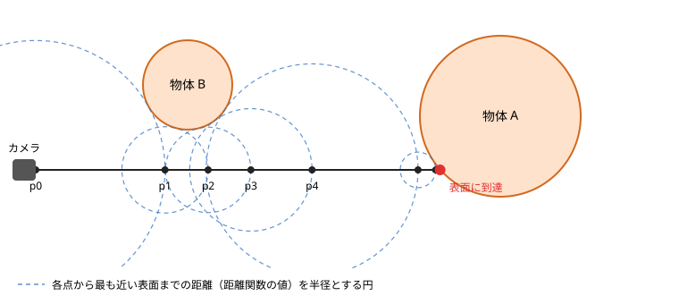

第 14 章 レイマーチング
=======================

これまでの章では、三角形を組み合わせて物体の形を表してきました。この章では、三角形を使わずに、フラグメントシェーダーだけで 3D のシーンを描く、レイマーチングという手法を説明します。第 8 章の距離関数と、第 10 章のライティングの知識を使います。

.. rubric:: サンプル 11：レイマーチング

`ブラウザーで開く <../examples/11_raymarching.html>`__／:download:`ダウンロード <../../examples/11_raymarching.html>`／シェーダー：:download:`11_raymarching.vert <../../examples/shaders/11_raymarching.vert>`、:download:`11_raymarching.frag <../../examples/shaders/11_raymarching.frag>`

.. raw:: html

   <iframe src="../examples/11_raymarching.html" title="サンプル 11：レイマーチング" loading="lazy" style="width: 100%; height: 500px; border: 1px solid #ccc;"></iframe>

レイマーチングの考え方
----------------------

カメラから画面の各ピクセルを通る半直線（レイ）を飛ばし、レイが最初に当たる物体の表面を求めれば、そのピクセルに何が見えるかが分かります。フラグメントシェーダーでは、フラグメントごとに 1 本のレイを扱います。

レイと物体の交点を求める方法の 1 つが、レイマーチングです。レイマーチングでは、レイに沿って少しずつ点を進め、点が物体の表面に達したところを交点とします。

距離関数を使うと、点をどれだけ進めてよいかが分かります。シーン全体の距離関数の値 :math:`d` は「点から最も近い物体の表面までの距離」なので、点を中心とする半径 :math:`d` の球の内側には、物体が 1 つもありません。そのため、レイに沿って :math:`d` だけ進めても、物体を突き抜けることはありません。この進め方を、スフィアトレーシングと呼びます。

   スフィアトレーシングで点を進める様子

図のように、物体から遠い所では大きく進み、物体に近づくほど細かく進みます。距離がある値（サンプルでは 0.001）より小さくなったら、表面に当たったと判定します。進んだ距離の合計が一定の値を超えた場合や、決められた回数だけ進めても表面に当たらない場合は、何にも当たらなかったとします。

シーンの距離関数
----------------

3 次元の距離関数は、2 次元の場合（第 8 章）と同じように作れます。球の距離関数は :math:`|p| - r`、箱の距離関数は 2 次元の長方形と同じ形の式です。複数の物体は ``min`` や ``smoothMin`` で合成します。

.. literalinclude:: ../../examples/shaders/11_raymarching.frag
   :language: glsl
   :start-after: // ---- 距離関数 ----
   :end-before: // ---- 距離関数ここまで ----
   :caption: シーンの距離関数

``map`` 関数が、シーン全体の距離関数です。球と箱を ``smoothMin`` でなめらかにつなぎ、さらに床（y = 0 の平面）と ``min`` で合成しています。球の位置は時間とともに動かしています。

カメラとレイの生成
------------------

フラグメントごとに、カメラの位置からそのフラグメントの方向へ向かうレイを作ります。

.. literalinclude:: ../../examples/shaders/11_raymarching.frag
   :language: glsl
   :start-after: // ---- カメラとレイの生成 ----
   :end-before: // ---- カメラとレイの生成ここまで ----
   :dedent: 4
   :caption: カメラとレイの生成

まず、カメラの前方向 ``forward``、右方向 ``right``、上方向 ``up`` の 3 つの単位ベクトルを求めます。``right`` は、前方向とワールド座標の上方向（0, 1, 0）の外積で求め、``up`` は、``right`` と ``forward`` の外積で求めます。

レイの方向は、画面上の位置 ``p`` を使って、次のように決めます。

.. math::

   \mathrm{rd} = \mathrm{normalize}(p_x \cdot \mathrm{right} + p_y \cdot \mathrm{up} + f \cdot \mathrm{forward})

:math:`f` は、カメラから仮想的なスクリーンまでの距離（焦点距離）です。サンプルでは ``FOCAL_LENGTH``\ （1.5）がこれにあたります。:math:`f` を大きくすると視野が狭くなり、望遠レンズのような見え方になります。

レイの前進
----------

.. literalinclude:: ../../examples/shaders/11_raymarching.frag
   :language: glsl
   :start-after: // ---- レイマーチング ----
   :end-before: // ---- レイマーチングここまで ----
   :caption: レイマーチング

``rayMarch`` 関数は、表面に当たったかどうかを戻り値で返し、進んだ距離とステップ数を ``out`` 引数で返します（第 4 章）。当たった点の位置は ``ro + rd * t`` で求められます。

``for`` 文の上限の 1000 は安全のための値で、実際の繰り返し回数は ``uMaxSteps`` で決めています。サンプル 11 の「最大ステップ数」を小さくすると、表面に達する前に打ち切られるレイが増え、物体の輪郭付近が欠けて表示されることを確かめられます。

法線の計算
----------

ライティングには法線が必要です。距離関数で表した物体では、距離関数の勾配（値が最も急に増える方向）が法線の方向になります。勾配は、各軸の方向に少しだけずらした位置の距離関数の値の差（中心差分）で近似できます。

.. math::

   N \approx \mathrm{normalize}
   \begin{pmatrix}
   d(p + h e_x) - d(p - h e_x) \\
   d(p + h e_y) - d(p - h e_y) \\
   d(p + h e_z) - d(p - h e_z)
   \end{pmatrix}

:math:`e_x, e_y, e_z` は各軸の方向の単位ベクトル、:math:`h` は小さな値です。

.. literalinclude:: ../../examples/shaders/11_raymarching.frag
   :language: glsl
   :start-after: // ---- 法線と影 ----
   :end-before: // ---- 法線と影ここまで ----
   :caption: 法線と影の計算

影
--

表面の点から光源の方向へ、もう一度レイマーチングを行います。途中で物体に当たれば、その点は影の中にあります。

さらに、レイが物体の近くを通った場合にも少し暗くすると、影の輪郭がぼやけたソフトシャドウになります。レイ上の各点での距離関数の値 :math:`d` と、そこまで進んだ距離 :math:`t` から :math:`k d / t` を計算し、その最小値を明るさとします。:math:`k` は影の輪郭の鋭さを決める定数で、大きいほど輪郭がくっきりします。

影のレイの始点を表面から法線の方向に少し浮かせているのは、始点が表面に近すぎると、始点のすぐそばで「表面に当たった」と判定されてしまうためです。

仕上げ
------

サンプル 11 では、さらに次の処理を行っています。

* **ライティング**：第 10 章の Blinn-Phong のモデルを使っています。レイマーチングではカメラへ向かう方向 :math:`V` がレイの方向の逆（``-rd``）になります。
* **フォグ**：遠くの物ほど空の色に近づけて、奥行きを感じさせます。
* **ガンマ補正**：第 10 章と同じく、最後に ``pow(color, vec3(1.0 / 2.2))`` で補正しています。

レイマーチングの性能
--------------------

レイマーチングでは、1 つのフラグメントで距離関数を何十回から何百回も計算します。そのため、画面の解像度、ステップ数の上限、距離関数の複雑さに応じて、計算量が大きく増えます。

サンプル 11 の「ステップ数を色で表示」を選ぶと、各ピクセルで何回ステップを進めたかが色で表示されます（黒 → 赤 → 黄 → 白の順に多い）。物体の輪郭付近では、レイが表面のすぐそばを通るため、ステップ数が多くなることが分かります。このように、計算量を色で表示することは、性能の問題を調べるのにも役立ちます（第 15 章）。

試してみよう
------------

* ``map`` 関数に物体を追加する。例えば、``sdSphere(p - vec3(-1.0, 0.3, 0.5), 0.3)`` を ``min`` で加える。
* ``smoothMin`` の第 3 引数（:math:`k`）の値を変えて、球と箱のつながり方の変化を確かめる。
* ``p`` を ``mod(p, 2.0) - 1.0`` のように変換してから距離関数に渡すと、物体が無限に繰り返されることを確かめる（床は除いて試してください）。
