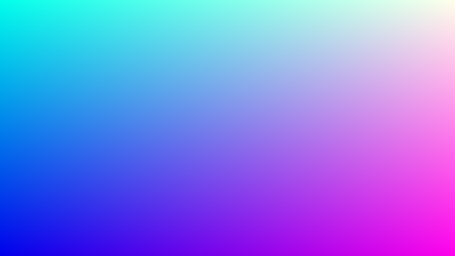
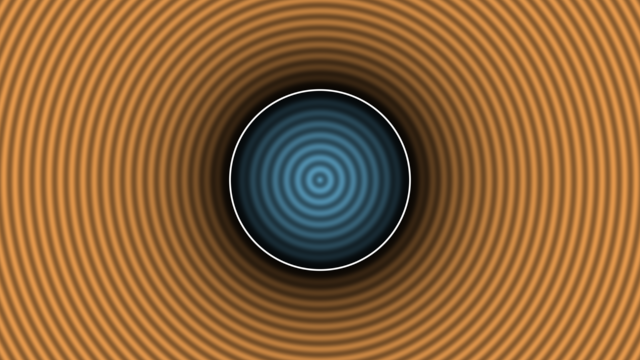

########################################################
第 1 章 GLSL とフラグメントシェーダーの基礎
########################################################

この章では、レイマーチングを書くために必要な GLSL とフラグメントシェーダーの知識を最小限に絞って説明する。最後に、第 2 章以降の土台となる「距離」を使った 2 次元の図形の描き方を示す。

シェーダーとは
==============

:term:`シェーダー` は GPU 上で実行されるプログラムである。CPU のプログラムが 1 つの処理を順番に実行するのに対し、シェーダーは同じプログラムを大量のデータに対して並列に実行する。

本資料で扱う :term:`フラグメントシェーダー` は、画面の各ピクセルの色を決めるプログラムである。1920 × 1080 の画面であれば、約 200 万個のピクセルそれぞれについて同じ関数が独立に呼び出される。このとき、各呼び出しには次の制約がある。

* 入力として受け取れるのは、自分のピクセルの座標と、全ピクセルに共通の値（:term:`uniform 変数`）だけである。
* 他のピクセルの計算結果を参照することはできない。
* 出力は自分のピクセルの色だけである。

つまりフラグメントシェーダーは、「ピクセル座標を受け取って色を返す関数」と考えればよい。レイマーチングでは、この関数の中で視点からそのピクセルを通るレイを作り、レイが最初に当たる物体を探して、その色を計算する。

レンダリングパイプラインの概略
==============================

OpenGL や WebGL で図形を描くときは、おおむね次の順に処理が進む。

1. :term:`頂点シェーダー` が、ポリゴンの各頂点を画面上の位置に変換する。
2. ラスタライザーが、ポリゴンが覆うピクセルを列挙する。
3. フラグメントシェーダーが、列挙された各ピクセルの色を計算する。

通常の 3DCG では、形状はポリゴンで表され、その形状を頂点シェーダーとラスタライザーが画面に投影する。一方、レイマーチングでは、画面全体を覆う四角形（2 つの三角形）だけを描き、形状の計算はすべてフラグメントシェーダーで行う。本資料のサンプルは Shadertoy と同じくこの構成をとっており、読者が書くのはフラグメントシェーダーだけである。

GLSL の基本
===========

:term:`GLSL` （OpenGL Shading Language）は C 言語に似た文法を持つシェーダー言語である。本資料のサンプルは WebGL2 で使われる GLSL ES 3.00 の範囲で書いている。ここではレイマーチングでよく使う機能に絞って説明する。

型
--

.. list-table::
   :header-rows: 1
   :widths: 25 75

   * - 型
     - 説明
   * - ``float``
     - 32 ビットの浮動小数点数
   * - ``int``, ``uint``
     - 32 ビットの符号付き整数、符号なし整数
   * - ``bool``
     - 真偽値
   * - ``vec2``, ``vec3``, ``vec4``
     - ``float`` を 2〜4 個まとめたベクトル。位置、方向、色などを表す。
   * - ``ivec2`` など
     - ``int`` のベクトル
   * - ``mat2``, ``mat3``, ``mat4``
     - ``float`` の 2 × 2〜4 × 4 の正方行列

ベクトルはコンストラクターで作る。引数の成分数の合計が一致していれば、スカラーとベクトルを混ぜて渡せる。成分は ``.xyzw`` （位置として使う場合）または ``.rgba`` （色として使う場合）で取り出す。複数の成分を並べて取り出したり、順番を入れ替えたりすることもでき、これを :term:`スウィズル` と呼ぶ。

.. code-block:: glsl
   :linenos:

   vec3 a = vec3(1.0, 2.0, 3.0);
   vec3 b = vec3(0.5);             // すべての成分が 0.5
   vec4 c = vec4(a, 1.0);          // (1.0, 2.0, 3.0, 1.0)
   vec2 d = a.xy;                  // (1.0, 2.0)
   vec3 e = a.zyx;                 // (3.0, 2.0, 1.0)
   vec3 f = a * b + 1.0;           // 成分ごとの積と和: (1.5, 2.0, 2.5)

ベクトル同士の ``+``、``-``、``*``、``/`` は成分ごとの演算になる。内積や外積は組み込み関数 ``dot`` と ``cross`` を使う。一方、行列とベクトルの ``*`` は通常の行列の積である。行列は列優先（column-major）で格納され、``mat3(a, b, c)`` は ``a``、``b``、``c`` を列ベクトルとする行列になる。

GLSL には暗黙の型変換がほとんど無い。例えば ``float x = 1;`` は GLSL ES 3.00 ではエラーになるため、浮動小数点数の定数は必ず ``1.0`` のように小数点を付けて書く。整数から変換する場合は ``float(i)`` のように明示する。また、関数の再帰呼び出しはできない。

よく使う組み込み関数
--------------------

.. list-table::
   :header-rows: 1
   :widths: 30 70

   * - 関数
     - 説明
   * - ``length(v)``
     - ベクトルの長さ :math:`|\mathbf{v}|`
   * - ``normalize(v)``
     - 正規化したベクトル :math:`\mathbf{v} / |\mathbf{v}|`
   * - ``dot(a, b)``, ``cross(a, b)``
     - 内積、外積
   * - ``abs``, ``sign``, ``floor``, ``fract``, ``mod``
     - 絶対値、符号、切り捨て、小数部、剰余（ベクトルには成分ごとに作用する）
   * - ``min``, ``max``, ``clamp(x, a, b)``
     - 最小値、最大値、:math:`x` を区間 :math:`[a, b]` に収めた値
   * - ``mix(a, b, t)``
     - 線形補間 :math:`a (1 - t) + b t`
   * - ``step(e, x)``
     - :math:`x < e` のとき 0、それ以外は 1
   * - ``smoothstep(e0, e1, x)``
     - :math:`x` が :math:`e_0` から :math:`e_1` に変わる間に 0 から 1 へ滑らかに変化する値
   * - ``reflect(i, n)``, ``refract(i, n, eta)``
     - 反射方向、屈折方向（第 11 章で使う）

Shadertoy の入出力
==================

本資料のサンプルは、`Shadertoy <https://www.shadertoy.com/>`_ と同じ形式で書いている。シェーダーのファイルには、次の形の関数 ``mainImage`` を定義する。

.. code-block:: glsl
   :linenos:

   void mainImage(out vec4 fragColor, in vec2 fragCoord)
   {
       fragColor = vec4(1.0, 0.0, 0.0, 1.0);  // すべてのピクセルを赤にする
   }

``fragCoord`` はピクセルの中心の座標で、画面の左下が原点、単位はピクセルである。例えば左下のピクセルでは ``(0.5, 0.5)`` になる。``fragColor`` には RGBA の色を 0〜1 の範囲で書き込む。``out`` と ``in`` は、それぞれ出力用と入力用の引数であることを表す。

さらに、次の uniform 変数が使える。付属のビューアーも同じ変数を提供する。

.. list-table::
   :header-rows: 1
   :widths: 25 15 60

   * - 変数名
     - 型
     - 内容
   * - ``iResolution``
     - ``vec3``
     - 描画領域の解像度。``xy`` が幅と高さ（ピクセル）である。
   * - ``iTime``
     - ``float``
     - 実行開始からの経過時間（秒）
   * - ``iTimeDelta``
     - ``float``
     - 前のフレームからの経過時間（秒）
   * - ``iFrame``
     - ``int``
     - フレーム番号（0 から始まる）
   * - ``iMouse``
     - ``vec4``
     - ``xy`` はドラッグ中のマウスの座標、``zw`` はクリックした座標。ボタンを離すと ``zw`` の符号が負になる。
   * - ``iChannel0``
     - ``sampler2D``
     - 別のパスの描画結果を読み出すテクスチャ。複数パスの描画で使う（第 17 章）。
   * - ``iChannelResolution``
     - ``vec3[4]``
     - 各チャンネルのテクスチャの解像度

最初のシェーダー
================

最初の例として、ピクセル座標をそのまま色として出力する。

.. literalinclude:: ../examples/shaders/01_uv.frag
   :language: glsl
   :linenos:
   :caption: 01_uv.frag

.. rst-class:: example-links

:download:`01_uv.frag をダウンロード <../examples/shaders/01_uv.frag>` ｜ `ブラウザーで実行 <demos/01_uv.html>`__

``fragCoord`` を解像度で割ると、画面の左下が :math:`(0, 0)`、右上が :math:`(1, 1)` になる座標 ``uv`` が得られる。この ``x`` を赤、``y`` を緑に割り当てるため、右に行くほど赤く、上に行くほど緑になる。青の成分は ``iTime`` によって時間とともに変化する。

   01_uv.frag の実行結果（iTime = 1 の時点）。青の成分は約 0.92 である。

座標の正規化
============

``uv`` は縦横とも 0〜1 なので、画面が横長のときは横方向に引き伸ばされた座標になる。このまま円を描くと楕円になってしまう。そこで、以降のサンプルでは次の式で座標を変換する。

.. math::

   \mathbf{p} = \frac{2\,\mathbf{f} - \mathbf{r}}{r_y}

ここで :math:`\mathbf{f}` は ``fragCoord``、:math:`\mathbf{r}` は ``iResolution.xy``、:math:`r_y` は画面の高さである。この座標 :math:`\mathbf{p}` は画面の中央が原点で、縦方向が :math:`-1` 〜 :math:`1` になる。横方向の範囲は画面の縦横比によって決まり、例えば 16 : 9 の画面では約 :math:`-1.78` 〜 :math:`1.78` になる。縦と横の単位の長さが等しいため、図形が歪まない。

2 次元の距離関数で円を描く
==========================

次に、この座標を使って円を描く。「点 :math:`\mathbf{p}` が円の内側にあるか」を判定する代わりに、「点 :math:`\mathbf{p}` から円周までの距離」を計算する。原点を中心とする半径 :math:`r` の円について、この距離は次の式で表せる。

.. math::

   d(\mathbf{p}) = |\mathbf{p}| - r

:math:`d` は円の外側で正、円周上で 0、内側で負になる。このように、表面までの距離に内外を表す符号を付けた関数を :term:`符号付き距離関数 <SDF>` （Signed Distance Function、SDF）と呼ぶ。次のサンプルでは、SDF の値によって色を変え、さらに距離に比例した縞模様を重ねて、SDF の値を可視化している。

.. literalinclude:: ../examples/shaders/01_circle2d.frag
   :language: glsl
   :linenos:
   :caption: 01_circle2d.frag

.. rst-class:: example-links

:download:`01_circle2d.frag をダウンロード <../examples/shaders/01_circle2d.frag>` ｜ `ブラウザーで実行 <demos/01_circle2d.html>`__

   01_circle2d.frag の実行結果。縞の間隔が一定であることから、SDF の値が円周からの距離に正確に比例していることがわかる。

23 行目では ``smoothstep`` を使い、:math:`|d|` が 0.01 未満の範囲を白く塗って境界線を描いている。SDF は境界からの距離を直接与えるため、このように一定の太さの輪郭線を簡単に描ける。

2 次元の SDF では、各ピクセルの SDF の値をそのまま色に変換すればよかった。3 次元の場合は、画面のピクセルから奥に向かって伸びるレイの上で、SDF が 0 になる点を探す必要がある。その方法が次の章で扱うレイマーチングである。
