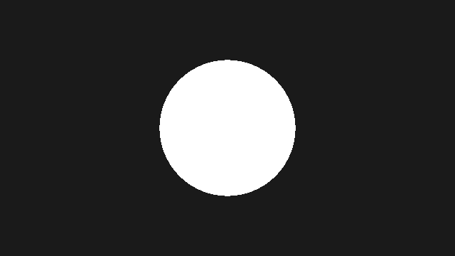
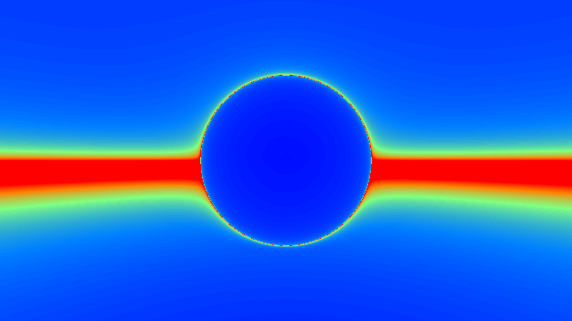

########################################################
第 2 章 レイマーチングの原理
########################################################

この章では、画面の各ピクセルからレイを作る方法と、SDF を使ってレイと表面の交点を求めるスフィアトレーシングを説明し、最初の 3D の球を描く。

レイトレーシングとレイマーチング
================================

3D シーンを画面に描く方法の 1 つに、視点から各ピクセルを通る半直線（:term:`レイ`）を飛ばし、最初に当たった物体の色をそのピクセルの色とする方法がある。この方法を総称して :term:`レイトレーシング` と呼ぶ。

レイと物体の交点を求める方法は、形状の表し方によって異なる。球や平面、三角形のように交点を解析的に求められる形状では、方程式を解けば交点が得られる。一方、:term:`レイマーチング` では、レイに沿って少しずつ点を進め、各点で形状の内外や表面までの距離を調べて交点を探す。形状を方程式で解く必要がないため、解析的に交点を求めにくい複雑な形状でも扱える。

レイマーチングの中でも、進む距離を SDF の値で決める方法を :term:`スフィアトレーシング` と呼ぶ（Hart, 1996）。本資料で「レイマーチング」と言う場合は、特に断らない限りスフィアトレーシングを指す。

レイの表現
==========

レイは、始点 :math:`\mathbf{o}` と単位ベクトルの方向 :math:`\hat{\mathbf{d}}` を使って次のように表す。

.. math::

   \mathbf{p}(t) = \mathbf{o} + t\,\hat{\mathbf{d}} \qquad (t \ge 0)

:math:`\hat{\mathbf{d}}` が単位ベクトルなので、パラメーター :math:`t` は始点からの距離そのものになる。サンプルコードでは、始点を ``ro`` （ray origin）、方向を ``rd`` （ray direction）という変数名で表す。

カメラとレイの生成
==================

ピンホールカメラ
----------------

最も簡単なカメラモデルは、1 点（視点）からスクリーンの各ピクセルに向かってレイを飛ばすピンホールカメラである。視点を原点に置き、:math:`-z` 方向を向いているとする。視点から距離 :math:`f` の位置にスクリーンを置くと、第 1 章で求めた正規化座標 :math:`\mathbf{p} = (p_x, p_y)` のピクセルに向かうレイの方向は次のようになる。

.. math::

   \hat{\mathbf{d}} = \frac{(p_x,\ p_y,\ -f)}{|(p_x,\ p_y,\ -f)|}

:math:`f` を :term:`焦点距離` と呼ぶ。:math:`p_y` の範囲は :math:`-1` 〜 :math:`1` なので、縦方向の :term:`視野角` :math:`\theta` と焦点距離には次の関係がある。

.. math::

   \tan\frac{\theta}{2} = \frac{1}{f}

例えば :math:`f = 1.5` では約 67°、:math:`f = 2` では約 53° になる。焦点距離を大きくするほど視野が狭くなり、望遠レンズで見たような画像になる。

ルックアットカメラ
------------------

カメラを任意の位置 :math:`\mathbf{o}` に置き、注視点 :math:`\mathbf{a}` の方を向かせるには、カメラの座標軸を表す 3 つの単位ベクトルを次のように求める。

.. math::

   \hat{\mathbf{w}} = \frac{\mathbf{a} - \mathbf{o}}{|\mathbf{a} - \mathbf{o}|}, \qquad
   \hat{\mathbf{u}} = \frac{\hat{\mathbf{w}} \times \hat{\mathbf{y}}}{|\hat{\mathbf{w}} \times \hat{\mathbf{y}}|}, \qquad
   \hat{\mathbf{v}} = \hat{\mathbf{u}} \times \hat{\mathbf{w}}

:math:`\hat{\mathbf{w}}` は前方、:math:`\hat{\mathbf{u}}` は右、:math:`\hat{\mathbf{v}}` は上を向く。:math:`\hat{\mathbf{y}} = (0, 1, 0)` はワールド座標の上方向である。これらを列ベクトルとする行列 :math:`M = [\hat{\mathbf{u}}\ \hat{\mathbf{v}}\ \hat{\mathbf{w}}]` を使うと、レイの方向は次のようになる。

.. math::

   \hat{\mathbf{d}} = M \frac{(p_x,\ p_y,\ f)}{|(p_x,\ p_y,\ f)|}

:math:`M` は直交行列でベクトルの長さを変えないため、正規化は行列を掛ける前に行っても後に行ってもよい。第 3 章以降のサンプルでは、この行列を関数 ``setCamera`` で求める。

.. literalinclude:: ../examples/shaders/03_primitives.frag
   :language: glsl
   :linenos:
   :lineno-match:
   :lines: {glsl:03_primitives.frag:setCamera}
   :caption: 03_primitives.frag（抜粋）

.. literalinclude:: ../examples/shaders/03_primitives.frag
   :language: glsl
   :linenos:
   :lineno-match:
   :lines: {glsl:03_primitives.frag:mainImage}
   :caption: 03_primitives.frag（抜粋）

カメラが真上や真下を向くと :math:`\hat{\mathbf{w}}` と :math:`\hat{\mathbf{y}}` が平行になり、外積が 0 になって :math:`\hat{\mathbf{u}}` が求められない。本資料のサンプルでは、カメラがこの向きにならないように配置している。

符号付き距離関数
================

定義
----

空間内の形状 :math:`\Omega` に対し、その :term:`SDF` :math:`f` を次のように定義する。

.. math::

   f(\mathbf{p}) =
   \begin{cases}
     \phantom{-}\min_{\mathbf{q} \in \partial\Omega} |\mathbf{p} - \mathbf{q}| & (\mathbf{p} \notin \Omega) \\
     -\min_{\mathbf{q} \in \partial\Omega} |\mathbf{p} - \mathbf{q}| & (\mathbf{p} \in \Omega)
   \end{cases}

:math:`\partial\Omega` は形状の表面（境界）である。つまり :math:`f` は表面までの最短距離に、外側なら正、内側なら負の符号を付けたものである。表面は :math:`f(\mathbf{p}) = 0` を満たす点の集合（ゼロ等値面）として表される。

性質
----

SDF には、レイマーチングで重要になる次の 2 つの性質がある。

1. **リプシッツ連続性**: 任意の 2 点 :math:`\mathbf{p}`、:math:`\mathbf{q}` について :math:`|f(\mathbf{p}) - f(\mathbf{q})| \le |\mathbf{p} - \mathbf{q}|` が成り立つ。すなわち、:math:`f` は :term:`リプシッツ定数 <リプシッツ連続>` 1 のリプシッツ連続な関数である。
2. **勾配の大きさが 1**: :math:`f` が微分可能な点では :math:`|\nabla f| = 1` であり、:math:`\nabla f` は最も近い表面から遠ざかる方向を向く。表面上では :math:`\nabla f` が外向きの法線になる。この性質は第 5 章で法線を求めるときに使う。

1 の性質から、点 :math:`\mathbf{p}` を中心とする半径 :math:`|f(\mathbf{p})|` の球の内部には表面が存在しないことがわかる。スフィアトレーシングはこの性質を利用する。

スフィアトレーシング
====================

アルゴリズム
------------

スフィアトレーシングでは、レイの上の点 :math:`\mathbf{p}(t_i)` での SDF の値だけ :math:`t` を進める操作を繰り返す。

.. math::

   t_0 = 0, \qquad t_{i+1} = t_i + f\bigl(\mathbf{o} + t_i\,\hat{\mathbf{d}}\bigr)

点 :math:`\mathbf{p}(t_i)` を中心とする半径 :math:`f(\mathbf{p}(t_i))` の球の内部には表面が無いので、その半径だけ進んでも表面を通り過ぎることはない。表面に近づくほど SDF の値は小さくなり、1 回に進む距離も短くなる。そのため、点は表面の手前に向かって収束していく。

実際の計算では、次のいずれかの条件を満たしたときに反復を終える。

.. list-table::
   :header-rows: 1
   :widths: 35 65

   * - 条件
     - 意味
   * - :math:`f(\mathbf{p}(t_i)) < \varepsilon`
     - 表面に十分近づいたので、表面に当たったとみなす。:math:`\varepsilon` は閾値（サンプルの ``SURF_DIST``）である。
   * - :math:`t_i > t_{\max}`
     - 十分遠くまで進んだので、何にも当たらなかったとみなす（``MAX_DIST``）。
   * - :math:`i \ge N`
     - 反復回数の上限に達した（``MAX_STEPS``）。サンプルでは当たらなかったものとして扱う。

SDF が厳密な距離ではなく、真の距離以下の値（距離の下界）を返す関数であっても、スフィアトレーシングは表面を通り過ぎない。進む距離が短くなるため反復回数は増えるが、描画結果は正しい。逆に、真の距離より大きな値を返す関数を使うと、表面を通り過ぎて穴が空いたように見えることがある。この問題と対策は第 9 章で扱う。

最初のレイマーチング
--------------------

原点に半径 1 の球を置き、スフィアトレーシングで描く。この段階では陰影を付けず、レイが球に当たったピクセルを白、当たらなかったピクセルを暗い灰色で塗る。

.. literalinclude:: ../examples/shaders/02_first_sphere.frag
   :language: glsl
   :linenos:
   :caption: 02_first_sphere.frag

.. rst-class:: example-links

:download:`02_first_sphere.frag をダウンロード <../examples/shaders/02_first_sphere.frag>` ｜ `ブラウザーで実行 <demos/02_first_sphere.html>`__

関数 ``map`` はシーン全体の SDF を返す。シーンに物体を追加するときは、この関数だけを書き換えればよい。関数 ``raymarch`` がスフィアトレーシングの本体で、表面に当たったときはその :math:`t` を、当たらなかったときは :math:`-1` を返す。カメラは :math:`z = 3` に置き、:math:`-z` 方向を向いている（42〜43 行目）。

   02_first_sphere.frag の実行結果。陰影が無いため、球は白い円に見える。

反復回数の可視化
----------------

スフィアトレーシングの挙動を理解するために、各ピクセルで反復を終えるまでの回数を色で表示してみる。次のサンプルでは、球の下に平面を追加し、反復回数が少ないほど青く、多いほど赤く表示する。

.. literalinclude:: ../examples/shaders/02_step_count.frag
   :language: glsl
   :linenos:
   :lineno-match:
   :lines: {glsl:02_step_count.frag:raymarchSteps}
   :caption: 02_step_count.frag（抜粋）

.. rst-class:: example-links

:download:`02_step_count.frag をダウンロード <../examples/shaders/02_step_count.frag>` ｜ `ブラウザーで実行 <demos/02_step_count.html>`__

   02_step_count.frag の実行結果

球の正面や、平面を見下ろす方向のレイは、少ない反復で表面に到達する。一方、球の輪郭の付近と、画面中央の地平線の付近は赤くなっている。これは、レイが表面とほぼ平行に進むため、表面までの距離が小さいまま少しずつしか進めないからである。特に地平線付近では、上限の 100 回に達しても結果が確定しないピクセルがある。このように、レイマーチングの計算量は場所によって大きく異なる。
