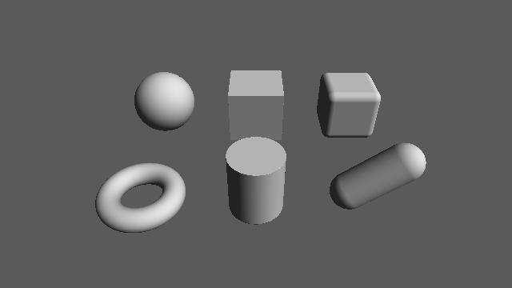

########################################################
第 3 章 距離関数（SDF）
########################################################

この章では、基本的な形状の SDF とその導出を示す。SDF を導出するときは、形状の対称性を利用して問題を簡単な場合に帰着させることが多い。ここで示す形状は、次の章で組み合わせて複雑な形状を作るための部品になる。

以降のコードでは、形状の中心を原点に置いた SDF を示す。形状を別の位置に置く方法は第 4 章で説明する。

次のサンプルは、この章で扱う基本形状を平面の上に並べたものである。陰影の計算（関数 ``calcNormal`` と ``shade``）は第 5 章で説明する。

.. rst-class:: example-links

:download:`03_primitives.frag をダウンロード <../examples/shaders/03_primitives.frag>` ｜ `ブラウザーで実行 <demos/03_primitives.html>`__

   03_primitives.frag の実行結果。奥の列は左から球、箱、角丸の箱、手前の列は左からトーラス、円柱、カプセルである。

球
==

中心が原点、半径が :math:`r` の球の SDF は、第 1 章の円と同じ形の式になる。

.. math::

   f(\mathbf{p}) = |\mathbf{p}| - r

.. literalinclude:: ../examples/shaders/03_primitives.frag
   :language: glsl
   :linenos:
   :lineno-match:
   :lines: {glsl:03_primitives.frag:sdSphere}

平面
====

単位法線ベクトル :math:`\hat{\mathbf{n}}` を持ち、原点からの符号付き距離が :math:`h` の平面の SDF は次のようになる。

.. math::

   f(\mathbf{p}) = \mathbf{p} \cdot \hat{\mathbf{n}} - h

サンプルでは、水平な地面として :math:`\hat{\mathbf{n}} = (0, 1, 0)` の場合だけを使う。このとき :math:`f(\mathbf{p}) = p_y - h` となり、平面より下が内側になる。

.. literalinclude:: ../examples/shaders/03_primitives.frag
   :language: glsl
   :linenos:
   :lineno-match:
   :lines: {glsl:03_primitives.frag:sdPlane}

箱
==

中心が原点で、各軸方向の半分の長さが :math:`\mathbf{b} = (b_x, b_y, b_z)` の箱を考える。箱は 3 つの座標平面について対称なので、:math:`\mathbf{p}` を :math:`|\mathbf{p}| = (|p_x|, |p_y|, |p_z|)` に置き換えても距離は変わらない。そこで第 1 象限（すべての成分が 0 以上の領域）だけを考え、次のベクトルを定義する。

.. math::

   \mathbf{q} = |\mathbf{p}| - \mathbf{b}

:math:`q_x > 0` は、点が箱の :math:`x` 方向の面より外にあることを意味する。

* 箱の外側（:math:`\mathbf{q}` のいずれかの成分が正）では、最も近い点は面、辺、頂点のいずれかにある。どの場合も、距離は :math:`\mathbf{q}` の正の成分だけを残したベクトルの長さ :math:`|\max(\mathbf{q}, \mathbf{0})|` になる。
* 箱の内側（:math:`\mathbf{q}` のすべての成分が負）では、最も近い面までの距離に負の符号を付けた値 :math:`\max(q_x, q_y, q_z)` になる。

2 つの場合を 1 つの式にまとめると、次のようになる。

.. math::

   f(\mathbf{p}) = |\max(\mathbf{q}, \mathbf{0})| + \min\bigl(\max(q_x, q_y, q_z),\ 0\bigr)

外側では第 2 項が 0 に、内側では第 1 項が 0 になるので、場合分けが不要になる。この式は、箱の内側でも外側でも厳密な距離を与える。

.. literalinclude:: ../examples/shaders/03_primitives.frag
   :language: glsl
   :linenos:
   :lineno-match:
   :lines: {glsl:03_primitives.frag:sdBox}

角丸の箱
========

SDF から定数 :math:`r` を引くと、ゼロ等値面が外側に :math:`r` だけ移動する。すなわち、元の形状を半径 :math:`r` だけ膨らませた形状になる。このとき、元の形状の角や辺は半径 :math:`r` で丸められる。この操作を「丸め」と呼ぶ。

外形の大きさを変えずに角を丸めるには、あらかじめ箱を :math:`r` だけ小さくしてから丸める。

.. math::

   f(\mathbf{p}) = f_{\text{box}}(\mathbf{p};\ \mathbf{b} - r) - r

.. literalinclude:: ../examples/shaders/03_primitives.frag
   :language: glsl
   :linenos:
   :lineno-match:
   :lines: {glsl:03_primitives.frag:sdRoundBox}

トーラス
========

:math:`xz` 平面上にある半径 :math:`R` の円を中心線とし、太さ（管の半径）が :math:`r` のトーラスを考える。トーラスは :math:`y` 軸まわりの回転体なので、点 :math:`\mathbf{p}` を回転軸からの距離 :math:`\sqrt{p_x^2 + p_z^2}` と高さ :math:`p_y` の 2 次元の問題に帰着できる。この 2 次元の断面では、トーラスは中心 :math:`(R, 0)`、半径 :math:`r` の円になる。

.. math::

   \mathbf{q} = \Bigl(\sqrt{p_x^2 + p_z^2} - R,\ p_y\Bigr), \qquad
   f(\mathbf{p}) = |\mathbf{q}| - r

サンプルでは、:math:`R` を ``t.x``、:math:`r` を ``t.y`` として渡す。

.. literalinclude:: ../examples/shaders/03_primitives.frag
   :language: glsl
   :linenos:
   :lineno-match:
   :lines: {glsl:03_primitives.frag:sdTorus}

円柱
====

:math:`y` 軸を中心軸とし、半径 :math:`r`、高さの半分が :math:`h` の円柱も回転体である。断面は幅 :math:`2r`、高さ :math:`2h` の長方形になるので、2 次元の箱の SDF をそのまま使える。

.. math::

   \mathbf{q} = \Bigl(\sqrt{p_x^2 + p_z^2},\ |p_y|\Bigr) - (r, h), \qquad
   f(\mathbf{p}) = |\max(\mathbf{q}, \mathbf{0})| + \min\bigl(\max(q_x, q_y),\ 0\bigr)

.. literalinclude:: ../examples/shaders/03_primitives.frag
   :language: glsl
   :linenos:
   :lineno-match:
   :lines: {glsl:03_primitives.frag:sdCylinder}

カプセル
========

カプセルは、線分 :math:`\overline{\mathbf{a}\mathbf{b}}` から距離 :math:`r` 以内にある点の集合である。まず線分上で :math:`\mathbf{p}` に最も近い点を求める。線分上の点を :math:`\mathbf{a} + h(\mathbf{b} - \mathbf{a})` （:math:`0 \le h \le 1`）と表すと、最も近い点のパラメーターは次のようになる。

.. math::

   h = \operatorname{clamp}\left(\frac{(\mathbf{p} - \mathbf{a}) \cdot (\mathbf{b} - \mathbf{a})}{|\mathbf{b} - \mathbf{a}|^2},\ 0,\ 1\right)

clamp を外した値は、:math:`\mathbf{p}` を直線 :math:`\mathbf{a}\mathbf{b}` に正射影した点のパラメーターである。これを区間 :math:`[0, 1]` に制限すると、線分の外側に射影された場合は端点が選ばれる。線分までの距離から :math:`r` を引いたものがカプセルの SDF になる。

.. math::

   f(\mathbf{p}) = \bigl|(\mathbf{p} - \mathbf{a}) - h(\mathbf{b} - \mathbf{a})\bigr| - r

.. literalinclude:: ../examples/shaders/03_primitives.frag
   :language: glsl
   :linenos:
   :lineno-match:
   :lines: {glsl:03_primitives.frag:sdCapsule}

シーンへの配置
==============

各形状を配置したシーン全体の SDF は、各形状の SDF の最小値として求める。最小値をとる操作の意味は第 4 章で説明する。形状を配置する位置 :math:`\mathbf{c}` は、SDF の引数を :math:`\mathbf{p} - \mathbf{c}` とすることで指定している。

.. literalinclude:: ../examples/shaders/03_primitives.frag
   :language: glsl
   :linenos:
   :lineno-match:
   :lines: {glsl:03_primitives.frag:map}

厳密な SDF と近似的な SDF
=========================

この章で示した SDF は、いずれも形状の内側でも外側でも厳密な距離を返す。しかし、楕円体のように厳密な距離を閉じた式で表せない形状も多い。また、第 4 章で扱う合成や変形を施すと、厳密な距離ではなくなることがある。

第 2 章で述べたとおり、スフィアトレーシングで使う関数は、真の距離以下の値（距離の下界）を返せば十分である。厳密な SDF に比べて反復回数は増えるが、表面を通り過ぎることはない。ただし、第 6 章で扱うソフトシャドウとアンビエントオクルージョンは SDF の値の大きさを利用するため、SDF が厳密な距離から大きく外れると結果の品質が下がる。

実用上は、関数が次の条件を満たしているかを意識するとよい。

* ゼロ等値面が目的の形状の表面と一致する。
* 表面の外側で正、内側で負の値を返す。
* 値が真の距離を超えない（リプシッツ定数が 1 以下である）。

2 次元の SDF から 3 次元の形状を作る
====================================

トーラスと円柱の導出で見たように、回転体の SDF は断面の 2 次元の SDF から作れる。一般に、2 次元の SDF :math:`f_{2}` を :math:`y` 軸まわりに回転させた形状（軸から :math:`o` だけ離す）の SDF は次のようになる。

.. code-block:: glsl
   :linenos:

   // 2 次元の SDF sdf2d を y 軸まわりに回転させる。o は回転軸からの距離
   float opRevolution(vec3 p, float o)
   {
       vec2 q = vec2(length(p.xz) - o, p.y);
       return sdf2d(q);
   }

また、:math:`xy` 平面上の 2 次元の SDF を :math:`z` 方向に厚さ :math:`2h` だけ押し出した形状（押し出し）の SDF は、2 次元の箱と同じ考え方で次のように書ける。

.. code-block:: glsl
   :linenos:

   // 2 次元の SDF sdf2d を z 方向に厚さ 2h だけ押し出す
   float opExtrusion(vec3 p, float h)
   {
       vec2 w = vec2(sdf2d(p.xy), abs(p.z) - h);
       return min(max(w.x, w.y), 0.0) + length(max(w, 0.0));
   }

どちらの操作も、2 次元の SDF が厳密であれば、得られる 3 次元の SDF も厳密になる。2 次元の SDF については参考文献の Quilez による記事に多くの例がある。
