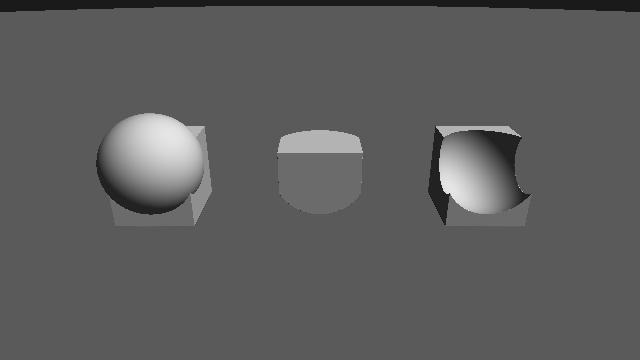
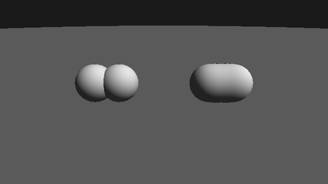
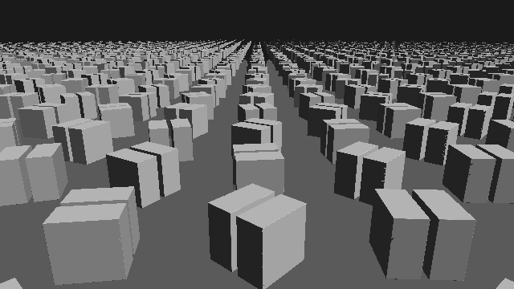
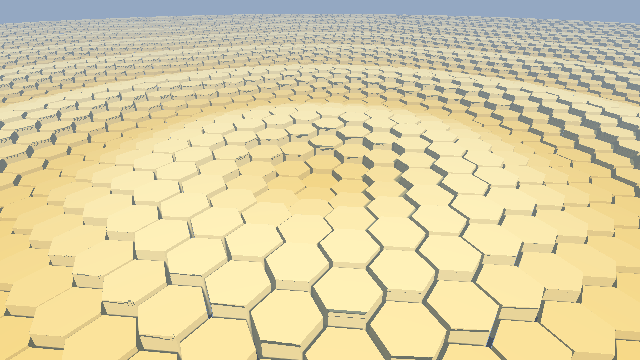
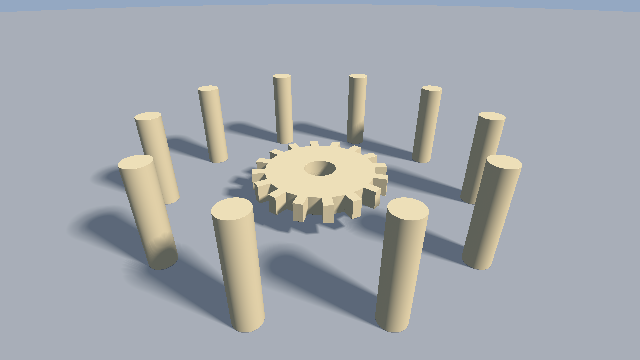
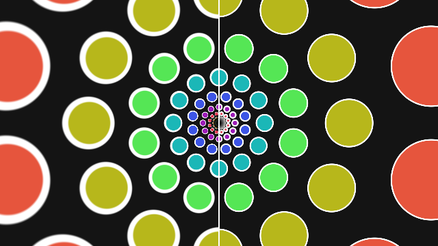

########################################################
第 4 章 形状の合成と変形
########################################################

第 3 章の基本形状だけでは、表現できる形は限られる。この章では、SDF 同士を合成する演算と、SDF を評価する前に空間（点の座標）を変換する操作を説明する。これらを組み合わせると、少ないコードで複雑な形状を作れる。

ブーリアン演算
==============

2 つの形状 :math:`A`、:math:`B` の SDF をそれぞれ :math:`f_A`、:math:`f_B` とする。和集合、積集合、差集合の SDF は、次のように最小値と最大値で表せる。

.. list-table::
   :header-rows: 1
   :widths: 30 30 40

   * - 演算
     - 式
     - 意味
   * - 和（union）
     - :math:`\min(f_A, f_B)`
     - :math:`A` または :math:`B` の内側
   * - 積（intersection）
     - :math:`\max(f_A, f_B)`
     - :math:`A` と :math:`B` の両方の内側
   * - 差（subtraction）
     - :math:`\max(f_A, -f_B)`
     - :math:`A` の内側かつ :math:`B` の外側

差の式は、:math:`-f_B` が :math:`B` の補集合（:math:`B` の外側を内側とみなした形状）の SDF であることから、「:math:`A` と :math:`B` の補集合の積」として導ける。

和の SDF は形状の外側では厳密な距離になるが、内側では厳密ではない。積と差は、外側でも一般に真の距離以下の値（距離の下界）になる。第 3 章で述べたとおり、下界であればスフィアトレーシングで正しく描画できる。

.. literalinclude:: ../examples/shaders/04_boolean.frag
   :language: glsl
   :linenos:
   :lineno-match:
   :lines: {glsl:04_boolean.frag:opUnion..opSubtraction}
   :caption: 04_boolean.frag（抜粋）

.. rst-class:: example-links

:download:`04_boolean.frag をダウンロード <../examples/shaders/04_boolean.frag>` ｜ `ブラウザーで実行 <demos/04_boolean.html>`__

   04_boolean.frag の実行結果。左から和、積、差である。差では、箱から球の形がくり抜かれている。

スムース合成
============

:math:`\min` による和では、2 つの形状の境目に鋭い溝ができる。この境目を滑らかにつなぐには、:math:`\min` の代わりに次の smooth min を使う。

.. math::

   h = \frac{\max\bigl(k - |a - b|,\ 0\bigr)}{k}, \qquad
   \operatorname{smin}(a, b; k) = \min(a, b) - \frac{k}{4} h^2

:math:`k` は滑らかにつなぐ範囲の幅である。:math:`|a - b| \ge k` の場所、つまり一方の形状が他方より十分近い場所では :math:`h = 0` となり、通常の :math:`\min` と一致する。:math:`|a - b| < k` の場所では、:math:`\min(a, b)` から最大 :math:`k/4` （:math:`a = b` のとき）だけ値を小さくすることで、形状を膨らませて境目を埋める。:math:`h` は :math:`|a - b| = k` で 0 となり、その点での微分も連続なので、表面が滑らかにつながる。

smooth min で合成した SDF は、厳密な距離ではなく距離の下界になる。同様に、smooth max は :math:`-\operatorname{smin}(-a, -b; k)` で得られ、滑らかな積や差に使える。

.. literalinclude:: ../examples/shaders/04_smooth_union.frag
   :language: glsl
   :linenos:
   :lineno-match:
   :lines: {glsl:04_smooth_union.frag:smin..twoSpheres}
   :caption: 04_smooth_union.frag（抜粋）

.. rst-class:: example-links

:download:`04_smooth_union.frag をダウンロード <../examples/shaders/04_smooth_union.frag>` ｜ `ブラウザーで実行 <demos/04_smooth_union.html>`__

   04_smooth_union.frag の実行結果。左は :math:`\min`、右は smooth min で合成している。

空間の変換
==========

形状を移動・回転・拡大縮小するときは、形状そのものではなく、SDF に渡す点の座標を変換する。形状に変換 :math:`T` を施した形状の SDF は、点に逆変換 :math:`T^{-1}` を施してから元の SDF を評価すれば得られる。

.. math::

   f_{T(\Omega)}(\mathbf{p}) = f_{\Omega}\bigl(T^{-1}(\mathbf{p})\bigr)

平行移動と回転
--------------

形状を :math:`\mathbf{c}` だけ平行移動するには、点を :math:`-\mathbf{c}` だけ移動する。第 3 章の ``sdSphere(p - c, r)`` がこれに当たる。

形状を回転行列 :math:`R` で回転させるには、点に :math:`R^{-1} = R^{\mathsf{T}}` を掛ける。平行移動と回転は距離を変えないので、変換後の SDF も厳密な距離のままである。サンプルでは、2 次元の回転行列を次の関数で作る。

.. literalinclude:: ../examples/shaders/04_repetition.frag
   :language: glsl
   :linenos:
   :lineno-match:
   :lines: {glsl:04_repetition.frag:rot}

GLSL の行列は列優先なので、``mat2(c, s, -s, c)`` は第 1 列が :math:`(c, s)`、第 2 列が :math:`(-s, c)` の行列、すなわち角度 :math:`a` の反時計回りの回転を表す。これを点に掛けると、形状は逆向き（角度 :math:`-a`）に回転する。

拡大縮小
--------

形状を :math:`s` 倍に拡大するには、点を :math:`1/s` 倍してから SDF を評価する。このとき、得られる距離も :math:`1/s` 倍に縮んでいるので、:math:`s` を掛けて元の尺度に戻す。

.. math::

   f_{s\Omega}(\mathbf{p}) = s\, f_{\Omega}\!\left(\frac{\mathbf{p}}{s}\right)

軸ごとに倍率が異なる拡大縮小では、距離が方向によって異なる比率で変わるため、厳密な SDF は得られない。この場合は、最も小さい倍率を掛けておけば距離の下界になる。

対称化
------

座標の成分に ``abs`` を適用すると、空間がその軸に垂直な平面で折り返される。例えば ``p.x = abs(p.x)`` とすると、:math:`x < 0` の側の点は :math:`x > 0` の側の対応する点に移る。そのため、:math:`x > 0` の側に置いた形状が、:math:`x < 0` の側にも鏡像として現れる。左右対称な形状を作るときに、SDF の評価の回数を減らせる。

空間の繰り返し
--------------

点の座標を周期 :math:`s` で折りたたむと、1 つの形状を無限に繰り返せる。

.. math::

   \mathbf{i} = \operatorname{round}\!\left(\frac{\mathbf{p}}{s}\right), \qquad
   \mathbf{p}' = \mathbf{p} - s\,\mathbf{i}

:math:`\mathbf{i}` はセル（周期の 1 区画）の番号で、:math:`\mathbf{p}'` はそのセルの中心を原点とする局所座標である。:math:`\mathbf{p}'` で形状の SDF を評価すると、すべてのセルに同じ形状が現れる。計算量は形状 1 つ分のままである。

セルの番号 :math:`\mathbf{i}` を使うと、セルごとに形状を変化させられる。次のサンプルでは、番号に応じて回転の位相をずらしている。

.. literalinclude:: ../examples/shaders/04_repetition.frag
   :language: glsl
   :linenos:
   :lineno-match:
   :lines: {glsl:04_repetition.frag:opRepeatXZ..map}
   :caption: 04_repetition.frag（抜粋）

.. rst-class:: example-links

:download:`04_repetition.frag をダウンロード <../examples/shaders/04_repetition.frag>` ｜ `ブラウザーで実行 <demos/04_repetition.html>`__

   04_repetition.frag の実行結果。折り返しによって、1 つの箱から左右対称な 2 枚の板ができている。

繰り返しで得られる SDF は、自分のセルの形状までの距離しか考慮しない。形状がセルの中で対称に置かれていれば問題ないが、セルごとに形状が異なる場合や、形状がセルの境界に近い場合は、隣のセルの形状の方が近いことがある。このとき SDF は距離を過大評価し、表面を通り過ぎる原因になる。形状をセルに比べて十分小さくするか、隣接するセルの形状も評価して最小値をとることで対策できる。サンプルでは、回転する形状の外接円の半径（約 0.6）がセルの半分の大きさ（1.0）より十分小さくなるようにしている。

繰り返す個数を有限にするには、セルの番号を範囲内に制限する。第 8 章のサンプルでは、次の関数で柱を 7 本だけ並べている。

.. literalinclude:: ../examples/shaders/08_scene.frag
   :language: glsl
   :linenos:
   :lineno-match:
   :lines: {glsl:08_scene.frag:opRepeatLimitedX}

セルごとに形状が異なる場合に、隣のセルを見落とさずに繰り返しを扱う方法は、第 15 章で説明する。

六角形の繰り返し
----------------

正方形の格子の代わりに、正六角形の格子で空間を繰り返すこともできる。六角形の格子では、隣り合う 6 つのセルの中心までの距離がすべて等しいので、蜂の巣のように詰まった配置になり、格子の向きが目立ちにくい。

隣り合うセルの中心の間隔を 1 とすると、六角形のセルの中心は、間隔 :math:`(1, \sqrt{3})` の長方形の格子と、それを :math:`(0.5, \sqrt{3}/2)` だけずらした格子の 2 つを合わせたものになる。点 :math:`\mathbf{p}` について、2 つの格子それぞれで最も近い中心を求め、そのうち近い方を選ぶと、:math:`\mathbf{p}` が属する六角形のセルの中心が得られる。最も近い中心を選ぶので、セルの形は自然に六角形になる（2 つの格子の点を母点とするボロノイ図になっている）。

.. literalinclude:: ../examples/shaders/04_hex_repeat.frag
   :language: glsl
   :linenos:
   :lineno-match:
   :lines: {glsl:04_hex_repeat.frag:hexCell}
   :caption: 04_hex_repeat.frag（抜粋）

セルの局所座標で六角柱の SDF を評価すると、六角柱を敷き詰められる。六角柱の向きは、六角形の辺が隣のセルとの境界に沿うように合わせる。

.. rst-class:: example-links

:download:`04_hex_repeat.frag をダウンロード <../examples/shaders/04_hex_repeat.frag>` ｜ `ブラウザーで実行 <demos/04_hex_repeat.html>`__

   04_hex_repeat.frag の実行結果

このサンプルでは、六角柱の高さをセルの中心の位置に応じて波打たせているので、隣り合う六角柱の高さが少しずつ異なる。そのため、正方形の繰り返しと同じく、隣のセルの高い六角柱を見落として距離を過大評価することがある。歩幅の係数を 0.8 にすると六角柱の側面に欠けが現れたため、サンプルでは 0.5 にしている。高さの差が大きい場合は、第 15 章で説明する六角形の格子の走査を使う。

回転方向の繰り返し
------------------

歯車の歯や、円周上に並ぶ柱のように、ある軸のまわりに同じ形状を等間隔に並べるには、極座標を使う。2 次元の点 :math:`\mathbf{p} = (x, y)` の極座標は、原点からの距離 :math:`r` と角度 :math:`\theta` の組である。

.. math::

   r = \sqrt{x^2 + y^2}, \qquad \theta = \operatorname{atan2}(y, x)

角度を :math:`2\pi/n` ごとに区切った扇形を 1 つのセルとみなし、直交座標の繰り返しと同じように角度を折りたたむと、1 つの形状が :math:`n` 個に複製される。

.. math::

   s = \frac{2\pi}{n}, \qquad
   \theta' = \theta - s \operatorname{round}\!\left(\frac{\theta}{s}\right), \qquad
   \mathbf{p}' = r\,(\cos\theta',\ \sin\theta')

:math:`\mathbf{p}'` は、角度 0 の方向（:math:`+x` 軸）を中心とする扇形の中の点になる。3 次元では、回転軸に垂直な 2 つの座標（:math:`y` 軸まわりなら ``p.xz``）にこの操作を適用する。

.. literalinclude:: ../examples/shaders/04_polar.frag
   :language: glsl
   :linenos:
   :lineno-match:
   :lines: {glsl:04_polar.frag:opRepeatAngle..sdPillars}
   :caption: 04_polar.frag（抜粋）

.. rst-class:: example-links

:download:`04_polar.frag をダウンロード <../examples/shaders/04_polar.frag>` ｜ `ブラウザーで実行 <demos/04_polar.html>`__

   04_polar.frag の実行結果。16 枚の歯と 10 本の柱は、それぞれ 1 つ分の SDF から作っている。

折りたたみは回転なので、扇形の中では距離が保たれる。ただし、直交座標の繰り返しと同じく、隣の扇形の形状の方が近い場合には距離を過大評価する。特に、回転軸の近くでは扇形の幅 :math:`r s` が狭くなるため、形状が扇形からはみ出しやすい。形状は回転軸から十分離して置くとよい。

極座標を使うと、軸のまわりに空間を曲げる変形もできる。例えば :math:`x` 方向に伸びた形状を、:math:`(R\theta,\ r - R)` を新しい座標として評価すると、半径 :math:`R` の円環状に曲がった形状になる。この変形は半径方向と角度方向で拡大率が異なる（半径 :math:`r` の位置で角度方向に :math:`r/R` 倍になる）ため、厳密な SDF にはならない。

対数極座標
----------

極座標の距離 :math:`r` の代わりにその対数を使った座標 :math:`(u, v) = (\log r,\ \theta)` を、対数極座標と呼ぶ。対数極座標では、原点からの距離を :math:`e^{L}` 倍することが、:math:`u` を :math:`L` だけずらすことに対応する。そのため、:math:`u` の方向に繰り返すと、中心に向かって一定の比率で縮小しながら同じ模様が無限に続く、自己相似な模様ができる（図の左右とも）。さらに、:math:`u` を時間とともにずらせば、中心に向かって無限に拡大し続けるアニメーションになる。

対数極座標への変換は等角写像である。すなわち、局所的には回転と拡大（拡大率 :math:`1/r`）の組み合わせで、角度や形を保つ。この性質から、次のことがわかる。

* :math:`u` と :math:`v` の方向の周期を等しくすると（:math:`2\pi/N`）、各セルに置いた円は、元の平面でもほぼ円に見える。
* 対数極座標の中で求めた距離 :math:`d_w` は、元の平面での距離の :math:`1/r` 倍になっている。したがって、元の平面での距離は :math:`d \approx r\, d_w` で近似できる。拡大率が場所によって変わるため厳密ではないが、1 次の近似としては正しい。

.. literalinclude:: ../examples/shaders/04_log_polar.frag
   :language: glsl
   :linenos:
   :lineno-match:
   :lines: {glsl:04_log_polar.frag:mainImage}
   :caption: 04_log_polar.frag（抜粋）

.. rst-class:: example-links

:download:`04_log_polar.frag をダウンロード <../examples/shaders/04_log_polar.frag>` ｜ `ブラウザーで実行 <demos/04_log_polar.html>`__

   04_log_polar.frag の実行結果。左半分は距離を補正せず、右半分は :math:`r` を掛けて補正している。補正しないと、外側ほど輪郭線が太くなる。

3 次元では、原点からの距離の対数だけを使って、同心球殻状に拡大・縮小しながら繰り返せる。殻の番号 :math:`k` に応じて点を :math:`e^{-kL}` 倍に縮小してから SDF を評価し、得られた距離を :math:`e^{kL}` 倍して戻す。これは各殻で一様な拡大縮小なので、殻の中では厳密な距離が得られる。

.. code-block:: glsl
   :linenos:

   // 原点からの距離が e^L 倍になるごとに、同じ形状を e^L 倍の大きさで繰り返す
   float opRepeatScale(vec3 p, float L)
   {
       float k = round(log(length(p)) / L);   // 殻の番号
       float scale = exp(k * L);
       return scale * sdShape(p / scale);
   }

変位とねじり
------------

SDF に関数 :math:`g` を加えると、表面を凹凸させられる（変位）。

.. math::

   f'(\mathbf{p}) = f(\mathbf{p}) + g(\mathbf{p})

例えば :math:`g(\mathbf{p}) = a \sin(\omega p_x) \sin(\omega p_y) \sin(\omega p_z)` とすると、表面に周期的な凹凸ができる。不規則な凹凸には、第 10 章で説明するノイズを使う。ただし、:math:`g` のリプシッツ定数を :math:`L_g` とすると、:math:`f'` のリプシッツ定数は最大で :math:`1 + L_g` になる。この値が 1 を超えると SDF が距離を過大評価するため、第 9 章で説明する方法で歩幅を小さくする必要がある。

ねじりは、:math:`y` 座標に比例した角度で :math:`xz` 平面を回転させる変換である。

.. code-block:: glsl
   :linenos:

   // y 軸まわりに、高さ 1 あたり k [rad] の割合でねじる
   vec3 opTwist(vec3 p, float k)
   {
       p.xz = rot(k * p.y) * p.xz;
       return p;
   }

ねじりは局所的には回転だが、場所によって回転角が異なるため、空間が引き伸ばされる。回転軸から距離 :math:`\rho` の点では、リプシッツ定数がおよそ :math:`\sqrt{1 + (k\rho)^2}` になる。変位と同様に、歩幅を小さくして対策する。

マテリアル ID
=============

ここまでの SDF は距離だけを返していた。物体ごとに色や質感を変えるには、どの物体に当たったかを知る必要がある。そこで、第 5 章以降のサンプルでは、``map`` が距離とマテリアル ID の組を ``vec2`` で返すようにする。和をとるときは、距離が小さい方の組を選ぶ。

.. literalinclude:: ../examples/shaders/05_lighting.frag
   :language: glsl
   :linenos:
   :lineno-match:
   :lines: {glsl:05_lighting.frag:MAT_GROUND..map}
   :caption: 05_lighting.frag（抜粋）

マテリアル ID を浮動小数点数で表しているのは、距離と 1 つの ``vec2`` にまとめるためである。ID には整数値だけを使うので、``==`` による比較で問題は起きない。
