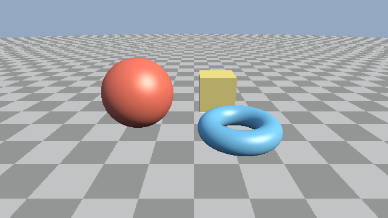

########################################################
第 5 章 照明
########################################################

第 2 章のレイマーチングで、レイが表面に当たる点は求められるようになった。この章では、その点の色を光の当たり方から計算する方法を説明する。まず表面の向き（法線）を SDF から求め、次に拡散反射、鏡面反射、環境光の順に照明を組み立てる。最後に、計算した値を画面に表示するためのガンマ補正を説明する。

影は次の第 6 章で扱う。この章のサンプルでは、光を遮る物体があっても影ができない。

   05_lighting.frag の実行結果

.. rst-class:: example-links

:download:`05_lighting.frag をダウンロード <../examples/shaders/05_lighting.frag>` ｜ `ブラウザーで実行 <demos/05_lighting.html>`__

法線の推定
==========

第 2 章で述べたとおり、SDF の勾配 :math:`\nabla f` は表面上で外向きの法線の方向を向く。そこで、:term:`法線` :math:`\hat{\mathbf{n}}` を次のように求める。

.. math::

   \hat{\mathbf{n}} = \frac{\nabla f(\mathbf{p})}{|\nabla f(\mathbf{p})|}

SDF が厳密な距離でなくても、勾配はゼロ等値面に垂直なので、正規化すれば正しい法線が得られる。勾配は数値微分で近似する。

中心差分
--------

最も素直な方法は、各軸方向の中心差分である。:math:`\mathbf{e}_x`、:math:`\mathbf{e}_y`、:math:`\mathbf{e}_z` を各軸の単位ベクトル、:math:`h` を小さな正の数とすると、次のようになる。

.. math::

   \nabla f(\mathbf{p}) \approx \frac{1}{2h}
   \begin{pmatrix}
     f(\mathbf{p} + h\mathbf{e}_x) - f(\mathbf{p} - h\mathbf{e}_x) \\
     f(\mathbf{p} + h\mathbf{e}_y) - f(\mathbf{p} - h\mathbf{e}_y) \\
     f(\mathbf{p} + h\mathbf{e}_z) - f(\mathbf{p} - h\mathbf{e}_z)
   \end{pmatrix}

正規化するので係数 :math:`1/(2h)` は省略できる。第 3 章と第 4 章のサンプルはこの方法を使っている。

.. literalinclude:: ../examples/shaders/03_primitives.frag
   :language: glsl
   :linenos:
   :lineno-match:
   :lines: {glsl:03_primitives.frag:calcNormal}
   :caption: 03_primitives.frag（抜粋）

``e.xyy`` はスウィズルで ``vec3(0.001, 0.0, 0.0)`` を表す。同様に ``e.yxy`` と ``e.yyx`` はそれぞれ :math:`y` 方向と :math:`z` 方向の微小なベクトルになる。

四面体による差分
----------------

中心差分は SDF を 6 回評価する。SDF の評価はレイマーチングで最も重い処理なので、回数を減らしたい。正四面体の 4 頂点の方向

.. math::

   \mathbf{k}_0 = (1, -1, -1), \quad
   \mathbf{k}_1 = (-1, -1, 1), \quad
   \mathbf{k}_2 = (-1, 1, -1), \quad
   \mathbf{k}_3 = (1, 1, 1)

を使うと、4 回の評価で勾配を近似できる。:math:`f(\mathbf{p} + h\mathbf{k}_i)` を 1 次の項までテイラー展開すると :math:`f(\mathbf{p}) + h\,\mathbf{k}_i \cdot \nabla f` となる。ここで :math:`\sum_i \mathbf{k}_i = \mathbf{0}`、:math:`\sum_i \mathbf{k}_i \mathbf{k}_i^{\mathsf{T}} = 4I` であることを使うと、次の式が得られる。

.. math::

   \sum_{i=0}^{3} \mathbf{k}_i\, f(\mathbf{p} + h\mathbf{k}_i)
   \approx f(\mathbf{p}) \sum_i \mathbf{k}_i + h \Bigl(\sum_i \mathbf{k}_i \mathbf{k}_i^{\mathsf{T}}\Bigr) \nabla f
   = 4h\, \nabla f(\mathbf{p})

第 5 章以降のサンプルは、この方法を使う。

.. literalinclude:: ../examples/shaders/05_lighting.frag
   :language: glsl
   :linenos:
   :lineno-match:
   :lines: {glsl:05_lighting.frag:calcNormal}
   :caption: 05_lighting.frag（抜粋）

差分の幅 :math:`h` が大きすぎると細かい形状がぼやけ、小さすぎると浮動小数点数の丸め誤差によって法線が乱れる。サンプルでは、シーンの大きさ（1 程度）に対して :math:`h = 0.0005` としている。

照明モデルの準備
================

本資料では、光の強さを放射輝度（ある方向から届く光の強さ）で考え、RGB の 3 成分で表す。光源として、太陽のように十分遠くにある :term:`平行光源` を 1 つ置く。平行光源は、すべての点に同じ方向から同じ強さの光が届く光源である。

以降の説明では、表面上の点 :math:`\mathbf{p}` で次のベクトルを使う。いずれも単位ベクトルである。

.. list-table::
   :header-rows: 1
   :widths: 20 30 50

   * - 記号
     - コードの変数
     - 意味
   * - :math:`\hat{\mathbf{n}}`
     - ``n``
     - 法線
   * - :math:`\hat{\mathbf{l}}`
     - ``LIGHT_DIR``
     - 表面から光源への方向
   * - :math:`\hat{\mathbf{v}}`
     - ``v``
     - 表面から視点への方向（:math:`-\hat{\mathbf{d}}`）
   * - :math:`\hat{\mathbf{h}}`
     - ``h``
     - ハーフベクトル（後述）

また、表面が光をどれだけ拡散反射するかを RGB ごとの反射率で表し、これを :term:`アルベド` と呼ぶ。サンプルでは、関数 ``albedoOf`` がマテリアル ID からアルベドを返す。

.. literalinclude:: ../examples/shaders/05_lighting.frag
   :language: glsl
   :linenos:
   :lineno-match:
   :lines: {glsl:05_lighting.frag:albedoOf}
   :caption: 05_lighting.frag（抜粋）

拡散反射
========

紙や漆喰のようにつやの無い表面は、受けた光をあらゆる方向に均等に反射する。このような反射を :term:`ランバート反射` と呼ぶ。ランバート反射では、表面の明るさは見る方向によらず、光の入射角 :math:`\theta` の余弦 :math:`\cos\theta = \hat{\mathbf{n}} \cdot \hat{\mathbf{l}}` に比例する。光が斜めに当たるほど、単位面積あたりに受ける光が減るためである。

アルベド :math:`\rho`、光源の強さ :math:`\mathbf{E}` を使うと、拡散反射による色は次のようになる。

.. math::

   \mathbf{L}_{\text{diffuse}} = \rho\, \mathbf{E}\, \max(\hat{\mathbf{n}} \cdot \hat{\mathbf{l}},\ 0)

物理的には、ランバート反射の BRDF は :math:`\rho/\pi` であり、式に :math:`1/\pi` が現れる。本資料のサンプルでは、この係数を光源の強さ ``SUN_COLOR`` に含めて省略している。:math:`\max` をとるのは、裏側から光が当たる面（:math:`\hat{\mathbf{n}} \cdot \hat{\mathbf{l}} < 0`）を 0 にするためである。

鏡面反射
========

プラスチックや塗装面のように、つやのある表面には光源の映り込み（ハイライト）が現れる。この鏡面反射を、:term:`Blinn-Phong` モデルで近似する。視点方向と光源の方向の中間の方向 :math:`\hat{\mathbf{h}}` （ハーフベクトル）を

.. math::

   \hat{\mathbf{h}} = \frac{\hat{\mathbf{l}} + \hat{\mathbf{v}}}{|\hat{\mathbf{l}} + \hat{\mathbf{v}}|}

とすると、鏡面反射の強さは次の式で表される。

.. math::

   L_{\text{specular}} \propto \max(\hat{\mathbf{n}} \cdot \hat{\mathbf{h}},\ 0)^{s}

表面が完全な鏡であれば、:math:`\hat{\mathbf{h}}` が法線と一致するときに光源が映る。指数 :math:`s` は表面のなめらかさを表し、大きいほどハイライトが小さく鋭くなる。サンプルでは :math:`s = 32` としている。

この式のままでは、:math:`s` を大きくするとハイライトの総エネルギーが小さくなる。エネルギーを保つには :math:`(s + 8)/(8\pi)` 程度の正規化係数を掛けるが、サンプルでは簡単のために定数 0.5 を掛けている。また、光が当たらない面にハイライトが出ないように、拡散反射の項 :math:`\max(\hat{\mathbf{n}} \cdot \hat{\mathbf{l}}, 0)` を掛けている。

環境光
======

現実の物体は、光源から直接届く光だけでなく、空や周囲の物体で散乱した光も受けている。これらをまとめて環境光と呼ぶ。環境光を無視すると、光源の当たらない面が真っ黒になってしまう。

屋外のシーンでは、環境光の大部分は空から届く :term:`天空光` である。上を向いた面ほど空の広い範囲が見えるので、多くの天空光を受ける。サンプルでは、この性質を次の式で近似する。

.. math::

   L_{\text{sky}} \propto \rho\, \mathbf{S}\, \frac{1 + n_y}{2}

:math:`\mathbf{S}` は天空光の強さ（``SKY_COLOR``）である。真上を向いた面（:math:`n_y = 1`）で 1、真下を向いた面（:math:`n_y = -1`）で 0 になる。

照明の合成
==========

以上の 3 つの項を足し合わせたものが、この章の照明モデルである。

.. literalinclude:: ../examples/shaders/05_lighting.frag
   :language: glsl
   :linenos:
   :lineno-match:
   :lines: {glsl:05_lighting.frag:shade}
   :caption: 05_lighting.frag（抜粋）

照明の計算に使う定数は、ファイルの先頭で定義している。光源の強さが 1 を超えているのは、明るい屋外を表すためである。1 を超えた値の扱いは第 7 章のトーンマッピングで説明する。

.. literalinclude:: ../examples/shaders/05_lighting.frag
   :language: glsl
   :linenos:
   :lineno-match:
   :lines: {glsl:05_lighting.frag:LIGHT_DIR..SKY_COLOR}
   :caption: 05_lighting.frag（抜粋）

ガンマ補正
==========

照明の計算は、光の強さに比例する値（線形な値）で行う必要がある。光の強さを足したり掛けたりする計算は、線形な値でなければ物理的な意味を持たないからである。

一方、一般的なディスプレイは、入力された値 :math:`V` に対しておよそ :math:`V^{2.2}` に比例する明るさで表示する（sRGB の特性）。そのため、線形な値 :math:`L` をそのまま出力すると、中間の明るさが暗く表示されてしまう。これを補正するため、出力の直前に次の変換を行う。この変換を :term:`ガンマ補正` と呼ぶ。

.. math::

   V = L^{1/2.2}

.. literalinclude:: ../examples/shaders/05_lighting.frag
   :language: glsl
   :linenos:
   :lineno-match:
   :lines: {glsl:05_lighting.frag:mainImage}
   :caption: 05_lighting.frag（抜粋）

sRGB の厳密な変換式は、暗い部分が線形で、それ以外がべき乗の区分的な関数であるが、指数 2.2 のべき乗で十分よく近似できる。同じ理由で、アルベドなどの色を画像や色見本から取り込むときは、逆の変換 :math:`L = V^{2.2}` で線形な値に戻してから計算に使う。
