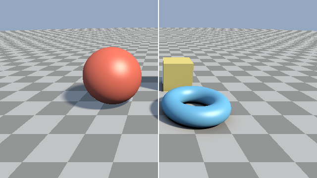

########################################################
第 6 章 影と AO
########################################################

第 5 章の照明モデルは、光源と表面の間に物体があっても光が届くものとして計算していた。この章では、光源からの光が遮られてできる影と、周囲の物体に環境光が遮られて暗くなる効果（アンビエントオクルージョン）を加える。どちらも、SDF を使って効率よく近似できる。

ハードシャドウ
==============

表面上の点 :math:`\mathbf{p}` に光源の光が届くかどうかは、:math:`\mathbf{p}` から光源の方向 :math:`\hat{\mathbf{l}}` にレイを飛ばせば判定できる。このレイ（シャドウレイ）が途中で物体に当たれば、:math:`\mathbf{p}` は影の中にある。平行光源は無限遠にあるので、シャドウレイの長さは十分大きな値 :math:`t_{\max}` で打ち切る。

.. literalinclude:: ../examples/shaders/06_shadow.frag
   :language: glsl
   :linenos:
   :lineno-match:
   :lines: {glsl:06_shadow.frag:hardShadow}
   :caption: 06_shadow.frag（抜粋）

影の値は、拡散反射と鏡面反射の項に掛ける。天空光は空全体から届くので、光源の影は掛けない。

.. literalinclude:: ../examples/shaders/06_shadow.frag
   :language: glsl
   :linenos:
   :lineno-match:
   :lines: {glsl:06_shadow.frag:shade}
   :caption: 06_shadow.frag（抜粋）

シャドウレイの始点は、:math:`\mathbf{p}` から法線方向に少し離した点にしている。レイマーチングで求めた :math:`\mathbf{p}` は表面から閾値 :math:`\varepsilon` 以内の位置にあり、表面のわずかに内側にあることもある。この点からそのままシャドウレイを飛ばすと、最初の評価で SDF がすでに閾値未満になり、自分自身の表面に当たったと判定されてしまう。その結果、影にならないはずの面にまだら模様の影が現れる。この現象を :term:`シャドウアクネ` と呼ぶ。

ソフトシャドウ
==============

ハードシャドウは、光源が大きさを持たない点（または無限遠の平行光源）である場合の影で、影の境界がくっきりしている。実際の光源には大きさがあるため、影の境界には光源の一部だけが見える半影ができ、境界がぼやける。

厳密に半影を求めるには、光源の各点へのシャドウレイを飛ばして平均をとる必要がある。レイマーチングでは、SDF の値を使うことで、1 本のシャドウレイだけで半影を近似できる。

シャドウレイ上の距離 :math:`t` の点で SDF の値が :math:`h` であるとき、その点を中心とする半径 :math:`h` の球の中に物体は無い。この球を :math:`\mathbf{p}` から見込む角度はおよそ :math:`h/t` である。つまり :math:`h/t` は、シャドウレイが物体からどれだけ離れて通過したかを角度で表した量になる。シャドウレイ全体でこの値の最小値をとり、定数 :math:`k` を掛けて 0〜1 に収めたものを影の値とする。

.. math::

   s = \operatorname{clamp}\left(\min_{i} \frac{k\, h_i}{t_i},\ 0,\ 1\right)

シャドウレイが物体にかすりもせずに通過すれば :math:`s = 1` （影なし）、物体に当たれば :math:`h_i \to 0` なので :math:`s = 0` （完全な影）になる。その間の値が半影を表す。:math:`k` は半影の幅を調整するパラメーターで、:math:`h/t` が :math:`1/k` 未満になると暗くなり始める。したがって、:math:`k` が大きいほど半影が狭くなり、影の境界がくっきりする。

.. literalinclude:: ../examples/shaders/06_shadow.frag
   :language: glsl
   :linenos:
   :lineno-match:
   :lines: {glsl:06_shadow.frag:softShadow}
   :caption: 06_shadow.frag（抜粋）

ソフトシャドウでは、表面に当たったかどうかではなく、物体の近くを通過したかどうかが重要である。そのため、1 回に進む距離を ``clamp(h, 0.01, 0.5)`` で制限し、物体から離れた場所でも大きく進みすぎないようにしている。最後の ``res * res * (3.0 - 2.0 * res)`` は ``smoothstep`` と同じ 3 次の補間で、半影の明暗の変化を滑らかにする。

.. rst-class:: example-links

:download:`06_shadow.frag をダウンロード <../examples/shaders/06_shadow.frag>` ｜ `ブラウザーで実行 <demos/06_shadow.html>`__

   06_shadow.frag の実行結果。左半分はハードシャドウ、右半分はソフトシャドウである。

この方法は物理的に正確な半影を求めるものではなく、見た目を近似する手法である。また、シャドウレイ上の離散的な点でしか SDF を評価しないため、物体の角の近くを通過するシャドウレイでは物体に最も近づく点を見逃しやすく、半影にむらが出ることがある。これを改善した方法が Quilez による記事で紹介されている（:doc:`references`）。

アンビエントオクルージョン
==========================

第 5 章の天空光は、すべての点で空全体が見えるものとして計算していた。しかし実際には、物体同士が接する部分や、くぼみの奥では、周囲の物体に遮られて空の一部しか見えない。そのため、これらの場所は天空光を受ける量が減り、暗くなる。この効果を :term:`アンビエントオクルージョン` （ambient occlusion、AO）と呼ぶ。

定義
----

点 :math:`\mathbf{p}` での AO は、法線まわりの半球 :math:`\Omega` のうち、周囲の物体に遮られずに見える方向の割合を、余弦で重み付けして表す。

.. math::

   A(\mathbf{p}) = \frac{1}{\pi} \int_{\Omega} V(\mathbf{p}, \hat{\omega})\, (\hat{\mathbf{n}} \cdot \hat{\omega})\, d\omega

:math:`V` は方向 :math:`\hat{\omega}` に遮るものが無ければ 1、あれば 0 になる関数である。何にも遮られていなければ :math:`A = 1` になる。この積分を正確に求めるには多数のレイを飛ばす必要があり、計算量が大きい。

SDF による近似
--------------

SDF を使うと、法線方向の数点で SDF を評価するだけで AO を近似できる。点 :math:`\mathbf{p}` から法線方向に距離 :math:`h_i` だけ離れた点 :math:`\mathbf{p} + h_i \hat{\mathbf{n}}` を考える。:math:`\mathbf{p}` の周囲に表面以外の物体が無ければ、この点での SDF の値は :math:`h_i` に等しい。周囲に物体があれば、SDF の値は :math:`h_i` より小さくなる。この差 :math:`h_i - f(\mathbf{p} + h_i \hat{\mathbf{n}})` が大きいほど、近くに遮るものがあると考えられる。

.. math::

   A(\mathbf{p}) \approx \operatorname{clamp}\left(1 - c \sum_{i=0}^{N-1} w_i \bigl(h_i - f(\mathbf{p} + h_i \hat{\mathbf{n}})\bigr),\ 0,\ 1\right)

:math:`w_i` は近い点ほど大きくする重み、:math:`c` は効果の強さを調整する係数である。サンプルでは :math:`N = 5`、:math:`h_i = 0.02 + 0.1i`、:math:`w_i = 0.6^i`、:math:`c = 2.5` としている。

.. literalinclude:: ../examples/shaders/06_ao.frag
   :language: glsl
   :linenos:
   :lineno-match:
   :lines: {glsl:06_ao.frag:calcAO}
   :caption: 06_ao.frag（抜粋）

AO は環境光の遮蔽を表すので、天空光の項にだけ掛ける。光源からの直接光の遮蔽はソフトシャドウで扱っている。

.. literalinclude:: ../examples/shaders/06_ao.frag
   :language: glsl
   :linenos:
   :lineno-match:
   :lines: {glsl:06_ao.frag:shade}
   :caption: 06_ao.frag（抜粋）

.. rst-class:: example-links

:download:`06_ao.frag をダウンロード <../examples/shaders/06_ao.frag>` ｜ `ブラウザーで実行 <demos/06_ao.html>`__

   06_ao.frag の実行結果。左半分は AO なし、右半分は AO ありである。右半分では、トーラスと地面の隙間や、物体と地面が接する部分が暗くなり、物体が地面に接していることがわかりやすくなる。

この近似は法線方向の 1 本の線上だけを調べるので、横方向にある物体による遮蔽は十分に考慮できない。また、SDF が距離を大きく過小評価している場所では、実際より暗くなる。それでも、数回の SDF の評価で自然な陰影が得られるため、レイマーチングでは広く使われている。
