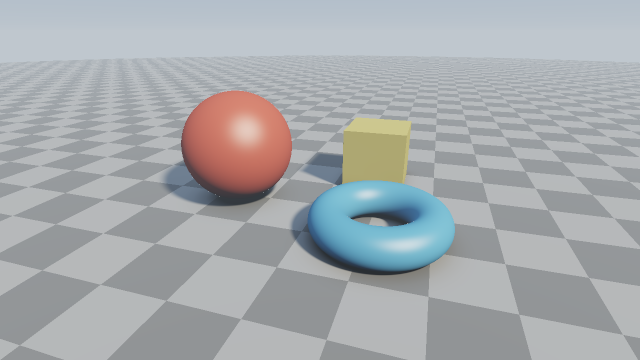
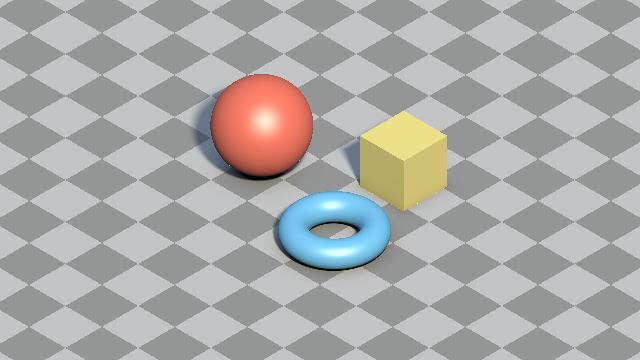
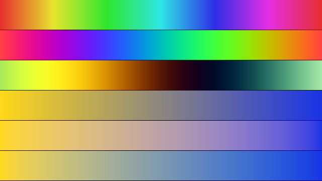

########################################################
第 7 章 カメラと演出
########################################################

ここまでのサンプルは、固定したカメラから物体を眺めるだけであった。この章では、カメラを動かす方法と平行投影、画像の見た目を整える処理として、空の描画、フォグ、トーンマッピング、色の設計、アンチエイリアスを説明する。

   07_camera.frag の実行結果

.. rst-class:: example-links

:download:`07_camera.frag をダウンロード <../examples/shaders/07_camera.frag>` ｜ `ブラウザーで実行 <demos/07_camera.html>`__

カメラの操作
============

第 2 章のルックアットカメラでは、カメラの位置 :math:`\mathbf{o}` と注視点 :math:`\mathbf{a}` を与えればカメラの向きが決まる。そこで、:math:`\mathbf{o}` を時間やマウスの位置の関数にすれば、カメラを動かせる。

次のサンプルでは、注視点を中心とする半径 :math:`R` の円周上にカメラを置き、時間とともに周回させる。

.. math::

   \mathbf{o} = \mathbf{a} + (R \sin\phi,\ h,\ R \cos\phi), \qquad \phi = 0.3\, t

マウスでドラッグしている間は、``iMouse`` の値で角度 :math:`\phi` と高さ :math:`h` を決める。ドラッグ中は ``iMouse.z`` が正になることを利用して判定している。

.. literalinclude:: ../examples/shaders/07_camera.frag
   :language: glsl
   :linenos:
   :lineno-match:
   :lines: {glsl:07_camera.frag:mainImage}
   :caption: 07_camera.frag（抜粋）

ズームは焦点距離を変えれば実現できる（第 2 章）。このサンプルでは焦点距離を 2.0 に固定している。

平行投影
========

ここまでのカメラは、すべてのレイが 1 点（視点）から出るピンホールカメラで、遠くの物体ほど小さく写る。これを透視投影と呼ぶ。一方、すべてのレイを同じ方向に平行に飛ばすと、物体は距離によらず同じ大きさで写る。これを :term:`平行投影` （正射影）と呼ぶ。平行投影は、設計図のような技術的な図や、ゲームの見下ろし型の画面などに使われる。

2 つの投影方法の違いは、レイの始点と方向の決め方だけである。

.. list-table::
   :header-rows: 1
   :widths: 20 40 40

   * - 投影方法
     - レイの始点
     - レイの方向
   * - 透視投影
     - すべてのピクセルで同じ（視点）
     - ピクセルごとに異なる：:math:`M\,\widehat{(p_x, p_y, f)}`
   * - 平行投影
     - ピクセルごとに異なる：:math:`\mathbf{c} + \frac{H}{2}(p_x \hat{\mathbf{u}} + p_y \hat{\mathbf{v}})`
     - すべてのピクセルで同じ：:math:`\hat{\mathbf{w}}`

:math:`\hat{\mathbf{u}}, \hat{\mathbf{v}}, \hat{\mathbf{w}}` は第 2 章のカメラの座標軸、:math:`\mathbf{c}` は画面の中心に写る点、:math:`H` は画面の高さに写るワールドの長さである。平行投影では焦点距離の代わりに :math:`H` で写る範囲を決める。

レイの始点は、画面の中心に写る点から視線と逆の方向に十分下げておく。始点が物体の内部にあると、SDF が負になり、正しく描画できないためである。

.. literalinclude:: ../examples/shaders/07_orthographic.frag
   :language: glsl
   :linenos:
   :lineno-match:
   :lines: {glsl:07_orthographic.frag:VIEW_DIR..mainImage}
   :caption: 07_orthographic.frag（抜粋）

.. rst-class:: example-links

:download:`07_orthographic.frag をダウンロード <../examples/shaders/07_orthographic.frag>` ｜ `ブラウザーで実行 <demos/07_orthographic.html>`__

   07_orthographic.frag の実行結果。地面の市松模様が、奥でも手前でも同じ大きさで写っている。

視線の方向を :math:`-(1, 1, 1)/\sqrt{3}` にすると、:math:`x, y, z` の 3 つの軸が画面上で互いに 120° ずつ離れて見える。これをアイソメトリック表示と呼ぶ。このとき視線は水平面から :math:`\arcsin(1/\sqrt{3}) \approx 35.26°` だけ見下ろしている。

平行投影には遠近感が無いため、奥行きの手がかりは陰影と重なり順だけになる。距離に応じたフォグ（後述）も、透視投影ほどは効果がない。サンプルの先頭の ``ORTHOGRAPHIC`` を 0 にすると、同じ向きの透視投影に切り替わるので、見え方を比べるとよい。

空の描画
========

レイが何にも当たらなかったピクセルには、レイの方向に応じた空の色を描く。サンプルでは、地平線から天頂に向かって色を変化させ、さらに太陽の方向を明るくしている。

.. literalinclude:: ../examples/shaders/07_camera.frag
   :language: glsl
   :linenos:
   :lineno-match:
   :lines: {glsl:07_camera.frag:skyColor}
   :caption: 07_camera.frag（抜粋）

太陽は、レイの方向と光源の方向の余弦 ``sun`` のべき乗で表している。指数の大きい項（512 乗）は太陽の円盤、指数の小さい項（16 乗）は太陽のまわりの光のにじみを表す。

フォグ
======

実際の屋外では、大気中の微粒子が光を散乱・吸収するため、遠くの物体ほど色が薄くなり、空の色に近づく。この効果を :term:`フォグ` で表す。

一様な媒質の中を距離 :math:`t` だけ進んだ光は、ランベルト・ベールの法則により :math:`e^{-\sigma t}` の割合だけが残る。:math:`\sigma` は媒質の濃さを表す係数である。残りの :math:`1 - e^{-\sigma t}` の割合は、大気で散乱された光（フォグの色）に置き換わるとみなす。

.. math::

   \mathbf{C}' = \mathbf{C}\, e^{-\sigma t} + \mathbf{C}_{\text{fog}} \bigl(1 - e^{-\sigma t}\bigr)

.. literalinclude:: ../examples/shaders/07_camera.frag
   :language: glsl
   :linenos:
   :lineno-match:
   :lines: {glsl:07_camera.frag:applyFog}
   :caption: 07_camera.frag（抜粋）

フォグの色には、レイの方向を水平にしたときの空の色（地平線の色）を使っている。これにより、遠くの地面が地平線の空の色に溶け込み、``MAX_DIST`` でレイマーチングを打ち切った境目も目立たなくなる。媒質が一様でない場合の扱いは、第 16 章のボリュームレンダリングで説明する。

トーンマッピング
================

第 5 章で述べたとおり、照明の計算は線形な値で行う。明るい光源に照らされた表面や太陽の円盤では、この値が 1 を大きく超えることがある。ディスプレイに表示できるのは 0〜1 の範囲なので、そのまま出力すると 1 を超えた部分がすべて同じ白になり、色の変化が失われる。

そこで、0 以上の任意の値を 0〜1 に滑らかに収める変換を施す。この変換を :term:`トーンマッピング` と呼ぶ。最も簡単なものは Reinhard の式である。

.. math::

   L' = \frac{L}{1 + L}

このサンプルでは、映画制作で使われる ACES の特性を近似した Narkowicz の式を使う。Reinhard の式に比べて暗部と明部のコントラストが高く、明るい部分がわずかに彩度を失いながら白に近づく。

.. literalinclude:: ../examples/shaders/07_camera.frag
   :language: glsl
   :linenos:
   :lineno-match:
   :lines: {glsl:07_camera.frag:toneMapACES}
   :caption: 07_camera.frag（抜粋）

最初の ``x *= 0.6`` は露出の調整で、Narkowicz が示した元の近似式に含まれている係数である。この値を変えると、画像全体の明るさを調整できる。トーンマッピングは線形な値に対して行い、その後でガンマ補正を施す。

色の設計
========

レイマーチングでは、マテリアル ID、反復回数、角度、ノイズの値などから、計算で色を作ることが多い。ここでは、数値から色を作る代表的な方法と、色を扱うときの注意点を説明する。

.. rst-class:: example-links

:download:`07_color.frag をダウンロード <../examples/shaders/07_color.frag>` ｜ `ブラウザーで実行 <demos/07_color.html>`__

   07_color.frag の実行結果。上から、HSV の色相、余弦関数によるパレット 2 種類、黄から青への補間（sRGB の値、線形な RGB、Oklab）である。

HSV
---

:term:`HSV` は、色を色相（hue）、彩度（saturation）、明度（value）の 3 つの値で表す方法である。色相を 0〜1 の範囲で変化させると、赤、黄、緑、シアン、青、マゼンタを経て赤に戻る。そのため、角度や反復回数のように、周期的に変化する値や連続的に変化する値を色で区別するのに便利である。

.. literalinclude:: ../examples/shaders/07_color.frag
   :language: glsl
   :linenos:
   :lineno-match:
   :lines: {glsl:07_color.frag:hsv2rgb}
   :caption: 07_color.frag（抜粋）

ただし、HSV は人間の知覚に基づく色空間ではない。明度が同じでも、黄は明るく、青は暗く見える（図の 1 本目）。明るさを揃えたい場合は、後述の Oklab を使う。

余弦関数によるパレット
----------------------

Quilez は、次の式で滑らかな配色（パレット）を作る方法を示している。

.. math::

   \mathbf{c}(t) = \mathbf{a} + \mathbf{b} \cos\bigl(2\pi(\mathbf{c}\, t + \mathbf{d})\bigr)

:math:`\mathbf{a}, \mathbf{b}, \mathbf{c}, \mathbf{d}` はいずれも RGB の 3 成分を持つベクトルで、式は成分ごとに計算する。:math:`\mathbf{a}` は色の平均、:math:`\mathbf{b}` は振れ幅、:math:`\mathbf{c}` は周波数、:math:`\mathbf{d}` は位相（成分ごとのずれ）を表す。4 つのパラメーターを変えるだけで、多様な配色を作れる。第 13 章のメンガーのスポンジ、第 14 章のステレオ投影のサンプルは、この方法で色を付けている。

.. literalinclude:: ../examples/shaders/07_color.frag
   :language: glsl
   :linenos:
   :lineno-match:
   :lines: {glsl:07_color.frag:cosinePalette}
   :caption: 07_color.frag（抜粋）

色の補間
--------

2 つの色の間を補間するときは、どの色空間で補間するかによって結果が変わる。

.. list-table::
   :header-rows: 1
   :widths: 25 75

   * - 色空間
     - 補間の結果
   * - sRGB の値
     - 表示用の値をそのまま補間する。計算は簡単だが、中間の色が暗く、くすんだ色になる（図の 4 本目）。
   * - 線形な RGB
     - 光の強さとして正しく混ぜる。光を混ぜた結果としては物理的に正しいが、中間の色は明るく白っぽく見える（図の 5 本目）。
   * - Oklab
     - 知覚的に均等になるように設計された色空間（Ottosson, 2020）。明るさと色合いが均等に変化して見える（図の 6 本目）。

照明の計算は、第 5 章で述べたとおり必ず線形な RGB で行う。一方、グラデーションやパレットのように「見た目として均等に変化させたい」配色を作るときは、Oklab で補間するとよい。Oklab と線形な RGB の変換は、3 行 3 列の行列、成分ごとの立方根、もう一度 3 行 3 列の行列という計算だけでできる。

.. literalinclude:: ../examples/shaders/07_color.frag
   :language: glsl
   :linenos:
   :lineno-match:
   :lines: {glsl:07_color.frag:linearToOklab..oklabToLinear}
   :caption: 07_color.frag（抜粋）

カラーグレーディング
--------------------

トーンマッピングの後に、画像全体の色味を整える処理をカラーグレーディングと呼ぶ。代表的なものは、彩度の調整、コントラストの調整、画面の周辺を暗くするビネットである。

.. code-block:: glsl
   :linenos:

   // 0〜1 の表示用の値 col を調整する。uv は画面の座標 (0〜1)
   vec3 colorGrade(vec3 col, vec2 uv)
   {
       float luma = dot(col, vec3(0.2126, 0.7152, 0.0722));  // 輝度
       col = mix(vec3(luma), col, 1.2);                      // 彩度を 1.2 倍にする
       col = smoothstep(0.0, 1.0, col);                      // コントラストを上げる
       col *= 0.5 + 0.5 * pow(16.0 * uv.x * uv.y * (1.0 - uv.x) * (1.0 - uv.y), 0.2);  // ビネット
       return col;
   }

輝度の係数 :math:`(0.2126, 0.7152, 0.0722)` は、線形な sRGB の値から輝度を求めるための係数である。表示用の値に対して使うと近似になるが、彩度の調整のように見た目を整える用途では問題ない。

アンチエイリアス
================

ここまでのサンプルでは、1 ピクセルにつき 1 本のレイしか飛ばしていない。そのため、物体の輪郭や遠くの市松模様にギザギザや、ちらつく模様（エイリアシング）が現れる。

これを減らす最も簡単な方法は、1 ピクセルの中の複数の位置からレイを飛ばし、得られた色を平均することである。この方法を :term:`スーパーサンプリング` と呼ぶ。サンプルでは、ピクセルを :math:`\mathrm{AA} \times \mathrm{AA}` の格子に分け、各格子の中心を通るレイを飛ばしている（``mainImage`` の二重ループ）。``AA`` は次のようにマクロで定義している。

.. literalinclude:: ../examples/shaders/07_camera.frag
   :language: glsl
   :linenos:
   :lineno-match:
   :lines: 5

各サンプルの色は、トーンマッピングを施してから平均している。トーンマッピングの前に平均すると、非常に明るいサンプルが 1 つあるだけで平均値が大きくなり、明るい物体の輪郭でエイリアシングが残るためである。

スーパーサンプリングの計算量は、:math:`\mathrm{AA}^2` 倍になる。``AA`` を 2 にすると 4 倍、3 にすると 9 倍の時間がかかる。描画が重い場合は ``AA`` を 1 にして無効にするとよい。

レンダリング関数の整理
======================

この章から、1 本のレイの色を求める処理を関数 ``render`` にまとめている。スーパーサンプリングのように、1 ピクセルで複数のレイを扱う場合に便利である。

.. literalinclude:: ../examples/shaders/07_camera.frag
   :language: glsl
   :linenos:
   :lineno-match:
   :lines: {glsl:07_camera.frag:render}
   :caption: 07_camera.frag（抜粋）
