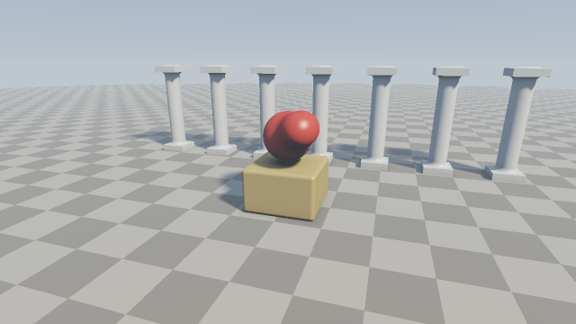

########################################################
第 8 章 実践：シーンを組み立てる
########################################################

この章では、第 3 章から第 7 章までの要素をすべて組み合わせて、1 つのシーンを完成させる。新しい技法は登場しないので、各要素がどのようにつながっているかに注目して読んでほしい。

完成イメージ
============

   08_scene.frag の実行結果

.. rst-class:: example-links

:download:`08_scene.frag をダウンロード <../examples/shaders/08_scene.frag>` ｜ `ブラウザーで実行 <demos/08_scene.html>`__

シーンは、床、台座、台座の上で形を変え続ける物体（以降「ブロブ」と呼ぶ）、奥に並ぶ柱で構成する。カメラはシーンのまわりを周回し、マウスでも操作できる。

シーンの設計
============

各物体に使う形状と技法を次の表にまとめる。

.. list-table::
   :header-rows: 1
   :widths: 15 45 20 20

   * - 物体
     - 形状と技法
     - マテリアル ID
     - 関連する章
   * - 床
     - 平面、市松模様
     - ``MAT_GROUND``
     - 第 3 章、第 5 章
   * - 台座
     - 角丸の箱
     - ``MAT_PEDESTAL``
     - 第 3 章
   * - ブロブ
     - 3 つの球の smooth min、時間による移動
     - ``MAT_BLOB``
     - 第 4 章
   * - 柱
     - 円柱と 2 つの箱の smooth min、有限回の繰り返し
     - ``MAT_PILLAR``
     - 第 3 章、第 4 章

1 ピクセルの色が決まるまでの処理の流れは、次のとおりである。

1. ``mainImage``: カメラの位置を決め、サブピクセルごとにレイを作る（第 2 章、第 7 章）。
2. ``render``: レイマーチングで交点を求め、陰影を付け、フォグを掛ける（第 2 章、第 7 章）。
3. ``raymarch``: シーンの SDF ``map`` を使ってスフィアトレーシングを行う（第 2 章）。
4. ``shade``: 法線、ソフトシャドウ、AO を求め、照明を計算する（第 5 章、第 6 章）。
5. ``mainImage``: トーンマッピングを施して平均し、ガンマ補正を施して出力する（第 5 章、第 7 章）。

形状の定義
==========

ブロブ
------

ブロブは、中心の球のまわりを 2 つの小さな球が異なる周期で回るようにし、それらを smooth min でつないだものである。2 つの球が中心の球に近づいたり離れたりするたびに、全体の形が滑らかに変化する。

.. literalinclude:: ../examples/shaders/08_scene.frag
   :language: glsl
   :linenos:
   :lineno-match:
   :lines: {glsl:08_scene.frag:sdBlob}
   :caption: 08_scene.frag（抜粋）

柱
--

柱は、円柱の上下に薄い箱（柱礎と柱頭）を置いたものである。円柱と箱のつなぎ目を smooth min で滑らかにし、石を削り出したような形にしている。

.. literalinclude:: ../examples/shaders/08_scene.frag
   :language: glsl
   :linenos:
   :lineno-match:
   :lines: {glsl:08_scene.frag:sdPillar}
   :caption: 08_scene.frag（抜粋）

シーン全体
----------

シーン全体の SDF では、各物体の距離とマテリアル ID の組を ``opU`` で合成する。柱は、第 4 章で示した有限回の繰り返しを使い、:math:`x` 方向に間隔 1.8 で 7 本並べている。柱は 1 本分の SDF しか評価しないので、本数を増やしても計算量は変わらない。

.. literalinclude:: ../examples/shaders/08_scene.frag
   :language: glsl
   :linenos:
   :lineno-match:
   :lines: {glsl:08_scene.frag:MAT_GROUND..map}
   :caption: 08_scene.frag（抜粋）

マテリアル
==========

マテリアル ID ごとのアルベドは、関数 ``albedoOf`` で決める。床の市松模様は、座標の整数部の和の偶奇で 2 色を切り替えて作る。

.. literalinclude:: ../examples/shaders/08_scene.frag
   :language: glsl
   :linenos:
   :lineno-match:
   :lines: {glsl:08_scene.frag:albedoOf}
   :caption: 08_scene.frag（抜粋）

照明
====

照明は、第 6 章の ``06_ao.frag`` と同じ構成である。拡散反射と鏡面反射にはソフトシャドウを、天空光には AO を掛ける。ブロブのつやを強調するため、鏡面反射の指数と強さを少し大きくしている。

.. literalinclude:: ../examples/shaders/08_scene.frag
   :language: glsl
   :linenos:
   :lineno-match:
   :lines: {glsl:08_scene.frag:shade}
   :caption: 08_scene.frag（抜粋）

カメラと仕上げ
==============

カメラ、空、フォグ、トーンマッピング、アンチエイリアスは、第 7 章の ``07_camera.frag`` と同じである。カメラの周回の半径と注視点の高さだけを、このシーンに合わせて変更している。

.. literalinclude:: ../examples/shaders/08_scene.frag
   :language: glsl
   :linenos:
   :lineno-match:
   :lines: {glsl:08_scene.frag:render..mainImage}
   :caption: 08_scene.frag（抜粋）

サンプルの改造
==============

このサンプルを土台にして、次のような改造を試すとよい。

* ブロブに第 4 章の変位を加え、表面を波打たせる。
* 柱の本数や間隔を変え、:math:`z` 方向にも並べて列柱の回廊にする。
* 光源の方向 ``LIGHT_DIR`` を時間で変化させ、夕方の太陽のような低い角度から照らす。
* 第 9 章のデバッグ表示を組み込み、反復回数が多い場所を調べる。

コード全体は :doc:`appendix_examples` に掲載している。
