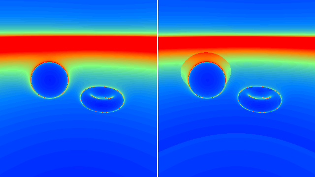
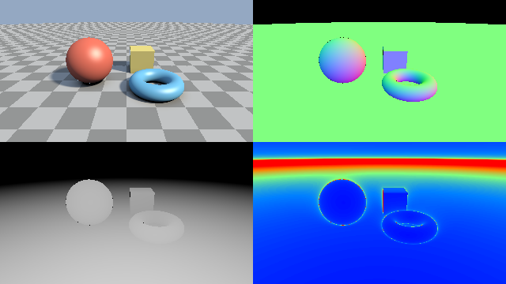

########################################################
第 9 章 最適化とデバッグ
########################################################

レイマーチングのシェーダーは、1 ピクセルごとに SDF を数十〜数百回評価するため、計算量が大きくなりやすい。また、SDF の性質が崩れると、表面に穴が空く、縞模様が出るといった不具合が起こる。この章では、パラメーターの調整方法、よくある不具合とその対策、高速化の方法、不具合の原因を調べるための可視化の方法を説明する。

レイマーチングのパラメーター
============================

スフィアトレーシングの品質と速度は、主に次の 3 つのパラメーターで決まる。

.. list-table::
   :header-rows: 1
   :widths: 20 40 40

   * - パラメーター
     - 小さくすると
     - 大きくすると
   * - ``MAX_STEPS``
     - 速くなるが、表面に届く前に打ち切られるレイが増える。
     - 遅くなるが、表面とほぼ平行に進むレイも表面に届きやすくなる。
   * - ``SURF_DIST``
     - 表面の位置が正確になるが、反復回数が増える。
     - 速くなるが、細かい形状がつぶれ、表面の位置がずれる。
   * - ``MAX_DIST``
     - 速くなるが、遠くの物体が描かれない。
     - 遠くまで描かれるが、何にも当たらないレイの反復回数が増える。

第 4 章の図で画面の上部が円弧状に途切れているのは、``MAX_DIST`` や ``MAX_STEPS`` に達して打ち切られたレイが背景色で塗られたためである。第 7 章のフォグは、この境目を目立たなくする効果もある。

距離に応じた閾値
----------------

遠くの物体ほど画面上では小さく見えるので、同じ閾値 ``SURF_DIST`` を使うと、遠くでは必要以上に精密な計算をしていることになる。そこで、閾値を距離 :math:`t` に比例させる方法がよく使われる。

.. math::

   f(\mathbf{p}(t)) < \varepsilon\, t

:math:`\varepsilon` を 1 ピクセルが見込む角度程度にすると、1 ピクセルより細かい精度の計算を省ける。例えば画面の高さが 1000 ピクセル、焦点距離が 2 の場合、1 ピクセルが見込む角度は約 :math:`2 / (1000 \times 2) = 0.001` である。第 13 章のフラクタルのサンプルは、この方法を :math:`\varepsilon = 0.0005` で使っている。

.. literalinclude:: ../examples/shaders/13_menger.frag
   :language: glsl
   :linenos:
   :lineno-match:
   :lines: {glsl:13_menger.frag:raymarch}
   :caption: 13_menger.frag（抜粋）

よくある不具合と対策
====================

表面の穴とすり抜け
------------------

第 4 章の変位やねじり、軸ごとに倍率の異なる拡大縮小を使うと、SDF のリプシッツ定数が 1 を超え、真の距離より大きな値を返す場所ができる。スフィアトレーシングがこの値だけ進むと、表面を通り過ぎてしまう。その結果、表面に穴が空いたり、物体の縁が欠けたりする。

リプシッツ定数の上限 :math:`L` がわかっている場合は、SDF の値を :math:`L` で割った距離だけ進めば安全である。上限がわからない場合は、0.5〜0.8 程度の係数を掛けて歩幅を小さくし、不具合が消えるまで調整する。

.. code-block:: glsl
   :linenos:

   const float STEP_SCALE = 0.6;  // 歩幅の係数 (1 / L の目安)

   float t = 0.0;
   for (int i = 0; i < MAX_STEPS; i++) {
       float d = map(ro + t * rd);
       if (d < SURF_DIST) {
           return t;
       }
       t += d * STEP_SCALE;
   }

歩幅を小さくすると反復回数が増えるので、``MAX_STEPS`` も合わせて大きくする必要がある。

シャドウアクネと自己交差
------------------------

第 6 章で説明したとおり、表面上の点から新しいレイ（シャドウレイ、反射レイなど）を飛ばすときは、始点を法線方向に少し離す。離す距離が小さすぎると自分自身の表面に当たってまだら模様が現れ、大きすぎると物体同士が接する部分で影が途切れる。サンプルでは、シーンの大きさ 1 程度に対して 0.01 としている。

浮動小数点数の精度
------------------

GLSL の ``float`` は 32 ビットで、有効数字は 10 進数で約 7 桁である。座標の値が大きくなるほど、表せる最小の差が大きくなる。原点から遠く離れた場所に物体を置くと、表面の位置や法線の計算が粗くなり、縞模様やちらつきが現れる。物体はなるべく原点の近くに置き、カメラを遠くに置く必要がある場合は、カメラを原点に置いてシーン全体を移動させるとよい。

``iTime`` も同様で、長時間実行して値が大きくなると、``sin(iTime * 100.0)`` のような速い変化の精度が落ちる。

高速化
======

バウンディングボリューム
------------------------

複雑な形状の SDF は評価に時間がかかる。形状を囲む単純な形状（球や箱）を用意し、点がその外側にあるときは、囲む形状までの距離を返すようにすると、評価を省ける。囲む形状までの距離は、中の形状までの距離の下界になっているので、スフィアトレーシングは正しく動作する。

.. literalinclude:: ../examples/shaders/13_mandelbulb.frag
   :language: glsl
   :linenos:
   :lineno-match:
   :lines: {glsl:13_mandelbulb.frag:map}
   :caption: 13_mandelbulb.frag（抜粋）

外接球の外側でも、表面から 0.1 以内に近づいたら本来の SDF を評価するようにしている。外接球の表面で ``bound`` を返すと、そこで閾値未満になり、外接球の表面に当たったと判定されるためである。

過緩和
------

スフィアトレーシングは、SDF の値 :math:`d` だけ進む。しかし SDF が表す安全な球は、レイの進行方向だけでなく全方向に同じ半径を持つため、平面に斜めに近づく場合などは、実際にはもっと先まで進んでも表面に当たらないことが多い。そこで、係数 :math:`\omega \ (1 \le \omega < 2)` を掛けて、:math:`\omega d` だけ進む方法がある。これを :term:`過緩和` （over-relaxation）と呼ぶ（Keinert et al., 2014）。

大きく進むと表面を通り越すおそれがあるため、各点で次の条件を確かめる。前の点 :math:`\mathbf{p}_{i-1}` の安全な球（半径 :math:`d_{i-1}`）と、今の点 :math:`\mathbf{p}_i` の安全な球（半径 :math:`d_i`）が重なっていれば、2 点の間の区間はすべて安全な球に覆われているので、表面は無い。

.. math::

   \omega\, d_{i-1} \le d_{i-1} + d_i

この条件が成り立たないとき、つまり 2 つの球の間に隙間があるときは、その隙間で表面を通り越した可能性がある。その場合は、通常の歩幅 :math:`d_{i-1}` で進んだ位置まで戻り、以降は :math:`\omega = 1` として通常のスフィアトレーシングを続ける。

.. literalinclude:: ../examples/shaders/09_relaxation.frag
   :language: glsl
   :linenos:
   :lineno-match:
   :lines: {glsl:09_relaxation.frag:relaxedRaymarchSteps}
   :caption: 09_relaxation.frag（抜粋）

.. rst-class:: example-links

:download:`09_relaxation.frag をダウンロード <../examples/shaders/09_relaxation.frag>` ｜ `ブラウザーで実行 <demos/09_relaxation.html>`__

   09_relaxation.frag の実行結果。左が通常の方法、右が過緩和（:math:`\omega = 1.2`）である。

右の図では、地面や遠くを見るレイの反復回数が全体に減っている。一方、球の周りでは反復回数が増えている。レイが球の近くを通ると、SDF の値が急に小さくなって条件が成り立たなくなり、戻る処理と通常の方法への切り替えが起こるためである。:math:`\omega` を大きくするほど、うまくいく場所ではより速くなるが、失敗して戻る場所も増える。このサンプルでも :math:`\omega = 1.6` にすると、失敗して反復回数が増える範囲が、球の周りから画面の上半分に大きく広がる。最適な値はシーンによるので、反復回数を可視化しながら調整するとよい。

コーンマーチング
----------------

画面の 1 ピクセルは、遠くに行くほど広い範囲を覆う。そこで、1 本のレイの代わりにピクセルが覆う円錐を考え、その円錐の中で表面が見つかるまでの距離を低い解像度で先に求めてから、その距離を各ピクセルのレイの開始位置として使う方法がある。これをコーンマーチングと呼ぶ。低い解像度の結果を使うため、1 回目の描画結果をテクスチャに保存する必要があり、第 17 章で説明する複数パスの描画で実装できる。

その他の工夫
------------

* ``map`` の中の処理を減らす。レイマーチング、法線、影、AO のすべてで ``map`` が呼ばれるため、``map`` の高速化が最も効果的である。
* 影や AO の反復回数を必要最小限にする。影の最大距離 ``tmax`` を短くするだけでも効果がある。
* ``if`` による分岐は、隣接するピクセルで条件が異なると GPU の並列実行の効率が下がる。ただし、分岐によって重い計算を省けるなら、分岐した方が速いことが多い。実際に計測して判断する。
* 画面の解像度を下げる。フラグメントシェーダーの計算量はピクセル数に比例する。

可視化によるデバッグ
====================

シェーダーには、``printf`` のように途中の値を出力する手段が無い。その代わりに、調べたい値を色に変換して画面に表示する。本資料で扱ったレイマーチングでは、特に次の値を表示すると不具合の原因を探しやすい。

.. list-table::
   :header-rows: 1
   :widths: 20 40 40

   * - 表示する値
     - 変換の方法
     - わかること
   * - 法線
     - :math:`0.5 + 0.5\,\hat{\mathbf{n}}` を RGB にする。
     - 法線が乱れている場所。面の向きによって色が決まるので、不連続な色の変化は SDF の不具合を示す。
   * - 反復回数
     - 回数を上限で割り、ヒートマップにする。
     - 計算が重い場所。上限に達した場所は、表面に届く前に打ち切られている。
   * - 距離（深度）
     - :math:`t` を一定の値で割り、白黒にする。
     - 物体の前後関係と、交点の位置が正しいか。
   * - AO、影
     - 値をそのまま白黒にする。
     - 遮蔽の計算が意図どおりか。

次のサンプルは、``DEBUG_MODE`` の値によって表示を切り替える。既定値の :math:`-1` では、画面を 4 分割して、通常の描画、法線、反復回数、距離を同時に表示する。

.. literalinclude:: ../examples/shaders/09_debug.frag
   :language: glsl
   :linenos:
   :lineno-match:
   :lines: {glsl:09_debug.frag:debugColor}
   :caption: 09_debug.frag（抜粋）

.. rst-class:: example-links

:download:`09_debug.frag をダウンロード <../examples/shaders/09_debug.frag>` ｜ `ブラウザーで実行 <demos/09_debug.html>`__

   09_debug.frag の実行結果。左上が通常の描画、右上が法線、右下が反復回数、左下が距離である。

表示する値は、ガンマ補正の影響を受けないようにしている。``debugColor`` は線形な値を返し、``mainImage`` の最後でガンマ補正を施すので、表示したい値にあらかじめ 2.2 乗を施しておき、補正後に元の値が表示されるようにしている。

右下の反復回数の表示では、地平線付近が赤くなっている。第 2 章で見たように、地面とほぼ平行に進むレイは反復回数が多くなる。物体の輪郭の周りがわずかに明るくなっているのも同じ理由である。
